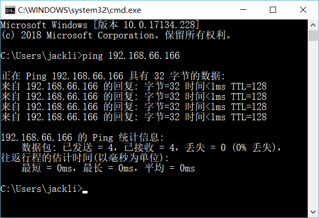

# oracle
<!-- TOC -->

- [oracle](#oracle)
    - [1.安装和使用oracle](#1安装和使用oracle)
        - [1-1.解压已经安装oracle的xp](#1-1解压已经安装oracle的xp)
        - [1-2.虚拟机中打开解压的xp系统](#1-2虚拟机中打开解压的xp系统)
        - [1-3.设置虚拟机ip](#1-3设置虚拟机ip)
        - [1-4.检查本机和虚拟机是否是同一个网段](#1-4检查本机和虚拟机是否是同一个网段)
    - [2.安装和使用pl/sql客户端](#2安装和使用plsql客户端)
        - [2-1.解压oracle客户端绿色版](#2-1解压oracle客户端绿色版)
        - [2-2.配置环境变量](#2-2配置环境变量)
        - [2-3.在plsql中设置oracle客户端](#2-3在plsql中设置oracle客户端)
        - [2-4.查看tnsnames.ora配置是否正确](#2-4查看tnsnamesora配置是否正确)
        - [2-5.测试本机是否能够连接上虚拟机上的oracle数据库](#2-5测试本机是否能够连接上虚拟机上的oracle数据库)
        - [2-6.plsql连接虚拟机上的oracle数据库](#2-6plsql连接虚拟机上的oracle数据库)
        - [2-7.oracle最重要的两个服务](#2-7oracle最重要的两个服务)
    - [3.oracle的基本使用](#3oracle的基本使用)
        - [3-1.mysql和oracle使用的比较](#3-1mysql和oracle使用的比较)
        - [3-2.oracle的基本查询](#3-2oracle的基本查询)
    - [4.oracle的高级应用](#4oracle的高级应用)
        - [4-1.视图](#4-1视图)
        - [4-2.索引](#4-2索引)
        - [4-3.plsql编程](#4-3plsql编程)
            - [4-3-1.声明变量](#4-3-1声明变量)
            - [4-3-2.plsql中的if判断](#4-3-2plsql中的if判断)
            - [4-3-3.游标](#4-3-3游标)
        - [4-4.存储过程](#4-4存储过程)
        - [4-5.函数](#4-5函数)
        - [4-6.触发器](#4-6触发器)
    - [5.Java调用存储过程和函数](#5java调用存储过程和函数)
    - [6.oracle调试](#6oracle调试)

<!-- /TOC -->
## 1.安装和使用oracle
### 1-1.解压已经安装oracle的xp
解压**xp虚拟机(已安装oracle)**到没有中文名称的目录

### 1-2.虚拟机中打开解压的xp系统

### 1-3.设置虚拟机ip
**虚拟机网卡：解决本机和虚拟机之间通讯使用(仅主机模式)**
**编辑-->虚拟网络编辑器**


选择**更改设置**


**添加网络-->选择要添加的网络-->确定**


**子网ip：192.168.66.0**


### 1-4.检查本机和虚拟机是否是同一个网段
win10：打开**网络和Internet**设置


选择**以太网-->网络和共享中心**


选择**更改适配器设置**


右键选择**属性**


选择**TCP/IPv4**，然后左键双击


查看IP地址是否和虚拟机是属于同一网段


## 2.安装和使用pl/sql客户端
### 2-1.解压oracle客户端绿色版
最好是解压到一个不含中文名称的目录


### 2-2.配置环境变量
**解决客户端乱码问题**
key：**NLS_LANG**
value：**AMERICAN_AMERICA.ZHS16GBK**


**设置连接Linux的oracle的**
key: **TNS_ADMIN**
value: **D:\develop\PLSQL\instantclient_11_2**


### 2-3.在plsql中设置oracle客户端
选择**配置**


设置值：
**D:\develop\PLSQL\instantclient_11_2**
**D:\develop\PLSQL\instantclient_11_2\oci.dll**


### 2-4.查看tnsnames.ora配置是否正确
**D:\develop\PLSQL\instantclient_11_2\tnsnames.ora**


### 2-5.测试本机是否能够连接上虚拟机上的oracle数据库
**1.先检查是否能够ping通**
**ping 192.168.66.166**


**2.再检查能够连上虚拟机上的oracle数据库**
**sqlplus system/orcl@192.168.66.166:1521/orcl**

### 2-6.plsql连接虚拟机上的oracle数据库


### 2-7.oracle最重要的两个服务
**OracleOraDb11g_home1TNSListener：监听服务**
```text
主要是留给客户端访问本机时所使用的，例如：在程序开发的过程之中，需要连接数据库，那么如果此服务没有启动或者是错误，那么将导致程序无法连接。
```
**OracleServiceFZTOMASTER：Oracle数据库的实例服务**
```text
在Oracle平台上可以同时配置有多个数据库。使用“DatabaseConfigurationAssistant”，这个工具可以建立更多的数据库，每一个数据库建立完成之后都会按照“OracleServiceSID”这样的服务，如果要想使用MLDN数据库进行数据操作，那么此服务必须的打开。
```
## 3.oracle的基本使用
### 3-1.mysql和oracle使用的比较
**使用mysql数据库**
* 创建数据库
* 创建表
* 操作表

**使用oracle数据库**
* 创建表空间
* 创建用户来操作表空间
* 授权
* 创建表
* 操作表


### 3-2.oracle的基本查询
```mysql
------------------使用system账号操作-----------------
-- 1.创建表空间
create tablespace jack --表空间名称
datafile 'c:\jack.dbf' --指定表空间对应数据文件名称
size 10M  --初始化大小
autoextend on  --自动扩展
next 10M  --每次添加10M
-- 2.删除表空间
drop tablespace jack including contents and datafiles;    

-- 3.创建用户
create user jack identified by jack default tablespace jack;
-- 4.删除用户
drop user jack cascade;
-- 5.授权
sys :超级管理员 创建数据库设置密码：orcl
system :管理员  创建数据库设置密码：orcl
scott :普通用户 默认密码：tiger
-- 6.oracle数据库自带角色
connect：连接角色
resource：普通开发角色
dba：超级管理员角色
-- 7.授权dba权限
grant dba to jack;
------------------------------------使用jack账号来操作------------------
-- 1.数据类型介绍和创建表
varchar  --可变长度 name  varchar(10) --'jack' 4
varchar2 --可变长度 name  varchar2(10) --'jack' 4(推荐使用)
char     --固定长度 name  char(10)     --'jack' 10
date     --mysql date 'yyyy-MM-dd'  mysql中的datetime和oracle中date 'yyyy-MM-dd hh24:mi:ss'
-- 2.删除表
drop table person
-- 3.创建表
create table person (
       pid number(10) primary key, --主键id，oracle没有自增，使用序列来完成
       pname varchar2(30) not null,
       gender char(1)  --gender 1 0
)

-- 4.修改表结构
-- 4.1添加字段
alter table person add address varchar2(50);
-- 4.2修改字段
alter table person modify address varchar2(100);
-- 4.3删除字段
alter table person drop column address;
-- 5.数据的增删改
-- 5.1增加一条数据
insert into person values(1, '杰克', 1);
commit; -- 事务提交，增、删、改都要commit
rollback; -- 事务回滚
select * from person;
-- 5.2修改数据，一定记住要加条件，不然就是全部更新
update person set pname = '肉丝' where pid = 1;
commit;-- alt+左右键：窗口切换
-- 5.3删除数据，一定记住要加条件
delete from person where pid = 1;
commit;
truncate table person;
-- delete和truncate的区别
delete -- 可以有条件，但是效率低，可以反悔
truncate -- 没有条件，但是效率高，不能反悔
-- 6.事务隔离级别
-- oracle的事务隔离级别：以提交的数据为主
-- mysql的事务隔离级别：可重复读取
-- 7.序列(重要)
-- 7.1序列解决oracle没有自增的问题
create sequence seq_person; -- 创建序列
drop sequence seq_person; --删除序列
-- 7.2序列的使用，dual伪表主要就是为了拼接sql语句
select seq_person.currval from dual;
select seq_person.nextval from dual;
-- 7.3在person表中测试
select * from person;
insert into person values(seq_person.nextval, '杰克', 1);
commit;

----------------------------使用scott用户来操作--------------------
-- 默认是锁定的，默认密码是：tiger
-- 为scott用户解锁
alter user scott account unlock;
-- 为scott用户设置密码
alter user scott identified by tiger;
-- 函数分为两类：单行函数和多行函数
-- 单行函数：操作10条数据，使用单行函数，操作数据的结果也是10条数据
-- 多行函数(聚合函数)：操作10条数据，返回一条数据

-- 1.单行函数
-- 1.1字符串函数：upper、lower
select * from emp;
select lower(e.ename), e.* from emp e; --lower
select upper('jack') from dual; --upper
-- 1.2数值函数：round、trunc、mod
-- round：返回四舍五入后的值
select round(66.6666, 2), round(1.23, 1), round(15000.22) from dual;
-- trunc：返回x按精度y截取后的值
select trunc(45.57, 1.1) from dual;
-- mod：返回x%y的值，求余
select mod(19, 5) from dual;
select userenv('language') from dual; -- 查看当前数据库编码
-- 1.3日期函数
-- sysdate，无参函数
select sysdate from dual;
select sysdate+1 from dual; -- 明天此时
-- 例子：查询出emp表中所有员工入职距离现在几月。
select round(months_between(sysdate, hiredate)), e.* from emp e;
-- 例子：查询出emp表中所有员工入职距离现在几年。
select round(months_between(sysdate, hiredate)/12), e.* from emp e;
-- 例子：查询出emp表中所有员工入职距离现在几周
select round((sysdate - hiredate)/7), e.* from emp e;
-- 1.4转换函数
-- to_char：日期/数据转换字符串类型
select 
to_char(sysdate,'d'),-- 每周第几天 
to_char(sysdate,'dd'),-- 每月第几天 
to_char(sysdate,'ddd'),-- 每年第几天 
to_char(sysdate,'ww'),-- 每年第几周 
to_char(sysdate,'mm'),-- 每年第几月 
to_char(sysdate,'q'),-- 每年第几季 
to_char(sysdate,'yyyy'),-- 年
to_char(sysdate,'yyyy/mm/dd hh24:mi:ss')
from dual;
-- to_date：字符串转日期
select to_date('2017/10/1', 'yyyy-MM-dd') from dual;
-- 1.5通用函数
select sal*12+comm, e.* from emp e; -- 由于comm有null值，参与运算为空，所以查询不准确
select sal*12+nvl(comm, 0), e.* from emp e;
-- 1.6条件表达式
-- 第一种写法
select 
   case e.ename
   when 'SMITH' then '史密斯' --这个后面不能有逗号
   when 'ALLEN' then '艾伦'
   else '杰克'
   end
from emp e;
-- 第二种写法
select
   case
   when e.ename = 'SMITH' then '史密斯'
   when e.ename = 'WARD' then '韦德'
   else '肉丝'
   end
from emp e;
-- 例子：判断emp表中员工工资，如果高于3000显示高收入，如果高于1500低于3000显示中等收入
select 
   case
   when e.sal > 3000 then '高收入人群'
   when e.sal > 1500 then '中等收入人群'
   else '低收入人群'
   end
from emp e;

-- 2.多行函数
-- 2.1count、max、min、avg、sum
select count(*) from emp; -- 查询总数量
select sum(sal) from emp; -- 查询总工资
select max(sal) from emp; -- 查询最高工资
select min(sal) from emp; -- 查询最低工资
select avg(sal) from emp; -- 查询平均工资
-- 2.1 分组查询
-- 例子：查询出每个部门的平均工资
-- 思路：
-- 1.确定要使用的数据表；
-- 2.确定已知的关联字段
-- 3.确定要查询哪些值
select avg(sal) from emp group by deptno;
-- 例子：查询出平均工资高于2000的部门信息
select avg(sal), e.deptno from emp e group by e.deptno having avg(sal) > 2000 order by e.deptno; 
-- oracle的sql执行顺序
[⑤确定要显示的数据列] SELECT [DISTINCT] * | 列[别名], 列[别名]...
[①确定数据来源(行与列的集合)] FROM 表名称[别名], 表名称[别名], ...
[②针对于数据行进行筛选] [WHERE 限定条件(s)]
[③针对于筛选的行分组] [GROUP BY 分组字段, 分组字段, 分组字段, ...]
[④针对于筛选大的行分组] [HAVING 分组过滤]
[⑥对选定数据的行与列进行排序] [ORDER BY 排序字段[ASC|DESC], 排序字段[ASC|DESC], ...]
-- HAVING是在GROUP BY分组之后才执行的筛选，在HAVING里面可以直接使用统计函数(count、sum、min、max、avg)
-- 例子：查询出每个部门工资高于800的员工的平均工资,然后再查询出平均工资高于2000的部门
-- 1.查询出每个部门工资高于800的员工的平均工资
select deptno, avg(sal) from emp where sal > 800 group by deptno;
-- 2.查询出平均工资高于2000的部门
select deptno, avg(sal) from emp where sal > 800 group by deptno having avg(sal) > 2000;

-- 3.多表查询
-- 多表查询分为：内连接、外连接、子查询
-- 3.1内连接使用
-- 例子：查询员工表和部门表
select * from emp e, dept d; -- 如果没有关联条件，那么会出现笛卡尔积
select * from emp e, dept d where e.deptno = d.deptno;
-- 例子：查询出所有部门，以及部门下的员工信息。
-- +号的使用，emp表：非全量表，dept表：全量表
select * from emp e, dept d where e.deptno(+) = d.deptno;
-- 例子：查询所有员工信息，以及员工所属部门
-- 显式内连接
select * from emp e, dept d where e.deptno = d.deptno;
-- 隐式内连接
select * from emp e inner join dept d on e.deptno = d.deptno;

-- 3.2外连接使用
-- 例子：查询出员工姓名，员工领导姓名 
select e1.ename "员工姓名", e2.ename "领导姓名" from emp e1, emp e2 where e1.mgr = e2.empno; -- 注意使用双引号
-- 例子：查询出员工姓名，员工部门名称，员工领导姓名，员工领导部门名称
select e.ename "员工姓名", d.dname "员工部门名称", e2.ename "员工领导姓名", d2.dname "员工领导部门名称"
from emp e, emp e2, dept d, dept d2
where e.mgr = e2.empno and e.deptno = d.deptno and e2.deptno = d2.deptno;

-- 4.子查询
-- 子查询 主要是子句查询结果 提供主句使用
-- 4.1 单行单列子查询
-- 例子：查询出工资和SCOTT一样的员工信息
select * from emp where sal = (select sal from emp where ename = 'SCOTT');
-- 4.2 多行单列子查询
-- 例子: 查询出工资和10号部门任意员工一样的员工信息
select * from emp where sal in (select sal from emp where deptno = 10);
-- 例子：查询出每个部门最低工资，和最低工资员工姓名，和该员工所在部门名称
select e.ename, e.sal, d.dname from emp e, dept d 
where e.sal in(select min(sal) from emp group by deptno) and e.deptno = d.deptno;

-- 5.oracle中的分页
-- mysql中的分页是limit，而oracle中的分页需要使用rownum伪列来完成，伪列是随着select查询而产生的
-- rownum：1.取得第一行数据，2.取得前n行的数据
-- 分页公式
-- currentPage, 表示的是当前所在页；
-- lineSize, 表示每页显示的数据行；
SELECT * FROM (
SELECT ROWNUM rn, 列, ... FROM 表名称 WHERE ROWNUM <= currentPage * lineSize) temp
WHERE temp.rn > (currentPage - 1) * lineSize;

select rownum, e.* from emp e;
-- 例子：查询工资最高的5条记录 
select rownum, temp.sal from (select sal from emp order by sal desc) temp where rownum < 6;
select * from (select rownum rn, sal from emp where rownum <= 2*5) temp where temp.rn > 5; -- 使用公式

-- 例子：emp表工资倒叙排列后，每页五条记录，查询第二页
select eee.* from (
select rownum rn,ee.* from (
select e.*from emp e order by sal desc)ee  
)eee where eee.rn > 5 and eee.rn <=10

select * from (select rownum rn, e.* from emp e where rownum <= 2*5) temp where temp.rn>5;

----重点
-- 1.oracle了解 
-- 2.oracle会使用
-- 3.oracle数据类型 操作表 操作数据 （重点）
-- 4.多行函数 多行（重点） 分组统计
-- 5.多表关联查询 子查询  分页
```
## 4.oracle的高级应用
### 4-1.视图
```sql
-- 1.视图
-- 查询scott用户的emp表的数据放入myemp表中(dba权限)
-- create table 表名 as 查询语句;
-- is、as、for
create table myemp as select * from scott.emp;
select * from myemp;

-- 视图：1.封装复杂sql语句，2.隐藏敏感信息
-- 两种创建方式
create view view_myemp as select * from myemp; 
create or replace view view_myemp as select e.empno, e.ename, e.mgr, e.deptno from myemp e;
-- 创建只读视图，就是只能查询，不能增、删、改
create view view_myemp as select * from myemp with read only;
-- 封装一个分页查询的视图
-- select * from (select rownum rn, m.* from myemp m where rownum <= currentPage*pageSize) temp where temp.rn > (currentPage-1)*pageSize;
create or replace view view_queryPage as select * from (select rownum rn, m.* from myemp m where rownum <= 2 * 5) temp 
where temp.rn > 5 with read only;
-- 查询视图
select * from view_myemp;
select * from view_queryPage;
-- 更新数据，一般视图只用作查询，不推荐使用更新操作
update view_myemp set sal=800 where ename='SMITH';
-- 删除视图
drop view view_myemp;
```
### 4-2.索引
```sql
-- 2.索引
-- 索引是可以优化查询速度的，特别是当数据量很大的时候
-- 单列索引
create index index_pname on person(pname);
-- 复合索引
create index index_pname_gender on person(pname, gender);
-- 测试单列索引
select * from person where pname='xxx'; --使用了index_pname索引
select * from person where upper('pname')='xxx'; --未用index_pname索引
select * from person where pname=upper('xxx'); --使用了index_pname索引
select * from person where pname like '%xxx%';--未用index_pname索引
-- 总结：单列索引，查询条件列 如果有使用到单行函数、模糊查询，不走索引
-- 测试复合索引
select * from person where pname='xxx' and gender='xxx'; --使用了index_pname_gender索引
select * from person where upper('pname')='xxx' and gender='xxx';--未使用index_pname_gender索引
select * from person where pname=upper('xxx') and gender='xxx';--使用了index_pname_gender索引
select * from person where pname like '%xxx%' and gender='xxx';--未使用index_pname_gender索引
select * from person where pname='xxx' and upper('gender')='xxx'; --使用了index_pname_gender索引
select * from person where pname='xxx' and gender=upper('xxx'); --使用了index_pname_gender索引
select * from person where pname='xxx' and gender like '%xxx%';--使用了index_pname_gender索引
-- 总结：复合索引 查询条件列（第二个列） 如果有使用单行函数、模糊查询 不走索引
select * from person;
-- 删除索引
drop index index_pname_gender;
```
### 4-3.plsql编程
#### 4-3-1.声明变量
```sql
-- 3.pl/sql数据库编程语言
-- plsql：Procedure language sql：过程化语言，数据库端开发语言
-- 将以前业务逻辑中复杂业务代码，通过这种过程化语言来实现。可以在程序中只需要调用一次，既可以完成业务功能。
-- 语法
declare
   -- 声明变量(普通变量、引用型变量、记录型变量)
begin
   -- DML语句(insert、update、select、delete)
end;

-- 3.1声明变量
declare
   myname varchar2(20):='杰克'; -- 普通变量
   myage  constant number(10):=12; -- 常量
   myname2 myemp.ename%type; -- 引用型变量，存放查询出来的 一个数据
   v_row myemp%rowtype; -- 记录型变量，存放一行数据，实体对象.列名
begin
   myname := '杰克';
   -- myage := 22;常量不能再次赋值
   -- myname2 := '肉丝';
   select ename into myname2 from myemp where empno = 7369;
   select * into v_row from myemp where empno = 7369;
   -- v_row不能直接输出，需要输出里面的值，v_row.ename等
   dbms_output.put_line(myname || '-' || myage || '-' || myname2 || '-' || v_row.deptno);
end;
```
#### 4-3-2.plsql中的if判断
```sql
-- 3.2plsql中的if判断
-- 输入小于18的数字，输出未成年 输入大于18小于40的数字，输出中年人 输入大于40的数字，输出老年人
declare
   age number(2) := &age;--定义变量并提示输入信息
begin
   if age<18 then dbms_output.put_line('未成年人');
   elsif age<40 then dbms_output.put_line('中年人'); -- 注意是elsif而不是elseif
   else dbms_output.put_line('老年人');
   end if; -- 结束if判断
end;

-- plsql中的loop循环
-- 用三种方式输出1到10是个数字
-- 方式一
declare
begin
   for i in 1..10
       loop
         dbms_output.put_line(i);
       end loop;
end;
-- 方式二
declare
   num number(10) := 1;
begin
   loop
       exit when num > 10;
       dbms_output.put_line(num);
       num := num+1;
   end loop;
end;
-- 方式三
declare
   num number(10) := 1;
begin
   while num <= 10
         loop
             dbms_output.put_line(num);
             num := num + 1;
         end loop;
end;
```
#### 4-3-3.游标
```sql
-- 3.3游标cursor
-- 游标作用：可以存放多行数据
-- 定义游标可以有参数也可以没有参数
-- 应用：循环游标把每一行数据放入记录型变量中
-- 语法
declare
   cursor cursor_myemp[(参数名称 参数数据类型)] is 查询语句;
begin
   open cursor_myemp[(参数名称 参数数据类型)];
     loop
       exit when cursor_myemp%notfound; -- 没有数据则退出循环
       fetch cursor_myemp into 记录性变量;
       -- 打印数据
     end loop;
   close cursor_myemp;
end;
-- 输出emp表中所有员工的姓名
declare
   v_row myemp%rowtype; -- 记录型变量
   cursor cursor_myemp is select * from myemp;
begin
   open cursor_myemp;
     loop
       exit when cursor_myemp%notfound; -- 没有数据则退出循环
       fetch cursor_myemp into v_row;
       dbms_output.put_line(v_row.empno || '-' || v_row.ename);
     end loop;
   close cursor_myemp;
end;
-- 给指定部门员工涨工资
declare
   v_row myemp%rowtype;
   cursor cursor_myemp(v_deptno myemp.deptno%type) is select * from myemp where deptno = v_deptno;
begin
   open cursor_myemp(&mydeptno);
     loop
        exit when cursor_myemp%notfound; -- 没有数据则退出循环
        fetch cursor_myemp into v_row;
        -- dbms_output.put_line(v_row.empno || '-' || v_row.ename || '-' || v_row.sal || '-' || v_row.deptno);
        update myemp set sal = sal + 1 where empno = v_row.empno;
     end loop;
   close cursor_myemp;
end;
-- 测试
select * from myemp;
```
### 4-4.存储过程
```sql
-- 4.存储过程
-- 将复杂业务逻辑写到这个过程语言中，通过java代码调用这个存储过程
-- 存储过程有名称 可以有输入参数 也可以没有输入参数 （java输入参数）
-- 输入参数的in关键字可以省略 
-- 输出参数一定要out关键字
-- 存储过程可以有输出参数 也可以没有输出参数(处理结果)
-- 语法
create [or replace] procedure 存储过程名称[(输入参数名称 参数类型, 输出参数名称 out 参数类型)]
is|as
 --声明变量
begin
 --DML语句
end;

-- 例子：给指定员工涨100块钱
create or replace procedure pro_addsal(v_empno myemp.empno%type)
is
begin
  update myemp set sal = sal +100 where empno = v_empno;
  commit;
end;
-- 测试存储过程
declare
begin
   pro_addsal(7369);
end;
-- 查询数据
select * from myemp;

-- 例子：使用存储过程来算年薪（使用out类型参数）
create or replace procedure pro_calcsal(v_empno myemp.empno%type, v_yearsal out myemp.sal%type)
is 
begin
  select sal*12+nvl(comm, 0) into v_yearsal from myemp where empno = v_empno;
end;
-- 测试存储过程
-- 方式一
declare
  mysal myemp.sal%type;
begin
  pro_calcsal(7369, mysal);
  dbms_output.put_line(mysal);
end;
-- 方式二：通过右击存储过程，进行测试
```
### 4-5.函数
```sql
-- 5.函数
-- 存储过程和函数的区别
-- 存储过程有名称 可以有输入参数 也可以没有输入参数 （java输入参数）
-- 存储过程java程序需要得到结果，必须要out参数
-- 函数有名称 可以有输入参数 也可以没有输入参数 （java输入参数）
-- 函数，必须return返回值 可以有输出参数 也可以没有参数

-- 一般情况都是存储过程中调用函数
-- 语法
create [or replace] function 函数名称[(输入参数名称 参数数据类型, 输出参数名称 out 参数数据类型)]
return 数据类型
is|as
  -- 声明变量
begin
  -- DML语句
  return 结果;
end;
-- 例子：通过函数(自定义)实现计算指定员工的年薪
create or replace function func_myemp(v_empno myemp.empno%type)
return number
as 
  mysal myemp.sal%type;
begin
  select sal*12+nvl(comm, 0) into mysal from myemp where empno = v_empno;
  return mysal;
end;
-- 测试函数
-- 方式一
declare
   mysal myemp.sal%type;
begin
   mysal := func_myemp(7369);
   dbms_output.put_line(mysal);
end;
-- 方式二
select func_myemp(7369) from dual;
```
### 4-6.触发器
```sql
-- 6.触发器
-- 在数据库上建立触发器(基于表)，编写plsql过程语言，当操作某一个表的时候（改变此表数据的时候oracle自动执行触发器）
-- insert、update、delete
-- 最新登录时间，登录日志表记录登录时间
-- 语法
create or replace trigger 触发器名称
before|after
insert | update of 字段名 | delete
on 表名
[for each row]
declare
  -- 声明变量
begin
  -- 执行具体业务
end;

-- 例子：插入一条记录，输出一个新员工入职
create or replace trigger myperson
after
insert
on person
declare
begin
   dbms_output.put_line('新员工入职了...');
end;
-- 测试
select * from person;
insert into person values(3, '肉丝', 1);
commit;
-- 例子：不能给员工降薪
-- 删除触发器
drop trigger myperson;
create or replace trigger myperson
before
update of sal
on myemp
for each row
declare
begin
  -- 更新前的薪水，更新后的薪水
  -- :old更新前的数据，:new更新后的数据
  if :old.sal >= :new.sal then
     --错误提示框来提示不能给员工降薪 
     --错误编号 -20000 - -20999
     raise_application_error('-20000', '该员工不能降薪');
  end if;
end;
-- 测试
select * from myemp;
update myemp set sal = sal -100 where empno = 7369;
commit;

-- 触发器实现主键自增
-- 跟mysql的主键自增一样的效果
drop trigger myperson; 
create trigger myperson
before
insert
on person
for each row
declare
begin
   --在插入表之前 为:new新记录 主键id赋值
   select seq_person.nextval into :new.pid from dual;
end;
-- 测试
insert into person(pname) values('杰瑞');
commit;
select * from person;
```
## 5.Java调用存储过程和函数
**创建工程**
com.jack.oralce_jdbc
**添加maven依赖**
```xml
<?xml version="1.0" encoding="UTF-8"?>
<project xmlns="http://maven.apache.org/POM/4.0.0"
         xmlns:xsi="http://www.w3.org/2001/XMLSchema-instance"
         xsi:schemaLocation="http://maven.apache.org/POM/4.0.0 http://maven.apache.org/xsd/maven-4.0.0.xsd">
    <modelVersion>4.0.0</modelVersion>

    <groupId>com.jack</groupId>
    <artifactId>oracle_jdbc</artifactId>
    <version>1.0-SNAPSHOT</version>
    <packaging>jar</packaging>

    <!--oracle驱动包 ojdbc14：oracle10g   ojdbc6：oracle11g-->
    <dependencies>
        <dependency>
            <groupId>com.oracle</groupId>
            <artifactId>ojdbc14</artifactId>
            <version>10.2.0.4.0</version>
        </dependency>
        <dependency>
            <groupId>junit</groupId>
            <artifactId>junit</artifactId>
            <version>4.12</version>
        </dependency>
    </dependencies>
</project>
```
**创建包com.jack.oracle，创建类OracleJdbc.java**
```java
public class OracleJdbc {

    /**
     * 测试连接oracle jdbc
     * @throws Exception
     */
    @Test
    public void javaCallOracle() throws Exception {
        // 加载数据库驱动
        Class.forName("oracle.jdbc.driver.OracleDriver");
        // 得到Connection连接
        Connection connection = DriverManager.getConnection("jdbc:oracle:thin:@192.168.66.166:1521:orcl", "jack", "jack");
        // 得到预编译的Statement对象
        PreparedStatement pstmt = connection.prepareStatement("select * from myemp where empno = ?");
        // 给参数赋值
        pstmt.setInt(1, 7369);
        // 执行数据库查询操作
        ResultSet rs = pstmt.executeQuery();
        // 输出结果
        while(rs.next()) {
            System.out.println(rs.getString("ename"));
        }
        // 释放资源
        rs.close();
        pstmt.close();
        connection.close();
    }

    /**
     * 测试连接oracle 存储过程pro_calcsal(v_empno myemp.empno%type, v_yearsal out myemp.sal%type)
     * @throws Exception
     */
    @Test
    public void javaCallProcedure() throws Exception {
        // 加载数据库驱动
        Class.forName("oracle.jdbc.driver.OracleDriver");
        // 得到Connection连接
        Connection connection = DriverManager.getConnection("jdbc:oracle:thin:@192.168.66.166:1521:orcl", "jack", "jack");
        // 得到预编译的Statement对象
        /**
         *    {?= call <procedure-name>[(<arg1>,<arg2>, ...)]}
         *    {call <procedure-name>[(<arg1>,<arg2>, ...)]}
         */
        CallableStatement callableStatement = connection.prepareCall("{call pro_calcsal(?,?)}");
        // 给参数赋值
        callableStatement.setInt(1, 7369);
        // 输出参数 注册数据类型
        callableStatement.registerOutParameter(2, OracleTypes.NUMBER);
        // 执行数据库查询操作
        callableStatement.execute();
        // 输出结果
        Object object = callableStatement.getObject(2);
        System.out.println(object);
        // 释放资源
        callableStatement.close();
        connection.close();
    }

    /**
     * 测试连接oracle 函数func_myemp(v_empno myemp.empno%type)
     */
    @Test
    public void javaCallFun() throws Exception {
        // 加载数据库驱动
        Class.forName("oracle.jdbc.driver.OracleDriver");
        // 得到Connection连接
        Connection connection = DriverManager.getConnection("jdbc:oracle:thin:@192.168.66.166:1521:orcl", "jack", "jack");
        // 得到预编译的Statement对象
        /**
         * {?= call <procedure-name>[(<arg1>,<arg2>, ...)]}
         * {call <procedure-name>[(<arg1>,<arg2>, ...)]}
         */

        CallableStatement callableStatement = connection.prepareCall("{?= call func_myemp(?)}");//
        //输出参数 注册数据类型
        callableStatement.registerOutParameter(1, OracleTypes.NUMBER);
        //给参数赋值
        callableStatement.setObject(2, 7369);
        //执行数据库查询操作
        callableStatement.execute();
        //输出结果
        Object object = callableStatement.getObject(1);
        System.out.println(object);

        //释放资源
        callableStatement.close();
        connection.close();
    }
}
```
## 6.oracle调试
右键选择**添加调试信息**

右键选择**查看**

**打断点**

**测试**

**输入测试值**，然后点击**开始测试**
