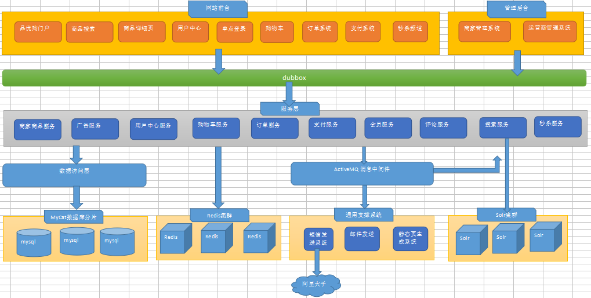
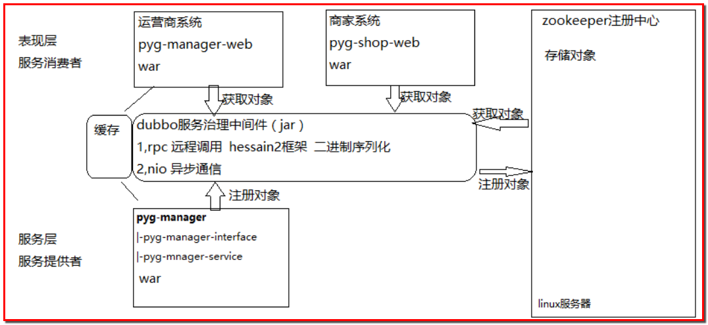
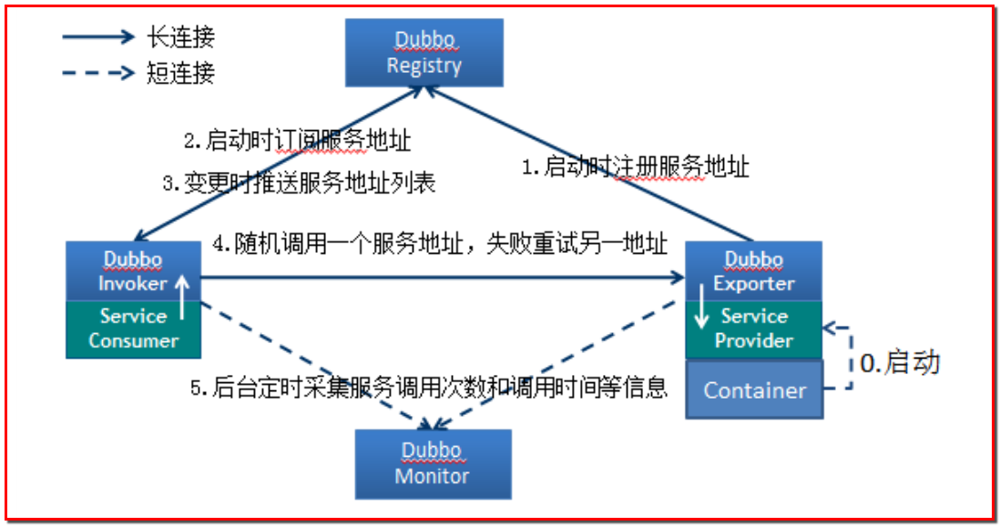

# day01总结

## 一.项目介绍

### 1.电商项目特点

- 高并发
  - 集群：部署多台服务器，共同完成一件事情(业务增加，厨房厨师不够用，招聘厨师，相当于增加服务器，集群)
  - 分布式：多台服务器，根据不同的业务，做不同的事情(酒店的厨师、服务员、收银员和老板，角色不同完成不同的任务，分布式)
  - 共同点：涉及多台服务器
- 高可用
  - 负载均衡
  - 主-备服务器构建
- 海量数据储存
- 业务复杂

### 2.常见电商模式

B2B：阿里巴巴

B2C：唯品会

C2C：淘宝

o2o：online、offline，美团，饿了么

B2B2C：天猫、京东

### 3.品优购项目的构成

品优购网上购物商城主要由3部分组成：**网站前台、运营商后台和商家管理后台**

**系统架构采用SOA(Service-Oriented Architecture)：面向服务开发的思想**

### 4.技术选型

**前后端分离，前端使用angularJS+Bootstrap，后台使用Spring+SpringMVC+Mybatis+Dubbo**

架构图



**架构调用流程**



1. 服务层通过dubbo把对象注册到zookeeper注册中心，服务层作为服务的提供者
2. 表现层通过dubbo从zookeeper注册中心获取对象，并消费服务
3. 表现层使用获得的代理对象远程调用服务层方法

## 二.dubbo分布式服务框架

dubbo是阿里巴巴的一个开源的分布式服务框架，提供**高性能、RPC远程服务调用，和SOA服务**，主要用于解决分布式的场景，本质上就是一个**远程调用的分布式框架**



节点角色说明：

- provider：服务的提供方
- consumer：调用远程服务的服务消费方
- register：服务注册中心
- monitor：监控中心
- container：服务运行的容器

调用关系说明：

- 0：服务器容器启动，加载，运行service provider
- 1：服务提供方在启动时，需要在注册中心注册提供的服务
- 2：服务消费方在启动时，向注册中心订阅自己所需要的服务
- 3：注册中心返回服务提供方地址列表给消费者，如果有变更，注册中心将基于长连接推送变更数据给消费者
- 4：服务消费者，从提供者地址列表中，基于软负载均衡算法，选一台提供者进行调用，如果调用失败，再选另一台调用。
- 5：服务消费者和提供者，在内存中累计调用次数和调用时间，定时每分钟发送一次统计
  数据到监控中心。

## 三.注册中心zookeeper

Apache Hadoop的子项目，支持变更推送，作为Dubbo服务的注册中心。

### 1.zookeeper在Linux上的安装

第一步：在Linux上安装jdk

第二步：上传zookeeper的压缩包到Linux系统的/root/pinyougou/目录下

第三步：解压，解压命令：**tar -zxvf zookeeper-3.4.6.tar.gz**

第四步：进入zookeeper目录，创建data文件夹，创建命令**：mkdir data**

第五步：进入conf目录，修改zoo_sample.cfg为zoo.cfg，命令：**mv zoo_sample.cfg zoo.cfg**

第六步：**vim zoo.cfg**，然后按**i**，进入编辑，修改data属性：**dataDir=/root/pinyougou/zookeeper-3.4.6/data**，退出**esc**，然后再**:wq**，退出并保存

第七步：在bin目录下启动，zookeeper启动命令：**./zkServer.sh start**，关闭命令：**./zkServer.sh stop**

查看状态：**./zkServer.sh status**

### 2.管理中心的配置

作用：知道注册中心提供了哪些服务，消费了哪些服务

上传dubbo-admin.war到Linux的/root/pinyougou/tomcat/webapps的目录下面即可

浏览器访问：http://192.168.25.128:8080/dubbo-admin/

## 四.品优购-框架搭建


**父工程项目：pinyougou_parent，pom**

**实体类：pinyougou_pojo，jar**

**持久层dao：pinyougou_dao，依赖实体类，jar**

**服务层service：pinyougou_xxx_service，依赖服务层接口，war**

**服务层接口：pinyougou_xxx_interface，jar**

**表现层web：pinyougou_xxx_web，依赖服务层接口，war**

### 1.父工程

创建带有site骨架的maven项目

- GroupId：com.pinyougou
- ArtifactId：pinyougou_parent

父工程的pom.xml文件

```xml
<!-- 集中定义依赖版本号 -->
<properties>
	<junit.version>4.12</junit.version>
	<spring.version>4.2.4.RELEASE</spring.version>
	<pagehelper.version>4.0.0</pagehelper.version>
	<servlet-api.version>2.5</servlet-api.version>
	<dubbo.version>2.8.4</dubbo.version>
	<zookeeper.version>3.4.7</zookeeper.version>
	<zkclient.version>0.1</zkclient.version>		
	<mybatis.version>3.2.8</mybatis.version>
	<mybatis.spring.version>1.2.2</mybatis.spring.version>
	<mybatis.paginator.version>1.2.15</mybatis.paginator.version>
	<mysql.version>5.1.32</mysql.version>		
	<druid.version>1.0.9</druid.version>
	<commons-fileupload.version>1.3.1</commons-fileupload.version>
	<freemarker.version>2.3.23</freemarker.version>
	<activemq.version>5.11.2</activemq.version>
	<security.version>3.2.3.RELEASE</security.version>		
	<solrj.version>4.10.3</solrj.version>
	<ik.version>2012_u6</ik.version>		
</properties>

<dependencyManagement>
	<dependencies>	
		<!-- Spring -->
		<dependency>
			<groupId>org.springframework</groupId>
			<artifactId>spring-context</artifactId>
			<version>${spring.version}</version>
		</dependency>
		<dependency>
			<groupId>org.springframework</groupId>
			<artifactId>spring-beans</artifactId>
			<version>${spring.version}</version>
		</dependency>
		<dependency>
			<groupId>org.springframework</groupId>
			<artifactId>spring-webmvc</artifactId>
			<version>${spring.version}</version>
		</dependency>
		<dependency>
			<groupId>org.springframework</groupId>
			<artifactId>spring-jdbc</artifactId>
			<version>${spring.version}</version>
		</dependency>
		<dependency>
			<groupId>org.springframework</groupId>
			<artifactId>spring-aspects</artifactId>
			<version>${spring.version}</version>
		</dependency>
		<dependency>
			<groupId>org.springframework</groupId>
			<artifactId>spring-jms</artifactId>
			<version>${spring.version}</version>
		</dependency>
		<dependency>
			<groupId>org.springframework</groupId>
			<artifactId>spring-context-support</artifactId>
			<version>${spring.version}</version>
		</dependency>
		<dependency>
			<groupId>org.springframework</groupId>
			<artifactId>spring-test</artifactId>
			<version>${spring.version}</version>
		</dependency>
		<!-- dubbo相关 -->
		<dependency>
			<groupId>com.alibaba</groupId>
			<artifactId>dubbo</artifactId>
			<version>${dubbo.version}</version>
		</dependency>
		<dependency>
			<groupId>org.apache.zookeeper</groupId>
			<artifactId>zookeeper</artifactId>
			<version>${zookeeper.version}</version>
		</dependency>
		<dependency>
			<groupId>com.github.sgroschupf</groupId>
			<artifactId>zkclient</artifactId>
			<version>${zkclient.version}</version>
		</dependency>
		<dependency>
			<groupId>junit</groupId>
			<artifactId>junit</artifactId>
			<version>4.9</version>
		</dependency>
		<dependency>
			<groupId>com.alibaba</groupId>
			<artifactId>fastjson</artifactId>
			<version>1.2.28</version>
		</dependency>
		<dependency>
			<groupId>javassist</groupId>
			<artifactId>javassist</artifactId>
			<version>3.11.0.GA</version>
		</dependency>
		<dependency>
			<groupId>commons-codec</groupId>
			<artifactId>commons-codec</artifactId>
			<version>1.10</version>
		</dependency>
		<dependency>
			<groupId>javax.servlet</groupId>
			<artifactId>servlet-api</artifactId>
			<version>2.5</version>
			<scope>provided</scope>
		</dependency>
		<dependency>
			<groupId>com.github.pagehelper</groupId>
			<artifactId>pagehelper</artifactId>
			<version>${pagehelper.version}</version>
		</dependency>		
		<!-- Mybatis -->
		<dependency>
			<groupId>org.mybatis</groupId>
			<artifactId>mybatis</artifactId>
			<version>${mybatis.version}</version>
		</dependency>
		<dependency>
			<groupId>org.mybatis</groupId>
			<artifactId>mybatis-spring</artifactId>
			<version>${mybatis.spring.version}</version>
		</dependency>
		<dependency>
			<groupId>com.github.miemiedev</groupId>
			<artifactId>mybatis-paginator</artifactId>
			<version>${mybatis.paginator.version}</version>
		</dependency>		
		<!-- MySql -->
		<dependency>
			<groupId>mysql</groupId>
			<artifactId>mysql-connector-java</artifactId>
			<version>${mysql.version}</version>
		</dependency>
		<!-- 连接池 -->
		<dependency>
			<groupId>com.alibaba</groupId>
			<artifactId>druid</artifactId>
			<version>${druid.version}</version>
		</dependency>		
		<dependency>
			<groupId>org.csource.fastdfs</groupId>
			<artifactId>fastdfs</artifactId>
			<version>1.2</version>
		</dependency>
		<!-- 文件上传组件 -->
		<dependency>
			<groupId>commons-fileupload</groupId>
			<artifactId>commons-fileupload</artifactId>
			<version>${commons-fileupload.version}</version>
		</dependency>		
		<!-- 缓存 -->
		<dependency> 
		  <groupId>redis.clients</groupId> 
		  <artifactId>jedis</artifactId> 
		  <version>2.8.1</version> 
		</dependency> 
		<dependency> 
		  <groupId>org.springframework.data</groupId> 
		  <artifactId>spring-data-redis</artifactId> 
		  <version>1.7.2.RELEASE</version> 
		</dependency>		
		<dependency>
			<groupId>org.freemarker</groupId>
			<artifactId>freemarker</artifactId>
			<version>${freemarker.version}</version>
		</dependency>		
		<dependency>
			<groupId>org.apache.activemq</groupId>
			<artifactId>activemq-all</artifactId>
			<version>${activemq.version}</version>
		</dependency>
		<!-- 身份验证 -->
		<dependency>
			<groupId>org.springframework.security</groupId>
			<artifactId>spring-security-web</artifactId>
			<version>4.1.0.RELEASE</version>
		</dependency>
		<dependency>
			<groupId>org.springframework.security</groupId>
			<artifactId>spring-security-config</artifactId>
			<version>4.1.0.RELEASE</version>
		</dependency>		
		<dependency>
			<groupId>com.github.penggle</groupId>
			<artifactId>kaptcha</artifactId>
			<version>2.3.2</version>
			<exclusions>
				<exclusion>
					<groupId>javax.servlet</groupId>
					<artifactId>javax.servlet-api</artifactId>
				</exclusion>
			</exclusions>
		</dependency>		
		<dependency>  
			<groupId>org.springframework.security</groupId>  
			<artifactId>spring-security-cas</artifactId>  
			<version>4.1.0.RELEASE</version>  
		</dependency>  
		<dependency>  
			<groupId>org.jasig.cas.client</groupId>  
			<artifactId>cas-client-core</artifactId>  
			<version>3.3.3</version>  
			<!-- 排除log4j包冲突 -->  
			<exclusions>  
				<exclusion>  
					<groupId>org.slf4j</groupId>  
					<artifactId>log4j-over-slf4j</artifactId>  
				</exclusion>  
			</exclusions>  
		</dependency> 	    
		<!-- solr客户端 -->
		<dependency>
			<groupId>org.apache.solr</groupId>
			<artifactId>solr-solrj</artifactId>
			<version>${solrj.version}</version>
		</dependency>
		<dependency>
			<groupId>com.janeluo</groupId>
			<artifactId>ikanalyzer</artifactId>
			<version>${ik.version}</version>
		</dependency>	
		<dependency>
			<groupId>org.apache.httpcomponents</groupId>
			<artifactId>httpcore</artifactId>
			<version>4.4.4</version>
		</dependency>  		
		<dependency>
			<groupId>org.apache.httpcomponents</groupId>
			<artifactId>httpclient</artifactId>
			<version>4.5.3</version>
		</dependency>
		<dependency>
			<groupId>dom4j</groupId>
			<artifactId>dom4j</artifactId>
			<version>1.6.1</version>
		</dependency>  		
		<dependency>  
			<groupId>xml-apis</groupId>  
			<artifactId>xml-apis</artifactId>  
			<version>1.4.01</version>  
		</dependency> 		
	</dependencies>	
</dependencyManagement>

<build>
	<plugins>			
		<!-- java编译插件 -->
		<plugin>
			<groupId>org.apache.maven.plugins</groupId>
			<artifactId>maven-compiler-plugin</artifactId>
			<version>3.2</version>
			<configuration>
				<source>1.8</source>
				<target>1.8</target>
				<encoding>UTF-8</encoding>
			</configuration>
		</plugin>
	</plugins>
</build>
```

### 2.pinyougou_common模块

- GroupId：com.pinyougou
- ArtifactId：pinyougou_common
- 不选骨架，jar包

### 3.pinyougou_pojo模块

- GroupId：com.pinyougou
- ArtifactId：pinyougou_pojo
- 不选骨架，jar包

**pom.xml**

```xml
<dependencies>
    <dependency>
        <groupId>com.pinyougou</groupId>
        <artifactId>pinyougou_common</artifactId>
        <version>1.0-SNAPSHOT</version>
    </dependency>
</dependencies>
```

**创建包com.pinyougou.pojo，创建TbBrand**

```java
public class TbBrand implements Serializable {

    private static final long serialVersionUID = 644394852464545588L;

    private Long id;
    private String name;
    private String firstChar;
	// ...
}
```

### 4.pinyougou_dao模块

- GroupId：com.pinyougou
- ArtifactId：pinyougou_dao
- 不选骨架，jar包

**pom.xml**

```xml
<dependencies>
    <dependency>
        <groupId>com.pinyougou</groupId>
        <artifactId>pinyougou_pojo</artifactId>
        <version>1.0-SNAPSHOT</version>
    </dependency>
    <dependency>
        <groupId>com.github.pagehelper</groupId>
        <artifactId>pagehelper</artifactId>
    </dependency>
    <!-- Mybatis -->
    <dependency>
        <groupId>org.mybatis</groupId>
        <artifactId>mybatis</artifactId>
    </dependency>
    <dependency>
        <groupId>org.mybatis</groupId>
        <artifactId>mybatis-spring</artifactId>
    </dependency>
    <dependency>
        <groupId>org.springframework</groupId>
        <artifactId>spring-jdbc</artifactId>
    </dependency>
    <dependency>
        <groupId>com.github.miemiedev</groupId>
        <artifactId>mybatis-paginator</artifactId>
    </dependency>
    <!-- MySql -->
    <dependency>
        <groupId>mysql</groupId>
        <artifactId>mysql-connector-java</artifactId>
    </dependency>
    <!-- 连接池 -->
    <dependency>
        <groupId>com.alibaba</groupId>
        <artifactId>druid</artifactId>
    </dependency>
</dependencies>
```

**在resources目录引入config/db.properties、mybatis/sqlMapConfig.xml和spring/applicationContext-dao.xml**

**db.properties**

```properties
jdbc.driver=com.mysql.jdbc.Driver
jdbc.url=jdbc:mysql://localhost:3306/pinyougoudb?characterEncoding=utf-8
jdbc.username=root
jdbc.password=root
```

**sqlMapConfig.xml**

```xml
<?xml version="1.0" encoding="UTF-8" ?>
<!DOCTYPE configuration PUBLIC "-//mybatis.org//DTD Config 3.0//EN" "http://mybatis.org/dtd/mybatis-3-config.dtd">
<configuration>
	<plugins>
		<!-- com.github.pagehelper 为 PageHelper 类所在包名 -->
		<plugin interceptor="com.github.pagehelper.PageHelper">
			<!-- 设置数据库类型 Oracle,Mysql,MariaDB,SQLite,Hsqldb,PostgreSQL 六种数据库-->
			<property name="dialect" value="mysql"/>
		</plugin>
	</plugins>
</configuration>
```

**applicationContext-dao.xml**

```xml
<?xml version="1.0" encoding="UTF-8"?>
<beans xmlns="http://www.springframework.org/schema/beans"
	xmlns:context="http://www.springframework.org/schema/context" xmlns:p="http://www.springframework.org/schema/p"
	xmlns:aop="http://www.springframework.org/schema/aop" xmlns:tx="http://www.springframework.org/schema/tx"
	xmlns:xsi="http://www.w3.org/2001/XMLSchema-instance"
	xsi:schemaLocation="http://www.springframework.org/schema/beans http://www.springframework.org/schema/beans/spring-beans-4.2.xsd
	http://www.springframework.org/schema/context http://www.springframework.org/schema/context/spring-context.xsd
	http://www.springframework.org/schema/aop http://www.springframework.org/schema/aop/spring-aop.xsd 
	http://www.springframework.org/schema/tx http://www.springframework.org/schema/tx/spring-tx.xsd
	http://www.springframework.org/schema/util http://www.springframework.org/schema/util/spring-util.xsd">

	<!-- 数据库连接池 -->
	<!-- 加载配置文件 -->
	<context:property-placeholder location="classpath*:config/*.properties" />
	<!-- 数据库连接池 -->
	<bean id="dataSource" class="com.alibaba.druid.pool.DruidDataSource"
		destroy-method="close">
		<property name="url" value="${jdbc.url}" />
		<property name="username" value="${jdbc.username}" />
		<property name="password" value="${jdbc.password}" />
		<property name="driverClassName" value="${jdbc.driver}" />
		<property name="maxActive" value="10" />
		<property name="minIdle" value="5" />
	</bean>
	<!-- 让spring管理sqlsessionfactory 使用mybatis和spring整合包中的 -->
	<bean id="sqlSessionFactory" class="org.mybatis.spring.SqlSessionFactoryBean">
		<!-- 数据库连接池 -->
		<property name="dataSource" ref="dataSource" />
		<!-- 加载mybatis的全局配置文件 -->
		<property name="configLocation" value="classpath:mybatis/SqlMapConfig.xml" />
		<!--设置别名-->
		<property name="typeAliasesPackage" value="com.pinyougou.pojo"></property>
	</bean>
	<bean class="org.mybatis.spring.mapper.MapperScannerConfigurer">
		<property name="basePackage" value="com.pinyougou.mapper" />
	</bean>
</beans>
```

**在java目录下创建com.pinyougou.mapper，创建TbBrandMapper接口**

```java
public interface TbBrandMapper {

    /**
     * 查询所有商标信息
     * @return
     */
    public List<TbBrand> findAll();
}
```

**在resources目录下创建com/pinyougou/mapper，创建TbBrandMapper.xml**

```xml
<?xml version="1.0" encoding="UTF-8" ?>
<!DOCTYPE mapper PUBLIC "-//mybatis.org//DTD Mapper 3.0//EN" "http://mybatis.org/dtd/mybatis-3-mapper.dtd" >
<mapper namespace="com.pinyougou.mapper.TbBrandMapper">
    <select id="findAll" resultType="tbBrand">
        select id, name, first_char as firstChar from tb_brand
    </select>
</mapper>
```

### 5.pinyougou_sellergoods_interface模块

**pom.xml**

```xml
<dependencies>
    <dependency>
        <groupId>com.pinyougou</groupId>
        <artifactId>pinyougou_pojo</artifactId>
        <version>1.0-SNAPSHOT</version>
    </dependency>
</dependencies>
```

**创建com.pinyougou.sellergoods.service，创建接口TbBrandService**

```java
public interface TbBrandService {
    /*
    * 查询所有商标信息
    */
    List<TbBrand> findAll();
}
```

### 6.pinyougou_sellergoods_service模块

**pom.xml**

```xml
<dependencies>
    <dependency>
        <groupId>com.pinyougou</groupId>
        <artifactId>pinyougou_dao</artifactId>
        <version>1.0-SNAPSHOT</version>
    </dependency>
    <dependency>
        <groupId>com.pinyougou</groupId>
        <artifactId>pinyougou_sellergoods_interface</artifactId>
        <version>1.0-SNAPSHOT</version>
    </dependency>
    <!-- Spring -->
    <dependency>
        <groupId>org.springframework</groupId>
        <artifactId>spring-context</artifactId>
    </dependency>
    <dependency>
        <groupId>org.springframework</groupId>
        <artifactId>spring-beans</artifactId>
    </dependency>
    <dependency>
        <groupId>org.springframework</groupId>
        <artifactId>spring-webmvc</artifactId>
    </dependency>
    <dependency>
        <groupId>org.springframework</groupId>
        <artifactId>spring-jdbc</artifactId>
    </dependency>
    <dependency>
        <groupId>org.springframework</groupId>
        <artifactId>spring-aspects</artifactId>
    </dependency>
    <dependency>
        <groupId>org.springframework</groupId>
        <artifactId>spring-jms</artifactId>
    </dependency>
    <dependency>
        <groupId>org.springframework</groupId>
        <artifactId>spring-context-support</artifactId>
    </dependency>
    <dependency>
        <groupId>org.springframework</groupId>
        <artifactId>spring-test</artifactId>
    </dependency>
    <!-- dubbo相关 -->
    <dependency>
        <groupId>com.alibaba</groupId>
        <artifactId>dubbo</artifactId>
    </dependency>
    <dependency>
        <groupId>org.apache.zookeeper</groupId>
        <artifactId>zookeeper</artifactId>
    </dependency>
    <dependency>
        <groupId>com.github.sgroschupf</groupId>
        <artifactId>zkclient</artifactId>
    </dependency>
    <dependency>
        <groupId>junit</groupId>
        <artifactId>junit</artifactId>
    </dependency>
    <dependency>
        <groupId>com.alibaba</groupId>
        <artifactId>fastjson</artifactId>
    </dependency>
    <dependency>
        <groupId>javassist</groupId>
        <artifactId>javassist</artifactId>
    </dependency>
    <dependency>
        <groupId>commons-codec</groupId>
        <artifactId>commons-codec</artifactId>
    </dependency>
    <dependency>
        <groupId>javax.servlet</groupId>
        <artifactId>servlet-api</artifactId>
        <scope>provided</scope>
    </dependency>
</dependencies>

<build>
    <plugins>
        <plugin>
            <groupId>org.apache.tomcat.maven</groupId>
            <artifactId>tomcat7-maven-plugin</artifactId>
            <version>2.2</version>
            <configuration>
                <!-- 指定端口 -->
                <port>9001</port>
                <!-- 请求路径 -->
                <path>/</path>
            </configuration>
        </plugin>
    </plugins>
</build>
```

**resources目录，创建spring目录，引入applicationContext-service.xml和applicationContext-tx.xml**

**applicationContext-service.xml**

```xml
<?xml version="1.0" encoding="UTF-8"?>
<beans xmlns="http://www.springframework.org/schema/beans"
	xmlns:xsi="http://www.w3.org/2001/XMLSchema-instance" xmlns:p="http://www.springframework.org/schema/p"
	xmlns:context="http://www.springframework.org/schema/context"
	xmlns:dubbo="http://code.alibabatech.com/schema/dubbo" xmlns:mvc="http://www.springframework.org/schema/mvc"
	xsi:schemaLocation="http://www.springframework.org/schema/beans http://www.springframework.org/schema/beans/spring-beans.xsd
        http://www.springframework.org/schema/mvc http://www.springframework.org/schema/mvc/spring-mvc.xsd
        http://code.alibabatech.com/schema/dubbo http://code.alibabatech.com/schema/dubbo/dubbo.xsd
        http://www.springframework.org/schema/context http://www.springframework.org/schema/context/spring-context.xsd">
	<!--dubbo配置  dubbo默认端口号20880-->
    <dubbo:protocol name="dubbo" port="20881"></dubbo:protocol>
	<!--提供服务项目名称-->
	<dubbo:application name="pinyougou_sellergoods_service"/>
	<!--注册中心地址-->
    <dubbo:registry address="zookeeper://192.168.25.128:2181"/>
	<!--提供服务实现类所在包，发布服务-->
    <dubbo:annotation package="com.pinyougou.sellergoods.service.impl" />
	<!--默认连接时间是1000-->
    <dubbo:provider timeout="50000"/>
</beans>
```

**applicationContext-tx.xml**

```xml
<?xml version="1.0" encoding="UTF-8"?>
<beans xmlns="http://www.springframework.org/schema/beans"
	xmlns:xsi="http://www.w3.org/2001/XMLSchema-instance" xmlns:p="http://www.springframework.org/schema/p"
	xmlns:context="http://www.springframework.org/schema/context"
	xmlns:tx="http://www.springframework.org/schema/tx"
	xmlns:mvc="http://www.springframework.org/schema/mvc"
	xsi:schemaLocation="http://www.springframework.org/schema/beans http://www.springframework.org/schema/beans/spring-beans.xsd
        http://www.springframework.org/schema/mvc http://www.springframework.org/schema/mvc/spring-mvc.xsd
		http://www.springframework.org/schema/tx http://www.springframework.org/schema/tx/spring-tx.xsd
        http://www.springframework.org/schema/context http://www.springframework.org/schema/context/spring-context.xsd">
 

    <!-- 事务管理器  -->  
    <bean id="transactionManager" class="org.springframework.jdbc.datasource.DataSourceTransactionManager">  
        <property name="dataSource" ref="dataSource" />  
    </bean>  
      
    <!-- 开启事务控制的注解支持 -->  
    <tx:annotation-driven transaction-manager="transactionManager"/>
   
</beans>
```

**创建包com.pinyougou.sellergoods.service.impl，创建类TbBrandServiceImpl**

```java
@Service // dubbo的注解，用于发布dubbo服务
public class TbBrandServiceImpl implements TbBrandService {

    @Autowired
    private TbBrandMapper tbBrandMapper;

    /**
     * 查询所有商标信息
     * @return
     */
    @Override
    public List<TbBrand> findAll() {
        return tbBrandMapper.findAll();
    }
}
```

**web.xml**

```xml
<?xml version="1.0" encoding="UTF-8"?>
<web-app xmlns:xsi="http://www.w3.org/2001/XMLSchema-instance"
         xmlns="http://java.sun.com/xml/ns/javaee"
         xsi:schemaLocation="http://java.sun.com/xml/ns/javaee http://java.sun.com/xml/ns/javaee/web-app_2_5.xsd"
         version="2.5">
  <!-- 加载spring容器 -->
  <context-param>
    <param-name>contextConfigLocation</param-name>
    <param-value>classpath*:spring/applicationContext*.xml</param-value>
  </context-param>
  <listener>
    <listener-class>org.springframework.web.context.ContextLoaderListener</listener-class>
  </listener>

</web-app>
```

### 7.pinyougou_shop_web模块

### 8.pinyougou_manager_web模块

**pom.xml**

```xml
<dependencies>
    <dependency>
        <groupId>com.pinyougou</groupId>
        <artifactId>pinyougou_sellergoods_interface</artifactId>
        <version>1.0-SNAPSHOT</version>
    </dependency>
    <!-- Spring -->
    <dependency>
        <groupId>org.springframework</groupId>
        <artifactId>spring-context</artifactId>
    </dependency>
    <dependency>
        <groupId>org.springframework</groupId>
        <artifactId>spring-beans</artifactId>
    </dependency>
    <dependency>
        <groupId>org.springframework</groupId>
        <artifactId>spring-webmvc</artifactId>
    </dependency>
    <dependency>
        <groupId>org.springframework</groupId>
        <artifactId>spring-jdbc</artifactId>
    </dependency>
    <dependency>
        <groupId>org.springframework</groupId>
        <artifactId>spring-aspects</artifactId>
    </dependency>
    <dependency>
        <groupId>org.springframework</groupId>
        <artifactId>spring-jms</artifactId>
    </dependency>
    <dependency>
        <groupId>org.springframework</groupId>
        <artifactId>spring-context-support</artifactId>
    </dependency>
    <dependency>
        <groupId>org.springframework</groupId>
        <artifactId>spring-test</artifactId>
    </dependency>
    <!-- dubbo相关 -->
    <dependency>
        <groupId>com.alibaba</groupId>
        <artifactId>dubbo</artifactId>
    </dependency>
    <dependency>
        <groupId>org.apache.zookeeper</groupId>
        <artifactId>zookeeper</artifactId>
    </dependency>
    <dependency>
        <groupId>com.github.sgroschupf</groupId>
        <artifactId>zkclient</artifactId>
    </dependency>
    <dependency>
        <groupId>junit</groupId>
        <artifactId>junit</artifactId>
    </dependency>
    <dependency>
        <groupId>com.alibaba</groupId>
        <artifactId>fastjson</artifactId>
    </dependency>
    <dependency>
        <groupId>javassist</groupId>
        <artifactId>javassist</artifactId>
    </dependency>
    <dependency>
        <groupId>commons-codec</groupId>
        <artifactId>commons-codec</artifactId>
    </dependency>
    <dependency>
        <groupId>javax.servlet</groupId>
        <artifactId>servlet-api</artifactId>
        <scope>provided</scope>
    </dependency>
</dependencies>

<build>
    <plugins>
        <plugin>
            <groupId>org.apache.tomcat.maven</groupId>
            <artifactId>tomcat7-maven-plugin</artifactId>
            <version>2.2</version>
            <configuration>
                <!-- 指定端口 -->
                <port>8081</port>
                <!-- 请求路径 -->
                <path>/</path>
            </configuration>
        </plugin>
    </plugins>
</build>
```

**resources目录，创建config和spring目录，config目录下放log4j.properties，spring目录下放springmvc.xml**

**log4j.properties**

```properties
# Set root category priority to INFO and its only appender to CONSOLE.
#log4j.rootCategory=INFO, CONSOLE            debug   info   warn error fatal
log4j.rootCategory=debug, CONSOLE, LOGFILE

# Set the enterprise logger category to FATAL and its only appender to CONSOLE.
log4j.logger.com.ibatis=DEBUG
log4j.logger.com.ibatis.common.jdbc.SimpleDataSource=DEBUG
log4j.logger.com.ibatis.common.jdbc.ScriptRunner=DEBUG
log4j.logger.com.ibatis.sqlmap.engine.impl.SqlMapClientDelegate=DEBUG
log4j.logger.Java.sql.Connection=DEBUG
log4j.logger.java.sql.Statement=DEBUG
log4j.logger.java.sql.PreparedStatement=DEBUG

# CONSOLE is set to be a ConsoleAppender using a PatternLayout.
log4j.appender.CONSOLE=org.apache.log4j.ConsoleAppender
log4j.appender.CONSOLE.layout=org.apache.log4j.PatternLayout
log4j.appender.CONSOLE.layout.ConversionPattern=%d{ISO8601} %-6r [%15.15t] %-5p %30.30c %x - %m\n

# LOGFILE is set to be a File appender using a PatternLayout.
log4j.appender.LOGFILE=org.apache.log4j.FileAppender
log4j.appender.LOGFILE.File=E:/itcast/code/pinyougou/pinyougou.log
log4j.appender.LOGFILE.Append=true
log4j.appender.LOGFILE.layout=org.apache.log4j.PatternLayout
log4j.appender.LOGFILE.layout.ConversionPattern=%d{ISO8601} %-6r [%15.15t] %-5p %30.30c %x - %m\n
```

**springmvc.xml**

```xml
<?xml version="1.0" encoding="UTF-8"?>
<beans xmlns="http://www.springframework.org/schema/beans"
	xmlns:xsi="http://www.w3.org/2001/XMLSchema-instance" xmlns:p="http://www.springframework.org/schema/p"
	xmlns:context="http://www.springframework.org/schema/context"
	xmlns:dubbo="http://code.alibabatech.com/schema/dubbo" xmlns:mvc="http://www.springframework.org/schema/mvc"
	xsi:schemaLocation="http://www.springframework.org/schema/beans http://www.springframework.org/schema/beans/spring-beans.xsd
        http://www.springframework.org/schema/mvc http://www.springframework.org/schema/mvc/spring-mvc.xsd
        http://code.alibabatech.com/schema/dubbo http://code.alibabatech.com/schema/dubbo/dubbo.xsd
        http://www.springframework.org/schema/context http://www.springframework.org/schema/context/spring-context.xsd">
    <!--<context:property-placeholder location="classpath:config/application.properties" />-->
	
	<mvc:annotation-driven>
	  <mvc:message-converters register-defaults="true">
	    <bean class="com.alibaba.fastjson.support.spring.FastJsonHttpMessageConverter">  
	      <property name="supportedMediaTypes" value="application/json"/>
	      <property name="features">
	        <array>
	          <value>WriteMapNullValue</value>
	          <value>WriteDateUseDateFormat</value>
	        </array>
	      </property>
	    </bean>
	  </mvc:message-converters>  
	</mvc:annotation-driven>

	<!-- 引用dubbo 服务 -->
	<dubbo:application name="pinyougou_manager_web" />
	<dubbo:registry address="zookeeper://192.168.25.128:2181"/>
	<!--通过扫描包，从注册中心获取服务-->
	<dubbo:annotation package="com.pinyougou.manager.controller" />

</beans>
```

**创建包com.pinyougou.manger.controller，创建类TbBrandController**

```java
@RestController
@RequestMapping("/brand")
public class TbBrandController {

    /**
     *  基于Reference注解从注册中心查询服务
     */
    @Reference
    private TbBrandService tbBrandService;

    /**
     * 查询所有商标信息
     * @return
     */
    @RequestMapping("/findAll")
    public List<TbBrand> findAll() {
        return tbBrandService.findAll();
    }
}
```

