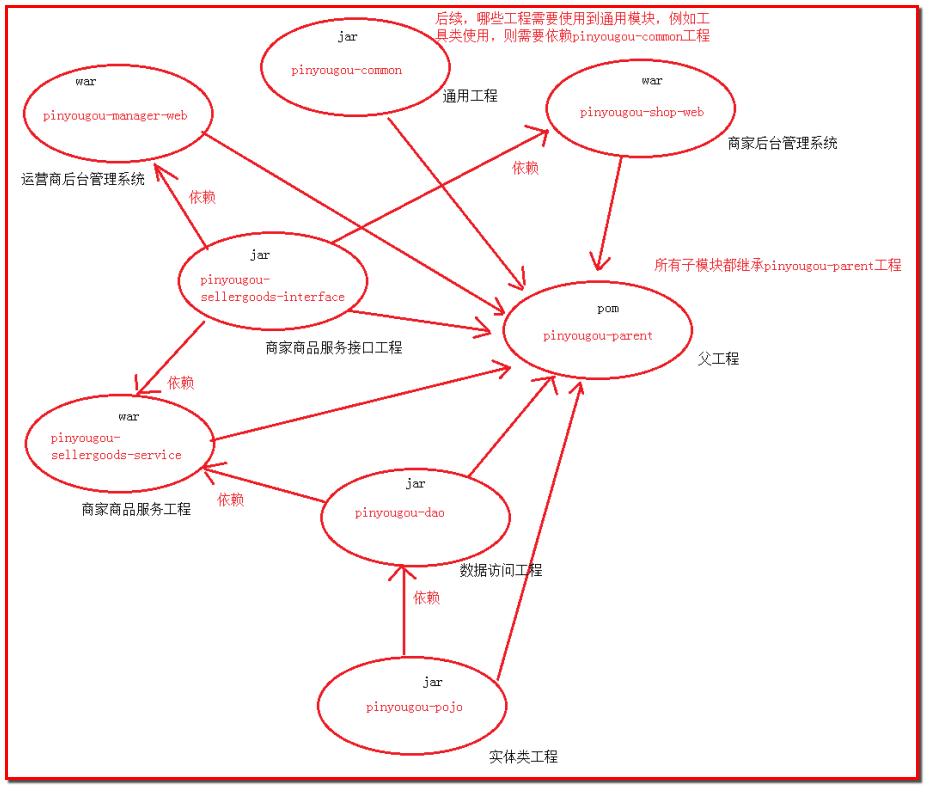

# day01总结

## 一.项目介绍

### 1.电商项目特点

- 高并发
  - 集群：部署多台服务器，共同完成一件事情(业务增加，厨房厨师不够用，招聘厨师，相当于增加服务器，集群)
  - 分布式：多台服务器，根据不同的业务，做不同的事情(酒店的厨师、服务员、收银员和老板，角色不同完成不同的任务，分布式)
  - 共同点：涉及多台服务器
- 高可用
  - 负载均衡
  - 主-备服务器构建
- 海量数据储存
- 业务复杂

### 2.常见电商模式

B2B：阿里巴巴

B2C：唯品会

C2C：淘宝

o2o：online、offline，美团，饿了么

B2B2C：天猫、京东

### 3.品优购项目的构成

品优购网上购物商城主要由3部分组成：**网站前台、运营商后台和商家管理后台**

**系统架构采用SOA(Service-Oriented Architecture)：面向服务开发的思想**

### 4.技术选型

**前后端分离，前端使用angularJS+Bootstrap，后台使用Spring+SpringMVC+Mybatis+Dubbo**

架构图


**架构调用流程**


1. 服务层通过dubbo把对象注册到zookeeper注册中心，服务层作为服务的提供者
2. 表现层通过dubbo从zookeeper注册中心获取对象，并消费服务
3. 表现层使用获得的代理对象远程调用服务层方法

## 二.dubbo分布式服务框架

dubbo是阿里巴巴的一个开源的分布式服务框架，提供**高性能、RPC远程服务调用，和SOA服务**，主要用于解决分布式的场景，本质上就是一个**远程调用的分布式框架**


节点角色说明：

- provider：服务的提供方
- consumer：调用远程服务的服务消费方
- register：服务注册中心
- monitor：监控中心
- container：服务运行的容器

调用关系说明：

- 0：服务器容器启动，加载，运行service provider
- 1：服务提供方在启动时，需要在注册中心注册提供的服务
- 2：服务消费方在启动时，向注册中心订阅自己所需要的服务
- 3：注册中心返回服务提供方地址列表给消费者，如果有变更，注册中心将基于长连接推送变更数据给消费者
- 4：服务消费者，从提供者地址列表中，基于软负载均衡算法，选一台提供者进行调用，如果调用失败，再选另一台调用。
- 5：服务消费者和提供者，在内存中累计调用次数和调用时间，定时每分钟发送一次统计
  数据到监控中心。

## 三.注册中心zookeeper

Apache Hadoop的子项目，支持变更推送，作为Dubbo服务的注册中心。

### 1.zookeeper在Linux上的安装

第一步：在Linux上安装jdk

第二步：上传zookeeper的压缩包到Linux系统的/root/pinyougou/目录下

第三步：解压，解压命令：**tar -zxvf zookeeper-3.4.6.tar.gz**

第四步：进入zookeeper目录，创建data文件夹，创建命令**：mkdir data**

第五步：进入conf目录，修改zoo_sample.cfg为zoo.cfg，命令：**mv zoo_sample.cfg zoo.cfg**

第六步：**vim zoo.cfg**，然后按**i**，进入编辑，修改data属性：**dataDir=/root/pinyougou/zookeeper-3.4.6/data**，退出**esc**，然后再**:wq**，退出并保存

第七步：在bin目录下启动，zookeeper启动命令：**./zkServer.sh start**，关闭命令：**./zkServer.sh stop**

查看状态：**./zkServer.sh status**

### 2.管理中心的配置

作用：知道注册中心提供了哪些服务，消费了哪些服务

上传dubbo-admin.war到Linux的/root/pinyougou/tomcat/webapps的目录下面即可

浏览器访问：http://192.168.25.128:8080/dubbo-admin/

## 四.品优购-框架搭建



**父工程项目：pinyougou_parent，pom**

**实体类：pinyougou_pojo，jar**

**持久层dao：pinyougou_dao，依赖实体类，jar**

**服务层service：pinyougou_xxx_service，依赖服务层接口，war**

**服务层接口：pinyougou_xxx_interface，jar**

**表现层web：pinyougou_xxx_web，依赖服务层接口，war**

### 1.父工程

创建带有site骨架的maven项目

- GroupId：com.pinyougou
- ArtifactId：pinyougou_parent

父工程的pom.xml文件

```xml
<!-- 集中定义依赖版本号 -->
<properties>
	<junit.version>4.12</junit.version>
	<spring.version>4.2.4.RELEASE</spring.version>
	<pagehelper.version>4.0.0</pagehelper.version>
	<servlet-api.version>2.5</servlet-api.version>
	<dubbo.version>2.8.4</dubbo.version>
	<zookeeper.version>3.4.7</zookeeper.version>
	<zkclient.version>0.1</zkclient.version>		
	<mybatis.version>3.2.8</mybatis.version>
	<mybatis.spring.version>1.2.2</mybatis.spring.version>
	<mybatis.paginator.version>1.2.15</mybatis.paginator.version>
	<mysql.version>5.1.32</mysql.version>		
	<druid.version>1.0.9</druid.version>
	<commons-fileupload.version>1.3.1</commons-fileupload.version>
	<freemarker.version>2.3.23</freemarker.version>
	<activemq.version>5.11.2</activemq.version>
	<security.version>3.2.3.RELEASE</security.version>		
	<solrj.version>4.10.3</solrj.version>
	<ik.version>2012_u6</ik.version>		
</properties>

<dependencyManagement>
	<dependencies>	
		<!-- Spring -->
		<dependency>
			<groupId>org.springframework</groupId>
			<artifactId>spring-context</artifactId>
			<version>${spring.version}</version>
		</dependency>
		<dependency>
			<groupId>org.springframework</groupId>
			<artifactId>spring-beans</artifactId>
			<version>${spring.version}</version>
		</dependency>
		<dependency>
			<groupId>org.springframework</groupId>
			<artifactId>spring-webmvc</artifactId>
			<version>${spring.version}</version>
		</dependency>
		<dependency>
			<groupId>org.springframework</groupId>
			<artifactId>spring-jdbc</artifactId>
			<version>${spring.version}</version>
		</dependency>
		<dependency>
			<groupId>org.springframework</groupId>
			<artifactId>spring-aspects</artifactId>
			<version>${spring.version}</version>
		</dependency>
		<dependency>
			<groupId>org.springframework</groupId>
			<artifactId>spring-jms</artifactId>
			<version>${spring.version}</version>
		</dependency>
		<dependency>
			<groupId>org.springframework</groupId>
			<artifactId>spring-context-support</artifactId>
			<version>${spring.version}</version>
		</dependency>
		<dependency>
			<groupId>org.springframework</groupId>
			<artifactId>spring-test</artifactId>
			<version>${spring.version}</version>
		</dependency>
		<!-- dubbo相关 -->
		<dependency>
			<groupId>com.alibaba</groupId>
			<artifactId>dubbo</artifactId>
			<version>${dubbo.version}</version>
		</dependency>
		<dependency>
			<groupId>org.apache.zookeeper</groupId>
			<artifactId>zookeeper</artifactId>
			<version>${zookeeper.version}</version>
		</dependency>
		<dependency>
			<groupId>com.github.sgroschupf</groupId>
			<artifactId>zkclient</artifactId>
			<version>${zkclient.version}</version>
		</dependency>
		<dependency>
			<groupId>junit</groupId>
			<artifactId>junit</artifactId>
			<version>4.9</version>
		</dependency>
		<dependency>
			<groupId>com.alibaba</groupId>
			<artifactId>fastjson</artifactId>
			<version>1.2.28</version>
		</dependency>
		<dependency>
			<groupId>javassist</groupId>
			<artifactId>javassist</artifactId>
			<version>3.11.0.GA</version>
		</dependency>
		<dependency>
			<groupId>commons-codec</groupId>
			<artifactId>commons-codec</artifactId>
			<version>1.10</version>
		</dependency>
		<dependency>
			<groupId>javax.servlet</groupId>
			<artifactId>servlet-api</artifactId>
			<version>2.5</version>
			<scope>provided</scope>
		</dependency>
		<dependency>
			<groupId>com.github.pagehelper</groupId>
			<artifactId>pagehelper</artifactId>
			<version>${pagehelper.version}</version>
		</dependency>		
		<!-- Mybatis -->
		<dependency>
			<groupId>org.mybatis</groupId>
			<artifactId>mybatis</artifactId>
			<version>${mybatis.version}</version>
		</dependency>
		<dependency>
			<groupId>org.mybatis</groupId>
			<artifactId>mybatis-spring</artifactId>
			<version>${mybatis.spring.version}</version>
		</dependency>
		<dependency>
			<groupId>com.github.miemiedev</groupId>
			<artifactId>mybatis-paginator</artifactId>
			<version>${mybatis.paginator.version}</version>
		</dependency>		
		<!-- MySql -->
		<dependency>
			<groupId>mysql</groupId>
			<artifactId>mysql-connector-java</artifactId>
			<version>${mysql.version}</version>
		</dependency>
		<!-- 连接池 -->
		<dependency>
			<groupId>com.alibaba</groupId>
			<artifactId>druid</artifactId>
			<version>${druid.version}</version>
		</dependency>		
		<dependency>
			<groupId>org.csource.fastdfs</groupId>
			<artifactId>fastdfs</artifactId>
			<version>1.2</version>
		</dependency>
		<!-- 文件上传组件 -->
		<dependency>
			<groupId>commons-fileupload</groupId>
			<artifactId>commons-fileupload</artifactId>
			<version>${commons-fileupload.version}</version>
		</dependency>		
		<!-- 缓存 -->
		<dependency> 
		  <groupId>redis.clients</groupId> 
		  <artifactId>jedis</artifactId> 
		  <version>2.8.1</version> 
		</dependency> 
		<dependency> 
		  <groupId>org.springframework.data</groupId> 
		  <artifactId>spring-data-redis</artifactId> 
		  <version>1.7.2.RELEASE</version> 
		</dependency>		
		<dependency>
			<groupId>org.freemarker</groupId>
			<artifactId>freemarker</artifactId>
			<version>${freemarker.version}</version>
		</dependency>		
		<dependency>
			<groupId>org.apache.activemq</groupId>
			<artifactId>activemq-all</artifactId>
			<version>${activemq.version}</version>
		</dependency>
		<!-- 身份验证 -->
		<dependency>
			<groupId>org.springframework.security</groupId>
			<artifactId>spring-security-web</artifactId>
			<version>4.1.0.RELEASE</version>
		</dependency>
		<dependency>
			<groupId>org.springframework.security</groupId>
			<artifactId>spring-security-config</artifactId>
			<version>4.1.0.RELEASE</version>
		</dependency>		
		<dependency>
			<groupId>com.github.penggle</groupId>
			<artifactId>kaptcha</artifactId>
			<version>2.3.2</version>
			<exclusions>
				<exclusion>
					<groupId>javax.servlet</groupId>
					<artifactId>javax.servlet-api</artifactId>
				</exclusion>
			</exclusions>
		</dependency>		
		<dependency>  
			<groupId>org.springframework.security</groupId>  
			<artifactId>spring-security-cas</artifactId>  
			<version>4.1.0.RELEASE</version>  
		</dependency>  
		<dependency>  
			<groupId>org.jasig.cas.client</groupId>  
			<artifactId>cas-client-core</artifactId>  
			<version>3.3.3</version>  
			<!-- 排除log4j包冲突 -->  
			<exclusions>  
				<exclusion>  
					<groupId>org.slf4j</groupId>  
					<artifactId>log4j-over-slf4j</artifactId>  
				</exclusion>  
			</exclusions>  
		</dependency> 	    
		<!-- solr客户端 -->
		<dependency>
			<groupId>org.apache.solr</groupId>
			<artifactId>solr-solrj</artifactId>
			<version>${solrj.version}</version>
		</dependency>
		<dependency>
			<groupId>com.janeluo</groupId>
			<artifactId>ikanalyzer</artifactId>
			<version>${ik.version}</version>
		</dependency>	
		<dependency>
			<groupId>org.apache.httpcomponents</groupId>
			<artifactId>httpcore</artifactId>
			<version>4.4.4</version>
		</dependency>  		
		<dependency>
			<groupId>org.apache.httpcomponents</groupId>
			<artifactId>httpclient</artifactId>
			<version>4.5.3</version>
		</dependency>
		<dependency>
			<groupId>dom4j</groupId>
			<artifactId>dom4j</artifactId>
			<version>1.6.1</version>
		</dependency>  		
		<dependency>  
			<groupId>xml-apis</groupId>  
			<artifactId>xml-apis</artifactId>  
			<version>1.4.01</version>  
		</dependency> 		
	</dependencies>	
</dependencyManagement>

<build>
	<plugins>			
		<!-- java编译插件 -->
		<plugin>
			<groupId>org.apache.maven.plugins</groupId>
			<artifactId>maven-compiler-plugin</artifactId>
			<version>3.2</version>
			<configuration>
				<source>1.7</source>
				<target>1.7</target>
				<encoding>UTF-8</encoding>
			</configuration>
		</plugin>
	</plugins>
</build>
```


