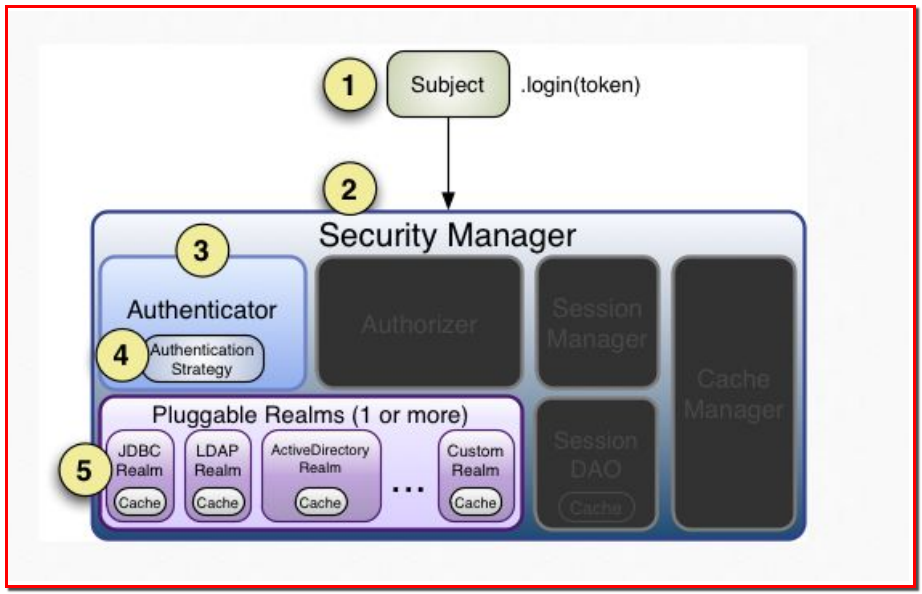

# Shiro

## 一.Shiro概述

### 1.Shiro简介
<!-- TOC -->

- [Shiro](#shiro)
    - [一.Shiro概述](#一shiro概述)
        - [1.Shiro简介](#1shiro简介)
        - [2.Shiro入门程序HelloShiro](#2shiro入门程序helloshiro)
    - [二.身份认证](#二身份认证)
        - [1.Subject认证主体](#1subject认证主体)
        - [2.身份认证流程](#2身份认证流程)
        - [3.Realm和JdbcRealm](#3realm和jdbcrealm)
        - [4.demo案例](#4demo案例)
    - [三.权限认证(授权)](#三权限认证授权)
        - [1.权限认证核心要素](#1权限认证核心要素)
        - [2.授权](#2授权)
            - [2.1基于角色的访问控制-相关API](#21基于角色的访问控制-相关api)
            - [2.2基于权限的访问控制-相关API](#22基于权限的访问控制-相关api)
            - [2.3基于角色和权限的测试demo](#23基于角色和权限的测试demo)
            - [2.4Permissions 对权限深入理解](#24permissions-对权限深入理解)
            - [2.5授权流程](#25授权流程)
    - [四.Shiro集成Web](#四shiro集成web)
        - [1.Shiro集成Web配置](#1shiro集成web配置)
        - [2.Shiro集成Web具体使用](#2shiro集成web具体使用)
        - [3.Shiro标签使用](#3shiro标签使用)
            - [3.1 hasRole标签](#31-hasrole标签)
            - [3.2 guest标签](#32-guest标签)
            - [3.3 user标签](#33-user标签)
            - [3.4 hasPermission标签](#34-haspermission标签)
            - [3.5 principal标签](#35-principal标签)
        - [4.Shiro会话机制](#4shiro会话机制)
            - [4.1 servlet容器的session-推荐使用](#41-servlet容器的session-推荐使用)
            - [4.2 shiro的容器session](#42-shiro的容器session)
        - [5.自定义Realm](#5自定义realm)
    - [五.加密](#五加密)
        - [1.shiro加密解密](#1shiro加密解密)
        - [2.shiro解密应用](#2shiro解密应用)
    - [六.Shiro支持特性](#六shiro支持特性)
        - [1.Web  支持](#1web--支持)
        - [2.缓存支持](#2缓存支持)
        - [3.并发支持](#3并发支持)
        - [4.测试支持](#4测试支持)
        - [5.“RunAs ”支持](#5runas-支持)
        - [6.“Remember Me"](#6remember-me)
    - [七.spring整合shiro](#七spring整合shiro)
        - [1.准备sql脚本](#1准备sql脚本)
        - [2.导入依赖，pom.xml](#2导入依赖pomxml)
        - [3.web.xml](#3webxml)
        - [4.准备配置文件](#4准备配置文件)
            - [4.1 applicationContext.xml](#41-applicationcontextxml)
            - [4.2 mybatis-config.xml](#42-mybatis-configxml)
            - [4.3 springmvc.xml](#43-springmvcxml)
            - [4.4 log4j.properties](#44-log4jproperties)
        - [5.建立实体类User](#5建立实体类user)
        - [6.建立dao接口](#6建立dao接口)
        - [7.创建service接口及其实现类](#7创建service接口及其实现类)
        - [8.建立UserController类](#8建立usercontroller类)
        - [9.建立自定义Realm，MyRealm](#9建立自定义realmmyrealm)
        - [10.测试](#10测试)

<!-- /TOC -->
Shiro官网：http://shiro.apache.org/

百度百科：https://baike.baidu.com/item/shiro/17753571?fr=aladdin

Apache Shiro是一个强大且易用的Java安全框架,执行身份验证、授权、密码和会话管理 

三个核心组件：**Subject, SecurityManager 和 Realms**. 

- Subject：即“当前操作用户” ，Subject代表了当前用户的安全操作 
- SecurityManager：它是Shiro框架的核心 ，管理内部组件实例，并通过它来提供安全管理的各种服务 
- Realm： Realm充当了Shiro与应用安全数据间的“桥梁”或者“连接器”。也就是说，当对用户执行认证（登录）和授权（访问控制）验证时，Shiro会从应用配置的Realm中查找用户及其权限信息 

Realm实质上是一个安全相关的DAO：它封装了数据源的连接细节，并在需要时将相关数据提供给Shiro 

### 2.Shiro入门程序HelloShiro

建立一个maven工程com.jack.shiro.shiro_demo

1.pom.xml导入shiro相关jar包

```xml
<dependencies>
<!-- 引入shiro的核心包 -->
    <dependency>
        <groupId>org.apache.shiro</groupId>
        <artifactId>shiro-core</artifactId>
        <version>1.2.4</version>
    </dependency>
    <dependency>
        <groupId>org.slf4j</groupId>
        <artifactId>slf4j-log4j12</artifactId>
        <version>1.7.25</version>
    </dependency>
</dependencies>
```

2.创建shiro.ini(配置文件放resources)

```ini
[users]
jack=123456
rose=123456
```

3.编写测试程序HelloShiro(创建com.jack.shiro包)

```java
import org.apache.shiro.SecurityUtils;
import org.apache.shiro.authc.AuthenticationException;
import org.apache.shiro.authc.UsernamePasswordToken;
import org.apache.shiro.config.IniSecurityManagerFactory;
import org.apache.shiro.mgt.SecurityManager;
import org.apache.shiro.subject.Subject;
import org.apache.shiro.util.Factory;

public class HelloShiro {
	
	public static void main(String[] args) {
		// 读取配置文件，初始化SecurityManager工厂
		Factory<SecurityManager> factory = new IniSecurityManagerFactory("classpath:shiro.ini");
		// 获取securityManager实例
		SecurityManager securityManager = factory.getInstance();
		// 把securityManager实例绑定到SecurityUtils
		SecurityUtils.setSecurityManager(securityManager);
		// 得到当前执行的用户
		Subject currentUser = SecurityUtils.getSubject();
		// 创建token令牌，用户名/密码
		UsernamePasswordToken token = new UsernamePasswordToken("jack", "123456");
		try {
			currentUser.login(token);
			System.out.println("身份认证成功!");
		} catch (AuthenticationException e) {
			e.printStackTrace();
			System.out.println("身份认证失败!");
		}
		// 退出
		currentUser.logout();
	}
}
```

## 二.身份认证

### 1.Subject认证主体

```
Subject 认证主体包含两个信息：
Principals：身份，可以是用户名，邮件，手机号码等等，用来标识一个登录主体身份；
Credentials：凭证，常见有密码，数字证书等等；
```

### 2.身份认证流程



### 3.Realm和JdbcRealm

Realm：意思是域，Shiro 从 Realm 中获取验证数据；
Realm 有很多种类，例如常见的 jdbc realm，jndi realm，text realm。

### 4.demo案例

创建maven项目工程com.jack.shiro.shiro_demo2

1.pom.xml文件

```xml
 <dependencies>
 	<!-- shiro核心包 -->
 	<dependency>
		<groupId>org.apache.shiro</groupId>
		<artifactId>shiro-core</artifactId>
		<version>1.2.4</version>
    </dependency>
    <dependency>
		<groupId>org.slf4j</groupId>
		<artifactId>slf4j-log4j12</artifactId>
		<version>1.7.12</version>
	</dependency>
	<!-- c3p0连接池 -->
	<dependency>
		<groupId>c3p0</groupId>
		<artifactId>c3p0</artifactId>
		<version>0.9.1.2</version>
	</dependency>
	<dependency>
		<groupId>commons-logging</groupId>
		<artifactId>commons-logging</artifactId>
		<version>1.2</version>
	</dependency>
	<!-- mysql的驱动包 -->
	<dependency>
		<groupId>mysql</groupId>
		<artifactId>mysql-connector-java</artifactId>
		<version>5.1.37</version>
	</dependency>
 </dependencies>
```

2.jdbc_realm.ini配置文件

```ini
[main]
#采用第三方JdbcRealm连接数据库
jdbcRealm=org.apache.shiro.realm.jdbc.JdbcRealm

#实例化数据源
dataSource=com.mchange.v2.c3p0.ComboPooledDataSource

#设置参数
dataSource.driverClass=com.mysql.jdbc.Driver
dataSource.jdbcUrl=jdbc:mysql://localhost:3306/db_shiro
dataSource.user=root
dataSource.password=root

#将数据源设置到realm中
jdbcRealm.dataSource=$dataSource
securityManager.realms=$jdbcRealm
```

3.编写测试类JdbcRealmTest

```java
import org.apache.shiro.SecurityUtils;
import org.apache.shiro.authc.AuthenticationException;
import org.apache.shiro.authc.UsernamePasswordToken;
import org.apache.shiro.config.IniSecurityManagerFactory;
import org.apache.shiro.mgt.SecurityManager;
import org.apache.shiro.subject.Subject;
import org.apache.shiro.util.Factory;

public class JdbcRealmTest {
	
	public static void main(String[] args) {
		// 读取配置文件，初始化SecurityManager工厂
		Factory<SecurityManager> factory = new IniSecurityManagerFactory("classpath:jdbc_realm.ini");
		// 获取securityManager实例
		SecurityManager securityManager = factory.getInstance();
		// 把securityManager实例绑定到SecurityUtils
		SecurityUtils.setSecurityManager(securityManager);
		// 得到当前执行的用户
		Subject currentUser = SecurityUtils.getSubject();
		// 创建token令牌，用户名/密码
		UsernamePasswordToken token = new UsernamePasswordToken("jack", "123456");
		try {
			currentUser.login(token);
			System.out.println("身份认证成功!");
		} catch (AuthenticationException e) {
			e.printStackTrace();
			System.out.println("身份认证失败!");
		}
		// 退出
		currentUser.logout();
	}
}
```

## 三.权限认证(授权)

### 1.权限认证核心要素

```txt
权限认证，也就是访问控制，即在应用中控制谁能访问哪些资源。
在权限认证中，最核心的三个要素是：权限，角色和用户；
权限，即操作资源的权利，比如访问某个页面，以及对某个模块的数据的添加，修改，删除，查看的权利；
角色，是权限的集合，一中角色可以包含多种权限；
用户，在 Shiro 中，代表访问系统的用户，即 Subject；
```

1.创建shiro_role.ini文件

```ini
[users]
jack=123456, role1, role2
rose=123456, role1
```

2.封装ShiroUtil工具类，放在com.jack.common包下

```java
import org.apache.shiro.SecurityUtils;
import org.apache.shiro.authc.AuthenticationException;
import org.apache.shiro.authc.UsernamePasswordToken;
import org.apache.shiro.config.IniSecurityManagerFactory;
import org.apache.shiro.mgt.SecurityManager;
import org.apache.shiro.subject.Subject;
import org.apache.shiro.util.Factory;

public class ShiroUtil {
	
	public static Subject login(String fileName, String userName, String passwrod) {
		// 读取配置文件，初始化SecurityManager工厂
		Factory<SecurityManager> factory = new IniSecurityManagerFactory(fileName);
		// 获取securityManager实例
		SecurityManager securityManager = factory.getInstance();
		// 把securityManager实例绑定到SecurityUtils
		SecurityUtils.setSecurityManager(securityManager);
		// 得到当前执行的用户
		Subject currentUser = SecurityUtils.getSubject();
		// 创建token令牌，用户名/密码
		UsernamePasswordToken token = new UsernamePasswordToken(userName, passwrod);
		try {
			currentUser.login(token);
			System.out.println("身份认证成功!");
		} catch (AuthenticationException e) {
			e.printStackTrace();
			System.out.println("身份认证失败!");
		}
		return currentUser;
	}
}
```

3.创建一个测试类RoleTest.java

```java
public class RoleTest {

	/**
	 * 测试基于角色的访问控制
	 */
	@Test
	public void testRole() {
		Subject subject = ShiroUtil.login("classpath:shiro_role.ini", "jack", "123456");
		System.out.println(subject.hasRole("role1")?"有role1这个角色":"没有role1这个角色");
	}
}
```

### 2.授权

```txt
1，编程式授权
1.1 基于角色的访问控制
1.2 基于权限的访问控制
2，注解式授权
@RequiresAuthentication 要求当前 Subject 已经在当前的 session 中被验证通过才能被访问或调用。
@RequiresGuest 要求当前的 Subject 是一个"guest"，也就是说，他们必须是在之前的 session 中没有被验证或被记住才
能被访问或调用。
@RequiresPermissions("account:create") 要求当前的 Subject 被允许一个或多个权限，以便执行注解的方法。
@RequiresRoles("administrator") 要求当前的 Subject 拥有所有指定的角色。如果他们没有，则该方法将不会被执行，而
且 AuthorizationException 异常将会被抛出。
@RequiresUser RequiresUser 注解需要当前的 Subject 是一个应用程序用户才能被注解的类/实例/方法访问或调用。一个“应
用程序用户”被定义为一个拥有已知身份，或在当前 session 中由于通过验证被确认，或者在之前 session 中的'RememberMe'
服务被记住。
3，Jsp 标签授权
<%@ taglib prefix="shiro" uri="http://shiro.apache.org/tags" %>
Guest 标签：用户没有身份验证时显示相应信息，即游客访问信息；
User 标签：用户已经身份验证/记住我登录后显示相应的信息；
Authenticated 标签：用户已经身份验证通过，即 Subject.login 登录成功，不是记住我登录的。
notAuthenticated 标签：用户没有身份验证通过，即没有调用 Subject.login 进行登录，包括记住我自动登录
的也属于未进行身份验证。
principal 标签 显示用户身份信息，默认调用 Subject.getPrincipal()获取，即 Primary Principal。
hasRole 标签 如果当前 Subject 有角色将显示 body 体内容。
lacksRole 标签 如果当前 Subject 没有角色将显示 body 体内容。
hasAnyRoles 标签 如果当前 Subject 有任意一个角色（或的关系）将显示 body 体内容。
hasPermission 标签 如果当前 Subject 有权限将显示 body 体内容。
lacksPermission 标签 如果当前 Subject 没有权限将显示 body 体内容
```

#### 2.1基于角色的访问控制-相关API

hasRole方法


checkRole方法


#### 2.2基于权限的访问控制-相关API

isPermitted方法


checkPermission方法


#### 2.3基于角色和权限的测试demo

1.创建shiro_role.ini和shiro_permission.ini文件

```ini
[users]
jack=123456, role1, role2
rose=123456, role1
```

```ini
[users]
jack=123456, role1, role2
rose=123456, role1
[roles]
role1=user:select
role2=user:select, user:update, user:delete
```

2.创建RoleTest.java文件和PermissionTest.java文件

```java
package com.jack.shiro;

import java.util.Arrays;
import org.apache.shiro.subject.Subject;
import org.junit.Test;
import com.jack.common.ShiroUtil;

public class RoleTest {

	/**
	 * 测试基于角色的访问控制
	 * hasRole(String roleName)
	 * hasRoles(List<String> roleNames)
	 * hasAllRoles(Collection<String> roleNames)
	 */
	@Test
	public void testHasRole() {
		Subject currentUser = ShiroUtil.login("classpath:shiro_role.ini", "jack", "123456");
		// Subject currentUser = ShiroUtil.login("classpath:shiro_role.ini", "rose", "123456");
		// 测试hasRole()
		System.out.println(currentUser.hasRole("role1")?"有role1这个角色":"没有role1这个角色");
		// 测试hasRoles()
		boolean[] roles = currentUser.hasRoles(Arrays.asList("role1", "role2", "role3"));
		System.out.println(roles[0]?"有role1这个角色":"没有role1这个角色");
		System.out.println(roles[1]?"有role2这个角色":"没有role2这个角色");
		System.out.println(roles[2]?"有role3这个角色":"没有role3这个角色");
		// 测试hasAllRoles()
		System.out.println(currentUser.hasAllRoles(Arrays.asList("role1", "role2"))?"role1, role2这两个角色都有":"role1, role2这两个个角色不全有");
	}
	
	/**
	 * 检查是否有该角色
	 * checkRole(String roleName)
	 * checkRoles(Collection<String> roleNames)
	 * checkRoles(String... roleNames)
	 */
	@Test
	public void testCheckRole() {
		Subject currentUser = ShiroUtil.login("classpath:shiro_role.ini", "jack", "123456");
		// 测试checkRole()
		currentUser.checkRole("role1");
		// 测试checkRoles(Collection<String> roleNames)
		currentUser.checkRoles(Arrays.asList("role1", "role2"));
		// 测试checkRoles(String... roleNames)
		currentUser.checkRoles("role1", "role2");
	}
}
```

```java
package com.jack.shiro;

import org.apache.shiro.subject.Subject;
import org.junit.Test;
import com.jack.common.ShiroUtil;

public class PermissionTest {

	/**
	 *  基于权限的访问控制
	 *  isPermitted(Permission p)，isPermitted(String perms)-常用
	 *  isPermitted(List<Permission> perms), isPermitted(String perms)-常用
	 *  isPermittedAll(Collection<Permission> perms)，isPermittedAll(String... perms)-常用
	 */
	@Test
	public void testIsPermissted() {
		Subject currentUser = ShiroUtil.login("classpath:shiro_permission.ini", "jack", "123456");
		// Subject currentUser = ShiroUtil.login("classpath:shiro_permission.ini", "rose", "123456");
		System.out.println(currentUser.isPermitted("user:select")?"有user:select这个权限":"没有user:select这个权限");
		
		boolean[] permissions = currentUser.isPermitted("user:select", "user:update", "user:delete");
		System.out.println(permissions[0]?"有user:select这个权限":"没有user:select这个权限");
		System.out.println(permissions[1]?"有user:update这个权限":"没有user:update这个权限");
		System.out.println(permissions[2]?"有user:delete这个权限":"没有user:delete这个权限");
		
		System.out.println(currentUser.isPermittedAll("user:select", "user:update", "user:delete")
				?"user:select，user:update，user:delete这3个权限都有":"user:select，user:update，user:delete这3个权限不全都有");
	}
	
	/**
	 * 基于权限的访问控制
	 * checkPermission(Permission p)，checkPermission(String perm)-常用
	 * checkPermissions(Collection<Permission> perms)，checkPermissions(String... perms)-常用
	 */
	@Test
	public void testCheckPermission() {
		Subject currentUser = ShiroUtil.login("classpath:shiro_permission.ini", "jack", "123456");
		// Subject currentUser = ShiroUtil.login("classpath:shiro_permission.ini", "rose", "123456");
		currentUser.checkPermission("user:update");
		
		currentUser.checkPermissions("user:select", "user:update", "user:delete");
	}
}
```

#### 2.4Permissions 对权限深入理解

```
单个权限 query
单个资源多个权限 user:query user:add 多值 user:query,add
单个资源所有权限 user:query,add,update,delete user:*
所有资源某个权限 *:view
实例级别的权限控制
单个实例的单个权限 printer:query:lp7200 printer:print:epsoncolor
所有实例的单个权限 printer:print:*
所有实例的所有权限 printer:*:*
单个实例的所有权限 printer:*:lp7200
单个实例的多个权限 printer:query,print:lp7200
```

#### 2.5授权流程


## 四.Shiro集成Web

### 1.Shiro集成Web配置

```xml
<listener>
	<listener-class>org.apache.shiro.web.env.EnvironmentLoaderListener</listener-class>
</listener>
<filter>
	<filter-name>ShiroFilter</filter-name>
	<filter-class>org.apache.shiro.web.servlet.IniShiroFilter</filter-class>
	<init-param>
		<param-name>configPath</param-name>
		<param-value>/WEB-INF/shiro.ini</param-value>
	</init-param>
</filter>
<filter-mapping>
    <filter-name>ShiroFilter</filter-name>
    <url-pattern>/*</url-pattern>
</filter-mapping>
```

1.在WEB-INF下创建shiro.ini

```ini
[main]
#必须先进行身份认证，才能进行后续角色和权限的认证操作
authc.loginUrl=/login
#角色认证未通过跳转的页面
roles.unauthorizedUrl=/unauthorized.jsp
#权限认证未通过跳转的页面
perms.unauthorizedUrl=/unauthorized.jsp
# 用户，以及该用户所拥有的角色
[users]
jack=123456,admin
rose=123456,teacher
marry=123
json=456
# 角色，以及该用户所拥有的权限
[roles]
admin=user:*
teacher=student:*
# 设置拦截url
[urls]
# 匿名用户也可以访问/login路径
/login=anon
# 访问/admin, shiro过滤器进行拦截，然后进行身份认证，用户没有登录则通过authc.loginUrl的配置跳转到/login
# /login则是请求LoginServlet，然后转发到login.jsp页面
/admin=authc
# 拥有user:create权限的已经登录的用户才能访问/teacher
/student=roles[teacher]
# 拥有user:create权限的才能访问/perms
/teacher=perms["user:create"]
```

2.在web.xml文件中添加shiro过滤器

```xml
<!-- 添加shiro支持 -->
  <listener>
	<listener-class>org.apache.shiro.web.env.EnvironmentLoaderListener</listener-class>
  </listener>
 <filter>
	<filter-name>ShiroFilter</filter-name>
	<filter-class>org.apache.shiro.web.servlet.IniShiroFilter</filter-class>
	<!-- <init-param>
		<param-name>configPath</param-name>
		<param-value>/WEB-INF/shiro.ini</param-value>
	</init-param> -->
 </filter>
 <filter-mapping>
    <filter-name>ShiroFilter</filter-name>
    <url-pattern>/*</url-pattern>
 </filter-mapping>
```

3.创建LoginServlet.java和AdminServlet.java

```java
public class LoginServlet extends HttpServlet{
	
	private static final long serialVersionUID = 1L;

	@Override
	protected void doGet(HttpServletRequest req, HttpServletResponse resp) throws ServletException, IOException {
		System.out.println("login doGet...");
		req.getRequestDispatcher("/login.jsp").forward(req, resp);
	}

	@Override
	protected void doPost(HttpServletRequest req, HttpServletResponse resp) throws ServletException, IOException {
		System.out.println("login doPost");
		String userName = req.getParameter("userName");
		String password = req.getParameter("password");
		// 获取当前登录认证用户
		Subject subject = SecurityUtils.getSubject();
		// 创建Token令牌
		UsernamePasswordToken token = new UsernamePasswordToken(userName, password);
		try {
			subject.login(token);
			resp.sendRedirect("success.jsp");
		} catch (AuthenticationException e) {
			e.printStackTrace();
			req.setAttribute("errorInfo", "用户名或者密码错误");
			req.getRequestDispatcher("login.jsp").forward(req, resp);
		}
		
	}
}
```

```java
public class AdminServlet extends HttpServlet{
	
	private static final long serialVersionUID = 1L;

	@Override
	protected void doGet(HttpServletRequest req, HttpServletResponse resp) throws ServletException, IOException {
		System.out.println("admin doGet...");
	}

	@Override
	protected void doPost(HttpServletRequest req, HttpServletResponse resp) throws ServletException, IOException {
		System.out.println("admin doPost...");
	}
}
```

4.在web.xml配置LoginServlet和AdminServlet的路径

```xml
<servlet>
 	<servlet-name>loginServlet</servlet-name>
 	<servlet-class>com.jack.servlet.LoginServlet</servlet-class>
 </servlet>
 <servlet-mapping>
 	<servlet-name>loginServlet</servlet-name>
 	<url-pattern>/login</url-pattern>
 </servlet-mapping>
 <servlet>
 	<servlet-name>adminServlet</servlet-name>
 	<servlet-class>com.jack.servlet.AdminServlet</servlet-class>
 </servlet>
 <servlet-mapping>
 	<servlet-name>adminServlet</servlet-name>
 	<url-pattern>/admin</url-pattern>
 </servlet-mapping>
```

5.在webapp下创建index.jsp、login.jsp、success.jsp和unauthorized.jsp4个页面

```jsp
<%@ page language="java" contentType="text/html; charset=utf-8" pageEncoding="utf-8"%>
<!DOCTYPE html PUBLIC "-//W3C//DTD HTML 4.01 Transitional//EN" "http://www.w3.org/TR/html4/loose.dtd">
<html>
<head>
<meta http-equiv="Content-Type" content="text/html; charset=utf-8">
<title>Insert title here</title>
</head>
<body>
hello world!
</body>
</html>
```

```jsp
<%@ page language="java" contentType="text/html; charset=utf-8" pageEncoding="utf-8"%>
<!DOCTYPE html PUBLIC "-//W3C//DTD HTML 4.01 Transitional//EN" "http://www.w3.org/TR/html4/loose.dtd">
<html>
<head>
<meta http-equiv="Content-Type" content="text/html; charset=utf-8">
<title>Insert title here</title>
</head>
<body>
<form action="login" method="post">
	userName:<input type="text" name="userName" /><br>
	password:<input type="password" name="password" /><br>
	<input type="submit" value="登录"/>
</form>
</body>
</html>
```

```jsp
<%@ page language="java" contentType="text/html; charset=UTF-8"
    pageEncoding="UTF-8"%>
<!DOCTYPE html PUBLIC "-//W3C//DTD HTML 4.01 Transitional//EN" "http://www.w3.org/TR/html4/loose.dtd">
<html>
<head>
<meta http-equiv="Content-Type" content="text/html; charset=UTF-8">
<title>Insert title here</title>
</head>
<body>
欢迎你!
</body>
</html>
```

```jsp
<%@ page language="java" contentType="text/html; charset=UTF-8"
    pageEncoding="UTF-8"%>
<!DOCTYPE html PUBLIC "-//W3C//DTD HTML 4.01 Transitional//EN" "http://www.w3.org/TR/html4/loose.dtd">
<html>
<head>
<meta http-equiv="Content-Type" content="text/html; charset=UTF-8">
<title>Insert title here</title>
</head>
<body>
认证未通过，或者权限不足
</body>
</html>
```

### 2.Shiro集成Web具体使用

```
Url 匹配方式
? 匹配一个字符 /admin? 可以匹配/admin1和/admin2 但是不能匹配/admin12 /admin
* 匹配零个或者一个或者多个字符 /admin* 可以匹配 /admin，/admin1 和/admin12 但是不能匹配/admin/abc
	/admin**和/admin*一样的效果
** 匹配零个或者多个路径 /admin/** 可以匹配/admin， /admin/a 和/admin/a/b
```

### 3.Shiro标签使用

#### 3.1 hasRole标签

**如果当前 Subject 有角色将显示 body 体内容**

1.先在success.jsp页面引入shiro的标签

```jsp
<%@ taglib prefix="shiro" uri="http://shiro.apache.org/tags" %>
```

2.再在success.jsp页面添加标签测试

```jsp
<shiro:hasRole name="admin">
	欢迎有admin角色的用户！
</shiro:hasRole>
```

这个表示只有admin角色的用户页面才显示该内容

#### 3.2 guest标签

**用户没有身份验证时显示相应信息，即游客访问信息**

```jsp
<shiro:guest>
欢迎你!
</shiro:guest>
```

#### 3.3 user标签

**用户已经身份验证/记住我登录后显示相应的信息**

```jsp
<shiro:user>
用户已经登录，可以看到该信息
</shiro:user>
```

#### 3.4 hasPermission标签

 **如果当前 Subject 有权限将显示 body 体内容**

```jsp
<shiro:hasPermission name="student:create">
	欢迎有student:create权限的用户！
</shiro:hasPermission>
```

#### 3.5 principal标签

**显示用户身份信息，默认调用 Subject.getPrincipal()获取，即 Primary Principal。**

```jsp
<shiro:user>
用户<shiro:principal/>已经登录，可以看到该信息
</shiro:user>
```

### 4.Shiro会话机制

#### 4.1 servlet容器的session-推荐使用

在web环境中，shiro默认的session管理器**SessionManager**实现是**ServletContainerSessionManager(org.apache.shiro.web.session.mgt包)**，其实底层还是servlet的容器session

如果使用默认的servlet容器，可以在web.xml中配置

```xml
<session-config>
  <!-- web.xml expects the session timeout in minutes: -->
  <session-timeout>30</session-timeout>
</session-config>
```

#### 4.2 shiro的容器session

如果想要设置shiro的session在我们的web项目中，实现shiro自己的SecurityManager的**DefaultWebSessionManager(org.apache.shiro.web.session.mgt包)**，在shiro.ini中配置

```ini
[main]
...
sessionManager = org.apache.shiro.web.session.mgt.DefaultWebSessionManager
# configure properties (like session timeout) here if desired
# Use the configured native session manager:
securityManager.sessionManager = $sessionManager
```

配置session cookie的sessionIdCookie属性

```ini
[main]
...
securityManager.sessionManager.sessionIdCookie.domain = foo.com
```

配置session cookie的sessionIdCookieEnabled 属性

```ini
[main]
...
securityManager.sessionManager.sessionIdCookieEnabled = false
```

在LoginServlet中获取session相关信息

```java
...
// 登录
subject.login(token);
// 获取session
Session session = subject.getSession();
System.out.println("sessionId:" + session.getId());
System.out.println("sessionHost:" + session.getHost());
// 会话超时默认是30分钟
System.out.println("sessionTimeout:" + session.getTimeout()); 
...
```

在success.jsp中取session数据

```jsp
<%@ page language="java" contentType="text/html; charset=UTF-8"
    pageEncoding="UTF-8"%>
<%@ taglib prefix="shiro" uri="http://shiro.apache.org/tags" %>
<!DOCTYPE html PUBLIC "-//W3C//DTD HTML 4.01 Transitional//EN" "http://www.w3.org/TR/html4/loose.dtd">
<html>
<head>
<meta http-equiv="Content-Type" content="text/html; charset=UTF-8">
<title>Insert title here</title>
</head>
<body>
${info}
<shiro:guest>
欢迎你!
</shiro:guest>
<shiro:user>
用户<shiro:principal/>已经登录，可以看到该信息
</shiro:user>
<shiro:hasPermission name="student:create">
	欢迎有student:create权限的用户！
</shiro:hasPermission>
<shiro:hasRole name="admin">
	欢迎有admin角色的用户！
</shiro:hasRole>
</body>
</html>
```

### 5.自定义Realm

1.准备数据库表

t_user

```sql
/*
Navicat MySQL Data Transfer

Source Server         : local-mysql
Source Server Version : 50549
Source Host           : localhost:3306
Source Database       : db_shiro

Target Server Type    : MYSQL
Target Server Version : 50549
File Encoding         : 65001

Date: 2018-10-25 16:38:20
*/

SET FOREIGN_KEY_CHECKS=0;

-- ----------------------------
-- Table structure for t_user
-- ----------------------------
DROP TABLE IF EXISTS `t_user`;
CREATE TABLE `t_user` (
  `id` int(11) NOT NULL AUTO_INCREMENT,
  `userName` varchar(20) DEFAULT NULL,
  `password` varchar(100) DEFAULT NULL,
  `roleId` int(11) DEFAULT NULL,
  PRIMARY KEY (`id`),
  KEY `roleId` (`roleId`),
  CONSTRAINT `t_user_ibfk_1` FOREIGN KEY (`roleId`) REFERENCES `t_role` (`id`)
) ENGINE=InnoDB AUTO_INCREMENT=5 DEFAULT CHARSET=utf8;

-- ----------------------------
-- Records of t_user
-- ----------------------------
INSERT INTO `t_user` VALUES ('1', 'jack', '123456', '1');
INSERT INTO `t_user` VALUES ('2', 'rose', '123456', '2');
INSERT INTO `t_user` VALUES ('3', 'marry', '123', null);
INSERT INTO `t_user` VALUES ('4', 'json', '456', null);

```

t_role

```sql
/*
Navicat MySQL Data Transfer

Source Server         : local-mysql
Source Server Version : 50549
Source Host           : localhost:3306
Source Database       : db_shiro

Target Server Type    : MYSQL
Target Server Version : 50549
File Encoding         : 65001

Date: 2018-10-25 16:38:32
*/

SET FOREIGN_KEY_CHECKS=0;

-- ----------------------------
-- Table structure for t_role
-- ----------------------------
DROP TABLE IF EXISTS `t_role`;
CREATE TABLE `t_role` (
  `id` int(11) NOT NULL AUTO_INCREMENT,
  `roleName` varchar(20) DEFAULT NULL,
  PRIMARY KEY (`id`)
) ENGINE=InnoDB AUTO_INCREMENT=3 DEFAULT CHARSET=utf8;

-- ----------------------------
-- Records of t_role
-- ----------------------------
INSERT INTO `t_role` VALUES ('1', 'admin');
INSERT INTO `t_role` VALUES ('2', 'teacher');

```

t_permission

```sql
/*
Navicat MySQL Data Transfer

Source Server         : local-mysql
Source Server Version : 50549
Source Host           : localhost:3306
Source Database       : db_shiro

Target Server Type    : MYSQL
Target Server Version : 50549
File Encoding         : 65001

Date: 2018-10-25 16:38:41
*/

SET FOREIGN_KEY_CHECKS=0;

-- ----------------------------
-- Table structure for t_permission
-- ----------------------------
DROP TABLE IF EXISTS `t_permission`;
CREATE TABLE `t_permission` (
  `id` int(11) NOT NULL AUTO_INCREMENT,
  `permissionName` varchar(50) DEFAULT NULL,
  `roleId` int(11) DEFAULT NULL,
  PRIMARY KEY (`id`),
  KEY `roleId` (`roleId`),
  CONSTRAINT `t_permission_ibfk_1` FOREIGN KEY (`roleId`) REFERENCES `t_role` (`id`)
) ENGINE=InnoDB AUTO_INCREMENT=3 DEFAULT CHARSET=utf8;

-- ----------------------------
-- Records of t_permission
-- ----------------------------
INSERT INTO `t_permission` VALUES ('1', 'user:*', '1');
INSERT INTO `t_permission` VALUES ('2', 'student:*', '2');

```

2.修改shiro.ini配置文件(webapp/WEB-INF/目录下)

```ini
[main]
#必须先进行身份认证，才能进行后续角色和权限的认证操作
authc.loginUrl=/login
#角色认证未通过跳转的页面
roles.unauthorizedUrl=/unauthorized.jsp
#权限认证未通过跳转的页面
perms.unauthorizedUrl=/unauthorized.jsp
myRealm=com.jack.realm.MyRealm
securityManager.realm=$myRealm
[urls]
# 匿名用户也可以访问/login路径
/login=anon
# 访问/admin, shiro过滤器进行拦截，然后进行身份认证，用户没有登录则通过authc.loginUrl的配置跳转到/login
/admin=authc
# 拥有teacher角色的已经登录的用户才能访问/student
/student=roles[teacher]
# 拥有user:create权限的已经登录的用户才能访问/teacher
/teacher=perms["user:create"]
```

3.准备实体类(com.jack.entity)

```java
public class User implements Serializable{

	private static final long serialVersionUID = 1L;
	
	private Integer id;
	
	private String userName;
	
	private String password;

	// ...	
}
```

4.数据库操作的工具类(com.jack.util)

```java
/**
   *   数据库工具类
 */
public class DbUtil {

	/**
	 * 获取数据库连接
	 * @return
	 * @throws Exception
	 */
	public Connection getCon() throws Exception{
		Class.forName("com.mysql.jdbc.Driver");
		Connection con=DriverManager.getConnection("jdbc:mysql://localhost:3306/db_shiro", "root", "root");
		return con;
	}
	
	/**
	 * 关闭数据库连接
	 * @param con
	 * @throws Exception
	 */
	public void closeCon(Connection con)throws Exception{
		if(con!=null){
			con.close();
		}
	}
	
	public static void main(String[] args) {
		DbUtil dbUtil=new DbUtil();
		try {
			dbUtil.getCon();
			System.out.println("数据库连接成功");
		} catch (Exception e) {
			// TODO Auto-generated catch block
			e.printStackTrace();
			System.out.println("数据库连接失败");
		}
	}
}
```

5.UserDao(com.jack.dao)

```java
public class UserDao {
	
	/**
	 * 根据用户名获取用户信息 
	 * @param connection
	 * @param userName
	 * @return
	 * @throws Exception
	 */
	public User getByUsername(Connection connection, String userName) throws Exception {
		// 定义User对象
		User user = null;
		// 定义查询语句
		String sql = "select * from t_user where userName = ?";
		// 执行查询操作
		PreparedStatement pstmt = connection.prepareStatement(sql);
		pstmt.setString(1, userName);
		ResultSet resultSet = pstmt.executeQuery();
		while (resultSet.next()) {
			user = new User();
			user.setUserName(resultSet.getString("userName"));
			user.setPassword(resultSet.getString("password"));
			user.setId(resultSet.getInt("id"));
		}
		return user;
	}

	/**
	 * 根据用户名获取用户的角色信息
	 * @param connection
	 * @param userName
	 * @return
	 * @throws Exception
	 */
	public Set<String> getRoleByUsername(Connection connection, String userName) throws Exception {
		Set<String> rolesSet = new HashSet<String>();
		String sql = "select * from t_user u, t_role r where u.roleId = r.id and u.userName = ?";
		PreparedStatement pstmt = connection.prepareStatement(sql);
		pstmt.setString(1, userName);
		ResultSet resultSet = pstmt.executeQuery();
		while (resultSet.next()) {
			rolesSet.add(resultSet.getString("roleName"));
		}
		return rolesSet;
	}

	/**
	 * 根据用户名获取用户的角色对应的权限信息
	 * @param connection
	 * @param userName
	 * @return
	 * @throws Exception
	 */
	public Set<String> getPermissionByUsername(Connection connection, String userName) throws Exception{
		Set<String> permissionsSet = new HashSet<String>();
		String sql = "select * from t_user u, t_role r, t_permission p where u.roleId = r.id and p.roleId = r.id and u.userName = ?";
		PreparedStatement pstmt = connection.prepareStatement(sql);
		pstmt.setString(1, userName);
		ResultSet resultSet = pstmt.executeQuery();
		while (resultSet.next()) {
			permissionsSet.add(resultSet.getString("permissionName"));
		}
		return permissionsSet;
	}
}
```

6.自定义realm，MyRealm.java(com.jack.realm)

```java
public class MyRealm extends AuthorizingRealm{

	private UserDao userDao = new UserDao();
	
	private DbUtil dbUtil = new DbUtil();
	
	/**
	 * 为当前登录的用户授予角色和权限-授权
	 */
	@Override
	protected AuthorizationInfo doGetAuthorizationInfo(PrincipalCollection principals) {
		// 获取已经登录的用户名
		String userName = (String) principals.getPrimaryPrincipal();
		// 定义授权对象
		SimpleAuthorizationInfo authorizationInfo = new SimpleAuthorizationInfo();
		Connection connection = null;
		try {
			connection = dbUtil.getCon();
			// 从数据库里查询角色和权限然后封装到授权对象里
			authorizationInfo.setRoles(userDao.getRoleByUsername(connection, userName));
			authorizationInfo.setStringPermissions(userDao.getPermissionByUsername(connection, userName));
		} catch(Exception e) {
			e.printStackTrace();
		} finally {
			try {
				dbUtil.closeCon(connection);
			} catch (Exception e) {
				// TODO Auto-generated catch block
				e.printStackTrace();
			}
		}
		return authorizationInfo;
	}

	/**
	 * 验证当前登录的用户-认证
	 */
	@Override
	protected AuthenticationInfo doGetAuthenticationInfo(AuthenticationToken token) throws AuthenticationException {
		// 从token中获取登录的用户名
		String userName = (String) token.getPrincipal();
		Connection connection = null;
		try {
			connection = dbUtil.getCon();
			// 根据用户名从数据库中查找该用户信息
			User user = userDao.getByUsername(connection, userName);
			if (user != null) {
				// 把用户名和密码封装到AuthenticationInfo对象信息里，框架底层再去和登录的用户名和密码做比对
				AuthenticationInfo authenticationInfo = new SimpleAuthenticationInfo(user.getUserName(), user.getPassword(), "随便输入");
				return authenticationInfo;
			} else {
				return null;
			}
		} catch(Exception e) {
			e.printStackTrace();
		} finally {
			try {
				dbUtil.closeCon(connection);
			} catch (Exception e) {
				// TODO Auto-generated catch block
				e.printStackTrace();
			}
		}
		return null;
	}
}
```

## 五.加密

### 1.shiro加密解密

两种加密方式：

- base64加密：对称加密
- md5加密：不可逆的一种加密方式

base64加密和解密的API

```
Base64.encodeToString(password.getBytes())
Base64.decodeToString(password)
```

md5加密API

```
new Md5Hash(password, salt)// salt加盐操作
```

### 2.shiro解密应用

```java
import org.apache.shiro.codec.Base64;
import org.apache.shiro.crypto.hash.Md5Hash;

/**
 * Cryptography: [krɪpˈɑ:grəfi]
   *   加密：密钥和证书管理
 * @author fztomaster
 *
 */
public class CryptographyUtil {
	
	/**
	 * base64加密
	 * @param password
	 * @return
	 */
	public static String encBase64(String password) {
		String encPassword = Base64.encodeToString(password.getBytes());
		return encPassword;
	}
	
	/**
	 * base64解密
	 * @param password
	 * @return
	 */
	public static String decBase64(String password) {
		String decPassword = Base64.decodeToString(password);
		return decPassword;
	}
	
	/**
	 * md5加密
	 * @param password
	 * @param salt
	 * @return
	 */
	public static String md5(String password, String salt) {
		String md5Password = new Md5Hash(password, salt).toString();
		return md5Password;
	}
	
	public static void main(String[] args) {
		String encPassword = CryptographyUtil.encBase64("123456");
		System.out.println("加密后的密码：" + encPassword);
		System.out.println("解密后的密码：" + CryptographyUtil.decBase64(encPassword));
		System.out.println("md5加密后的密码：" + CryptographyUtil.md5("123456", "123456"));
	}
}
```

在LoginServlet中使用shiro的md5加密

```java
...
// 创建Token令牌
UsernamePasswordToken token = new UsernamePasswordToken(userName, CryptographyUtil.md5(password, "123456"));
...
```

## 六.Shiro支持特性

### 1.Web  支持

### 2.缓存支持

### 3.并发支持

### 4.测试支持

### 5.“RunAs ”支持

### 6.“Remember Me"

**LoginServlet.java**

```java
import java.io.IOException;

import javax.servlet.ServletException;
import javax.servlet.http.HttpServlet;
import javax.servlet.http.HttpServletRequest;
import javax.servlet.http.HttpServletResponse;

import org.apache.shiro.SecurityUtils;
import org.apache.shiro.authc.AuthenticationException;
import org.apache.shiro.authc.UsernamePasswordToken;
import org.apache.shiro.session.Session;
import org.apache.shiro.subject.Subject;

import com.jack.util.CryptographyUtil;

public class LoginServlet extends HttpServlet{
	
	private static final long serialVersionUID = 1L;

	@Override
	protected void doGet(HttpServletRequest req, HttpServletResponse resp) throws ServletException, IOException {
		System.out.println("login doGet...");
		req.getRequestDispatcher("/login.jsp").forward(req, resp);
	}

	@Override
	protected void doPost(HttpServletRequest req, HttpServletResponse resp) throws ServletException, IOException {
		System.out.println("login doPost");
		String userName = req.getParameter("userName");
		String password = req.getParameter("password");
		// 获取当前登录认证用户
		Subject subject = SecurityUtils.getSubject();
		// 创建Token令牌
		UsernamePasswordToken token = new UsernamePasswordToken(userName, CryptographyUtil.md5(password, "123456"));
		try {
			if (subject.isRemembered()) {
				System.out.println("---isRememberMe---");
			} else {
				// 用户信息记录在cookie中
				token.setRememberMe(true);				
			}
			// 登录
			subject.login(token);
			// 获取session
			Session session = subject.getSession();
			System.out.println("sessionId:" + session.getId());
			System.out.println("sessionHost:" + session.getHost());
			// 会话超时默认是30分钟
			System.out.println("sessionTimeout:" + session.getTimeout()); 
			// session中存数据
			session.setAttribute("info", "session中的数据");
			resp.sendRedirect("success.jsp");
		} catch (AuthenticationException e) {
			e.printStackTrace();
			req.setAttribute("errorInfo", "用户名或者密码错误");
			req.getRequestDispatcher("login.jsp").forward(req, resp);
		}
		
	}
}
```

## 七.spring整合shiro

### 1.准备sql脚本

**t_permission.sql**

```mysql
SET FOREIGN_KEY_CHECKS=0;

-- ----------------------------
-- Table structure for t_permission
-- ----------------------------
DROP TABLE IF EXISTS `t_permission`;
CREATE TABLE `t_permission` (
  `id` int(11) NOT NULL AUTO_INCREMENT,
  `permissionName` varchar(50) DEFAULT NULL,
  `roleId` int(11) DEFAULT NULL,
  PRIMARY KEY (`id`),
  KEY `roleId` (`roleId`),
  CONSTRAINT `t_permission_ibfk_1` FOREIGN KEY (`roleId`) REFERENCES `t_role` (`id`)
) ENGINE=InnoDB AUTO_INCREMENT=3 DEFAULT CHARSET=utf8;

-- ----------------------------
-- Records of t_permission
-- ----------------------------
INSERT INTO `t_permission` VALUES ('1', 'user:*', '1');
INSERT INTO `t_permission` VALUES ('2', 'student:*', '2');
```

**t_role.sql**

```mysql
SET FOREIGN_KEY_CHECKS=0;

-- ----------------------------
-- Table structure for t_role
-- ----------------------------
DROP TABLE IF EXISTS `t_role`;
CREATE TABLE `t_role` (
  `id` int(11) NOT NULL AUTO_INCREMENT,
  `roleName` varchar(20) DEFAULT NULL,
  PRIMARY KEY (`id`)
) ENGINE=InnoDB AUTO_INCREMENT=3 DEFAULT CHARSET=utf8;

-- ----------------------------
-- Records of t_role
-- ----------------------------
INSERT INTO `t_role` VALUES ('1', 'admin');
INSERT INTO `t_role` VALUES ('2', 'teacher');
```

**t_user.sql**

```mysql
SET FOREIGN_KEY_CHECKS=0;

-- ----------------------------
-- Table structure for t_user
-- ----------------------------
DROP TABLE IF EXISTS `t_user`;
CREATE TABLE `t_user` (
  `id` int(11) NOT NULL AUTO_INCREMENT,
  `userName` varchar(20) DEFAULT NULL,
  `password` varchar(100) DEFAULT NULL,
  `roleId` int(11) DEFAULT NULL,
  PRIMARY KEY (`id`),
  KEY `roleId` (`roleId`),
  CONSTRAINT `t_user_ibfk_1` FOREIGN KEY (`roleId`) REFERENCES `t_role` (`id`)
) ENGINE=InnoDB AUTO_INCREMENT=5 DEFAULT CHARSET=utf8;

-- ----------------------------
-- Records of t_user
-- ----------------------------
INSERT INTO `t_user` VALUES ('1', 'jack', '123', '1');
INSERT INTO `t_user` VALUES ('2', 'rose', '123', '2');
INSERT INTO `t_user` VALUES ('3', 'marry', '123', null);
INSERT INTO `t_user` VALUES ('4', 'json', '456', null);
```

### 2.导入依赖，pom.xml

```xml
<dependencies>
    <dependency>
      <groupId>junit</groupId>
      <artifactId>junit</artifactId>
      <version>3.8.1</version>
      <scope>test</scope>
    </dependency>
    <!-- 添加Servlet支持 -->
  	<dependency>
		<groupId>javax.servlet</groupId>
		<artifactId>javax.servlet-api</artifactId>
		<version>3.1.0</version>
	</dependency>
	<dependency>
		<groupId>javax.servlet.jsp</groupId>
		<artifactId>javax.servlet.jsp-api</artifactId>
		<version>2.3.1</version>
	</dependency>
	<!-- 添加jtl支持 -->
	<dependency>
		<groupId>javax.servlet</groupId>
		<artifactId>jstl</artifactId>
		<version>1.2</version>
	</dependency>
  	<!-- 添加Spring支持 -->
	<dependency>
  		<groupId>org.springframework</groupId>
  		<artifactId>spring-core</artifactId>
  		<version>4.1.7.RELEASE</version>
  	</dependency>
  	<dependency>
  		<groupId>org.springframework</groupId>
  		<artifactId>spring-beans</artifactId>
  		<version>4.1.7.RELEASE</version>
  	</dependency>
  	<dependency>
         <groupId>org.springframework</groupId>
         <artifactId>spring-tx</artifactId>
         <version>4.1.7.RELEASE</version>
        </dependency>
  	<dependency>
  		<groupId>org.springframework</groupId>
  		<artifactId>spring-context</artifactId>
  		<version>4.1.7.RELEASE</version>
  	</dependency>
  	<dependency>
  		<groupId>org.springframework</groupId>
  		<artifactId>spring-context-support</artifactId>
  		<version>4.1.7.RELEASE</version>
  	</dependency>
  	<dependency>
		<groupId>org.springframework</groupId>
		<artifactId>spring-web</artifactId>
		<version>4.1.7.RELEASE</version>
	</dependency>
	<dependency>
		<groupId>org.springframework</groupId>
		<artifactId>spring-webmvc</artifactId>
		<version>4.1.7.RELEASE</version>
	</dependency>
	<dependency>
		<groupId>org.springframework</groupId>
		<artifactId>spring-aop</artifactId>
		<version>4.1.7.RELEASE</version>
	</dependency>
	<dependency>
		<groupId>org.springframework</groupId>
		<artifactId>spring-aspects</artifactId>
		<version>4.1.7.RELEASE</version>
	</dependency>
	<dependency>
		<groupId>org.springframework</groupId>
		<artifactId>spring-jdbc</artifactId>
		<version>4.1.7.RELEASE</version>
	</dependency>
  	<!-- spring整合mybatis -->
	<dependency>
		<groupId>org.mybatis</groupId>
		<artifactId>mybatis-spring</artifactId>
		<version>1.2.3</version>
	</dependency>
  	<!-- 添加日志支持 -->
  	<dependency>
		<groupId>log4j</groupId>
		<artifactId>log4j</artifactId>
		<version>1.2.17</version>
	</dependency>
	<!-- 添加mybatis支持 -->
	 <dependency>
		<groupId>org.mybatis</groupId>
		<artifactId>mybatis</artifactId>
		<version>3.3.0</version>
	</dependency>
	<!-- jdbc驱动包  -->
	<dependency>
		<groupId>mysql</groupId>
		<artifactId>mysql-connector-java</artifactId>
		<version>5.1.37</version>
	</dependency>
	<!-- shiro核心包 -->
	<dependency>
		<groupId>org.apache.shiro</groupId>
		<artifactId>shiro-core</artifactId>
		<version>1.2.4</version>
	</dependency>
	<dependency>
		<groupId>org.slf4j</groupId>
		<artifactId>slf4j-log4j12</artifactId>
		<version>1.7.12</version>
	</dependency>
	<dependency>
		<groupId>org.apache.shiro</groupId>
		<artifactId>shiro-web</artifactId>
		<version>1.2.4</version>
	</dependency>
	<!-- spring整合shiro -->
	<dependency>
		<groupId>org.apache.shiro</groupId>
		<artifactId>shiro-spring</artifactId>
		<version>1.2.4</version>
	</dependency>
  </dependencies>
```

### 3.web.xml

```xml
<?xml version="1.0" encoding="UTF-8"?>
<web-app xmlns:xsi="http://www.w3.org/2001/XMLSchema-instance" xmlns="http://java.sun.com/xml/ns/javaee" xsi:schemaLocation="http://java.sun.com/xml/ns/javaee http://java.sun.com/xml/ns/javaee/web-app_2_5.xsd" id="WebApp_ID" version="2.5">
  <display-name>spring_shiro</display-name>
  <welcome-file-list>
    <welcome-file>index.jsp</welcome-file>
  </welcome-file-list>
    <!-- shiro过滤器定义 -->
	<filter>  
	    <filter-name>shiroFilter</filter-name>  
	    <filter-class>org.springframework.web.filter.DelegatingFilterProxy</filter-class>  
    <init-param>  
    <!-- 该值缺省为false,表示生命周期由SpringApplicationContext管理,设置为true则表示由ServletContainer管理 -->  
    <param-name>targetFilterLifecycle</param-name>  
    <param-value>true</param-value>  
    </init-param>  
	</filter>  
	<filter-mapping>  
	        <filter-name>shiroFilter</filter-name>  
	        <url-pattern>/*</url-pattern>  
	</filter-mapping>
    <!-- Spring配置文件 -->
	<context-param>
		<param-name>contextConfigLocation</param-name>
		<param-value>classpath:applicationContext.xml</param-value>
	</context-param>
	<!-- 编码过滤器 -->
	<filter>
		<filter-name>encodingFilter</filter-name>
		<filter-class>org.springframework.web.filter.CharacterEncodingFilter</filter-class>
		<init-param>
			<param-name>encoding</param-name>
			<param-value>UTF-8</param-value>
		</init-param>
	</filter>
	<filter-mapping>
		<filter-name>encodingFilter</filter-name>
		<url-pattern>/*</url-pattern>
	</filter-mapping>
	<!-- Spring监听器 -->
	<listener>
		<listener-class>org.springframework.web.context.ContextLoaderListener</listener-class>
	</listener>
	<!-- 添加对springmvc的支持 -->
	<servlet>
		<servlet-name>springMVC</servlet-name>
		<servlet-class>org.springframework.web.servlet.DispatcherServlet</servlet-class>
		<init-param>
			<param-name>contextConfigLocation</param-name>
			<param-value>classpath:spring-mvc.xml</param-value>
		</init-param>
		<load-on-startup>1</load-on-startup>
	</servlet>
	<servlet-mapping>
		<servlet-name>springMVC</servlet-name>
		<url-pattern>*.do</url-pattern>
	</servlet-mapping>
</web-app>
```

### 4.准备配置文件

#### 4.1 applicationContext.xml

```xml
<?xml version="1.0" encoding="UTF-8"?>    
<beans xmlns="http://www.springframework.org/schema/beans"    
    xmlns:xsi="http://www.w3.org/2001/XMLSchema-instance"   
    xmlns:p="http://www.springframework.org/schema/p"  
    xmlns:aop="http://www.springframework.org/schema/aop"   
    xmlns:context="http://www.springframework.org/schema/context"  
    xmlns:jee="http://www.springframework.org/schema/jee"  
    xmlns:tx="http://www.springframework.org/schema/tx"  
    xsi:schemaLocation="    
        http://www.springframework.org/schema/aop http://www.springframework.org/schema/aop/spring-aop-4.0.xsd  
        http://www.springframework.org/schema/beans http://www.springframework.org/schema/beans/spring-beans-4.0.xsd  
        http://www.springframework.org/schema/context http://www.springframework.org/schema/context/spring-context-4.0.xsd  
        http://www.springframework.org/schema/jee http://www.springframework.org/schema/jee/spring-jee-4.0.xsd  
        http://www.springframework.org/schema/tx http://www.springframework.org/schema/tx/spring-tx-4.0.xsd">   
        
	<!-- 自动扫描 -->
	<context:component-scan base-package="com.jack.service" />
	
	<!-- 配置数据源 -->
	<bean id="dataSource"
		class="org.springframework.jdbc.datasource.DriverManagerDataSource">
		<property name="driverClassName" value="com.mysql.jdbc.Driver"/>
		<property name="url" value="jdbc:mysql://localhost:3306/db_shiro"/>
		<property name="username" value="root"/>
		<property name="password" value="root"/>
	</bean>

	<!-- 配置mybatis的sqlSessionFactory -->
	<bean id="sqlSessionFactory" class="org.mybatis.spring.SqlSessionFactoryBean">
		<property name="dataSource" ref="dataSource" />
		<!-- 自动扫描mappers.xml文件 -->
		<property name="mapperLocations" value="classpath:com/jack/mappers/*.xml"></property>
		<!-- mybatis配置文件 -->
		<property name="configLocation" value="classpath:mybatis-config.xml"></property>
	</bean>

	<!-- DAO接口所在包名，Spring会自动查找其下的类 -->
	<bean class="org.mybatis.spring.mapper.MapperScannerConfigurer">
		<property name="basePackage" value="com.jack.dao" />
		<property name="sqlSessionFactoryBeanName" value="sqlSessionFactory"></property>
	</bean>

	<!-- (事务管理)transaction manager, use JtaTransactionManager for global tx -->
	<bean id="transactionManager"
		class="org.springframework.jdbc.datasource.DataSourceTransactionManager">
		<property name="dataSource" ref="dataSource" />
	</bean>
	
	<!-- 自定义Realm -->
	<bean id="myRealm" class="com.jack.realm.MyRealm"/>  
	
	<!-- 安全管理器 -->
	<bean id="securityManager" class="org.apache.shiro.web.mgt.DefaultWebSecurityManager">  
  	  <property name="realm" ref="myRealm"/>  
	</bean>  
	
	<!-- Shiro过滤器 -->
	<bean id="shiroFilter" class="org.apache.shiro.spring.web.ShiroFilterFactoryBean">  
	    <!-- Shiro的核心安全接口,这个属性是必须的 -->  
	    <property name="securityManager" ref="securityManager"/>
	    <!-- 身份认证失败，则跳转到登录页面的配置 -->  
	    <property name="loginUrl" value="/index.jsp"/>
	    <!-- 权限认证失败，则跳转到指定页面 -->  
	    <property name="unauthorizedUrl" value="/unauthor.jsp"/>  
	    <!-- Shiro连接约束配置,即过滤链的定义 -->  
	    <property name="filterChainDefinitions">  
	        <value>  
	             /login=anon
				/admin*=authc
				/student=roles[teacher]
				/teacher=perms["user:create"]
	        </value>  
	    </property>
	</bean>  
	
	<!-- 保证实现了Shiro内部lifecycle函数的bean执行 -->  
	<bean id="lifecycleBeanPostProcessor" class="org.apache.shiro.spring.LifecycleBeanPostProcessor"/>  
	
	<!-- 开启Shiro注解 -->
	<bean class="org.springframework.aop.framework.autoproxy.DefaultAdvisorAutoProxyCreator" depends-on="lifecycleBeanPostProcessor"/>  
  		<bean class="org.apache.shiro.spring.security.interceptor.AuthorizationAttributeSourceAdvisor">  
  	  <property name="securityManager" ref="securityManager"/>  
    </bean>  
  
	<!-- 配置事务通知属性 -->  
    <tx:advice id="txAdvice" transaction-manager="transactionManager">  
        <!-- 定义事务传播属性 -->  
        <tx:attributes>  
            <tx:method name="insert*" propagation="REQUIRED" />  
            <tx:method name="update*" propagation="REQUIRED" />  
            <tx:method name="edit*" propagation="REQUIRED" />  
            <tx:method name="save*" propagation="REQUIRED" />  
            <tx:method name="add*" propagation="REQUIRED" />  
            <tx:method name="new*" propagation="REQUIRED" />  
            <tx:method name="set*" propagation="REQUIRED" />  
            <tx:method name="remove*" propagation="REQUIRED" />  
            <tx:method name="delete*" propagation="REQUIRED" />  
            <tx:method name="change*" propagation="REQUIRED" />  
            <tx:method name="check*" propagation="REQUIRED" />  
            <tx:method name="get*" propagation="REQUIRED" read-only="true" />  
            <tx:method name="find*" propagation="REQUIRED" read-only="true" />  
            <tx:method name="load*" propagation="REQUIRED" read-only="true" />  
            <tx:method name="*" propagation="REQUIRED" read-only="true" />  
        </tx:attributes>  
    </tx:advice>  
  
    <!-- 配置事务切面 -->  
    <aop:config>  
        <aop:pointcut id="serviceOperation"  
            expression="execution(* com.jack.service.*.*(..))" />  
        <aop:advisor advice-ref="txAdvice" pointcut-ref="serviceOperation" />  
    </aop:config>  
</beans>
```

#### 4.2 mybatis-config.xml

```xml
<?xml version="1.0" encoding="UTF-8" ?>
<!DOCTYPE configuration
PUBLIC "-//mybatis.org//DTD Config 3.0//EN"
"http://mybatis.org/dtd/mybatis-3-config.dtd">
<configuration>
	<!-- 别名 -->
	<typeAliases>
		<package name="com.jack.entity"/>
	</typeAliases>
</configuration>

```

#### 4.3 springmvc.xml

```xml
<?xml version="1.0" encoding="UTF-8"?>    
<beans xmlns="http://www.springframework.org/schema/beans"    
    xmlns:xsi="http://www.w3.org/2001/XMLSchema-instance"   
    xmlns:p="http://www.springframework.org/schema/p"  
    xmlns:aop="http://www.springframework.org/schema/aop"   
    xmlns:context="http://www.springframework.org/schema/context"  
    xmlns:jee="http://www.springframework.org/schema/jee"  
    xmlns:tx="http://www.springframework.org/schema/tx"  
    xsi:schemaLocation="    
        http://www.springframework.org/schema/aop http://www.springframework.org/schema/aop/spring-aop-4.0.xsd  
        http://www.springframework.org/schema/beans http://www.springframework.org/schema/beans/spring-beans-4.0.xsd  
        http://www.springframework.org/schema/context http://www.springframework.org/schema/context/spring-context-4.0.xsd  
        http://www.springframework.org/schema/jee http://www.springframework.org/schema/jee/spring-jee-4.0.xsd  
        http://www.springframework.org/schema/tx http://www.springframework.org/schema/tx/spring-tx-4.0.xsd">    

	<!-- 使用注解的包，包括子集 -->
	<context:component-scan base-package="com.jack.controller" />

	<!-- 视图解析器 -->
	<bean id="viewResolver"
		class="org.springframework.web.servlet.view.InternalResourceViewResolver">
		<property name="prefix" value="/" />
		<property name="suffix" value=".jsp"></property>
	</bean>

</beans>  
```

#### 4.4 log4j.properties

```properties
log4j.rootLogger=DEBUG, Console  
  
#Console  
log4j.appender.Console=org.apache.log4j.ConsoleAppender  
log4j.appender.Console.layout=org.apache.log4j.PatternLayout  
log4j.appender.Console.layout.ConversionPattern=%d [%t] %-5p [%c] - %m%n  
  
log4j.logger.java.sql.ResultSet=INFO  
log4j.logger.org.apache=INFO  
log4j.logger.java.sql.Connection=DEBUG  
log4j.logger.java.sql.Statement=DEBUG  
log4j.logger.java.sql.PreparedStatement=DEBUG  
```

### 5.建立实体类User

建立包com.jack.entity

```java
public class User {
	
	private Integer id;
	private String userName;
	private String password;
    // get和set方法省略
}
```

### 6.建立dao接口

建立包com.jack.dao，和建立dao接口对应的映射文件UserMapper.xml(在resources目录创建com/jack/mappers/)

```java
public interface UserDao {

	/**
	 * 通过用户名查询用户
	 * @param userName
	 * @return
	 */
	public User getByUserName(String userName);
	
	/**
	 * 通过用户名查询角色信息
	 * @param userName
	 * @return
	 */
	public Set<String> getRoles(String userName);
	
	/**
	 * 通过用户名查询权限信息
	 * @param userName
	 * @return
	 */
	public Set<String> getPermissions(String userName);
}
```

```xml
<?xml version="1.0" encoding="UTF-8" ?>
<!DOCTYPE mapper
PUBLIC "-//mybatis.org//DTD Mapper 3.0//EN"
"http://mybatis.org/dtd/mybatis-3-mapper.dtd">
<mapper namespace="com.jack.dao.UserDao">

	<resultMap type="User" id="UserResult">
		<result property="id" column="id"/>
		<result property="userName" column="userName"/>
		<result property="password" column="password"/>
	</resultMap>
	
	<select id="getByUserName" parameterType="String" resultMap="UserResult">
		select * from t_user where userName=#{userName}
	</select>
	
	<select id="getRoles" parameterType="String" resultType="String">
		select r.roleName from t_user u,t_role r where u.roleId=r.id and u.userName=#{userName}
	</select>
	
	<select id="getPermissions" parameterType="String" resultType="String">
		select p.permissionName from t_user u,t_role r,t_permission p where u.roleId=r.id and p.roleId=r.id and u.userName=#{userName}
	</select>

</mapper> 
```

### 7.创建service接口及其实现类

创建包com.jack.service和实现类com.jack.service.impl.UserServiceImpl

```java
public interface UserService {

	/**
	 * 通过用户名查询用户
	 * @param userName
	 * @return
	 */
	public User getByUserName(String userName);
	
	/**
	 * 通过用户名查询角色信息
	 * @param userName
	 * @return
	 */
	public Set<String> getRoles(String userName);
	
	/**
	 * 通过用户名查询权限信息
	 * @param userName
	 * @return
	 */
	public Set<String> getPermissions(String userName);
}
```

```java
@Service("userService")
public class UserServiceImpl implements UserService {
	@Resource
	private UserDao userDao;
	
	public User getByUserName(String userName) {
		return userDao.getByUserName(userName);
	}

	public Set<String> getRoles(String userName) {
		return userDao.getRoles(userName);
	}

	public Set<String> getPermissions(String userName) {
		return userDao.getPermissions(userName);
	}
}
```

### 8.建立UserController类

建立包com.jack.controller

```java
/**
 * 用户Controller层
 * @author Administrator
 *
 */
@Controller
@RequestMapping("/user")
public class UserController {
	/**
	 * 用户登录
	 * @param user
	 * @param request
	 * @return
	 */
	@RequestMapping("/login")
	public String login(User user,HttpServletRequest request){
		Subject subject=SecurityUtils.getSubject();
		UsernamePasswordToken token=new UsernamePasswordToken(user.getUserName(), user.getPassword());
		try{
			subject.login(token);
			Session session=subject.getSession();
			System.out.println("sessionId:"+session.getId());
			System.out.println("sessionHost:"+session.getHost());
			System.out.println("sessionTimeout:"+session.getTimeout());
			session.setAttribute("info", "session的数据");
			return "redirect:/success.jsp";
		}catch(Exception e){
			e.printStackTrace();
			request.setAttribute("user", user);
			request.setAttribute("errorMsg", "用户名或密码错误！");
			return "index";
		}
	}
}
```

### 9.建立自定义Realm，MyRealm

建立com.jack.realm

```java
public class MyRealm extends AuthorizingRealm{

	@Resource
	private UserService userService;
	
	/**
	 * 为当限前登录的用户授予角色和权
	 */
	@Override
	protected AuthorizationInfo doGetAuthorizationInfo(PrincipalCollection principals) {
		String userName=(String)principals.getPrimaryPrincipal();
		SimpleAuthorizationInfo authorizationInfo=new SimpleAuthorizationInfo();
		authorizationInfo.setRoles(userService.getRoles(userName));
		authorizationInfo.setStringPermissions(userService.getPermissions(userName));
		return authorizationInfo;
	}

	/**
	 * 验证当前登录的用户
	 */
	@Override
	protected AuthenticationInfo doGetAuthenticationInfo(AuthenticationToken token) throws AuthenticationException {
		String userName=(String)token.getPrincipal();
			User user=userService.getByUserName(userName);
			if(user!=null){
				AuthenticationInfo authcInfo=new SimpleAuthenticationInfo(user.getUserName(),user.getPassword(),"xx");
				return authcInfo;
			}else{
				return null;				
			}
	}
}
```

### 10.测试