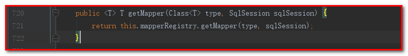

# Mybatis
<!-- TOC -->

- [Mybatis](#mybatis)
    - [day01](#day01)
        - [1. mybatis介绍](#1-mybatis介绍)
            - [1-1.概述](#1-1概述)
            - [1-2.分层思想](#1-2分层思想)
            - [1-3.mybatis优点](#1-3mybatis优点)
            - [1-4.ORM思想](#1-4orm思想)
        - [2. Mybatis之quickstart](#2-mybatis之quickstart)
            - [2-1.准备pom文件](#2-1准备pom文件)
            - [2-2.准备数据库脚本](#2-2准备数据库脚本)
            - [2-3.准备实体类User](#2-3准备实体类user)
            - [2-4.接口UserDao](#2-4接口userdao)
            - [2-5.配置文件sqlMapConfig.xml](#2-5配置文件sqlmapconfigxml)
            - [2-6.准备映射文件UserDao.xml](#2-6准备映射文件userdaoxml)
            - [2-7.日志文件log4j.properties](#2-7日志文件log4jproperties)
            - [2-8.测试](#2-8测试)
        - [3. mybatis自定义框架(理解思路)](#3-mybatis自定义框架理解思路)
    - [day02](#day02)
        - [1.学习计划](#1学习计划)
        - [2.Mybatis的CRUD(操作接口-掌握)](#2mybatis的crud操作接口-掌握)
            - [2-1.创建工程](#2-1创建工程)
            - [2-2.导入maven坐标](#2-2导入maven坐标)
            - [2-3.创建实体类和接口](#2-3创建实体类和接口)
            - [2-4.导入日志文件](#2-4导入日志文件)
            - [2-5.查询所有](#2-5查询所有)
                - [2-5-1.sqlMapConfig.xml](#2-5-1sqlmapconfigxml)
                - [2-5-2.创建接口](#2-5-2创建接口)
                - [2-5-3.创建映射文件](#2-5-3创建映射文件)
                - [2-5-4.测试](#2-5-4测试)
            - [2-6.保存用户](#2-6保存用户)
                - [2-6-1.UserDao.java](#2-6-1userdaojava)
                - [2-6-2.UserDao.xml](#2-6-2userdaoxml)
                - [2-6-3.测试](#2-6-3测试)
                - [2-6-4.问题扩展：获取新增用户的id](#2-6-4问题扩展获取新增用户的id)
            - [2-7.修改用户](#2-7修改用户)
                - [2-7-1.UserDao.java](#2-7-1userdaojava)
                - [2-7-2.UserDao.xml](#2-7-2userdaoxml)
                - [2-7-3.测试](#2-7-3测试)
            - [2-8.删除用户](#2-8删除用户)
                - [2-8-1.UserDao.java](#2-8-1userdaojava)
                - [2-8-2.UserDao.xml](#2-8-2userdaoxml)
                - [2-8-3.测试](#2-8-3测试)
            - [2-9.主键查询](#2-9主键查询)
                - [2-9-1.UserDao.java](#2-9-1userdaojava)
                - [2-9-2.UserDao.xml](#2-9-2userdaoxml)
                - [2-9-3.测试](#2-9-3测试)
            - [2-10.模糊查询](#2-10模糊查询)
                - [2-10-1.UserDao.java](#2-10-1userdaojava)
                - [2-10-2.UserDao.xml](#2-10-2userdaoxml)
                - [2-10-3.测试](#2-10-3测试)
                - [2-10-4.模糊查询另一种配置](#2-10-4模糊查询另一种配置)
                    - [1.UserDao.xml](#1userdaoxml)
                    - [2.测试](#2测试)
                - [2-10-5.#{}和${}的区别](#2-10-5和的区别)
            - [2-11.查询数量(聚合函数)](#2-11查询数量聚合函数)
                - [2-11-1.UserDao.java](#2-11-1userdaojava)
                - [2-11-2.UserDao.xml](#2-11-2userdaoxml)
                - [2-11-3.测试](#2-11-3测试)
        - [3.Mybatis的参数深入](#3mybatis的参数深入)
            - [3-1.了解OGNL](#3-1了解ognl)
            - [3-2.Mybatis的参数](#3-2mybatis的参数)
                - [3-2-1.parameterType(输入类型)](#3-2-1parametertype输入类型)
                - [3-2-2.QueryVo.java](#3-2-2queryvojava)
                - [3-2-3.UserDao.java](#3-2-3userdaojava)
                - [3-2-4.UserDao.xml](#3-2-4userdaoxml)
                - [3-2-5.MybatisTest.java](#3-2-5mybatistestjava)
            - [3-3.Mybatis的输出结果封装](#3-3mybatis的输出结果封装)
                - [3-3-1.resultType(输出类型)](#3-3-1resulttype输出类型)
                - [3-3-2.简单对象的数据类型](#3-3-2简单对象的数据类型)
                - [3-3-3.数据库中的字段和对象中的属性不一致](#3-3-3数据库中的字段和对象中的属性不一致)
                - [3-3-4.定义resultMap](#3-3-4定义resultmap)
        - [4.Mybatis实现Dao接口的实现类开发(了解)](#4mybatis实现dao接口的实现类开发了解)
            - [4-1.Mybatis实现Dao的传统开发方式](#4-1mybatis实现dao的传统开发方式)
                - [4-1-1.创建工程](#4-1-1创建工程)
                - [4-1-2.导入坐标](#4-1-2导入坐标)
                - [4-1-3.导入java类、资源文件、测试类](#4-1-3导入java类资源文件测试类)
            - [4-2.查询所有](#4-2查询所有)
            - [4-3.新增保存](#4-3新增保存)
            - [4-4.修改保存](#4-4修改保存)
            - [4-5.删除](#4-5删除)
            - [4-6.主键查询](#4-6主键查询)
            - [4-7.模糊查询](#4-7模糊查询)
            - [4-8.查询数量](#4-8查询数量)
        - [5.Mybatis传统开发方式源码分析SQL语句执行过程](#5mybatis传统开发方式源码分析sql语句执行过程)
            - [5-1.新增](#5-1新增)
            - [5-2.查询](#5-2查询)
        - [6.Mybatis使用Dao代理开发方式](#6mybatis使用dao代理开发方式)
            - [6-1.Mybatis代理方式实现Dao源码分析](#6-1mybatis代理方式实现dao源码分析)
        - [7.sqlMapConfig.xml配置文件](#7sqlmapconfigxml配置文件)
            - [7-1.配置内容](#7-1配置内容)
            - [7-2.properties属性](#7-2properties属性)
            - [7-3.typeAliases(类型别名)](#7-3typealiases类型别名)
            - [7-4.自定义别名](#7-4自定义别名)
            - [7-5.mappers(映射器)](#7-5mappers映射器)
    - [day03](#day03)
        - [1.学习计划](#1学习计划-1)
        - [2.Mybatis 连接池与事务深入](#2mybatis-连接池与事务深入)
            - [2-1.Mybatis的连接池技术](#2-1mybatis的连接池技术)
                - [2-1-1.Mybatis连接池的分类](#2-1-1mybatis连接池的分类)
                - [2-1-2.Mybatis中数据源的配置](#2-1-2mybatis中数据源的配置)
                - [2-1-3.Mybatis的事务控制](#2-1-3mybatis的事务控制)
                    - [2-1-3-1.jdbc中的事务](#2-1-3-1jdbc中的事务)
                    - [2-1-3-2.Mybatis中事务提交方式](#2-1-3-2mybatis中事务提交方式)
        - [3.Mybatis映射文件的SQL深入](#3mybatis映射文件的sql深入)
            - [3-1.动态SQL之if标签](#3-1动态sql之if标签)
            - [3-2.动态SQL之where标签](#3-2动态sql之where标签)
            - [3-3.动态标签之foreach标签](#3-3动态标签之foreach标签)
            - [3-4.Mybatis中简化编写的SQL片段](#3-4mybatis中简化编写的sql片段)
        - [4.Mybatis的多表关联查询](#4mybatis的多表关联查询)
            - [4-1.关联关系](#4-1关联关系)
            - [4-2.用户和账号](#4-2用户和账号)
            - [4-3.Mybatis维护一对多关系](#4-3mybatis维护一对多关系)

<!-- /TOC -->
## day01

### 1. mybatis介绍
#### 1-1.概述
mybatis是一个持久层框架，对jdbc操作数据库进行了轻量级封装；mybatis前身是ibatis，Apache开源项目。
#### 1-2.分层思想
JavaEE开发分层：
* 表示层：springmvc、struts(淘汰)
* 业务层：spring(IoC和AOP)
* 持久层：mybatis、hibernate
#### 1-3.mybatis优点
mybatis优点：
* 开发者不必关心jdbc的api，只关注于sql语句
* 查询结果封装成pojo（javabean）
* 可维护性和可扩展性高
#### 1-4.ORM思想
ORM：Object Relational Mapping对象关系映射
ORM框架：hibernate、mybatis、spring data jpa
```sequence
java实体类->映射文件:映射
Note right of java实体类:User类
Note right of 映射文件: UserMapper.xml(UserDao.xml)
映射文件->数据库表:映射
Note right of 映射文件: 查找UserDao接口
```
### 2. Mybatis之quickstart
#### 2-1.准备pom文件
```xml
<?xml version="1.0" encoding="UTF-8"?>
<project xmlns="http://maven.apache.org/POM/4.0.0"
         xmlns:xsi="http://www.w3.org/2001/XMLSchema-instance"
         xsi:schemaLocation="http://maven.apache.org/POM/4.0.0 http://maven.apache.org/xsd/maven-4.0.0.xsd">
    <modelVersion>4.0.0</modelVersion>

    <groupId>com.jack</groupId>
    <artifactId>mybatis_day01_quick</artifactId>
    <version>1.0-SNAPSHOT</version>
    <packaging>jar</packaging>

    <dependencies>
        <!--mybatis的核心包-->
        <dependency>
            <groupId>org.mybatis</groupId>
            <artifactId>mybatis</artifactId>
            <version>3.4.5</version>
        </dependency>

        <!--数据库驱动包-->
        <dependency>
            <groupId>mysql</groupId>
            <artifactId>mysql-connector-java</artifactId>
            <version>5.1.18</version>
        </dependency>

        <!--日志包-->
        <dependency>
            <groupId>log4j</groupId>
            <artifactId>log4j</artifactId>
            <version>1.2.12</version>
        </dependency>

        <!--测试包-->
        <dependency>
            <groupId>junit</groupId>
            <artifactId>junit</artifactId>
            <version>4.12</version>
        </dependency>
    </dependencies>
</project>
```
#### 2-2.准备数据库脚本
```sql
DROP TABLE IF EXISTS `user`;

CREATE TABLE `user` (
  `id` int(11) NOT NULL auto_increment,
  `username` varchar(32) NOT NULL COMMENT '用户名称',
  `birthday` datetime default NULL COMMENT '生日',
  `sex` char(1) default NULL COMMENT '性别',
  `address` varchar(256) default NULL COMMENT '地址',
  PRIMARY KEY  (`id`)
) ENGINE=InnoDB DEFAULT CHARSET=utf8;

insert  into `user`(`id`,`username`,`birthday`,`sex`,`address`) values (41,'老王','2018-02-27 17:47:08','男','重庆'),(42,'小二王','2018-03-02 15:09:37','女','重庆南山'),(43,'小二王','2018-03-04 11:34:34','女','重庆南山'),(45,'小猪佩奇','2018-03-04 12:04:06','男','重庆南山'),(46,'老王','2018-03-07 17:37:26','男','重庆'),(48,'小马宝莉','2018-03-08 11:44:00','女','重庆巴南');
```
#### 2-3.准备实体类User
**创建com.jack.domain，创建实体类User.java**
```java
public class User {
    private Integer id;
    /**
     * 用户名
     */
    private String username;
    /**
     * 生日
     */
    private Date birthday;
    /**
     * 性别
     */
    private String sex;
    /**
     * 地址
     */
    private String address;

    // get、set方法省略
}
```
#### 2-4.接口UserDao
**创建包com.jack.dao，创建接口UserDao**
```java
public interface UserDao {
    /**
     * 查询所有
     * @return
     */
    List<User> findAll();
}
```
#### 2-5.配置文件sqlMapConfig.xml

**在resources目录下创建sqlMapConfig.xml文件**

```xml
<?xml version="1.0" encoding="UTF-8"?>
<!DOCTYPE configuration
        PUBLIC "-//mybatis.org//DTD Config 3.0//EN"
        "http://mybatis.org/dtd/mybatis-3-config.dtd">
<!--用来连接数据库、加载映射文件-->
<configuration>
    <!--定义mysql的环境-->
    <environments default="mysql">
        <!--声明一个mysql-->
        <environment id="mysql">
            <!--事务管理器，控制事务，固定的写法JDBC-->
            <transactionManager type="JDBC"></transactionManager>
            <!--定义数据源POOLED(连接池)、UNPOOLED、JNDI-->
            <dataSource type="POOLED">
                <property name="driver" value="com.mysql.jdbc.Driver"></property>
                <property name="url" value="jdbc:mysql:///db_mybatis"></property>
                <property name="username" value="root"></property>
                <property name="password" value="root"></property>
            </dataSource>
        </environment>
    </environments>

    <!--加载配置文件-->
    <mappers>
        <!--配置文件方式-->
        <mapper resource="com/jack/dao/UserDao.xml"/>
        <!--注解方式-->
        <mapper class="com.jack.dao.UserDao2"/>
    </mappers>
</configuration>
```
#### 2-6.准备映射文件UserDao.xml
**在resource目录下创建和UserDao对应的com/jack/dao的映射文件UserDao.xml(或者是UserMapper.xml)**
```xml
<?xml version="1.0" encoding="UTF-8"?>
<!DOCTYPE mapper
        PUBLIC "-//mybatis.org//DTD Mapper 3.0//EN"
        "http://mybatis.org/dtd/mybatis-3-mapper.dtd">
<!--放置sql语句，指定封装的实体对象-->
<!--
    namespace：查找对应接口的全路径
    id：方法的名称
    parameterType：表示的是参数类型
    resultType：表示结果集的类型
    在<select><select>中指定查询的sql语句
-->
<mapper namespace="com.jack.dao.UserDao">
    <select id="findAll" resultType="com.jack.domain.User">
        SELECT * FROM user
    </select>
</mapper>
```
#### 2-7.日志文件log4j.properties
```properties
# Set root category priority to INFO and its only appender to CONSOLE.
#log4j.rootCategory=INFO, CONSOLE            debug   info   warn error fatal
log4j.rootCategory=info, CONSOLE, LOGFILE

# Set the enterprise logger category to FATAL and its only appender to CONSOLE.
log4j.logger.org.apache.axis.enterprise=FATAL, CONSOLE

# CONSOLE is set to be a ConsoleAppender using a PatternLayout.
log4j.appender.CONSOLE=org.apache.log4j.ConsoleAppender
log4j.appender.CONSOLE.layout=org.apache.log4j.PatternLayout
log4j.appender.CONSOLE.layout.ConversionPattern=%d{ISO8601} %-6r [%15.15t] %-5p %30.30c %x - %m\n

# LOGFILE is set to be a File appender using a PatternLayout.
log4j.appender.LOGFILE=org.apache.log4j.FileAppender
log4j.appender.LOGFILE.File=e:/log/mybatis.log
log4j.appender.LOGFILE.Append=true
log4j.appender.LOGFILE.layout=org.apache.log4j.PatternLayout
log4j.appender.LOGFILE.layout.ConversionPattern=%d{ISO8601} %-6r [%15.15t] %-5p %30.30c %x - %m\n
```
#### 2-8.测试
**test/java/com.jack.test.MybatisTest**
```java
public class MybatisTest {
    @Test
    public void findAllTest() throws Exception {
        // 1. 加载配置文件（sqlMapConfig.xml）和映射文件（UserDao.xml）--->IO流
        InputStream in = Resources.getResourceAsStream("sqlMapConfig.xml");
        // 2. 创建SqlSessionFactoryBuilder（使用构建者模式）
        SqlSessionFactoryBuilder sqlSessionFactoryBuilder = new SqlSessionFactoryBuilder();
        /**
         * 构建者模式：
         *      通过SqlSessionFactoryBuilder对象构建一个SqlSessionFactory
         *      将一个复杂的对象的构建过程分离出来，隐藏了复杂对象的创建过程，是我们不用关心对象构建的过程。
         */
        // 3. 创建SqlSessionFactory对象（使用工厂模式）（一个项目创建一次就可以了，相当于连接池）
        SqlSessionFactory sqlSessionFactory = sqlSessionFactoryBuilder.build(in);
        // 4. 创建SqlSession对象（相当于Connection连接，它是Mybatis操作数据库的核心）
        /**
         * 工厂模式：
         *      通过SqlSessionFactory构建一个SqlSession
         *      工厂模式是我们最常用的实例化对象模式了，是用工厂方法代替new操作的一种模式
         *      用工厂模式能够降低程序之间的耦合性，给系统带来更大的可扩展性和尽量少的修改量
         */
        SqlSession sqlSession = sqlSessionFactory.openSession();
        // 5. 操作数据库
        // 5.1 通过代理对象访问dao中的方法，指定被代理对象，返回一个代理对象
        /***
         * 代理模式：
         *     通过SqlSession实现增删改查
         *     构建一个UserDao接口的代理类，让代理对象完成增删改查。
         *     在某些情况下，一个对象不适合或者不能直接引用另一个对象，而代理对象可以在客户端和目标对象之间起到中介的作用。
         *     优点
         *     (1).职责清晰
         *         真实的角色就是实现实际的业务逻辑，不用关心其他非本职责的事务，通过后期的代理完成一件完成事务，
         *         附带的结果就是编程简洁清晰。
         *     (2).代理对象可以在客户端和目标对象之间起到中介的作用，这样起到了中介的作用和保护了目标对象的作用。
         *     (3).高扩展性
         */
        UserDao userDao = sqlSession.getMapper(UserDao.class);
        List<User> userList = userDao.findAll();
        for (User user : userList) {
            System.out.println(user);
        }
        // 6. 关闭资源
        sqlSession.close();
        in.close();
    }
}
```
### 3. mybatis自定义框架(理解思路)

## day02

### 1.学习计划

- **Mybatis基于代理Dao的CRUD操作(重点掌握)**
- CRUD中可能遇到的问题：参数的传递以及返回值的封装 
- 介绍Mybatis基于传统dao方式的使用（自己编写dao的实现类)-了解
- **Mybatis主配置文件(sqlMapConfig.xml)中的常用配置**
  - properties标签
  - typeAliases标签
  - mappers标签的子标签：package

### 2.Mybatis的CRUD(操作接口-掌握)

**需求：实现查询所有的用户操作**

#### 2-1.创建工程

创建maven工程：

- GroupId：com.jack
- ArtifactId：mybatis_day02_crud
- Version：1.0-SNAPSHOT

#### 2-2.导入maven坐标

```xml
<?xml version="1.0" encoding="UTF-8"?>
<project xmlns="http://maven.apache.org/POM/4.0.0"
         xmlns:xsi="http://www.w3.org/2001/XMLSchema-instance"
         xsi:schemaLocation="http://maven.apache.org/POM/4.0.0 http://maven.apache.org/xsd/maven-4.0.0.xsd">
    <modelVersion>4.0.0</modelVersion>

    <groupId>com.jack</groupId>
    <artifactId>mybatis_day02_crud</artifactId>
    <version>1.0-SNAPSHOT</version>
    <packaging>jar</packaging>

    <dependencies>
        <!--mybatis的核心包-->
        <dependency>
            <groupId>org.mybatis</groupId>
            <artifactId>mybatis</artifactId>
            <version>3.4.5</version>
        </dependency>

        <!--数据库驱动包-->
        <dependency>
            <groupId>mysql</groupId>
            <artifactId>mysql-connector-java</artifactId>
            <version>5.1.18</version>
        </dependency>

        <!--日志包-->
        <dependency>
            <groupId>log4j</groupId>
            <artifactId>log4j</artifactId>
            <version>1.2.12</version>
        </dependency>

        <!--测试包-->
        <dependency>
            <groupId>junit</groupId>
            <artifactId>junit</artifactId>
            <version>4.12</version>
        </dependency>
    </dependencies>
</project>
```

#### 2-3.创建实体类和接口

**创建包com.jack.domain，创建实体类User**

```java
public class User {
    private Integer id;
    private String username;
    private Date birthday;
    private String sex;
    private String address;

    // ...
}
```

#### 2-4.导入日志文件

```properties
# Set root category priority to INFO and its only appender to CONSOLE.
#log4j.rootCategory=INFO, CONSOLE            debug   info   warn error fatal
log4j.rootCategory=debug, CONSOLE, LOGFILE

# Set the enterprise logger category to FATAL and its only appender to CONSOLE.
log4j.logger.org.apache.axis.enterprise=FATAL, CONSOLE

# CONSOLE is set to be a ConsoleAppender using a PatternLayout.
log4j.appender.CONSOLE=org.apache.log4j.ConsoleAppender
log4j.appender.CONSOLE.layout=org.apache.log4j.PatternLayout
log4j.appender.CONSOLE.layout.ConversionPattern=%d{ISO8601} %-6r [%15.15t] %-5p %30.30c %x - %m\n

# LOGFILE is set to be a File appender using a PatternLayout.
log4j.appender.LOGFILE=org.apache.log4j.FileAppender
log4j.appender.LOGFILE.File=e:/log/mybatis.log
log4j.appender.LOGFILE.Append=true
log4j.appender.LOGFILE.layout=org.apache.log4j.PatternLayout
log4j.appender.LOGFILE.layout.ConversionPattern=%d{ISO8601} %-6r [%15.15t] %-5p %30.30c %x - %m\n
```

#### 2-5.查询所有

##### 2-5-1.sqlMapConfig.xml

```xml
<?xml version="1.0" encoding="UTF-8"?>
<!DOCTYPE configuration
        PUBLIC "-//mybatis.org//DTD Config 3.0//EN"
        "http://mybatis.org/dtd/mybatis-3-config.dtd">
<!--用来连接数据库、加载映射文件-->
<configuration>
    <!--定义mysql的环境-->
    <environments default="mysql">
        <!--声明一个mysql-->
        <environment id="mysql">
            <!--事务管理器，控制事务，固定的写法JDBC-->
            <transactionManager type="JDBC"/>
            <!--定义数据源POOLED(连接池)、UNPOOLED、JNDI-->
            <dataSource type="POOLED">
                <property name="driver" value="com.mysql.jdbc.Driver"/>
                <property name="url" value="jdbc:mysql:///db_mybatis"/>
                <property name="username" value="root"/>
                <property name="password" value="root"/>
            </dataSource>
        </environment>
    </environments>
    <!--加载配置文件-->
    <mappers>
        <!--配置文件方式-->
        <mapper resource="com/jack/dao/UserDao.xml"/>
    </mappers>
</configuration>
```

##### 2-5-2.创建接口

**创建包com.jack.dao，创建接口UserDao**

```java
public interface UserDao {
    /**
 	* 查询所有
 	*/
    List<User> findAll();
}
```

##### 2-5-3.创建映射文件

**在resources目录下，创建与接口对应的文件目录com/jack/dao，创建UserDao.xml**

```xml
<?xml version="1.0" encoding="UTF-8"?>
<!DOCTYPE mapper
        PUBLIC "-//mybatis.org//DTD Mapper 3.0//EN"
        "http://mybatis.org/dtd/mybatis-3-mapper.dtd">
<mapper namespace="com.jack.dao.UserDao">
    <!--
		namespace：命名空间，对应的接口全路径
		id：对应接口的方法名称
		resultType：查询的返回数据类型
	-->
	<select id="findAll" resultType="com.jack.domain.User">
    	select * from user;
    </select>
</mapper>
```

##### 2-5-4.测试

**在test/java目录创建com.jack.test，创建测试类MybatisTest**

```java
public class MybatisTest {

    @Test
    public void testFindAll() throws IOException {
        //1.读取配置文件，生成字节输入流
        InputStream in = Resources.getResourceAsStream("SqlMapConfig.xml");
        //2.获取SqlSessionFactory
        SqlSessionFactory factory = new SqlSessionFactoryBuilder().build(in);
        //3.获取SqlSession对象
        SqlSession sqlSession = factory.openSession();
        //4.获取dao的代理对象
        UserDao userDao = sqlSession.getMapper(UserDao.class);
        //5.执行查询所有方法
        List<User> users = userDao.findAll();
        for(User user : users){
            System.out.println(user);
        }
        //6.释放资源
        sqlSession.close();
        in.close();
    }
}
```

#### 2-6.保存用户

##### 2-6-1.UserDao.java

```java
/**
 * 增加用户
 * @param user
 */
void saveUser(User user);
```

##### 2-6-2.UserDao.xml

- **#{}表示占位符，里面的username由User的username属性来决定，#{username}就是OGNL表达式**
- **parameter：表示参数的类型，这里传入的是一个类的对象，所以写了类的全路径名称**

**注意：**

- xml配置方式要求<mapper namespace=”映射接口所在的全路径包名”>，insert、delete、update和select标签里面的id属性必须和代理接口的方法名称一样** 

```xml
<!--保存用户-->
<insert id="saveUser" parameterType="com.jack.domain.User">
    insert into user(username,address,sex,birthday) values(#{username}, #{address} ,#{sex}, #{birthday});
</insert>
```

##### 2-6-3.测试

测试初始化：

- 读取sqlMapConfig.xml配置文件
- 构建SqlSessionFactory
- 打开SqlSession
- 获取UserDao对象

测试结束：

- 提交事务
- 释放资源

```java
public class MybatisTest {

    private InputStream in;
    private SqlSession sqlSession;
    private UserDao userDao;
    private  User user = new User();

    @Before
    public void init() throws Exception {
        in = Resources.getResourceAsStream("sqlMapConfig.xml");
        SqlSessionFactory sqlSessionFactory = new SqlSessionFactoryBuilder().build(in);
        sqlSession = sqlSessionFactory.openSession();
        userDao = sqlSession.getMapper(UserDao.class);
    }
	@After
    public void close() throws Exception {
        sqlSession.commit();
        sqlSession.close();
        in.close();
    }
    /**
     * 查询所有
     */
    @Test
    public void testFindAll() {
        List<User2> userList = userDao.findAll();
        for (User2 user : userList) {
            System.out.println(user);
        }
    }

    /**
     * 添加User
     */
    @Test
    public void testSaveUser() {
        user.setUsername("jack");
        user.setBirthday(new Date());
        user.setSex("男");
        user.setAddress("重庆");
        System.out.println("插入前：" + user);
        userDao.saveUser(user);
        System.out.println("插入后：" + user);
    }
}
```

在测试的时候如果发现数据库没有添加数据，那么一定是事务没有提交，加上**sqlSession.commit**即可。

但是这是又存在一个问题：保存之前的User的id和保存User之后的id都是null，**怎么获取保存用户之后的id？**

##### 2-6-4.问题扩展：获取新增用户的id

新增用户后，同时还要返回当前新增用户的id值，因为id是由数据库的自动增长来实现的，所以就相当于我们要在新增后将自动增长auto_increment的值返回。 

Mysql自增主键的返回，配置如下： 

```sql
insert into user(username,address,sex,birthday) values('jack','重庆','男','1992-9-8');
select last_insert_id()
```

**配置UserDao.xml**

```xml
<!--
	解决方案：
    id：接口中的方法名称
    parameterType：参数类型
            * 如果参数是基本数据类型，例如int，类型可以写成int，java.lang.Integer
            * 如果参数是实体，类型需要学成com.itheima.domain.User
            selectKey：用于在新增之后获取插入的id的值
                * keyProperty="" :实体类中的属性名称，查询完主键的结果存放到哪里
                * keyColumn=""：查询哪个字段的名称
                * resultType：结果类型
                * order：将查询id的结果放到插入操作之后
                * selectKey标签中的内容：指定操作的sql语句
    -->
<insert id="saveUser" parameterType="com.jack.domain.User">
    <selectKey keyProperty="id" keyColumn="id" resultType="int" order="AFTER">
        select last_insert_id()
    </selectKey>
    insert into user(username, birthday, sex, address) values (#{username}, #{birthday}, #{sex}, #{address})
</insert>
```

这样应该就可以了。

#### 2-7.修改用户

##### 2-7-1.UserDao.java

```java
/**
 *更新用户
 * @param user
 */
void updateUser(User user);
```

##### 2-7-2.UserDao.xml

```xml
<!--更新用户-->
<update id="updateUser" parameterType="com.jack.domain.User">
    update user set username=#{username}, birthday=#{birthday}, sex=#{sex}, address=#{address} where id=#{id}
</update>
```

##### 2-7-3.测试

```java
/**
 * 更新用户
 */
@Test
public void testUpdateUser() {
    user.setUsername("rose");
    user.setBirthday(new Date());
    user.setSex("女");
    user.setAddress("深圳");
    user.setId(52);
    userDao.updateUser(user);
}
```

#### 2-8.删除用户

##### 2-8-1.UserDao.java

```java
 /**
 * 删除用户
 * @param id
 */
 void deleteUser(Integer id);
```

##### 2-8-2.UserDao.xml

```xml
<!--删除用户-->
<delete id="deleteUser" parameterType="java.lang.Integer">
    delete from user where id = #{id}
</delete>
```

其中的**#{uid}是占位符，代表参数的值由方法的参数传入进来的**。

**注意：**

- 此处的#{uid}中的id其实只是一个形参，所以它的名称是自由定义的，比如定义成#{abc}也是可以的。
- 关于parameterType的取值问题，对于基本类型我们可以直接写成int,short,double…..也可以写成java.lang.Integer。
- 字符串可以写成string,也可以写成java.lang.String

##### 2-8-3.测试

```java
 /**
 * 删除用户
 */
 @Test
 public void testDeleteUser() {
 	userDao.deleteUser(52);
 }
```

#### 2-9.主键查询

##### 2-9-1.UserDao.java

```java
/**
* 根据id查询用户
* @param id
* @return
*/
User findById(Integer id);
```

##### 2-9-2.UserDao.xml

```xml
 <!--根据id查询用户-->
<select id="findById" parameterType="int" resultType="com.jack.domain.User">
    select * from user where id = #{id}
</select>
```

##### 2-9-3.测试

```java
/**
 * 根据id查询用户
 */
@Test
public void testFindById() {
    User user = userDao.findById(48);
    System.out.println(user);
}
```

#### 2-10.模糊查询

##### 2-10-1.UserDao.java

```java
/**
* 模糊查询
*/
@Test
public void testFindByName() {
	List<User> userList = userDao.findByName("%王%");
	for (User user : userList) {
	System.out.println(user);
  }
}
```

##### 2-10-2.UserDao.xml

```xml
<!--模糊查询-->
<select id="findByName" parameterType="java.lang.String" resultType="com.jack.domain.User">
    select * from user where username like #{name}
</select>
```

注意：此时的**#{name}**中的因为这时候是普通的参数，所以它的起名是随意的，比如我们改成**#{abc}**也是可以的。  

##### 2-10-3.测试

```java
/**
 * 模糊查询
 */
@Test
public void testFindByName() {
    List<User> userList = userDao.findByName("%王%");
    for (User user : userList) {
        System.out.println(user);
    }
}
```

 	在UserDao.xml配置文件中没有加入%来作为模糊查询的条件，所以在传入字符串实参时，就需要给定模糊查询的标识%。配置文件中的#{name}也只是一个占位符，所以SQL语句显示为“？”。如何将模糊查询的匹配符%写到配置文件中呢？  

##### 2-10-4.模糊查询另一种配置

###### 1.UserDao.xml

```xml
<!--模糊查询-->
<select id="findByName" parameterType="java.lang.String" resultType="com.jack.domain.User">
    select * from user where username like '%${name}%'
</select>
```

将原来的#{}占位符，**改成了${}**。注意如果用模糊查询的这种写法，那么${value}的写法就是固定的，不能写成其它名字。 

###### 2.测试

```java
/**
 * 模糊查询
 */
@Test
public void testFindByName() {
    List<User> userList = userDao.findByName("王");
    for (User user : userList) {
        System.out.println(user);
    }
}
```

##### 2-10-5.#{}和${}的区别

**#{}表示一个占位符**

通过#{}可以实现preparedStatement向占位符中设置值，自动进行java类型和jdbc类型转换，#{}可以有效防止sql注入。 #{}可以接收简单类型值或pojo属性值。 如果parameterType传输单个简单类型值，#{}括号中可以是value或其它名称。  **#{}括号中可以是value或其他名称**

**${}表示拼接字符串**

通过**${}**可以将parameterType 传入的内容拼接在sql中且不进行jdbc类型转换， **${}**可以接收简单类型值或pojo属性值，如果parameterType传输单个简单类型值，**${}括号中只能是value**。 

那么为什么一定要写成${value}呢？我们一起来看TextSqlNode类的源码：  


这就说明了源码中指定了读取的key的名字就是”value”，所以我们在绑定参数时就只能叫value的名字了。  

#### 2-11.查询数量(聚合函数)

##### 2-11-1.UserDao.java

```java
/**
 * 查询总的用户数
 */
Integer findCount();
```

##### 2-11-2.UserDao.xml

```xml
<!--查询总的用户数-->
<select id="findCount" resultType="java.lang.Integer">
    select count(*) from user
</select>
```

##### 2-11-3.测试

```java
/**
 * 查询总的用户数
 */
@Test
public void testFindCount() {
    Integer count = userDao.findCount();
    System.out.println(count);
}
```

### 3.Mybatis的参数深入

- **Mybatis的映射文件其实就是与DAO相对应**，因为DAO中的方法有输入参数及返回结果，那么在Mybatis的映射文件中自然也就有与之对应的参数和返回结果 
- 在Mybatis的映射文件**中参数用parameterType来代表，它的值可以是基本类型，也可以是包装的对象** 
- 在Mybatis的映射文件中**返回结果用resultType或resultMap**来代表。 

#### 3-1.了解OGNL

OGNL表达式： 

```
Object Graphic Navigation Language
对象	  图	     导航	       语言
```

它是通过对象的取值方法来获取数据。在写法上把get给省略了。
比如：我们获取用户的名称
	类中的写法：**user.getUsername();**
	OGNL表达式写法：**user.username**
mybatis中为什么能直接写username,而不用user.呢：
	因为在parameterType中已经提供了属性所属的类，所以此时不需要写对象名

**Mybatis使用ognl表达式解析对象字段的值，#{}或者${}括号中的值为pojo属性名称。** 

#### 3-2.Mybatis的参数

##### 3-2-1.parameterType(输入类型)

**传递简单类型**

- int - int或者java.lang.Integer
- String - String 或者java.lang.String

**传递pojo对象**

- com.jackdomain.User - username、address、sex、birthday、id

##### 3-2-2.QueryVo.java

开发中通过pojo传递查询条件 ，查询条件是综合的查询条件，不仅包括用户查询条件还包括其它的查询条件（比如将用户购买商品信息也作为查询条件），这时**可以使用包装对象传递输入参数**。 
Pojo类中包含pojo。 
需求：根据用户名查询用户信息，查询条件放到QueryVo的user属性中。 
在com.jack.domain中，创建QueryVO.java

```java
public class QueryVO {

    private User user;

    public User getUser() {
        return user;
    }

    public void setUser(User user) {
        this.user = user;
    }
}
```

##### 3-2-3.UserDao.java

```java
/**
 * 根据QueryVO查询用户
 * @param vo
 * @return
 */
List<User> findUserByVO(QueryVO vo);
```

##### 3-2-4.UserDao.xml

```xml
<!--根据QueryVO查询用户-->
<select id="findUserByVO" parameterType="com.jack.domain.QueryVO" resultType="com.jack.domain.User">
    select * from user where username like #{user.username}
</select>
```

如果我们使用的是**包装类作为参数**，比如这个示例的QueryVO类作为findUserByVO()方法的参数，那么在使用时，因为QueryVO类中有一个User类的user对象，而这个user对象中才能找到username属性，所以我们在访问属性时，就使用**OGNL表达式#{user.username}才访问对象的属性**。

##### 3-2-5.MybatisTest.java

```java
/**
 * 根据QueryVO查询用户
 */
@Test
public void testFindUserByVO() {
    user.setUsername("%王%");
    QueryVO vo = new QueryVO(user);
    List<User> userList = userDao.findUserByVO(vo);
    for (User u : userList) {
        System.out.println(u);
    }
}
```

#### 3-3.Mybatis的输出结果封装

##### 3-3-1.resultType(输出类型)

**输出简单类型**

**UserDao.xml文件**

```xml
<!-- 获取用户的总记录条数 -->
<select id="findTotal" resultType="int">
    select count(*) from user;
</select>
```

**MybatisTest.java**

```java
/**
 * 查询总的用户数
 */
@Test
public void testFindCount() {
    Integer count = userDao.findCount();
    System.out.println(count);
}
```

**输出简单类型必须查询出来的结果集有一条记录，最终将第一个字段的值转换为输出类型。** 

##### 3-3-2.简单对象的数据类型

让数据库的字段和实体类的属性一致：
User类中的属性：和数据库的字段一致。

```java
public class User {
    private Integer id;
    private String username;
    private Date birthday;
    private String sex;
    private String address;
    // ...
}
```


**所以定义映射文件的时候，可以在resultType的类型上指定com.jack.domain.User**

```xml
<!--查询所有-->
<select id="findAll" resultType="com.jack.domain.User">
    select * from user
</select>
```

##### 3-3-3.数据库中的字段和对象中的属性不一致

**第一步：在com.jack.domain中，修改User.java**

```java
public class User {
    private Integer userId;
    private String userName;
    private Date userBirthDay;
    private String userSex;
    private String userAddress;
    // get、set、toString方法省略
}
```

**第二步：在包com.jack.dao中的UserDao.java不需要修改**

```java
public interface UserDao {

    /**
     * 查询所有
     */
    List<User> findAll();

    /**
     * 增加用户
     * @param user
     */
    void saveUser(User user);

    /**
     *更新用户
     * @param user
     */
    void updateUser(User user);

    /**
     * 删除用户
     * @param id
     */
    void deleteUser(Integer id);

    /**
     * 根据id查询用户
     * @param id
     * @return
     */
    User findById(Integer id);

    /**
     * 模糊查询
     */
    List<User> findByName(String name);

    /**
     * 查询总的用户数
     */
    Integer findCount();

    /**
     * 根据QueryVO查询用户
     * @param vo
     * @return
     */
    List<User> findUserByVO(QueryVO vo);
}
```

**第三步：在com.jack.dao，修改UserDao.xml**

```xml
<!-- 查询所有 -->
<select id="findAll" resultType="com.jack.domain.User">
    <!--select id as userId,username as userName,address as userAddress,sex as userSex,birthday as userBirthday from user;-->
    select * from user;
</select>

<!--保存用户-->
<insert id="saveUser" parameterType="com.jack.domain.User">
    <!-- 配置插入操作后，获取插入数据的id -->
    <selectKey keyProperty="userId" keyColumn="id" resultType="int" order="AFTER">
        select last_insert_id();
    </selectKey>
    insert into user(username,address,sex,birthday) values(#{userName}, #{userAddress}, #{userSex}, #{userBirthday});

</insert>
```

**第四步：测试MybatisTest.java**

```java
public class MybatisTest {

    private InputStream in;
    private SqlSession sqlSession;
    private UserDao userDao;
    private  User user = new User();

    @Before
    public void init() throws Exception {
        in = Resources.getResourceAsStream("sqlMapConfig.xml");
        SqlSessionFactory sqlSessionFactory = new SqlSessionFactoryBuilder().build(in);
        sqlSession = sqlSessionFactory.openSession();
        userDao = sqlSession.getMapper(UserDao.class);
    }

    /**
     * 查询所有
     */
    @Test
    public void testFindAll() {
        List<User2> userList = userDao.findAll();
        for (User2 user : userList) {
            System.out.println(user);
        }
    }

    /**
     * 添加User
     */
    @Test
    public void testSaveUser() {
        user.setUsername("jack");
        user.setBirthday(new Date());
        user.setSex("男");
        user.setAddress("重庆");
        System.out.println("插入前：" + user);
        userDao.saveUser(user);
        System.out.println("插入后：" + user);
    }
    
    @After
    public void close() throws Exception {
        sqlSession.commit();
        sqlSession.close();
        in.close();
    }
}
```

但是在查询的时候，发现：查询结果无法封装到实体

这是如何解决呢？
需求：**如果返回的列名与实体类的属性不一致时，我们就不能封装结果集到指定的实体对象。** 
**解决方案一：**
**通过改别名的方式。 修改UserDao.xml**

```xml
<select id="findAll" resultType="com.jack.domain.User2">
        select id as userId, username as userName, birthday as userBirthDay, sex as userSex, address as userAddress from user
</select>
```

**解决方案二：（推荐）**

**使用resultMap**

##### 3-3-4.定义resultMap

由于userDao.xml中sql查询列和Users.java类属性不一致，需要定义resultMap：
**第一步：修改UserDao.xml**

```xml
<!--查询所有-->
<select id="findAll" resultMap="userMap">
    select * from user
</select>
```

**第二步：在UserDao.xml中的<mapper>下定义：**

```xml
<!--解决方案二：使用resultMap，推荐使用-->
<resultMap id="userMap" type="com.jack.domain.User2">
    <!--
        id：主键
        property：实体类属性字段
        column：数据库字段
        result：非主键
    -->
    <!-- 主键字段的对应 -->
    <id property="userId" column="id"/>
    <!--非主键字段的对应-->
    <result property="userName" column="username"/>
    <result property="userBirthDay" column="birthday"/>
    <result property="userSex" column="sex"/>
    <result property="userAddress" column="address"/>
</resultMap>
```

- <id >：此属性表示查询结果集的唯一标识，非常重要。如果是多个字段为复合唯一约束则定义多个<id >。 
- <result >：普通属性，即pojo的属性。 
- property：表示User类的属性。 
- column：表示sql查询出来的字段名。 
- column和property放在一块儿表示将sql查询出来的字段映射到指定的pojo类属性上。 

### 4.Mybatis实现Dao接口的实现类开发(了解)

使用Mybatis开发Dao，通常有两个方法，即**原始Dao开发方式**和**Mapper接口代理开发方式（通用）**。而现在主流的开发方式是接口代理开发方式，这种方式总体上更加简便。

#### 4-1.Mybatis实现Dao的传统开发方式

**SqlSession中封装了对数据库的操作，如：查询、插入、更新、删除等**。 
**通过SqlSessionFactory创建SqlSession，而SqlSessionFactory是通过SqlSessionFactoryBuilder进行创建。** 

##### 4-1-1.创建工程

- GroupId：com.jack
- ArtifactId：mybatis_day02_daoImpl
- Version：1.0-SNAPSHOT

##### 4-1-2.导入坐标

```xml
<dependencies>
    <!--mybatis的核心包-->
    <dependency>
        <groupId>org.mybatis</groupId>
        <artifactId>mybatis</artifactId>
        <version>3.4.5</version>
    </dependency>

    <!--数据库驱动包-->
    <dependency>
        <groupId>mysql</groupId>
        <artifactId>mysql-connector-java</artifactId>
        <version>5.1.18</version>
    </dependency>

    <!--日志包-->
    <dependency>
        <groupId>log4j</groupId>
        <artifactId>log4j</artifactId>
        <version>1.2.12</version>
    </dependency>

    <!--测试包-->
    <dependency>
        <groupId>junit</groupId>
        <artifactId>junit</artifactId>
        <version>4.12</version>
    </dependency>
</dependencies>
```

##### 4-1-3.导入java类、资源文件、测试类


#### 4-2.查询所有

**第一步：调整User.java，与数据库的列名一致**

```java
public class User {
    private Integer id;
    private String username;
    private Date birthday;
    private String sex;
    private String address;
    // ...
}
```

**第二步：调整UserDao.xml**

```xml
<?xml version="1.0" encoding="UTF-8"?>
<!DOCTYPE mapper
        PUBLIC "-//mybatis.org//DTD Mapper 3.0//EN"
        "http://mybatis.org/dtd/mybatis-3-mapper.dtd">
<mapper namespace="com.jack.dao.UserDao">
    <!--查询所有-->
    <select id="findAll" resultType="com.jack.domain.User">
        select * from user
    </select>
</mapper>
```

**第三步：创建UserDao.java的实现类UserDaoImpl.java**

```java
public class UserDaoImpl implements UserDao {
    private SqlSessionFactory factory;

    public UserDaoImpl(SqlSessionFactory factory) {
        this.factory = factory;
    }

    public List<User> findAll() {
        // 根据factory工厂获得sqlSession（操作数据库的对象）
        SqlSession sqlSession = factory.openSession();
        // 调用sqlSession中的方法，实现查询所有
        List<User> userList = sqlSession.selectList("com.jack.dao.UserDao.findAll");
        sqlSession.commit();
        sqlSession.close();
        return userList;
    }
}
```

**第四步：调整MybatisTest.java**

```java
public class MybatisTest {

    private InputStream in;
    private UserDao userDao;

    /*
    * 在执行方法之前执行
    */
    @Before
    public void init() throws Exception {
        // 读取配置文件
        in = Resources.getResourceAsStream("sqlMapConfig.xml");
        // 获取factory工厂（工厂模式）
        SqlSessionFactory factory = new SqlSessionFactoryBuilder().build(in);
        // 获取dao的实现类对象，多态向上转型
        userDao = new UserDaoImpl(factory);
    }
    /*
    * 在执行方法之后执行
    */
    @After
    public void destroy() throws Exception {
        in.close();
    }

    /*
    * 查询所有用户
    */
    @Test
    public void testFindAll() {
        List<User> userList = userDao.findAll();
        for (User user : userList) {
            System.out.println(user);
        }
    }
}
```

#### 4-3.新增保存

**第一步：UserDao.xml**

```xml
<!--添加用户-->
<insert id="saveUser" parameterType="com.jack.domain.User">
    <!-- 配置插入操作后，获取插入数据的id -->
    <selectKey keyProperty="id" keyColumn="id" resultType="int" order="AFTER">
        select last_insert_id();
    </selectKey>
    insert into user(username, birthday, sex, address) values (#{username}, #{birthday}, #{sex}, #{address})
</insert>
```

**第二步：UserDaoImpl.java**

```java
public void saveUser(User user) {
    // 根据factory工厂获得sqlSession（操作数据库的对象）
    SqlSession sqlSession = factory.openSession();
    // 调用sqlSession中的方法，实现保存用户
    sqlSession.insert("com.jack.dao.UserDao.saveUser", user);
    sqlSession.commit();
    sqlSession.close();
}
```

**第三步：测试MybatisTest.java**

```java
@Test
public void testSaveUser() {
    User user = new User();
    user.setUsername("tom");
    user.setBirthday(new Date());
    user.setSex("男");
    user.setAddress("重庆");
    System.out.println("保存前：" + user);
    userDao.saveUser(user);
    System.out.println("保存后：" + user);
}
```

#### 4-4.修改保存

**第一步：UserDao.xml**

```xml
<!--更新用户-->
<update id="updateUser" parameterType="user">
    update user set username=#{username}, birthday=#{birthday}, sex=#{sex}, address=#{address} where id=#{id}
</update>
```

**第二步：UserDaoImpl.java**

```java
public void updateUser(User user) {
    // 根据factory工厂获得sqlSession（操作数据库的对象）
    SqlSession sqlSession = factory.openSession();
    // 调用sqlSession中的方法，实现更新用户
    sqlSession.update("com.jack.dao.UserDao.updateUser", user);
    sqlSession.commit();
    sqlSession.close();
}
```

**第三步：MybatisTest.java**

```java
@Test
public void testUpdataUser() {
    User user = new User();
    user.setId(53);
    user.setUsername("jerry");
    user.setBirthday(new Date());
    user.setSex("男");
    user.setAddress("重庆");
    System.out.println("保存前：" + user);
    userDao.updateUser(user);
    System.out.println("保存后：" + user);
}
```

#### 4-5.删除

**第一步：UserDao.xml**

```xml
<!--删除用户-->
<delete id="deleteUser" parameterType="java.lang.Integer">
    delete from user where id=#{id}
</delete>
```

**第二步：UserDaoImpl.java**

```java
public void deleteUser(Integer id) {
    // 根据factory工厂获得sqlSession（操作数据库的对象）
    SqlSession sqlSession = factory.openSession();
    // 调用sqlSession中的方法，实现删除用户
    sqlSession.delete("com.jack.dao.UserDao.deleteUser", id);
    sqlSession.commit();
    sqlSession.close();
}
```

**第三步：MybatisTest.java**

```java
@Test
public void testDeleteUser() {
    userDao.deleteUser(53);
}
```

#### 4-6.主键查询

**第一步：UserDao.xml**

```xml
<!--主键查询-->
<select id="findById" parameterType="java.lang.Integer" resultType="user">
--         select * from user where id=#{id}
    select * from user where id=#{0}
</select>
```

**第二步：UserDaoImpl.java**

```java
public User findById(Integer id) {
    // 根据factory工厂获得sqlSession（操作数据库的对象）
    SqlSession sqlSession = factory.openSession();
    // 调用sqlSession中的方法，实现查询一个用户根据id
    User user = sqlSession.selectOne("com.jack.dao.UserDao.findById", id);
    sqlSession.commit();
    sqlSession.close();
    return user;
}
```

**第三步：MybatisTest.java**

```java
@Test
public void testFindById() {
    User user = userDao.findById(48);
    System.out.println(user);
}
```

#### 4-7.模糊查询

**第一步：UserDao.xml**

```xml
<!--模糊查询-->
<select id="findByName" parameterType="String" resultType="user">
    select * from user where username like '%${value}%'
</select>
```

**第二步：UserDaoImpl.java**

```java
public List<User> findByName(String username) {
    // 根据factory工厂获得sqlSession（操作数据库的对象）
    SqlSession sqlSession = factory.openSession();
    // 调用sqlSession中的方法，实现模糊查询
    List<User> userList = sqlSession.selectList("com.jack.dao.UserDao.findByName", username);
    sqlSession.commit();
    sqlSession.close();
    return userList;
}
```

**第三步：MybatisTest.java**

```java
@Test
public void testFindByName() {
    List<User> userList = userDao.findByName("王");
    for (User user : userList) {
        System.out.println(user);
    }
}
```

#### 4-8.查询数量

**第一步：UserDao.xml**

```java
<!--查询总用户数-->
<select id="findCount" resultType="java.lang.Integer">
    select count(*) from user
</select>
```

**第二步：UserDaoImpl.java**

```java
public Integer findCount() {
    // 根据factory工厂获得sqlSession（操作数据库的对象）
    SqlSession sqlSession = factory.openSession();
    // 调用sqlSession中的方法，实现用户数量
    Integer i = sqlSession.selectOne("com.jack.dao.UserDao.findCount");
    sqlSession.commit();
    sqlSession.close();
    return i;
}
```

**第三步：MybatisTest.java**

```java
@Test
public void testFindByCount() {
    Integer count = userDao.findCount();
    System.out.println("总用户数：" + count);
}
```

### 5.Mybatis传统开发方式源码分析SQL语句执行过程

现在可以通过调用SqlSession接口中的方法实现CRUD操作了，那么SqlSession接口中的方法是如何实现的？ 
通过来分析sqlSession接口中的insert()方法的执行过程，进行源码跟踪发现了**Mybatis只是对于jdbc的封装**。 

#### 5-1.新增

```text
insert()方法的执行过程分析 
* DefaultSqlSession----> return update(statement, parameter);185行 
* 进入DefaultSqlSession---> public int update(String statement, Object parameter) {方法定义  159行
* 进入198行--- return executor.update(ms, wrapCollection(parameter)); 
* 找到executor对象的update方法------------查看update()方法-----------------BaseExecutor类的update()方法 
* 进入BaseExecutor类的update()第117行return doUpdate(ms, parameter); 
* 查看doUpdate()方法------------------查看SimpleExecutor类的doUpdate()方法 
```


**查看doUpdate()方法------------------stmt = prepareStatement(handler, ms.getStatementLog()); 49行** 


**查看RoutingStatementHandler类的update()方法**


**查看PreparedStatementHandler类的update方法**


#### 5-2.查询

findAll()方法的执行过程分析 ：

* DefaultSqlSession----> return this.selectList(statement, (Object)null);113行 
* 进入DefaultSqlSession---> public <E> List<E> selectList(String statement, Object parameter, RowBounds rowBounds)方法定义  124行


* 进入124行--- this.query(); 
* 找到executor对象的query方法------------查看query()方法-----------------BaseExecutor类的query()方法 
* 进入BaseExecutor类的this.queryFromDatabase()第115行return this.query(ms, parameter, rowBounds, resultHandler, key, boundSql);


* 进入BaseExecutor类的this.doQuery(ms, parameter, rowBounds, resultHandler, boundSql)方法。
* 进入SimpleExecutor类的handler.query(stmt, resultHandler)方法。


- 查看handler.query()的方法
- 查看RoutingStatementHandler类的query()方法


- 查看PreparedStatementHandler类的query()方法 


**备注：**

- PreparedStatement对象它的执行方法
- **execute：它能执行CRUD中的任意一种语句，它的返回值是一个boolean类型，表示是否有结果集，有结果集是true，没有结果集是false。**
- executeUpdate：它只能执行CUD语句，查询语句无法执行，它的返回值是影响数据库记录的行数
- executeQuery：它只能执行SELECT语句，无法执行增删改，执行结果封装的结果集ResultSet对象

点击进去this.resultSetHandler.handleResultSets(ps)
查看**DefaultResultSetHandler**类的handleResultSets()方法，它是用来封装结果集对象。


### 6.Mybatis使用Dao代理开发方式

采用Mybatis的代理开发方式实现DAO层的开发，这种方式是企业的主流方式，所以Mybatis的入门程序实现的CRUD就是采用这种方式来做的。现在一起再使用这种方式来开发我们的DAO。 
代理方式开发DAO规范总结： 
**Dao接口开发方法只需要程序员编写Dao接口（相当于Dao接口）**，由Mybatis框架根据接口定义创建接口的动态代理对象，代理对象的方法体同上边Dao接口实现类方法。 
Dao接口开发需要遵循以下规范： 

1. **UserDao.xml文件中的namespace与Dao接口的类路径相同。** 
2. **UserDao接口方法名和UserDao.xml中定义的每个statement的id相同** 
3. **UserDao接口方法的输入参数类型和UserDao.xml中定义的每个sql 的parameterType的类型相同** 
4.  **UserDao接口方法的输出参数类型和UserDao.xml中定义的每个sql的resultType的类型相同** 


#### 6-1.Mybatis代理方式实现Dao源码分析

通过对源代码进行跟踪，我们会发现在调用SqlSession接口的getMapper()方法时，它的底层进一步调用了JDK动态代理方式来生成代理子类对象的

- 第一：查看getMapper()


- 第二：DefaultSqlSession.java 


- 第三：Configuration.java 



- 第四：MapperRegistry.java 


选择mapperProxyFactory.newInstance(sqlSession)。

- 第五：MapperProxyFactory.java


- 第六：MapperProxy.java，动态代理 


- 第七：MapperMethod.java 


- 点击：this.executeForMany() 


### 7.sqlMapConfig.xml配置文件

#### 7-1.配置内容

SqlMapConfig.xml中配置的内容和顺序如下： 

- **properties（属性）** 
- settings（全局配置参数） 
- **typeAliases（类型别名）** 
- typeHandlers（类型处理器） 
- objectFactory（对象工厂） 
- plugins（插件） 
- environments（环境集合属性对象） 
- environment（环境子属性对象） 
- transactionManager（事务管理） 
- dataSource（数据源） 
- **mappers（映射器）**

#### 7-2.properties属性

SqlMapConfig.xml可以引用java属性文件中的配置信息如下： 

- 在classpath下定义jdbc.properties文件

```properties
jdbc.driver=com.mysql.jdbc.Driver
jdbc.url=jdbc:mysql://localhost:3306/db_mybatis
jdbc.username=root
jdbc.password=root
```

- 在sqlMapConfig.xml中配置：

```xml
<?xml version="1.0" encoding="UTF-8"?>
<!DOCTYPE configuration
        PUBLIC "-//mybatis.org//DTD Config 3.0//EN"
        "http://mybatis.org/dtd/mybatis-3-config.dtd">
<!--用来连接数据库、加载映射文件-->
<configuration>
   <!-- 配置properties
     可以在标签内部配置连接数据库的信息。也可以通过属性引用外部配置文件信息
     resource属性： 常用的
         用于指定配置文件的位置，是按照类路径的写法来写，并且必须存在于类路径下。
     url属性：
         是要求按照Url的写法来写地址
         URL：Uniform Resource Locator 统一资源定位符。它是可以唯一标识一个资源的位置。
         它的写法：
             http://localhost:8080/mybatisserver/demo1Servlet
             协议      主机   端口       URI
         URI:Uniform Resource Identifier 统一资源标识符。它是在应用中可以唯一定位一个资源的。
    -->
    <!--方式一-->
    <properties resource="jdbc.properties"/>
    <!--方式二-->
    <properties url="file:\\\E:\itcast\code\ssm\mybatis_day02_daoImpl\src\main\resources\jdbc.properties"/>
    <!--配置别名，不区分大小写-->
    <typeAliases>
        <!--类配置别名-->
        <typeAlias type="com.jack.domain.User" alias="user"/>
        <!--扫描com.jack.domain中所有的实体，都会起别名，按照类名起别名，不区分大小写-->
        <package name="com.jack.domain"/>
    </typeAliases>
    <!--定义mysql的环境-->
    <environments default="mysql">
        <!--声明一个mysql-->
        <environment id="mysql">
            <!--事务管理器，控制事务，固定的写法JDBC-->
            <transactionManager type="JDBC"/>
            <!--定义数据源POOLED(连接池)、UNPOOLED、JNDI-->
            <dataSource type="POOLED">
                <property name="driver" value="${jdbc.driver}"/>
                <property name="url" value="${jdbc.url}"/>
                <property name="username" value="${jdbc.username}"/>
                <property name="password" value="${jdbc.password}"/>
            </dataSource>
        </environment>
    </environments>

    <!--加载配置文件-->
    <mappers>
        <!--配置文件方式-->
        <!--<mapper resource="com/jack/dao/UserDao.xml"/>-->
        <!--注解方式-->
        <!--<mapper class="com.jack.dao.UserDao"/>-->
        <!--两种方式都可以-->
        <package name="com.jack.dao"/>
    </mappers>
</configuration>
```

- 以上代码可以写成：

```xml
<properties url="file:\\\E:\itcast\code\ssm\mybatis_day02_daoImpl\src\main\resources\jdbc.properties"/>
```

注意： MyBatis 将按照下面的顺序来加载属性： 

- 使用 properties 元素加载的外部属性文件优先级最高。 
- 然后会读取properties 元素中resource加载的属性，它会覆盖已读取的同名属性。 

#### 7-3.typeAliases(类型别名)

mybatis支持别名

|    别名    |  映射类型  |
| :--------: | :--------: |
|    byte    |    byte    |
|    long    |    long    |
|   short    |   short    |
|    int     |    int     |
|  integer   |  integer   |
|   double   |   double   |
|   float    |   float    |
|  boolean   |  boolean   |
|   string   |   String   |
|    byte    |    Byte    |
|    long    |    Long    |
|   short    |   Short    |
|    int     |  Integer   |
|  integer   |  Integer   |
|   double   |   Double   |
|   float    |   Float    |
|  boolean   |  Boolean   |
|    date    |    Date    |
|  decimal   | BigDecimal |
| bigdecimal | BigDecimal |
|    map     |    Map     |

#### 7-4.自定义别名

1. 在sqlMapConfig.xml配置

```xml
<?xml version="1.0" encoding="UTF-8"?>
<!DOCTYPE configuration
        PUBLIC "-//mybatis.org//DTD Config 3.0//EN"
        "http://mybatis.org/dtd/mybatis-3-config.dtd">
<configuration>
 <!--
	1.配置别名，不区分大小写
	2.使用typeAliases配置别名，它只能配置domain中类的别名
-->
    <typeAliases>
        <!--
	typeAlias用于配置别名。type属性指定的是实体类全限定类名。alias属性指定别名，当指定了别名就再区		 分大小写-->
        <typeAlias type="com.jack.domain.User" alias="user"/>
        <!--扫描com.jack.domain中所有的实体，都会起别名，按照类名起别名，不区分大小写-->
        <!--<package name="com.jack.domain"/>-->
    </typeAliases>
</configuration>
```

2. 在UserDao.xml中配置

```xml
<mapper namespace="com.jack.dao.UserDao">
    <!--
		查询所有：resultType使用了别名user
	-->
    <select id="findAll" resultType="user">
        select * from user
    </select>
    <!--添加用户-->
    <insert id="saveUser" parameterType="user">
        <selectKey keyProperty="id" keyColumn="id" resultType="int" order="AFTER">
            select last_insert_id();
        </selectKey>
        insert into user(username, birthday, sex, address) values (#{username}, #{birthday}, #{sex}, #{address})
    </insert>
    <!--更新用户-->
    <update id="updateUser" parameterType="user">
        update user set username=#{username}, birthday=#{birthday}, sex=#{sex}, address=#{address} where id=#{id}
    </update>
</mapper>
```

#### 7-5.mappers(映射器)

在sqlMapConfig.xml中配置：SqlSession

```xml
<?xml version="1.0" encoding="UTF-8"?>
<!DOCTYPE configuration
        PUBLIC "-//mybatis.org//DTD Config 3.0//EN"
        "http://mybatis.org/dtd/mybatis-3-config.dtd">
<configuration>
<!--加载配置文件-->
    <mappers>
        <!--配置文件方式-->
        <!--<mapper resource="com/jack/dao/UserDao.xml"/>-->
        <!--注解方式-->
        <!--<mapper class="com.jack.dao.UserDao"/>-->
        <!--
		package标签是用于指定dao接口所在的包,当指定了之后就不需要在写mapper以及resource或者class了
		-->
        <package name="com.jack.dao"/>
    </mappers>
</configuration>
```

1. <mapper resource=" " /> 

- 使用相对于类路径的资源 
  - 如：<mapper resource="com/jack/dao/UserDao.xml" />
- 应用场景：指定XML映射配置 

2. <mapper class=" " />

- 使用mapper接口类路径 
  - 如：<mapper class="com.jack.dao.UserDao"/> 
- 注意：此种方法要求mapper接口名称和mapper映射文件名称相同，且放在同一个目录中。 
- 应用场景：指定注解配置

3.<package name=""/>

- 注册指定包下的所有mapper接口 
  - 如：<package name="cn.jack.dao"/> 
- 注意：此种方法要求mapper接口名称和mapper映射文件名称相同，且放在同一个目录中。 
- 应用场景：即可以使用XML配置文件，也可以使用注解。

## day03

### 1.学习计划

- mybatis中的连接池以及事务控制(原理部分了解，应用部分会用)
  - mybatis中连接池使用及分析
  - mybatis事务控制的分析
- mybatis基于XML配置的动态SQL语句使用(会用即可)
  - mappers配置文件中的几个标签：
    - <if>
    - <where>
    - <foreach>
    - <sql>
- mybatis中的多表操作-掌握应用（联合查询）
  - 一对多
  - 多对多

### 2.Mybatis 连接池与事务深入

#### 2-1.Mybatis的连接池技术

我们在实际开发中都会使用连接池。因为它可以减少我们获取连接所消耗的时间。
我们在前面的WEB课程中也学习过类似的连接池技术，而在Mybatis中也有连接池技术，但是它采用的是自己的连接池技术。在Mybatis的SqlMapConfig.xml配置文件中，通过<dataSource type=”pooled”>来实现Mybatis中连接池的配置。 
什么是连接池


**连接池的特点：**

- 连接池就是用于存储连接的一个容器
- 连接池其实就是一个集合对象，该集合必须是线程安全的，不能两个线程拿到同一个连接。
- 连接池必须实现队列的特性，先进先出


##### 2-1-1.Mybatis连接池的分类

在Mybatis中我们将它的数据源dataSource分为以下几类：


可以看出Mybatis将它自己的数据源分为三类： 

- UNPOOLED：不使用连接池的数据源，采用传统的获取连接的方式，虽然也实现Javax.sql.DataSource接口，但是并没有使用池的思想。
- POOLED：使用连接池的数据源，采用传统的javax.sql.DataSource规范中的连接池，mybatis中有针对规范的实现。
- JNDI：使用JNDI实现的数据源，采用服务器提供的JNDI技术实现，来获取DataSource对象，不同的服务器所能拿到DataSource是不一样。

**注意：如果不是web或者maven的war工程，是不能使用的。**
具体结构如下： 
相应地，MyBatis内部分别定义了实现了java.sql.DataSource接口的UnpooledDataSource，PooledDataSource类来表示UNPOOLED、POOLED类型的数据源。


在这三种数据源中，我们一般采用的是**POOLED数据源**（很多时候我们所说的数据源就是为了更好的管理数据库连接，也就是我们所说的连接池技术）

##### 2-1-2.Mybatis中数据源的配置

**创建工程**


**拷贝main/java，resources，test/java，pom.xml中的内容** 


测试数据源：
我们的数据源配置就是在SqlMapConfig.xml文件中，具体配置如下： 
MyBatis在初始化时，解析此文件，根据<dataSource>的type属性来创建相应类型的的数据源DataSource，即： 
type=”POOLED”：MyBatis会创建PooledDataSource实例 


**结论：它是从池中获取一个连接来用。**
**底层：PooledDataSource.java**


**分析：**


**type=”UNPOOLED” ： MyBatis会创建UnpooledDataSource实例**

 


**结论：它是每次创建一个新的连接来用。**
**底层：UnpooledDataSource.java**


type=”JNDI”：MyBatis会从JNDI服务上查找DataSource实例，然后返回使用 （不需要了解）
**总结：最后我们可以发现，真正连接打开的时间点，只是在我们执行SQL语句时，才会进行。其实这样做我们也可以进一步发现，数据库连接是我们最为宝贵的资源，只有在要用到的时候，才去获取并打开连接，当我们用完了就再立即将数据库连接归还到连接池中。** 

##### 2-1-3.Mybatis的事务控制

###### 2-1-3-1.jdbc中的事务

**1.什么是事务**


**2.事务的四大特性ACID**


**3.不考虑隔离性会产生的3个问题**

- **脏读：**（针对未提交数据）如果一个事务中对数据进行了更新，但事务还没有提交，另一个事务可以“看到”该事务没有提交的更新结果，这样造成的问题就是，如果第一个事务回滚，那么，第二个事务在此之前所“看到”的数据就是一笔脏数据。
- **不可重复读：**（针对其他提交前后，读取数据本身的对比）不可重复读取是指同一个事务在整个事务过程中对同一笔数据进行读取，每次读取结果都不同。如果事务1在事务2的更新操作之前读取一次数据，在事务2的更新操作之后再读取同一笔数据一次，两次结果是不同的
- **幻读：**（针对其他提交前后，读取数据条数的对比） 幻读是指同样一笔查询在整个事务过程中多次执行后，查询所得的结果集是不一样的。幻读针对的是多笔记录。如果事务1在事务2的新增操作之前读取一次数据，在事务2的新增操作之后再读取同一笔数据，取得的结果集是不同的，幻读发生。
- **不可重复读和幻读比较：**两者有些相似，但是前者针对的是update或delete，后者针对的insert。

**4.解决办法：四种隔离级别**

- **Serializable （串行化）**：最严格的级别，事务串行执行，资源消耗最大；
- **REPEATABLE READ（重复读）**：保证了一个事务不会修改已经由另一个事务读取但未提交（回滚）的数据。避免了“脏读”和“不可重复读”的情况，但不能避免“幻读”，但是带来了更多的性能损失。
- **READ COMMITTED （读已提交）**：大多数主流数据库的默认事务等级，保证了一个事务不会读到另一个并行事务已修改但未提交的数据，避免了“脏读”，但不能避免“幻读”和“不可重复读”。该级别适用于大多数系统。
- **Read Uncommitted（读未提交）** ：事务中的修改，即使没有提交，其他事务也可以看得到，会导致“脏读”、“幻读”和“不可重复读取”。

**事务的提交和回滚**
	通过sqlsession对象的commit方法和rollback方法实现事务的提交和回滚，在JDBC中我们可以通过手动方式将事务的提交改为手动方式，通过setAutoCommit()方法就可以调整。 
**通过JDK文档，我们找到该方法如下：** 


那么我们的Mybatis框架因为是对JDBC的封装，所以Mybatis框架的事务控制方式，本身也是用JDBC的setAutoCommit()方法来设置事务提交方式的。 

###### 2-1-3-2.Mybatis中事务提交方式

Mybatis中事务的提交方式，本质上就是调用JDBC的setAutoCommit()来实现事务控制。 
我们运行之前所写的代码： 


- **查看DefaultSqlSessionFactory的openSession();方法**

设置为false表示需要手动提交事务


这是我们的Connection的整个变化过程，通过分析我们能够发现之前的CUD操作过程中，我们都要手动进行事务的提交，原因是setAutoCommit()方法，在执行时它的值被设置为false了，所以我们在CUD操作中，必须通过sqlSession.commit()方法来执行提交操作

- **查看SqlSession.commit();方法**

还是调用了JdbcTransaction.java


测试自动提交：


总结：如果设置此时事务就设置为自动提交了，同样可以实现CUD操作时记录的保存。虽然这也是一种方式，但就编程而言，**设置为自动提交方式为false再根据情况决定是否进行提交，这种方式更常用**。因为我们可以根据业务情况来决定提交是否进行提交。如果自动提交，如果当前操作有误，事务很难设置回滚了。

### 3.Mybatis映射文件的SQL深入

Mybatis的映射文件中，前面我们的SQL都是比较简单的，有些时候业务逻辑复杂时，我们的SQL是动态变化的，此时在前面的学习中我们的SQL就不能满足要求了。 
参考的官方文档，描述如下：


**第一步：创建工程**


**导入基本配置**


#### 3-1.动态SQL之if标签

我们根据实体类的不同取值，使用不同的SQL语句来进行查询。比如在id如果不为空时可以根据id查询，如果username不为空时还要加入用户名作为条件。这种情况在我们的多条件组合查询中经常会碰到。 
**第一步：UserDao.xml中配置**

```xml
<!--根据条件查询-->
<select id="findByCondition" parameterType="user" resultMap="userMap">
    select * from user where 1=1
    <if test="userName != null">
        and username = #{userName}
    </if>
    <if test="userSex != null">
        and sex = #{userSex}
    </if>
</select>
```

**第二步：UserDao.java中配置** 

```java
/**
 * 根据条件查询
 * @param  user
 * @return
 */
List<User> findByCondition(User user);
```

**第三步：MybatisTest.java中配置** 

```java
/**
 * 测试根据查询条件查询
 */
@Test
public void testFindByCondition(){
    User user = new User();
    user.setUserName("老王");
    user.setUserSex("女");
    //5.执行查询一个方法
    List<User> users = userDao.findByCondition(user);
    for(User u : users){
        System.out.println(u);
    }
}
```

**注意：if标签的test属性中写的是对象的属性名，如果是包装类的对象要使用OGNL表达式的写法。** **另外要注意where 1=1 的作用。**

#### 3-2.动态SQL之where标签

省略where 1=1
**UserDao.xml**

```java
<!--where标签的使用-->
<select id="findByCondition" parameterType="user" resultMap="userMap">
    select * from user
    <where>
        <if test="userName != null">
            and username = #{userName}
        </if>
        <if test="userSex != null">
            and sex = #{userSex}
        </if>
    </where>
</select>
```

<where />可以自动处理第一个and 

#### 3-3.动态标签之foreach标签

需求：

```sql
--传入多个id查询用户信息，用下边两个sql实现： 
SELECT * FROM USERS WHERE username LIKE '%张%' AND (id =10 OR id =89 OR id=16) 
SELECT * FROM USERS WHERE username LIKE '%张%' AND id IN (10,89,16) 
```

这样我们在进行范围查询时，就要将一个集合中的值，作为参数动态添加进来。 

这样我们将如何进行参数的传递？ 
**第一步：QueryVo.java**
定义List<Integer>

```java
public class QueryVo {

    private User user;
    private List<Integer> ids = new ArrayList<Integer>();

    public User getUser() {
        return user;
    }

    public void setUser(User user) {
        this.user = user;
    }

    public List<Integer> getIds() {
        return ids;
    }

    public void setIds(List<Integer> ids) {
        this.ids = ids;
    }
}
```

**第二步：UserDao.xml**

```xml
<!--foreach标签的使用-->
<select id="findInIds" parameterType="queryVo" resultMap="userMap">
    select * from user
    <where>
        <if test="ids != null and ids.size()>0">
            <foreach collection="ids" open=" and id in (" close=")" item="uid" separator=",">
                #{uid}
            </foreach>
        </if>
    </where>
</select>
```

这里：
SQL语句： select 字段from user where id in (?) 
<foreach>标签用于遍历集合，它的属性： 

- collection:代表要遍历的集合元素，注意编写时不要写#{} 
- open:代表语句的开始部分 
- close:代表结束部分 
- item:代表遍历集合的每个元素，生成的变量名 
- sperator:代表分隔符 

**第三步：UserDao.java **

```java
/**
 * 嵌套子查询（foreach的用法）
 * @param  user
 * @return
 */
List<User> findInIds(QueryVo queryVo);
```

**第四步：MybatisTest.java** 

```java
/**
 * 测试嵌套子查询forEach
 */
@Test
public void testFindInIds(){
    QueryVo queryVo = new QueryVo();
    List<Integer> ids = new ArrayList<Integer>();
    ids.add(41);
    ids.add(42);
    ids.add(43);
    ids.add(46);
    queryVo.setIds(ids);
    //5.执行查询一个方法
    List<User> users = userDao.findInIds(queryVo);
    for(User u : users){
        System.out.println(u);
    }
}
```


#### 3-4.Mybatis中简化编写的SQL片段

Sql中可将重复的sql提取出来，使用时用include引用即可，最终达到sql重用的目的。 
我们先到UserDao.xml文件中使用<sql>标签，定义出公共部分，如下：

```xml
<sql id="defaultUser">
    select * from user 
</sql>
<!--foreach标签的使用-->
<select id="findInIds" parameterType="queryVo" resultMap="userMap">
    <!--select * from user-->
    <include refid="defaultUser"></include>
    <where>
        <if test="ids != null and ids.size()>0">
            <foreach collection="ids" open=" and id in (" close=")" item="uid" separator=",">
                #{uid}
            </foreach>
        </if>
    </where>
</select>
```

其中<include>标签的refid属性的值就是<sql> 标签定义id的取值。 
注意：如果引用其它mapper.xml的sql片段，则在引用时需要加上namespace，如下： 
<include refid="namespace.sql片段”/> 

### 4.Mybatis的多表关联查询

#### 4-1.关联关系

**表之间的关系有几种：**

- 一对多
- 多对一
- 一对一
- 多对多

**举例：**

- 用户和订单就是一对多
- 订单和用户就是多对一
  - 一个用户可以下多个订单
  - 多个订单属于同一个用户
- 人和身份证号就是一对一
  - 一个人只能有一个身份证号
  - 一个身份证号只能属于一个人
- 老师和学生之间就是多对多
  - 一个学生可以被多个老师教过
  - 一个老师可以交多个学生

**在多对一中：特例：**

- 如果拿出每一个订单，他都只能属于一个用户
- **所以Mybatis就把多对一看成了一对一**

#### 4-2.用户和账号

本次案例主要以最为简单的用户和账户的模型来分析Mybatis 多表关系。用户为User 表，账户为Account 表。一个用户（User）可以有多个账户（Account）。具体关系如下


**创建表，添加数据**

```sql
DROP TABLE IF EXISTS `account`;
CREATE TABLE `account` (
  `ID` INT(11) NOT NULL COMMENT '编号',
  `UID` INT(11) DEFAULT NULL COMMENT '用户编号',
  `MONEY` DOUBLE DEFAULT NULL COMMENT '金额',
  PRIMARY KEY  (`ID`),
  KEY `FK_Reference_8` (`UID`),
  CONSTRAINT `FK_Reference_8` FOREIGN KEY (`UID`) REFERENCES `user` (`id`)
) ENGINE=INNODB DEFAULT CHARSET=utf8;

INSERT  INTO `account`(`ID`,`UID`,`MONEY`) VALUES (1,46,1000),(2,45,1000),(3,46,2000);
```

**【学习内容】**

```reStructuredText
mybatis中的多表查询：
		示例：用户和账户
			一个用户可以有多个账户
			一个账户只能属于一个用户（多个账户也可以属于同一个用户）
		步骤：
			1、建立两张表：用户表，账户表
				让用户表和账户表之间具备一对多的关系：需要使用外键在账户表中添加
			2、建立两个实体类：用户实体类和账户实体类
				让用户和账户的实体类能体现出来一对多的关系
			3、建立两个配置文件
				用户的配置文件（UserDao.xml）
				账户的配置文件（AccountDao.xml）
			4、实现配置：【需求】
				当我们查询用户时，可以同时得到用户下所包含的账户信息（一对多）
				当我们查询账户时，可以同时得到账户的所属用户信息（一对一）
```

#### 4-3.Mybatis维护一对多关系

