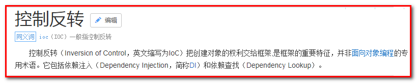
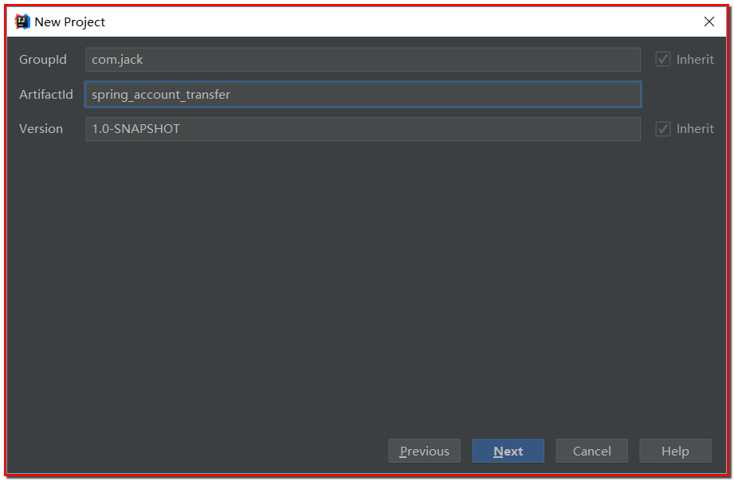
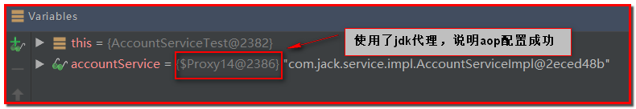

# Spring5

[TOC]

## 一.Spring概述以及Spring基于XML的IOC
### 1.总结
1、spring的概述
	spring是什么
	spring的两大核心
	spring的发展历程和优势
	spring体系结构
2、程序的耦合及解耦
	曾经案例中问题
	工厂模式解耦
3、**IOC概念和spring中的IOC（重点）**
* ** spring中基于XML的IOC环境搭建-掌握**
*  **实例化Bean的3种方式(构造方法)-掌握**
* Bean的作用访问的配置(Scope配置)-理解
* Bean的生命周期-理解

4、**依赖注入（Dependency Injection）（重点）**
* **属性的3种注入方式(构造方法、set方法、p名称空间(本质还是set方法)、注解)，set方法注入方式-掌握**
* 数据类型的注入(基本数据类型、其他Bean对象、集合属性注入)
### 2.Spring概述
#### 2-1.Spring概述(了解)
Spring是分层的Java SE/EE应用 full-stack轻量级开源框架，**以IoC（Inverse Of Control：反转控制）和AOP（Aspect Oriented Programming：面向切面编程）为内核**，提供了展现层Spring MVC和持久层Spring JDBC以及业务层事务管理等众多的企业级应用技术，还能整合开源世界众多著名的第三方框架和类库，逐渐成为使用最多的Java EE企业应用开源框架。
什么是一站式开发：

#### 2-2.Spring的发展历程
1997年IBM提出了EJB的思想 
1998年，SUN制定开发标准规范EJB1.0 
1999年，EJB1.1发布 
2001年，EJB2.0发布 
2003年，EJB2.1发布 
2006年，EJB3.0发布 
Rod Johnson（spring之父） 
Expert One-to-One J2EE Design and Development(2002) 
阐述了J2EE使用EJB开发设计的优点及解决方案 
Expert One-to-One J2EE Development without EJB(2004) 
阐述了J2EE开发不使用EJB的解决方式（Spring雏形） 
**2017年9月份发布了spring的最新版本spring 5.0通用版（GA） **
#### 2-3.Spring的优势
**1：方便解耦，简化开发 **
通过Spring提供的IoC容器，可以将对象间的依赖关系交由Spring进行控制，避免硬编码所造成的过度程序耦合。用户也不必再为单例模式类、属性文件解析等这些很底层的需求编写代码，可以更专注于上层的应用。 
**2：AOP编程的支持 (jdk动态代理)**
通过Spring的AOP功能，方便进行面向切面的编程，许多不容易用传统OOP实现的功能可以通过AOP轻松应付。 
声明式事务的支持可以将我们从单调烦闷的事务管理代码中解脱出来，通过声明式方式灵活的进行事务的管理，提高开发效率和质量。 
3：方便程序的测试（和Junit整合） 
可以用非容器依赖的编程方式进行几乎所有的测试工作，测试不再是昂贵的操作，而是随手可做的事情。 
4：方便集成各种优秀框架 
Spring可以降低各种框架的使用难度，提供了对各种优秀框架（Struts、Hibernate、Hessian、Quartz等）的直接支持。 
5：降低JavaEE API的使用难度 （SSM整合）
Spring对JavaEE API（如JDBC、JavaMail、远程调用等）进行了薄薄的封装层，使这些API的使用难度大为降低。 
Java源码是经典学习范例 
Spring的源代码设计精妙、结构清晰、匠心独用，处处体现着大师对Java设计模式灵活运用以及对Java技术的高深造诣。它的源代码无意是Java技术的最佳实践的范例。 
#### 2-4.Spring的体系结构

### 3.IOC的概念和作用
#### 3-1.什么是程序的耦合
耦合性(Coupling)，也叫耦合度，是对模块间关联程度的度量。耦合的强弱取决于模块间接口的复杂性、调用模块的方式以及通过界面传送数据的多少。模块间的耦合度是指模块之间的依赖关系，包括控制关系、调用关系、数据传递关系。模块间联系越多，其耦合性越强，同时表明其独立性越差( 降低耦合性，可以提高其独立性)。
耦合性存在于各个领域，而非软件设计中独有的，但是我们只讨论软件工程中的耦合。 
**在软件工程中，耦合指的就是就是对象之间的依赖性**。对象之间的耦合越高，维护成本越高。因此对象的设计应使类和构件之间的耦合最小。软件设计中通常用耦合度和内聚度作为衡量模块独立程度的标准。划分模块的一个准则就是高内聚低耦合。 

它有如下分类：（了解） 
（1） 内容耦合。当一个模块直接修改或操作另一个模块的数据时，或一个模块不通过正常入口而转入另一个模块时，这样的耦合被称为内容耦合。内容耦合是最高程度的耦合，应该避免使用之。 
（2） 公共耦合。两个或两个以上的模块共同引用一个全局数据项，这种耦合被称为公共耦合。在具有大量公共耦合的结构中，确定究竟是哪个模块给全局变量赋了一个特定的值是十分困难的。 
（3） 外部耦合 。一组模块都访问同一全局简单变量而不是同一全局数据结构，而且不是通过参数表传递该全局变量的信息，则称之为外部耦合。 
（4） 控制耦合 。一个模块通过接口向另一个模块传递一个控制信号，接受信号的模块根据信号值而进行适当的动作，这种耦合被称为控制耦合。 
（5） 标记耦合 。若一个模块A通过接口向两个模块B和C传递一个公共参数，那么称模块B和C之间存在一个标记耦合。 
（6） 数据耦合。模块之间通过参数来传递数据，那么被称为数据耦合。数据耦合是最低的一种耦合形式，系统中一般都存在这种类型的耦合，因为为了完成一些有意义的功能，往往需要将某些模块的输出数据作为另一些模块的输入数据。 
（7） 非直接耦合 。两个模块之间没有直接关系，它们之间的联系完全是通过主模块的控制和调用来实现的。 
总结： 
**耦合是影响软件复杂程度和设计质量的一个重要因素**，在设计上我们应采用以下原则：如果模块间必须存在耦合，就尽量使用数据耦合，少用控制耦合，限制公共耦合的范围，尽量避免使用内容耦合。 
内聚与耦合 
内聚标志一个模块内各个元素彼此结合的紧密程度，它是信息隐蔽和局部化概念的自然扩展。内聚是从功能角度来度量模块内的联系，一个好的内聚模块应当恰好做一件事。它描述的是模块内的功能联系。耦合是软件结构中各模块之间相互连接的一种度量，耦合强弱取决于模块间接口的复杂程度、进入或访问一个模块的点以及通过接口的数据。 程序讲究的是低耦合，高内聚。就是同一个模块内的各个元素之间要高度紧密，但是各个模块之间的相互依存度却要不那么紧密。 
内聚和耦合是密切相关的，同其他模块存在高耦合的模块意味着低内聚，而高内聚的模块意味着该模块同其他模块之间是低耦合。**在进行软件设计时，应力争做到高内聚，低耦合**

我们在开发中，有些依赖关系是必须的，有些依赖关系可以通过优化代码来解除的。 
请看下面的示例代码：
```java
/** 
* 账户的业务层实现类 
*/ 
public class AccountServiceImpl implements IAccountService { 
	private AccountDao accountDao = new AccountDaoImpl(); 
}
```
上面的代码表示： 
  业务层调用持久层，并且此时业务层在依赖持久层的接口和实现类。如果此时没有持久层实现类，编译将不能通过。这种编译期依赖关系，应该在我们开发中杜绝。我们需要优化代码解决。 
再比如： 
  早期我们的JDBC操作，注册驱动时，我们为什么不使用DriverManager的register方法，而是采用Class.forName的方式？ 
```java
public class JdbcDemo1 { 

	public static void main(String[] args) throws Exception { 
		//1.注册驱动 
		//DriverManager.registerDriver(new com.mysql.jdbc.Driver()); 
		Class.forName("com.mysql.jdbc.Driver"); 
		//2.获取连接 
		//3.获取预处理sql语句对象 
		//4.获取结果集 
		//5.遍历结果集 
	} 
} 
```
原因就是： 
	我们的类依赖了数据库的具体驱动类（MySQL），如果这时候更换了数据库品牌（比如Oracle），需要修改源码来重新数据库驱动。这显然不是我们想要的。
#### 3-2.案例一:使用反射技术创建JDBC连接
第一步：创建工程
maven工程
```
GourpId：com.jack
ArtifactId: spring_day01_jdbc
Version: 1.0-SNAPSHOT
```
第二步：导入maven坐标，pom.xml
```xml
<?xml version="1.0" encoding="UTF-8"?>
<project xmlns="http://maven.apache.org/POM/4.0.0"
         xmlns:xsi="http://www.w3.org/2001/XMLSchema-instance"
         xsi:schemaLocation="http://maven.apache.org/POM/4.0.0 http://maven.apache.org/xsd/maven-4.0.0.xsd">
    <modelVersion>4.0.0</modelVersion>

    <groupId>com.jack</groupId>
    <artifactId>spring_day01_jdbc</artifactId>
    <version>1.0-SNAPSHOT</version>
    <packaging>jar</packaging>

    <dependencies>
        <dependency>
            <groupId>mysql</groupId>
            <artifactId>mysql-connector-java</artifactId>
            <version>5.1.6</version>
        </dependency>
    </dependencies>

</project>
```
第三步：创建数据库和表
创建数据库
spring
创建表
```sql
create table account(
	id int primary key auto_increment,
	name varchar(40),
	money float
)character set utf8 collate utf8_general_ci;

insert into account(name,money) values('aaa',1000);
insert into account(name,money) values('bbb',1000);
insert into account(name,money) values('ccc',1000);
```
第四步：创建JdbcDemo1.java，测试连接数据库
```java
/**
 * @author jackli
 *
 * 程序的耦合
 *      耦合：程序间的依赖关系
 *          包括：
 *              类之间的依赖
 *              方法间的依赖
 *      解耦：
 *          降低程序间的依赖关系
 *      实际开发中：
 *          应该做到：编译期不依赖，运行时才依赖。
 *      解耦的思路：
 *          第一步：使用反射来创建对象，而避免使用new关键字。
 *          第二步：通过读取配置文件来获取要创建的对象全限定类名
 *
 */
public class JdbcDemo {

    public static void main(String[] args) throws Exception {
        // 1.注册驱动
        // DriverManager.registerDriver(new com.mysql.jdbc.Driver());
        // 利用反射解决程序间的耦合
        Class.forName("com.mysql.jdbc.Driver");
        // 2.创建连接
        Connection conn = DriverManager.getConnection("jdbc:mysql://localhost:3306/spring", "root", "root");
        // 3.创建预编译对象
        PreparedStatement pstmt = conn.prepareStatement("select * from account");
        // 4.执行sql操作
        ResultSet rs = pstmt.executeQuery();
        // 5.遍历结果集
        while (rs.next()) {
            System.out.println(rs.getString("name"));
        }
        // 6.释放资源
        rs.close();
        pstmt.close();
        conn.close();
    }
}
```
#### 3-3.案例二：使用工厂模式+反射技术创建对象
第一步：创建工程
```
GourpId：com.jack
ArtifactId: spring_day01_factory
Version: 1.0-SNAPSHOT
```
第二步：创建包com.jack.dao，创建接口AccountDao.java
```java
/**
 * @author jackli
 * 账户的持久层接口
 */
public interface AccountDao {

    /**
     * 保存账户
     */
    void saveAccount();
}
```
创建包com.itheima.dao.impl创建类AccountDaoImpl.java实现接口AccountDao.java
```java
/**
 * @author jackli
 * 账户的持久层实现类
 */
public class AccountDaoImpl implements AccountDao {
    public void saveAccount() {
        System.out.println("保存账户");
    }
}
```
第三步：创建com.itheima.service，创建接口AccountService.java
```java
/**
 * @author jackli
 * 账户的业务层接口
 */
public interface AccountService {

    /**
     * 保存账户
     */
    void saveAccount();
}
```
创建包com.itheima.service.impl，创建接口的实现类AccountServiceImpl.java
```java
/**
 * @author jackli
 * 账户的业务层实现类
 */
public class AccountServiceImpl implements AccountService {

//    private AccountDao accountDao = new AccountDaoImpl();

    private AccountDao accountDao = (AccountDao) BeanFactory.getBean("accountDao");

    private int i = 1; // 单例对象会改变全局变量

    public void saveAccount() {
        // 单例对象，尽量不要设置成全局变量，因为对属性的赋值会影响全局变量
        System.out.println(i);
        System.out.println("执行service中的方法...");
        accountDao.saveAccount();
        i++;
    }
}
```
第四步：创建com.jack.ui，创建类Client.java，表示表现层
```java
/**
 * @author jackli
 */
public class Client {

    public static void main(String[] args) {
        // 耦合
        // AccountService accountService = new AccountServiceImpl();
        // 解耦（使用BeanFactory工厂类获取对象）
        for (int i = 0; i < 5; i++) {
            AccountService as = (AccountService) BeanFactory.getBean("accountService");
            System.out.println(as);
            as.saveAccount();
        }
    }
}
```
第五步：在resource下，创建bean.properties
```properties
accountService=com.jack.service.impl.AccountServiceImpl
accountDao=com.jack.dao.impl.AccountDaoImpl
```
第六步：创建工厂类，用来创建对象
创建包com.jack.factory，创建类BeanFactory.java
```java
/**
 * 一个创建Bean对象的工厂
 *
 * Bean：在计算机英语中，有可重用组件的含义。
 * JavaBean：用java语言编写的可重用组件。
 *      javabean ->  实体类
 *
 *   它就是创建我们的service和dao对象的。
 *
 *   第一个：需要一个配置文件来配置我们的service和dao
 *           配置的内容：唯一标识=全限定类名（key=value)
 *   第二个：通过读取配置文件中配置的内容，反射创建对象
 *
 *   我的配置文件可以是xml也可以是properties
 */
public class BeanFactory {

    // 使用Properties解析properties文件
    private static Properties props;
    // 使用Map<String,Object>集合，存放对象的key和创建的对象
    private static Map<String, Object> beans;

    // 通过静态代码块（运行BeanFactory，一定会被加载，只被加载一次）
    static {
        try {
            // 读取bean.properties文件
            props = new Properties();
            // 读取每个key的值
            InputStream in = BeanFactory.class.getClassLoader().getResourceAsStream("bean.properties");
            props.load(in);
            // Map集合
            beans = new HashMap<String, Object>();
            // 取出配置文件中所有的Key
            Enumeration keys = props.keys();
            // 遍历枚举
            while (keys.hasMoreElements()) {
                // 获取properties文件的中的key
                String key = keys.nextElement().toString();
                // 通过key，获取key所对应的对象的路径
                String beanPath = props.getProperty(key);
                // 使用路径，通过反射技术，获取对象
                Object value = Class.forName(beanPath).newInstance();
                // 将key和Object对象存放到map集合中
                beans.put(key, value);
            }
        } catch (Exception e) {
            throw new ExceptionInInitializerError("初始化properties失败");
        }
    }

    /**
     * 根据bean的名称获取对象（单例）
     * @param beanName
     * @return
     */
    public static Object getBean(String beanName) {
        return beans.get(beanName);
    }

    /**
     * 根据Bean的名称获取bean对象（多例）
     * @param beanName
     * @return
     */
    public static Object getBean2(String beanName) {
        Object bean = null;

        try {
            // 获取bean的全路径
            String beanPath = props.getProperty(beanName);
            // 每次都会调用默认构造函数创建对象
            bean = Class.forName(beanName).newInstance();
        } catch (Exception e) {
            e.printStackTrace();
        }
        return bean;
    }
}
```
#### 3-4.解决程序耦合的思路
当是我们讲解jdbc时，是通过反射来注册驱动的，代码如下： 
```java
Class.forName("com.mysql.jdbc.Driver");//此处只是一个字符串 
```
此时的好处是，我们的类中不再依赖具体的驱动类，此时就算删除mysql的驱动jar包，依然可以编译（运行就不要想了，没有驱动不可能运行成功的）。 
同时，也产生了一个新的问题，mysql驱动的全限定类名字符串是在java类中写死的，一旦要改还是要修改源码。 
解决这个问题也很简单，使用配置文件配置（xml或者是properties）。
#### 3-5.工厂模式解耦
在实际开发中我们可以把三层的对象都使用配置文件配置起来，当启动服务器应用加载的时候，让一个类中的方法通过读取配置文件，把这些对象创建出来并存起来。在接下来的使用的时候，直接拿过来用就好了。 
那么，这个读取配置文件，创建和获取三层对象的类就是工厂。
#### 3-6.控制反转
上一小节解耦的思路有2个问题： 
1、存哪去？ 
分析：由于我们是很多对象，肯定要找个集合来存。这时候有Map和List供选择。 
到底选Map还是List就看我们有没有查找需求。因为有查找需求，选Map。 
所以我们的答案就是在应用加载时，创建一个Map，用于存放三层对象。 
我们把这个map称之为容器。 
2、还是没解释什么是工厂？ 
工厂就是负责给我们从容器中获取指定对象的类。这时候我们获取对象的方式发生了改变。而不是我们在程序中去new对象，而是通过工厂去创建对象，并且通过工厂去获取对象。 
原来： 
我们在获取对象时，都是采用new的方式。是主动的

现在： 
我们获取对象时，同时跟工厂要，有工厂为我们查找或者创建对象。是被动的。 

这种被动接收的方式获取对象的思想就是控制反转，它是spring框架的核心之一。

**ioc的作用： 削减计算机程序的耦合(解除我们代码中的依赖关系)，将对象的创建和调用都交给spring容器去处理。**
### 4.使用Spring的IOC解决程序耦合
官网：http://spring.io/ 
下载地址：http://repo.springsource.org/libs-release-local/org/springframework/spring 
解压:(Spring目录结构:) 

* docs :API和开发规范. 
* libs :jar包和源码. 
* schema :约束.
#### 4-1.IOC入门
第一步：创建工程
```
GourpId：com.jack
ArtifactId: spring_day01_ioc
Version: 1.0-SNAPSHOT
```
第二步：导入spring的依赖包
```xml
<?xml version="1.0" encoding="UTF-8"?>
<project xmlns="http://maven.apache.org/POM/4.0.0"
         xmlns:xsi="http://www.w3.org/2001/XMLSchema-instance"
         xsi:schemaLocation="http://maven.apache.org/POM/4.0.0 http://maven.apache.org/xsd/maven-4.0.0.xsd">
    <modelVersion>4.0.0</modelVersion>

    <groupId>com.jack</groupId>
    <artifactId>spring_day01_ioc</artifactId>
    <version>1.0-SNAPSHOT</version>
    <packaging>jar</packaging>

    <dependencies>
        <dependency>
            <groupId>org.springframework</groupId>
            <artifactId>spring-context</artifactId>
            <version>5.0.2.RELEASE</version>
        </dependency>
        <dependency>
            <groupId>junit</groupId>
            <artifactId>junit</artifactId>
            <version>4.12</version>
            <scope>test</scope>
        </dependency>
    </dependencies>

</project>
```
第三步：创建Dao
创建接口AccountDao.java
```java
/**
 * @author jackli
 * 账户的持久层接口
 */
public interface AccountDao {

    /**
     * 保存账户
     */
    void saveAccount();
}
```
创建实现类AccountDaoImpl.java(com.jack.dao.impl)
```java
/**
 * @author jackli
 * 账户的持久层实现类
 */
public class AccountDaoImpl implements AccountDao {

    public void saveAccount() {
        System.out.println("AccountDao--保存账户...");
    }
}
```
第四步：创建Service
创建接口AccountService.java
```java
 * @author jackli
 * 账户的业务层接口
 */
public interface AccountService {

    /**
     * 保存账户
     */
    void saveAccount();
}
```
创建接口的实现类AccountServiceImpl.java
```java
/**
 * @author jackli
 * 账户的业务层实现类
 */
public class AccountServiceImpl implements AccountService {

    private AccountDao accountDao;

    public void setAccountDao(AccountDao accountDao) {
        this.accountDao = accountDao;
    }

    public AccountServiceImpl() {
        System.out.println("AccountServiceImpl构造方法执行了...");
    }

    public void saveAccount() {
        System.out.println("accountService--保存账户....");
        accountDao.saveAccount();
    }
}
```
第五步：在resource下创建applicationContext.xml
```xml
<?xml version="1.0" encoding="UTF-8"?>
<beans xmlns="http://www.springframework.org/schema/beans"
       xmlns:xsi="http://www.w3.org/2001/XMLSchema-instance"
       xsi:schemaLocation="http://www.springframework.org/schema/beans
        http://www.springframework.org/schema/beans/spring-beans.xsd">

    <!--
        IOC(将对象的创建权交给Spring容器中管理)
        id：对象创建的key(唯一)
        class：创建对象的全路径(底层使用反射技术)
    -->
    <bean id="accountService" class="com.jack.service.impl.AccountServiceImpl">
        <property name="accountDao" ref="accountDao"></property>
    </bean>
    <bean id="accountDao" class="com.jack.dao.impl.AccountDaoImpl"></bean>
</beans>
```
第六步：ApplicationContext接口对象
参考：ApplicationContext和ClassPathXmlApplicationContext、FileSystemXmlApplicationContex的关系。


**BeanFactory 和ApplicationContext 的区别**
BeanFactory 才是Spring 容器中的顶层接口。
ApplicationContext 是它的子接口。
BeanFactory 和ApplicationContext 的区别：
创建对象的时间点不一样。
	ApplicationContext：只要一读取配置文件，默认情况下就会创建对象。（立即加载）
	BeanFactory：什么时候使，用什么时候创建对象。（延迟加载）
**ApplicationContext 接口的实现类**
（1）ClassPathXmlApplicationContext： 
它是从类的根路径下加载配置文件 推荐使用这种 
（2）FileSystemXmlApplicationContext： 
它是从磁盘路径上加载配置文件，配置文件可以在磁盘的任意位置。 
（3）AnnotationConfigApplicationContext: （第2天）
当我们使用注解配置容器对象时，需要使用此类来创建spring 容器。它用来读取注解。
第七步：测试类
```java
/**
 * @author jackli
 */
public class Client {

    public static void main(String[] args) {
        getBeanByApplicaitonContext();
        // diffBeanFactoryAndApplicationContext();
        // instaniateApplicationContext();
        // diffIdAndName();
    }

    /**
     * 测试由ApplicationContext对象获取Spring容器中创建的对象
     */
    private static void getBeanByApplicaitonContext() {
        // 代码之间存在依赖性(耦合)
        // AccountService accountService = new AccountServiceImpl();
        // 由Spring创建对象(完成对象的解耦)
        ApplicationContext ac = new ClassPathXmlApplicationContext("applicationContext.xml");
        // 通过名称调用(通过Spring容器中的id属性)--推荐使用
        AccountService accountService = (AccountService) ac.getBean("accountService");
        // 通过类型调用(通过Spring容器中的class属性)
        AccountService accountService2 = ac.getBean(AccountServiceImpl.class);
        accountService.saveAccount();
    }

    /**
     * 比较BeanFactory和ApplicationContext的区别：
     *      ApplicationContext：只要一读取配置文件，默认情况下就会创建对象(立即加载)
     *      BeanFactory：什么时候用，什么时候创建对象(延迟加载)
     */
    private static void diffBeanFactoryAndApplicationContext() {
        // 使用ApplicationContext创建对象默认是单例(只要加载Spring容器，对象就会创建，叫作立即检索)
        ApplicationContext ac = new ClassPathXmlApplicationContext("applicationContext.xml");
        // 使用BeanFactory创建对象默认是单例（当加载spring容器的时候，不会执行构造方法，对象不会立即创建，
        // 只要调用getBean的方法，对象才会创建，叫做延迟检索）
        BeanFactory ac2 = new XmlBeanFactory(new ClassPathResource("applicationContext.xml"));
        AccountService accountService = (AccountService) ac.getBean("accountService");
        System.out.println(accountService);

        AccountService accountService1 = (AccountService) ac.getBean("accountService");
        System.out.println(accountService1);
    }

    /**
     * 【ApplicationContext 接口的实现类】
     *（1）ClassPathXmlApplicationContext：
     *      它是从类的根路径下加载配置文件 推荐使用这种
     *（2）FileSystemXmlApplicationContext：
     *      它是从磁盘路径上加载配置文件，配置文件可以在磁盘的任意位置。注意磁盘的权限
     *（3）AnnotationConfigApplicationContext:
     *      当我们使用注解配置容器对象时，需要使用此类来创建spring 容器。它用来读取注解
     */
    private static void instaniateApplicationContext() {
        // 测试ClassPathXmlApplicationContext
        ApplicationContext ac = new ClassPathXmlApplicationContext("applicationContext.xml");
        // 测试FileSystemXmlApplicationContext
        ApplicationContext ac2 =  new FileSystemXmlApplicationContext("d:/applicationContext.xml");
        AccountService accountService = (AccountService) ac.getBean("accountService");
        System.out.println(accountService);

        AccountService accountService1 = (AccountService) ac.getBean("accountService");
        System.out.println(accountService1);
    }

    /**
     * id中不能出现特殊字符，name中可以出现特殊的字符。
     *   可以指定多个name，之间可以用分号（“；”）、空格（“ ”）或逗号（“，”）分隔开，如果没有指定id，
     *      那么第一个name为标识符，其余的为别名； 若指定了id属性，则id为标识符，所有的name均为别名。如：
     *   <bean name="alias1 alias2;alias3,alias4" id="hello1" class="com.zyh.spring3.hello.HelloWorld"> </bean>  
     *   此时，hello1为标识符，而alias1，alias2，alias3，alias4为别名，它们都可以作为Bean的键值；
     */
    private static void diffIdAndName() {
        // 测试ClassPathXmlApplicationContext
        ApplicationContext ac = new ClassPathXmlApplicationContext("applicationContext.xml");
        AccountService accountService = (AccountService) ac.getBean("accountService");
        System.out.println(accountService);
        accountService.saveAccount();
    }
}
```
#### 4-2.id和name的配置
**id中不能出现特殊字符，name中可以出现特殊的字符。**
可以指定多个name，之间可以用分号（“；”）、空格（“ ”）或逗号（“，”）分隔开，如果没有指定id，那么第一个name为标识符，其余的为别名； 若指定了id属性，则id为标识符，所有的name均为别名。如：
```java
<bean name="alias1 alias2;alias3,alias4" id="hello1" class="com.zyh.spring3.hello.HelloWorld"> </bean>  
```
此时，hello1为标识符，而alias1，alias2，alias3，alias4为别名，它们都可以作为Bean的键值；
#### 4-3.实例化Bean的3种方式
创建工程
```
GourpId：com.jack
ArtifactId: spring_day01_jdbc
Version: 1.0-SNAPSHOT
```
导入坐标
```xml
<?xml version="1.0" encoding="UTF-8"?>
<project xmlns="http://maven.apache.org/POM/4.0.0"
         xmlns:xsi="http://www.w3.org/2001/XMLSchema-instance"
         xsi:schemaLocation="http://maven.apache.org/POM/4.0.0 http://maven.apache.org/xsd/maven-4.0.0.xsd">
    <modelVersion>4.0.0</modelVersion>

    <groupId>com.jack</groupId>
    <artifactId>spring_day01_bean</artifactId>
    <version>1.0-SNAPSHOT</version>
    <packaging>jar</packaging>

    <dependencies>
        <dependency>
            <groupId>org.springframework</groupId>
            <artifactId>spring-context</artifactId>
            <version>5.0.2.RELEASE</version>
        </dependency>
        <dependency>
            <groupId>junit</groupId>
            <artifactId>junit</artifactId>
            <version>4.12</version>
            <scope>test</scope>
        </dependency>
    </dependencies>
</project>
```
创建包，com.jack.service，创建接口AccountService.java
```java
/**
 * @author jackli
 * 账户的业务层接口
 */
public interface AccountService {

    void saveAccount();
}
```
创建包com.jack.service.impl，创建接口的实现类AccountService.java
```java
/**
 * @author jackli
 * 账户的业务层实现类
 */
public class AccountServiceImpl implements AccountService {

    /**
     * 默认通过无参构造注入bean对象
     */
    public AccountServiceImpl() {
        System.out.println("这是AccountServiceImpl的无参构造方法");
    }

    public void saveAccount() {
        System.out.println("保存账户....");
    }

    public void init() {
        System.out.println("对象初始化了init...");
    }

    public void destroy() {
        System.out.println("对象销毁了destroy...");
    }
}
```
测试类：Client.java
```java
public class Client {

    /**
     *
     * @param args
     */
    public static void main(String[] args) {
        //1.获取核心容器对象
        ApplicationContext ac = new ClassPathXmlApplicationContext("applicationContext.xml");
        //2.根据id获取Bean对象
        AccountService as  = (AccountService)ac.getBean("accountService");
        as.saveAccount();
    }
}
```
##### 4-3-1.第一种：采用无参数的构造方法方式实例化（用的最多）
**applicationContext.xml**
```xml
<!--实例化bean，第一种方式：默认使用无参构造（推荐使用）-->
    <bean id="accountService" class="com.jack.service.impl.AccountServiceImpl"></bean>
```
```java
public class AccountServiceImpl implements AccountService {
    //可以不写
    public AccountServiceImpl(){
        System.out.println("对象创建了");
    }
}
```
##### 4-3-2.第二种：采用静态工厂实例化的方式
**applicationContext.xml**
```xml
 <!--
        实例化bean，第二种方式：使用静态工厂
        factory-method: 获取bean的静态方法名称相对应
    -->
    <bean id="accountService2" class="com.jack.factory.StaticFactory" factory-method="getBean"/>
```
**AccountServiceImpl**
```java
public class AccountServiceImpl implements AccountService {
	// ...
}
```
**StaticFactory.java**
```java
public class StaticFactory {

    /**
     * 提供静态方法，用来获取bean(创建对象)
     * @return
     */
    public static AccountService getBean() {
        return new AccountServiceImpl();
    }
}
```
##### 4-3-3.第三种方式：采用实例工厂实例化的方式
**applicationContext.xml**
```xml
<!--
    实例化bean，第三种方式：使用实例工厂
    1.先创建实例工厂类的bean对象
    2.然后再创建accountService的bean对象
    3.factory-bean：对应实例工厂类的bean对象id
    4.factory-method：对应获取accountService的bean对象的普通方法名称
-->
<bean id="instanceFactory" class="com.jack.factory.InstanceFactory"/>
<bean id="accountService3" factory-bean="instanceFactory" factory-method="getBean"/>
```
**AccountServiceImpl**
```java
public class AccountServiceImpl implements AccountService {
	//...
}
```
**InstanceFactory.java**
```java
public class InstanceFactory {

    public AccountService getBean() {
        return new AccountServiceImpl();
    }
}
```
##### 4-3-4.三种实例化Bean的总结
第一种无参构造的方式用的最多，第二种和第三种一般是调用spring底层写好类的时候会用到
#### 4-4.Bean的作用访问的配置：scope的配置
Spring创建这个类的时候，**默认**采用的**单例的模式**进行创建的。如果想去改变单例模式，需要通过scope进行配置。
Scope属性中有以下几个取值:
* **singleton**			：默认值，单例的。
	 **prototype**		    ：多例的。
	 request			：应用在web应用中，将创建的对象存入到request域中。
	 session			：应用在web应用中，将创建的对象存入到session域中。
	 globalsession		：应用在集群环境下使用。将创建的对象存入到全局的session中。
什么是globalsession（了解即可）？


**applicationContext.xml**
```xml
<!--
    spring创建对象默认是单例的模式，如果要想改变，就得使用scope属性去改变
        singleton：单例
        prototype：多例
        request：作用于web中的请求范围
        session：作用于web中的session范围
        global-session：集群环境的会话范围，如果不是集群，就是session
-->
<bean id="accountService4" class="com.jack.service.impl.AccountServiceImpl" scope="prototype"/>
```
#### 4-5.Bean的生命周期的配置
单例对象
* 初始化：当容器创建时对象出生
* 存在：只要容器还在，对象一直活着
* 销毁：容器销毁，对象消亡
* 总结：**单例对象的生命周期和容器相同**

多例对象
* 初始化：当我们使用对象时spring框架为我们创建
* 存在：对象只要是在使用过程中就一直活着。
* 销毁：当对象长时间不用，且没有别的对象引用时，由Java的垃圾回收器回收
* 总结：**多例对象的声明周期和对象是否被使用有关。与容器是否被销毁无关。**

**AccountServiceImpl.java**
```java
public class AccountServiceImpl implements AccountService {
	// ...
    public void init() {
        System.out.println("对象初始化了init...");
    }

    public void destroy() {
        System.out.println("对象销毁了destroy...");
    }
}
```
**applicationContext.xml**
```xml
<!--
    bean的生命周期：
        单例：
            出生：spring容器创建对象时
            存在：容器在，对象在
            销毁：容器销毁，对象销毁
            特点：与容器同存亡
        多例：
            出生：当使用到对象时，spring容器创建
            存在：对象在使用
            销毁：对象没有使用，或者没有引用指向它，java垃圾回收器回收
            特点：与对象是否使用有关系
-->
<bean id="accountService5" scope="singleton" class="com.jack.service.impl.AccountServiceImpl" init-method="init" destroy-method="destroy"/>
```
**测试**
```java
/**
 * 模拟一个表现层，用于调用业务层
 */
public class Client {

    /**
     *
     * @param args
     */
    public static void main(String[] args) {
        //1.获取核心容器对象
        ClassPathXmlApplicationContext ac = new ClassPathXmlApplicationContext("applicationContext.xml");
        //2.根据id获取Bean对象
        AccountService as  = (AccountService)ac.getBean("accountService");
        as.saveAccount();
        //手动关闭容器
        ac.close();
    }
}
```
### 5.Spring的依赖注入(DI)
**依赖注入**：Dependency Injection。它是**spring框架核心ioc的具体实现**。 
我们的程序在编写时，通过控制反转，把对象的创建交给了spring，但是代码中不可能出现没有依赖的情况。ioc解耦只是降低他们的依赖关系，但不会消除。例如：我们的业务层仍会调用持久层的方法。 那这种业务层和持久层的依赖关系，在使用spring之后，就让spring来维护了。 简单的说，就是坐等**框架把持久层对象传入业务层，而不用我们自己去获取。 这就是依赖注入。**
依赖注入：
**能注入的数据：有三类**
* （1）基本类型和String
* （2）其他bean类型（在配置文件中或者注解配置过的bean）
* （3）复杂类型/集合类型

**能注入的方式：有三种**
* （1）第一种：使用构造函数提供
* （2）第二种：**使用set方法提供**（使用p名称空间注入）
* （3）第三种：使用注解提供
#### 5-1.准备工作
**创建工程**
com.jack.spring_di
**添加maven依赖**
```xml
<dependencies>
    <dependency>
        <groupId>org.springframework</groupId>
        <artifactId>spring-context</artifactId>
        <version>5.0.2.RELEASE</version>
    </dependency>
</dependencies>
```
**创建包com.jack.service，创建接口AccountService.java**
```java
/**
 * @author jackli
 * 账户业务层的接口
 */
public interface AccountService {

    /**
     * 模拟保存账户
     */
    void saveAccount();
}
```
**创建包com.jack.service.impl，创建接口的实现类AccountServiceImpl.java**
```java
/**
 * @author jackli
 * 账户业务层的实现类
 */
public class AccountServiceImpl implements AccountService {

    private String name;
    private Integer age;
    private Date birthday;

    public void saveAccount() {
        System.out.println("AccountServiceImpl的saveAccount方法执行了...");
        System.out.println("name：" + name + "，age：" + age + "，birthday：" + birthday);
    }
}
```
#### 5-2.构造函数注入
**AccountServiceImpl.java提供传递参数的构造方法。**
```java
public class AccountServiceImpl implements AccountService {

    // 如果是经常变化的数据，并不适用于构造方法注入的方式
    private String name;
    private Integer age;
    private Date birthday;

    public AccountServiceImpl() {
    }

    public AccountServiceImpl(String name, Integer age, Date birthday) {
        this.name = name;
        this.age = age;
        this.birthday = birthday;
    }

    public void saveAccount() {
        System.out.println("AccountServiceImpl的saveAccount方法执行了...");
        System.out.println("name：" + name + "，age：" + age + "，birthday：" + birthday);
    }
}
```
**applicationContext.xml**
```xml
<?xml version="1.0" encoding="UTF-8"?>
<beans xmlns="http://www.springframework.org/schema/beans"
       xmlns:xsi="http://www.w3.org/2001/XMLSchema-instance"
       xsi:schemaLocation="http://www.springframework.org/schema/beans
        http://www.springframework.org/schema/beans/spring-beans.xsd">

    <!--
        注入数据第一种方式：构造方法注入
            name：对应的是对象属性名
            value：给对象属性赋值
            ref：引入其他bean类型
            type：属性的数据类型
            index：构造方法参数列表的参数属性
    -->
    <bean id="accountService" class="com.jack.service.impl.AccountServiceImpl">
        <constructor-arg name="name" value="杰克"></constructor-arg>
        <constructor-arg name="age" value="21"></constructor-arg>
        <constructor-arg name="birthday" ref="date"></constructor-arg>
    </bean>
    <bean id="date" class="java.util.Date"></bean>
</beans>
```
**测试类Client.java**
```java
public class Client {

    public static void main(String[] args) {
        // 获取spring ioc容器对象
        ApplicationContext ac = new ClassPathXmlApplicationContext("applicationContext.xml");
        // 根据id获取Bean对象
        AccountService accountService = ac.getBean("accountService", AccountService.class);
        accountService.saveAccount();
    }
}
```
#### 5-3.set方法注入(推荐使用)
**AccountServiceImpl2.java提供属性的set方法。**
```java
public class AccountServiceImpl2 implements AccountService {
    
    private String name;
    private Integer age;
    private Date birthday;

    public void setName(String name) {
        this.name = name;
    }

    public void setAge(Integer age) {
        this.age = age;
    }

    public void setBirthday(Date birthday) {
        this.birthday = birthday;
    }

    public void saveAccount() {
        System.out.println("AccountServiceImpl的saveAccount方法执行了...");
        System.out.println("name：" + name + "，age：" + age + "，birthday：" + birthday);
    }
}
```
**applicationContext.xml**
```xml
<!-- set方法注入                更常用的方式
涉及的标签：property
出现的位置：bean标签的内部
标签的属性
    name：用于指定注入时所调用的set方法名称
    value：用于提供基本类型和String类型的数据
    ref：用于指定其他的bean类型数据。它指的就是在spring的Ioc核心容器中出现过的bean对象
优势：
    创建对象时没有明确的限制，可以直接使用默认构造函数
弊端：
    如果有某个成员必须有值，则获取对象是有可能set方法没有执行。
-->
<bean id="accountService2" class="com.jack.service.impl.AccountServiceImpl2">
    <property name="name" value="肉丝"></property>
    <property name="age" value="22"></property>
    <property name="birthday" ref="date"></property>
</bean>
```
**测试类**
```java
public class Client {
    
    public static void main(String[] args) {
        // 获取spring ioc容器对象
        ApplicationContext ac = new ClassPathXmlApplicationContext("applicationContext.xml");
        // 根据id获取Bean对象
        AccountService accountService = ac.getBean("accountService2", AccountService.class);
        accountService.saveAccount();
    }
}
```
#### 5-4.使用p名称空间注入数据(本质还是set方式)
**引入p名称空间**
applicationContext.xml
```xml
<?xml version="1.0" encoding="UTF-8"?>
<beans xmlns="http://www.springframework.org/schema/beans"
       xmlns:xsi="http://www.w3.org/2001/XMLSchema-instance"
       xmlns:p="http://www.springframework.org/schema/p"
       xsi:schemaLocation="http://www.springframework.org/schema/beans
        http://www.springframework.org/schema/beans/spring-beans.xsd">
```
**使用p名称空间完成属性注入**
* 普通属性：**p:属性名="值"**
* 对象类型：**p:属性名-ref="值"**
```xml
bean id="accountService3" class="com.jack.service.impl.AccountServiceImpl2"
      p:name="汤姆" p:age="18" p:birthday-ref="date"></bean>
```
**测试**
```java
public class Client {

    public static void main(String[] args) {
        // 获取spring ioc容器对象
        ApplicationContext ac = new ClassPathXmlApplicationContext("applicationContext.xml");
        // 根据id获取Bean对象
        AccountService accountService = ac.getBean("accountService3", AccountService.class);
        accountService.saveAccount();
    }
}
```
**注意：需要对属性提供set方法，才可以实现注入。**
#### 5-5.注入集合属性
**AccountServiceImpl3.java提供属性的set方法。**
```java
public class AccountServiceImpl3 implements AccountService {

    private String[] strs;
    private List<String> lists;
    private Set<String> sets;
    private Map<String, String> maps;
    private Properties props;

    public void setStrs(String[] strs) {
        this.strs = strs;
    }

    public void setList(List<String> lists) {
        this.lists = lists;
    }

    public void setSets(Set<String> sets) {
        this.sets = sets;
    }

    public void setMaps(Map<String, String> maps) {
        this.maps = maps;
    }

    public void setProps(Properties props) {
        this.props = props;
    }

    public void saveAccount() {
        System.out.println(Arrays.toString(strs));
        System.out.println(lists);
        System.out.println(sets);
        System.out.println(maps);
        System.out.println(props);
    }
}
```
**applicationContext.xml**
```xml
<!--
    注入集合属性
        1.property的name属性对应的是setXxx方法的Xxx名称而不是属性名称
        2.用于给List结构集合注入的标签：
            list、set、array
        3.用于给map结构集合注入的标签：
            map，properties
        结构相同，标签可以互换
-->
<bean id="accountService4" class="com.jack.service.impl.AccountServiceImpl3">
    <!--list-->
    <property name="lists">
        <list>
            <value>杰克</value>
            <value>汤姆</value>
            <value>杰瑞</value>
        </list>
    </property>
    <!--set-->
    <property name="sets">
        <set>
            <value>库里</value>
            <value>汤普森</value>
            <value>杜兰特</value>
        </set>
    </property>
    <!--数组-->
    <property name="strs">
        <array>
            <value>str1</value>
            <value>str2</value>
            <value>str3</value>
        </array>
    </property>
    <!--map-->
    <property name="maps">
        <map>
            <entry key="name1" value="java"></entry>
            <entry key="name2" value="c++"></entry>
            <entry key="name3">
                <value>c</value>
            </entry>
        </map>
    </property>
    <!--properties-->
    <property name="props">
        <props>
            <prop key="a">aa</prop>
            <prop key="b">bb</prop>
            <prop key="c">cc</prop>
        </props>
    </property>
</bean>
```
**测试**
```java
public class Client {

    public static void main(String[] args) {
        // 获取spring ioc容器对象
        ApplicationContext ac = new ClassPathXmlApplicationContext("applicationContext.xml");
        // 根据id获取Bean对象
        AccountService accountService = ac.getBean("accountService4", AccountService.class);
        accountService.saveAccount();
    }
}
```

## 二.Spring基于注解的IOC
### 1.总结
### 2.基于注解的IOC配置
基于注解的IoC配置，即注解配置和xml配置要实现的功能都是一样的，都是要降低程序间的耦合。只是配置的形式不一样，**注解配置和xml配置IOC都要完全掌握**
#### 2-1.准备工作
**创建工程**
com.jack.spring_anno_ioc
**添加maven依赖**
```xml
<?xml version="1.0" encoding="UTF-8"?>
<project xmlns="http://maven.apache.org/POM/4.0.0"
         xmlns:xsi="http://www.w3.org/2001/XMLSchema-instance"
         xsi:schemaLocation="http://maven.apache.org/POM/4.0.0 http://maven.apache.org/xsd/maven-4.0.0.xsd">
    <modelVersion>4.0.0</modelVersion>

    <groupId>com.jack</groupId>
    <artifactId>spring_anno_ioc</artifactId>
    <version>1.0-SNAPSHOT</version>
    <packaging>jar</packaging>

    <dependencies>
        <dependency>
            <groupId>org.springframework</groupId>
            <artifactId>spring-context</artifactId>
            <version>5.0.2.RELEASE</version>
        </dependency>
    </dependencies>
</project>
```
**创建包com.jack.dao，创建接口AccountDao.java，创建实现类AccountDaoImpl.java**
```java
public interface AccountDao {

    void saveAccount();
}
```
```java
public class AccountDaoImpl implements AccountDao {

    public void saveAccount() {
        System.out.println("AccountDaoImpl的saveAccount方法执行了...");
    }
}
```
**创建包com.jack.service，创建接口AccountService.java，创建实现类
AccountServiceImpl.java**
```java
public interface AccountService {

    void saveAccount();
}
```
```java
public class AccountServiceImpl implements AccountService {

    public void saveAccount() {
        System.out.println("AccountServiceImpl的saveAccount方法执行了...");
    }
}
```
#### 2-2.注解配置-控制反转IOC
1.xml配置文件方式创建对象
```xml
<bean id="accountService" class="com.jack.service.impl.AccountServiceImpl"></bean>
```
2.注解方式
**Spring容器(IOC容器)
是一个map结构
* key：id
* value：class(Object类型)

**@Component**

* 作用：把当前类对象注入到IOC容器中
* 属性
	* value：用于指定bean的id，如果我们不指定value属性，那么默认是当前类名且首单词小写
* 示例

@Component等价于
```xml
<bean id="accountServiceImpl" class="com.jack.service.impl.AccountServiceImpl"/>
```
@Component(value="accountService")等价于
```xml
 <bean id="accountService" class="com.jack.service.impl.AccountServiceImpl"/>
```
**Spring还有功能类似于@Component的3个注解**
**@Service**
* 用来注入service层的对象

**@Controller(SpringMVC用了该注解)**
* 用来注入controller层对象

**@Repository**
* 用来注入dao层的对象

**AccountDaoImpl.java加上@Repository注解**
```java
@Repository(value = "accountDao")
public class AccountDaoImpl implements AccountDao {

    public void saveAccount() {
        System.out.println("AccountDaoImpl的saveAccount方法执行了...");
    }
}
```
**AccountServiceImpl.java加上@Service注解**
```java
@Service(value = "accountService")
public class AccountServiceImpl implements AccountService {

    public void saveAccount() {
        System.out.println("AccountServiceImpl的saveAccount方法执行了...");
    }
}
```
**applicationContext.xml开启注解扫描**
```xml
<?xml version="1.0" encoding="UTF-8"?>
<beans xmlns="http://www.springframework.org/schema/beans"
       xmlns:xsi="http://www.w3.org/2001/XMLSchema-instance"
       xmlns:context="http://www.springframework.org/schema/context"
       xsi:schemaLocation="http://www.springframework.org/schema/beans
        http://www.springframework.org/schema/beans/spring-beans.xsd
        http://www.springframework.org/schema/context
        http://www.springframework.org/schema/context/spring-context.xsd">

    <!--开启注解扫描-->
    <context:component-scan base-package="com.jack"></context:component-scan>
</beans>
```
**测试**
```java
public class Client {

    public static void main(String[] args) {
        ApplicationContext ac = new ClassPathXmlApplicationContext("applicationContext.xml");
        AccountService accountService = ac.getBean("accountService", AccountService.class);
        accountService.saveAccount();
    }
}
```
#### 2-3注解配置-依赖注入DI
用于注入数据的
* 它们的作用就和在xml配置文件中的bean标签中写一个**<property>**标签的作用是一样的

##### 2-3-1.@Autowired:基于spring
* 作用：自动按照**类型注入**。只要容器中有唯一的一个bean对象类型和要注入的变量类型匹配，就可以注入成功
	* 如果ioc容器中没有任何bean的类型和要注入的变量类型匹配，则报错。
	* 如果Ioc容器中有多个类型匹配时：先按照类型匹配，如果不能匹配上，会按照属性的名称进行匹配
* 出现位置
	* @Autowired可以设置在属性上，表示按照默认类型去查找(其实如果类型找不到也会按照名称，不过不建议使用，如果要按照名称就使用@Qualifier)
	* @Autowired可以设置在set方法上，表示使用set方法的形参类型去spring容器中查找，如果查找到那么就通过set方法注入对象

* 细节：**在使用注解注入时，set方法就不是必须的了。**

##### 2-3-2.@Qualifier
* 作用：在按照类中注入类型的基础之上再按照**名称注入**，**一般配合@Autowired使用**
* 属性：
	* value：用于指定注入bean的id。

##### 2-3-3.@Resource(JDK提供的注解)
* 作用：直接按照bean的id注入。如果id属性不存在，可以再按照类型注入。它可以独立使用
* 属性：
	* name：用于指定bean的id，如果指定name，只能按照bean的id注入，不能按照类型注入

**注意：**
* 1.**@Autowired、@Qualifier、@Resource都只能注入其他bean类型的数据**，而基本类型和String类型无法使用上述注解实现。
* 2.**集合类型的注入只能通过XML来实现。**
* 3.@Autowired和@Resource表示注入对象，相当于xml中的ref，<property name="" ref=""></property>

**原理图**


**说明**
* @Autowired：如果两个类都是实现的同一个接口，那么使用该注解，由于两个实现类都实现了该接口，那么按照类型找Bean对象，会有冲突
* @Qualifer：可以解决多个类实现同一个接口找不到Bean对象的问题，按照名称注入

##### 2-3-4.@Value
* 作用：**用于注入基本数据类型和String类型的数据**
* 相当于xml配置中的value，<property name="" value=""></property>
* 属性：
	* value：用于指定数据的值。它可以使用spring中SpEL(也就是spring的el表达式）
	* SpEL表达式格式：**${表达式}**

**第一步：创建AccountDaoImpl2.java，实现AccountDao.java接口**
```java
@Repository(value = "accountDao2")
public class AccountDaoImpl2 implements AccountDao {

    public void saveAccount() {
        System.out.println("AccountDaoImpl2的saveAccount方法执行了...");
    }
}
```
**第二步：创建AccountServiceImpl2.java，测试注解**
**测试@Autowired注解**
```java
@Service(value = "accountService2")
public class AccountServiceImpl2 implements AccountService {

    @Autowired
    private AccountDao accountDao;

    public void saveAccount() {
        System.out.println("AccountServiceImpl2的saveAccount方法执行了...");
        accountDao.saveAccount();
    }
}
```
**测试@Qualifer注解**
```java
@Service(value = "accountService2")
public class AccountServiceImpl2 implements AccountService {

    @Autowired
    @Qualifer(value = "accountDao2")
    private AccountDao accountDao;

    public void saveAccount() {
        System.out.println("AccountServiceImpl2的saveAccount方法执行了...");
        accountDao.saveAccount();
    }
}
```
**测试@Resource注解**
```java
@Service(value = "accountService2")
public class AccountServiceImpl2 implements AccountService {

    @Resource(name = "accountDao2")
    private AccountDao accountDao;

    public void saveAccount() {
        System.out.println("AccountServiceImpl2的saveAccount方法执行了...");
        accountDao.saveAccount();
    }
}
```
**第三步：测试类Client.java**
```java
public class Client {

    public static void main(String[] args) {
        ApplicationContext ac = new ClassPathXmlApplicationContext("applicationContext.xml");
        AccountService accountService = ac.getBean("accountService2", AccountService.class);
        accountService.saveAccount();
    }
}
```
**测试@Autowired注解的结果**

**测试@Qualifer注解的结果**

**测试@Resource注解的结果**

#### 2-4. 注解配置-作用域
**Spring容器默认是单例**，@Scope：用于改变作用范围的
他们的作用就和在bean标签中使用scope属性实现的功能是一样的
* 作用：用于指定bean的作用范围
* 属性：
	* value：指定范围的取值。常用取值：singleton prototype

**创建AccountServiceImpl.java**
默认是单例，测试单例
```java
@Service(value = "accountService3")
public class AccountServiceImpl3 implements AccountService {

    @Autowired
    @Qualifier(value = "accountDao")
    private AccountDao accountDao;

    public void saveAccount() {
        System.out.println("AccountServiceImpl3的saveAccount方法执行了...");
        accountDao.saveAccount();
    }
}
```
多例情况下
```java
@Service(value = "accountService3")
@Scope(value = "prototype")
public class AccountServiceImpl3 implements AccountService {

    @Autowired
    @Qualifier(value = "accountDao")
    private AccountDao accountDao;

    public void saveAccount() {
        System.out.println("AccountServiceImpl3的saveAccount方法执行了...");
        accountDao.saveAccount();
    }
}
```
**测试Client.java**
```java
public class Client {

    public static void main(String[] args) {
        ApplicationContext ac = new ClassPathXmlApplicationContext("applicationContext.xml");
        // 默认是单例
        AccountService accountService = ac.getBean("accountService3", AccountService.class);
        AccountService accountService2 = ac.getBean("accountService3", AccountService.class);
        // 单例情况下是true，多例情况下是false
        System.out.println(accountService == accountService2);
    }
}
```
#### 2-5.注解配置-初始化和销毁(单例)
初始化和销毁：单例模式下
* 1.**@PostContruct**：相当于init-method
* 2.**@PreDestroy**：相当于init-destroy

**AccountServiceImpl4.java**
```java
@Service(value = "accountService4")
@Scope(value = "singleton")
public class AccountServiceImpl4 implements AccountService {

    @Autowired
    @Qualifier(value = "accountDao")
    private AccountDao accountDao;

    public void saveAccount() {
        System.out.println("AccountServiceImpl4的saveAccount方法执行了...");
        accountDao.saveAccount();
    }

    @PostConstruct
    public void init() {
        System.out.println("初始化方法执行了...");
    }

    @PreDestroy
    public void destroy() {
        System.out.println("销毁方法执行了...");
    }
}
```
**测试Client.java**
```java
public class Client {

    public static void main(String[] args) {
        ClassPathXmlApplicationContext ac = new ClassPathXmlApplicationContext("applicationContext.xml");
        AccountService accountService = ac.getBean("accountService4", AccountService.class);
        accountService.saveAccount();
        // 销毁Spring容器
        ac.close();
    }
}
```

### 3.Spring IOC实现账户的CRUD
需求：**实现账户的CRUD**
技术选型：
* 使用Spring的IOC实现对象的管理
* 使用DBUtils作为持久层解决方案(JDBCTemplate，Mybatis)
* 使用c3p0数据库连接池

#### 3-1.使用xml配置IOC
**第一步：创建工程**


**第二步：添加maven依赖**
```xml
<groupId>com.jack</groupId>
<artifactId>spring_account_xml_ioc</artifactId>
<version>1.0-SNAPSHOT</version>
<packaging>jar</packaging>

<properties>
    <!--文件的编码格式-->
    <project.build.sourceEncoding>UTF-8</project.build.sourceEncoding>
    <project.reporting.outputEncoding>UTF-8</project.reporting.outputEncoding>
    <maven.compiler.source>1.8</maven.compiler.source>
    <maven.compiler.target>1.8</maven.compiler.target>
</properties>
<dependencies>
    <!--spring的依赖-->
    <dependency>
        <groupId>org.springframework</groupId>
        <artifactId>spring-context</artifactId>
        <version>5.0.2.RELEASE</version>
    </dependency>
    <!--持久层的解决方案DBUtils-->
    <dependency>
        <groupId>commons-dbutils</groupId>
        <artifactId>commons-dbutils</artifactId>
        <version>1.4</version>
    </dependency>
    <!--数据库的驱动-->
    <dependency>
        <groupId>mysql</groupId>
        <artifactId>mysql-connector-java</artifactId>
        <version>5.1.6</version>
    </dependency>
    <!--c3p0-->
    <dependency>
        <groupId>c3p0</groupId>
        <artifactId>c3p0</artifactId>
        <version>0.9.1.2</version>
    </dependency>
    <!--junit-->
    <dependency>
        <groupId>junit</groupId>
        <artifactId>junit</artifactId>
        <version>4.12</version>
    </dependency>
    <!--spring整合junit-->
    <dependency>
        <groupId>org.springframework</groupId>
        <artifactId>spring-test</artifactId>
        <version>5.0.2.RELEASE</version>
    </dependency>
</dependencies>
```
**第三步：创建数据库和表**
```sql
create table account(
	id int primary key auto_increment,
	name varchar(40),
	money float
)character set utf8 collate utf8_general_ci;

insert into account(name,money) values('aaa',1000);
insert into account(name,money) values('bbb',1000);
insert into account(name,money) values('ccc',1000);
```
**第四步：创建com.jack.domain，创建实体类Account**
```java
public class Account implements Serializable {

    private static final long serialVersionUID = -219808417995979688L;

    private Integer id;
    private String name;
    private Float money;

    public Integer getId() {
        return id;
    }

    public void setId(Integer id) {
        this.id = id;
    }

    public String getName() {
        return name;
    }

    public void setName(String name) {
        this.name = name;
    }

    public Float getMoney() {
        return money;
    }

    public void setMoney(Float money) {
        this.money = money;
    }

    @Override
    public String toString() {
        return "Account{" +
                "id=" + id +
                ", name='" + name + '\'' +
                ", money=" + money +
                '}';
    }
}
```
**第五步：创建包com.jack.dao，创建接口AccoutDao，实现CRUD操作**
```java
public interface AccountDao {

    /**
     * 查询所有账户
     * @return
     */
    List<Account> findAllAccount();

    /**
     * 注解查询
     * @param accountId
     * @return
     */
    Account findAccountById(Integer accountId);

    /**
     * 保存账户
     * @param account
     */
    void saveAccount(Account account);

    /**
     * 更新账户
     * @param account
     */
    void updateAccount(Account account);

    /**
     * 删除账户
     * @param accountId
     */
    void deleteAccount(Integer accountId);
}
```
**第六步：创建包com.jack.dao.impl，创建实现类AccountDaoImpl.java**
```java
public class AccountDaoImpl implements AccountDao {

    private QueryRunner queryRunner;

    public void setQueryRunner(QueryRunner queryRunner) {
        this.queryRunner = queryRunner;
    }

    /**
     * 查询所有账户
     * @return
     */
    @Override
    public List<Account> findAllAccount() {
        List<Account> accounts = null;

        try {
            accounts = queryRunner.query("select * from account", new BeanListHandler<Account>(Account.class));
        } catch (Exception e) {
            e.printStackTrace();
        }
        return accounts;
    }

    /**
     * 注解查询
     * @param accountId
     * @return
     */
    @Override
    public Account findAccountById(Integer accountId) {
        Account account = null;
        try {
            account = queryRunner.query("select * from account where id = ?", new BeanHandler<Account>(Account.class), accountId);
        } catch (SQLException e) {
            e.printStackTrace();
        }
        return account;
    }

    /**
     * 保存账户
     * @param account
     */
    @Override
    public void saveAccount(Account account) {
        try {
            queryRunner.update("insert into account(name, money) values(?, ?)", account.getName(), account.getMoney());
        } catch (SQLException e) {
            e.printStackTrace();
        }
    }

    /**
     * 更新账户
     * @param account
     */
    @Override
    public void updateAccount(Account account) {
        try {
            queryRunner.update("update account set name=?, money=? where id=?", account.getName(), account.getMoney(), account.getId());
        } catch (SQLException e) {
            e.printStackTrace();
        }
    }

    /**
     * 删除账户
     * @param accountId
     */
    @Override
    public void deleteAccount(Integer accountId) {
        try {
            queryRunner.update("delete from account where id = ?", accountId);
        } catch (SQLException e) {
            e.printStackTrace();
        }
    }
}
```
**第七步：创建包com.jack.service，创建接口AccountService**
```java
public interface AccountService {

    /**
     * 查询所有账户
     * @return
     */
    List<Account> findAllAccount();

    /**
     * 注解查询
     * @param accountId
     * @return
     */
    Account findAccountById(Integer accountId);

    /**
     * 保存账户
     * @param account
     */
    void saveAccount(Account account);

    /**
     * 更新账户
     * @param account
     */
    void updateAccount(Account account);

    /**
     * 删除账户
     * @param accountId
     */
    void deleteAccount(Integer accountId);
}
```
**第八步：创建包com.jack.service.impl，创建实现类AccountServiceImpl.java**
```java
public class AccountServiceImpl implements AccountService {

    private AccountDao accountDao;

    public void setAccountDao(AccountDao accountDao) {
        this.accountDao = accountDao;
    }

    /**
     * 查询所有账户
     * @return
     */
    @Override
    public List<Account> findAllAccount() {
        List<Account> accounts = accountDao.findAllAccount();
        return accounts;
    }

    /**
     * 主键查询
     * @param accountId
     * @return
     */
    @Override
    public Account findAccountById(Integer accountId) {
        Account account = accountDao.findAccountById(accountId);
        return account;
    }

    /**
     * 保存账户
     * @param account
     */
    @Override
    public void saveAccount(Account account) {
        accountDao.saveAccount(account);
    }

    /**
     * 更新账户
     * @param account
     */
    @Override
    public void updateAccount(Account account) {
        accountDao.updateAccount(account);
    }

    /**
     * 删除账户
     * @param accountId
     */
    @Override
    public void deleteAccount(Integer accountId) {
        accountDao.deleteAccount(accountId);
    }
}
```
**第九步：编写applicationContext.xml以及jdbc.properties配置文件**
jdbc.properties
```properties
jdbc.driver=com.mysql.jdbc.Driver
jdbc.url=jdbc:mysql://localhost:3306/spring
jdbc.username=root
jdbc.password=root
```
applicationContext.xml
```xml
<?xml version="1.0" encoding="UTF-8"?>
<beans xmlns="http://www.springframework.org/schema/beans"
       xmlns:xsi="http://www.w3.org/2001/XMLSchema-instance"
       xmlns:context="http://www.springframework.org/schema/context"
       xsi:schemaLocation="
        http://www.springframework.org/schema/beans
        http://www.springframework.org/schema/beans/spring-beans.xsd
        http://www.springframework.org/schema/context
        http://www.springframework.org/schema/context/spring-context.xsd">

    <!--让spring容器来创建对象-->
    <bean id="accountDao" class="com.jack.dao.impl.AccountDaoImpl">
        <property name="queryRunner" ref="queryRunner"></property>
    </bean>
    <bean id="accountService" class="com.jack.service.impl.AccountServiceImpl">
        <property name="accountDao" ref="accountDao"></property>
    </bean>

    <!--加载jdbc.properties-->
    <context:property-placeholder location="classpath:jdbc.properties"></context:property-placeholder>

    <!--创建c3p0数据源-->
    <bean id="dataSource" class="com.mchange.v2.c3p0.ComboPooledDataSource">
        <property name="driverClass" value="${jdbc.driver}"></property>
        <property name="jdbcUrl" value="${jdbc.url}"></property>
        <property name="user" value="${jdbc.username}"></property>
        <property name="password" value="${jdbc.password}"></property>
    </bean>

    <!--创建queryRunner对象-->
    <bean id="queryRunner" class="org.apache.commons.dbutils.QueryRunner" scope="prototype">
       <constructor-arg name="ds" ref="dataSource"></constructor-arg>
    </bean>
</beans>
```
**第十步：编写测试类com.jack.test，AccountServiceTest.java**
```java
public class AccountServiceTest {

    /**
     * 测试查询所有账户
     */
    @Test
    public void testFindAllAccount() {
        ApplicationContext ac = new ClassPathXmlApplicationContext("classpath:applicationContext.xml");
        AccountService accountService = ac.getBean("accountService", AccountService.class);
        List<Account> accounts = accountService.findAllAccount();
        for (Account account : accounts) {
            System.out.println(account);
        }
    }

    /**
     * 测试主键查询
     */
    @Test
    public void testFindAccountById() {
        ApplicationContext ac = new ClassPathXmlApplicationContext("classpath:applicationContext.xml");
        AccountService accountService = ac.getBean("accountService", AccountService.class);
        Account account = accountService.findAccountById(2);
        System.out.println(account);
    }

    /**
     * 测试保存账户
     */
    @Test
    public void testSaveAccount() {
        ApplicationContext ac = new ClassPathXmlApplicationContext("classpath:applicationContext.xml");
        AccountService accountService = ac.getBean("accountService", AccountService.class);
        Account account = new Account();
        account.setName("桃子");
        account.setMoney(800f);
        accountService.saveAccount(account);
    }

    /**
     * 测试更新账户
     */
    @Test
    public void testUpdateAccount() {
        ApplicationContext ac = new ClassPathXmlApplicationContext("classpath:applicationContext.xml");
        AccountService accountService = ac.getBean("accountService", AccountService.class);
        Account account = new Account();
        account.setId(5);
        account.setName("谢娟");
        account.setMoney(20000f);
        accountService.updateAccount(account);
    }

    /**
     * 测试删除账户
     */
    @Test
    public void testDeleteAccount() {
        ApplicationContext ac = new ClassPathXmlApplicationContext("classpath:applicationContext.xml");
        AccountService accountService = ac.getBean("accountService", AccountService.class);
        accountService.deleteAccount(8);
    }
}
```
**查询所有账户**

**根据id查询账号**

**保存账户**

**更新账户**

**删除账户**

#### 3-2.使用注解配合IOC
**第一步：创建工程**

**第二步：添加maven依赖**
```xml
<properties>
    <!--文件的编码格式-->
    <project.build.sourceEncoding>UTF-8</project.build.sourceEncoding>
    <project.reporting.outputEncoding>UTF-8</project.reporting.outputEncoding>
    <maven.compiler.source>1.8</maven.compiler.source>
    <maven.compiler.target>1.8</maven.compiler.target>
</properties>
<dependencies>
    <!--spring的依赖-->
    <dependency>
        <groupId>org.springframework</groupId>
        <artifactId>spring-context</artifactId>
        <version>5.0.2.RELEASE</version>
    </dependency>
    <!--持久层的解决方案DBUtils-->
    <dependency>
        <groupId>commons-dbutils</groupId>
        <artifactId>commons-dbutils</artifactId>
        <version>1.4</version>
    </dependency>
    <!--数据库的驱动-->
    <dependency>
        <groupId>mysql</groupId>
        <artifactId>mysql-connector-java</artifactId>
        <version>5.1.6</version>
    </dependency>
    <!--c3p0-->
    <dependency>
        <groupId>c3p0</groupId>
        <artifactId>c3p0</artifactId>
        <version>0.9.1.2</version>
    </dependency>
    <!--junit-->
    <dependency>
        <groupId>junit</groupId>
        <artifactId>junit</artifactId>
        <version>4.12</version>
    </dependency>
    <!--spring整合junit-->
    <dependency>
        <groupId>org.springframework</groupId>
        <artifactId>spring-test</artifactId>
        <version>5.0.2.RELEASE</version>
    </dependency>
</dependencies>
```
**第三步：创建数据库和表**
```sql
create table account(
	id int primary key auto_increment,
	name varchar(40),
	money float
)character set utf8 collate utf8_general_ci;

insert into account(name,money) values('aaa',1000);
insert into account(name,money) values('bbb',1000);
insert into account(name,money) values('ccc',1000);
```
**第四步：创建包com.jack.domain，创建实体类Account**
```java
public class Account implements Serializable {

    private static final long serialVersionUID = -219808417995979688L;

    private Integer id;
    private String name;
    private Float money;

    public Integer getId() {
        return id;
    }

    public void setId(Integer id) {
        this.id = id;
    }

    public String getName() {
        return name;
    }

    public void setName(String name) {
        this.name = name;
    }

    public Float getMoney() {
        return money;
    }

    public void setMoney(Float money) {
        this.money = money;
    }

    @Override
    public String toString() {
        return "Account{" +
                "id=" + id +
                ", name='" + name + '\'' +
                ", money=" + money +
                '}';
    }
}
```
**第五步：创建包com.jack.dao，创建接口AccountDao.java，实现CRUD操作**
```java
public interface AccountDao {

    /**
     * 查询所有账户
     * @return
     */
    List<Account> findAllAccount();

    /**
     * 注解查询
     * @param accountId
     * @return
     */
    Account findAccountById(Integer accountId);

    /**
     * 保存账户
     * @param account
     */
    void saveAccount(Account account);

    /**
     * 更新账户
     * @param account
     */
    void updateAccount(Account account);

    /**
     * 删除账户
     * @param accountId
     */
    void deleteAccount(Integer accountId);
}
```
**第六步：创建包com.jack.dao.impl，创建实现类AccountDaoImpl.java**
```java
@Repository(value = "accountDao")
public class AccountDaoImpl implements AccountDao {

    @Autowired
    private QueryRunner queryRunner;

    /**
     * 查询所有账户
     * @return
     */
    @Override
    public List<Account> findAllAccount() {
        List<Account> accounts = null;

        try {
            accounts = queryRunner.query("select * from account", new BeanListHandler<Account>(Account.class));
        } catch (Exception e) {
            e.printStackTrace();
        }
        return accounts;
    }

    /**
     * 注解查询
     * @param accountId
     * @return
     */
    @Override
    public Account findAccountById(Integer accountId) {
        Account account = null;
        try {
            account = queryRunner.query("select * from account where id = ?", new BeanHandler<Account>(Account.class), accountId);
        } catch (SQLException e) {
            e.printStackTrace();
        }
        return account;
    }

    /**
     * 保存账户
     * @param account
     */
    @Override
    public void saveAccount(Account account) {
        try {
            queryRunner.update("insert into account(name, money) values(?, ?)", account.getName(), account.getMoney());
        } catch (SQLException e) {
            e.printStackTrace();
        }
    }

    /**
     * 更新账户
     * @param account
     */
    @Override
    public void updateAccount(Account account) {
        try {
            queryRunner.update("update account set name=?, money=? where id=?", account.getName(), account.getMoney(), account.getId());
        } catch (SQLException e) {
            e.printStackTrace();
        }
    }

    /**
     * 删除账户
     * @param accountId
     */
    @Override
    public void deleteAccount(Integer accountId) {
        try {
            queryRunner.update("delete from account where id = ?", accountId);
        } catch (SQLException e) {
            e.printStackTrace();
        }
    }
}
```
**第七步：创建包com.jack.service，创建接口AccountService.java**
```java
public interface AccountService {

    /**
     * 查询所有账户
     * @return
     */
    List<Account> findAllAccount();

    /**
     * 注解查询
     * @param accountId
     * @return
     */
    Account findAccountById(Integer accountId);

    /**
     * 保存账户
     * @param account
     */
    void saveAccount(Account account);

    /**
     * 更新账户
     * @param account
     */
    void updateAccount(Account account);

    /**
     * 删除账户
     * @param accountId
     */
    void deleteAccount(Integer accountId);
}
```
**第八步：创建包com.jack.service.impl，创建实现类AccountServiceImpl.java**
```java
@Service(value = "accountService")
public class AccountServiceImpl implements AccountService {

    @Autowired
    private AccountDao accountDao;

    /**
     * 查询所有账户
     * @return
     */
    @Override
    public List<Account> findAllAccount() {
        List<Account> accounts = accountDao.findAllAccount();
        return accounts;
    }

    /**
     * 主键查询
     * @param accountId
     * @return
     */
    @Override
    public Account findAccountById(Integer accountId) {
        Account account = accountDao.findAccountById(accountId);
        return account;
    }

    /**
     * 保存账户
     * @param account
     */
    @Override
    public void saveAccount(Account account) {
        accountDao.saveAccount(account);
    }

    /**
     * 更新账户
     * @param account
     */
    @Override
    public void updateAccount(Account account) {
        accountDao.updateAccount(account);
    }

    /**
     * 删除账户
     * @param accountId
     */
    @Override
    public void deleteAccount(Integer accountId) {
        accountDao.deleteAccount(accountId);
    }
}
```
**第九步：编写applicationContext.xml和jdbc.properties配置文件**
jdbc.properties
```properties
jdbc.driver=com.mysql.jdbc.Driver
jdbc.url=jdbc:mysql://localhost:3306/spring
jdbc.username=root
jdbc.password=root
```
applicationContext.xml
```xml
<?xml version="1.0" encoding="UTF-8"?>
<beans xmlns="http://www.springframework.org/schema/beans"
       xmlns:xsi="http://www.w3.org/2001/XMLSchema-instance"
       xmlns:context="http://www.springframework.org/schema/context"
       xsi:schemaLocation="
        http://www.springframework.org/schema/beans
        http://www.springframework.org/schema/beans/spring-beans.xsd
        http://www.springframework.org/schema/context
        http://www.springframework.org/schema/context/spring-context.xsd">

    <!--开启spring的注解扫描-->
    <context:component-scan base-package="com.jack"></context:component-scan>

    <!--加载jdbc.properties-->
    <context:property-placeholder location="classpath:jdbc.properties"></context:property-placeholder>

    <!--创建c3p0数据源-->
    <bean id="dataSource" class="com.mchange.v2.c3p0.ComboPooledDataSource">
        <property name="driverClass" value="${jdbc.driver}"></property>
        <property name="jdbcUrl" value="${jdbc.url}"></property>
        <property name="user" value="${jdbc.username}"></property>
        <property name="password" value="${jdbc.password}"></property>
    </bean>

    <!--创建queryRunner对象-->
    <bean id="queryRunner" class="org.apache.commons.dbutils.QueryRunner" scope="prototype">
       <constructor-arg name="ds" ref="dataSource"></constructor-arg>
    </bean>
</beans>
```
**第十步：编写测试类com.jack.test，AccountServiceTest.java**
```java
public class AccountServiceTest {

    /**
     * 测试查询所有账户
     */
    @Test
    public void testFindAllAccount() {
        ApplicationContext ac = new ClassPathXmlApplicationContext("classpath:applicationContext.xml");
        AccountService accountService = ac.getBean("accountService", AccountService.class);
        List<Account> accounts = accountService.findAllAccount();
        for (Account account : accounts) {
            System.out.println(account);
        }
    }

    /**
     * 测试主键查询
     */
    @Test
    public void testFindAccountById() {
        ApplicationContext ac = new ClassPathXmlApplicationContext("classpath:applicationContext.xml");
        AccountService accountService = ac.getBean("accountService", AccountService.class);
        Account account = accountService.findAccountById(2);
        System.out.println(account);
    }

    /**
     * 测试保存账户
     */
    @Test
    public void testSaveAccount() {
        ApplicationContext ac = new ClassPathXmlApplicationContext("classpath:applicationContext.xml");
        AccountService accountService = ac.getBean("accountService", AccountService.class);
        Account account = new Account();
        account.setName("桃子");
        account.setMoney(800f);
        accountService.saveAccount(account);
    }

    /**
     * 测试更新账户
     */
    @Test
    public void testUpdateAccount() {
        ApplicationContext ac = new ClassPathXmlApplicationContext("classpath:applicationContext.xml");
        AccountService accountService = ac.getBean("accountService", AccountService.class);
        Account account = new Account();
        account.setId(5);
        account.setName("谢娟");
        account.setMoney(20000f);
        accountService.updateAccount(account);
    }

    /**
     * 测试删除账户
     */
    @Test
    public void testDeleteAccount() {
        ApplicationContext ac = new ClassPathXmlApplicationContext("classpath:applicationContext.xml");
        AccountService accountService = ac.getBean("accountService", AccountService.class);
        accountService.deleteAccount(8);
    }
}
```
### 4.Spring的注解配置，去掉applicationContext.xml
#### 4-1.准备工作
**第一步：创建工程**

**第二步：添加项目工程的maven依赖**
```xml
<packaging>jar</packaging>

    <properties>
        <!--文件的编码格式-->
        <project.build.sourceEncoding>UTF-8</project.build.sourceEncoding>
        <project.reporting.outputEncoding>UTF-8</project.reporting.outputEncoding>
        <maven.compiler.source>1.8</maven.compiler.source>
        <maven.compiler.target>1.8</maven.compiler.target>
    </properties>
    <dependencies>
        <!--spring的依赖-->
        <dependency>
            <groupId>org.springframework</groupId>
            <artifactId>spring-context</artifactId>
            <version>5.0.2.RELEASE</version>
        </dependency>
        <!--持久层的解决方案DBUtils-->
        <dependency>
            <groupId>commons-dbutils</groupId>
            <artifactId>commons-dbutils</artifactId>
            <version>1.4</version>
        </dependency>
        <!--数据库的驱动-->
        <dependency>
            <groupId>mysql</groupId>
            <artifactId>mysql-connector-java</artifactId>
            <version>5.1.6</version>
        </dependency>
        <!--c3p0-->
        <dependency>
            <groupId>c3p0</groupId>
            <artifactId>c3p0</artifactId>
            <version>0.9.1.2</version>
        </dependency>
        <!--junit-->
        <dependency>
            <groupId>junit</groupId>
            <artifactId>junit</artifactId>
            <version>4.12</version>
        </dependency>
        <!--spring整合junit-->
        <dependency>
            <groupId>org.springframework</groupId>
            <artifactId>spring-test</artifactId>
            <version>5.0.2.RELEASE</version>
        </dependency>
    </dependencies>
```
**第三步：从spring_account_anno_ioc工程导入Account.java**
**第四步：从spring_account_anno_ioc工程导入AccountDao.java和AccountDaoImpl.java**
**第五步：从spring_account_anno_ioc工程导入AccountService.java和AccountServiceImpl.java**
**第六步：从spring_account_anno_ioc工程导入applicationContext.xml和jdbc.properties**
**第七步：从spring_account_anno_ioc工程导入AccountServiceTest.java的测试类**
#### 4-2.@Configuration注解
**创建包com.jack.config，创建SpringConfiguration.java类**
```java
@Configuration
public class SpringConfiguration {
}
```
**@Configuration**注解表示该类是一个配置类，它的作用和applicationContext.xml是一样的

**@Configuration**
* 作用：**指定当前类是一个配置类，如同applicationContext.xml中的配置**
* 属性：**当配置类作为AnnotationConfigApplicationContext对象创建的参数时，该注解可以不写。**
#### 4-3.@ComponentScan注解
**@ComponentScan**
* 作用：**用于通过注解指定spring在创建容器时要扫描的包**
* 属性：
	* value：它和basePackages的作用是一样的，都是用于指定创建容器时要扫描的包。
	* 我们使用此注解就等同于在xml中配置了:
**<context:component-scan base-package="com.jack"></context:component-scan>**

```java
@Configuration
@ComponentScan(value = {"com.jack"})
public class SpringConfiguration {
}
```
#### 4-4.@Bean注解
**@Bean**
* 作用：**用于把当前方法的返回值作为bean对象存入spring的ioc容器中**
* 属性： name:用于指定bean的id。当不写时，默认值是当前方法的名称
* 依赖注入的细节：我们使用注解配置方法时，如果方法有参数，spring框架会去容器中查找有没有可用的bean对象，如果有bean对象，将对象通过方法的形参注入到方法中使用。**查找的方式和Autowired注解的作用是一样的**

```java
@Configuration
@ComponentScan(value = {"com.jack"})
public class SpringConfiguration {

    /**
     * 创建一个QueryRunner的对象
     * @param dataSource
     * @return
     */
    @Bean(name = "queryRunner")
    @Scope("prototype")
    public QueryRunner createQueryRunner(DataSource dataSource) {
        return new QueryRunner(dataSource);
    }

    @Bean(name = "dataSource")
    public DataSource createDataSource() {
        try {
            ComboPooledDataSource dataSource = new ComboPooledDataSource();
            dataSource.setDriverClass("com.mysql.jdbc.Driver");
            dataSource.setJdbcUrl("jdbc:mysql://localhost:3306/spring");
            dataSource.setUser("root");
            dataSource.setPassword("root");
            return dataSource;
        }catch (Exception e){
            throw new RuntimeException(e);
        }
    }
}
```
#### 4-5.配置类AnnotationConfigApplicationContext.java
**当配置类作为AnnotationConfigApplicationContext对象创建的参数时，@Configuration注解可以不写**
使用AccountServiceTest.java测试查询：
```java
public class AccountServiceTest {
	@Test
    public void testFindAllAccount() {
        ApplicationContext ac = new AnnotationConfigApplicationContext(SpringConfiguration.class);
        AccountService accountService = ac.getBean("accountService", AccountService.class);
        List<Account> accounts = accountService.findAllAccount();
        for (Account account : accounts) {
            System.out.println(account);
        }
    }
}
```
**创建测试类QueryRunnerTest.java，测试QueryRunner是否是单例**
```java
public class QueryRunnerTest {

    /**
     * 测试queryRunner是否单例
     * 结论：默认是单例singleton
     */
    @Test
    public void testQueryRunner() {
        ApplicationContext ac = new AnnotationConfigApplicationContext(SpringConfiguration.class);
        QueryRunner queryRunner1 = ac.getBean("queryRunner", QueryRunner.class);
        QueryRunner queryRunner2 = ac.getBean("queryRunner", QueryRunner.class);
        System.out.println(queryRunner1 == queryRunner2); // true
    }
}
```
#### 4-6.@Import注解
**@Import**
* 作用：**用于导入其他的配置类**
* 属性：
	* value：用于指定其他配置类的字节码
	* 当我们使用Import的注解之后，有Import注解的类就是父配置类，而导入的都是子配置类
相当于**applicationContext.xml中的<import resource="">**

**创建配置类：JdbcConfig.java，将配置都放在JdbcConfig类中**
```java
public class JdbcConfig {

    /**
     * 创建一个QueryRunner的对象
     * @param dataSource
     * @return
     */
    @Bean(name = "queryRunner")
    public QueryRunner createQueryRunner(DataSource dataSource) {
        return new QueryRunner(dataSource);
    }

    @Bean(name = "dataSource")
    public DataSource createDataSource() {
        try {
            ComboPooledDataSource dataSource = new ComboPooledDataSource();
            dataSource.setDriverClass("com.mysql.jdbc.Driver");
            dataSource.setJdbcUrl("jdbc:mysql://localhost:3306/spring");
            dataSource.setUser("root");
            dataSource.setPassword("root");
            return dataSource;
        }catch (Exception e){
            throw new RuntimeException(e);
        }
    }
}
```
**在SpringConfiguration.java类中引入JdbcConfig.java配置**
```java
@Configuration
@ComponentScan(value = {"com.jack"})
@Import(value = {JdbcConfig.class})
public class SpringConfiguration {

}
```
#### 4-7.@PropertySource注解
**@PropertySource**
* 作用：**用于指定properties文件的位置**
* 属性：
	* value：指定文件的名称和路径
	* 关键字：classpath，表示类路径下

**第一步：在resources下创建jdbc.properties文件**
```properties
jdbc.driver=com.mysql.jdbc.Driver
jdbc.url=jdbc:mysql://localhost:3306/spring
jdbc.username=root
jdbc.password=root
```
**第二步：配置SpringConfiguration.java**
```java
@Configuration
@ComponentScan(value = {"com.jack"})
@Import(value = {JdbcConfig.class})
@PropertySource(value = "classpath:jdbc.properties")
public class SpringConfiguration {

}
```
**第三步：配置JdbcConfig.java**
```java
public class JdbcConfig {

    @Value("${jdbc.driver}")
    private String driver;

    @Value("${jdbc.url}")
    private String url;

    @Value("${jdbc.username}")
    private String username;

    @Value("${jdbc.password}")
    private String password;

    /**
     * 创建一个QueryRunner的对象
     * @param dataSource
     * @return
     */
    @Bean(name = "queryRunner")
    public QueryRunner createQueryRunner(DataSource dataSource) {
        return new QueryRunner(dataSource);
    }

    @Bean(name = "dataSource")
    public DataSource createDataSource() {
        try {
            ComboPooledDataSource dataSource = new ComboPooledDataSource();
            dataSource.setDriverClass(driver);
            dataSource.setJdbcUrl(url);
            dataSource.setUser(username);
            dataSource.setPassword(password);
            return dataSource;
        }catch (Exception e){
            throw new RuntimeException(e);
        }
    }
}
```
#### 4-8.@Qualifer注解
**@Qualifier**
* **如果spring容器中出现了多个数据源类型，使用该注解指定注入的数据源**

**修改JdbcConfig.java的配置。**
```java
public class JdbcConfig {

    @Value("${jdbc.driver}")
    private String driver;

    @Value("${jdbc.url}")
    private String url;

    @Value("${jdbc.username}")
    private String username;

    @Value("${jdbc.password}")
    private String password;

    /**
     * 创建一个QueryRunner的对象
     * @param dataSource
     * @return
     */
    @Bean(name = "queryRunner")
    public QueryRunner createQueryRunner(@Qualifier(value = "dataSource2") DataSource dataSource) {
        return new QueryRunner(dataSource);
    }

    @Bean(name = "dataSource")
    public DataSource createDataSource() {
        try {
            ComboPooledDataSource dataSource = new ComboPooledDataSource();
            dataSource.setDriverClass(driver);
            dataSource.setJdbcUrl(url);
            dataSource.setUser(username);
            dataSource.setPassword(password);
            return dataSource;
        }catch (Exception e){
            throw new RuntimeException(e);
        }
    }

    @Bean(name = "dataSource2")
    public DataSource createDataSource2() {
       ComboPooledDataSource dataSource2 = new ComboPooledDataSource();
        try {
            dataSource2.setDriverClass(driver);
            dataSource2.setJdbcUrl(url);
            dataSource2.setUser(username);
            dataSource2.setPassword(password);
            return dataSource2;
        } catch (PropertyVetoException e) {
            throw new RuntimeException(e);
        }
    }
}
```
### 5.Spring整合Junit
* 什么是main方法？
	* main方法，应用程序的入口
* 什么是junit方法？
	* junit单元测试中，没有main方法也能执行,因为junit集成了一个main方法, 该方法就会判断当前测试类中哪些方法有 @Test注解,junit就让有Test注解的方法执行
* junit方法测试spring的IOC和DI的问题？
	* junit不会管我们是否采用spring框架,在执行测试方法时，junit根本不知道我们是不是使用了spring框架,所以也就不会为我们读取配置文件（基于XML）、配置类（基于注解）、并创建spring核心容器.
* 总结：
	* 当测试方法执行时，没有Ioc容器，就算写了Autowired注解，也无法实现注入,但是如何通过junit加载Ioc容器（即srping容器）呢？

#### 5-1.Spring整合Junit
**第一步：添加Spring整合junit的maven依赖**
```xml
<!--junit-->
<dependency>
    <groupId>junit</groupId>
    <artifactId>junit</artifactId>
    <version>4.12</version>
</dependency>
<!--spring整合junit-->
<dependency>
    <groupId>org.springframework</groupId>
    <artifactId>spring-test</artifactId>
    <version>5.0.2.RELEASE</version>
</dependency>
```
**第二步：使用Junit提供的一个注解把原有的main方法替换了，替换成spring提供的**
使用：**@Runwith，加载SpringJUnit4ClassRunner.class**
**第三步：告知spring的运行器，spring和ioc创建是基于xml还是基于注解的，并且说明位置**
使用**@ContextConfiguration**
*  **locations：指定xml文件的位置，加上classpath关键字，表示在类路径下**
```java
@ContextConfiguration(locations = "classpath:applicationContext.xml"
```
*  **classes：指定注解类所在地位置**
```java
@ContextConfiguration(classes = SpringConfiguration.class)
```
**注意：当我们使用spring 5.x版本的时候，要求junit的jar必须是4.12及以上**
```java
/**
 * 使用Junit单元测试：测试我们的配置
 * Spring整合junit的配置
 *      1、导入spring整合junit的jar(坐标)
 *      2、使用Junit提供的一个注解把原有的main方法替换了，替换成spring提供的
 *          @Runwith
 *      3、告知spring的运行器，spring和ioc创建是基于xml还是注解的，并且说明位置
 *          @ContextConfiguration
 *                  locations：指定xml文件的位置，加上classpath关键字，表示在类路径下
 *                  classes：指定注解类所在地位置
 *
 *   当我们使用spring 5.x版本的时候，要求junit的jar必须是4.12及以上
 */
@RunWith(value = SpringJUnit4ClassRunner.class)
@ContextConfiguration(classes = SpringConfiguration.class)
public class AccountServiceTest2 {

    @Autowired
    private AccountService accountService;

    @Test
    public void testFindAllAccount() {
        List<Account> accounts = accountService.findAllAccount();
        for (Account account : accounts) {
            System.out.println(account);
        }
    }
}
```
## 三.Spring AOP-基于XML和注解
### 1.总结
* 完善account转账案例
* 分析转账案例中问题
* 回顾之前讲过的一个技术：**动态代理（JDK）**
* 动态代理另一种实现方式（**CGLIB**）
* 解决转账案例中的问题
* AOP的概念
* **spring中的AOP相关术语**
* **spring中基于XML和注解的AOP配置**
### 2.转账案例
**需求：从账户aaa取出100元转给账户bbb**
#### 2-1.准备工作
**第一步：创建工程spring_account_transfer**


**第二步：添加项目工程所需要的jar包依赖**
```xml
<properties>
    <!--文件的编码格式-->
    <project.build.sourceEncoding>UTF-8</project.build.sourceEncoding>
    <project.reporting.outputEncoding>UTF-8</project.reporting.outputEncoding>
    <maven.compiler.source>1.8</maven.compiler.source>
    <maven.compiler.target>1.8</maven.compiler.target>
</properties>
<dependencies>
    <!--spring的依赖-->
    <dependency>
        <groupId>org.springframework</groupId>
        <artifactId>spring-context</artifactId>
        <version>5.0.2.RELEASE</version>
    </dependency>
    <!--持久层的解决方案DBUtils-->
    <dependency>
        <groupId>commons-dbutils</groupId>
        <artifactId>commons-dbutils</artifactId>
        <version>1.4</version>
    </dependency>
    <!--数据库的驱动-->
    <dependency>
        <groupId>mysql</groupId>
        <artifactId>mysql-connector-java</artifactId>
        <version>5.1.6</version>
    </dependency>
    <!--c3p0-->
    <dependency>
        <groupId>c3p0</groupId>
        <artifactId>c3p0</artifactId>
        <version>0.9.1.2</version>
    </dependency>
    <!--junit-->
    <dependency>
        <groupId>junit</groupId>
        <artifactId>junit</artifactId>
        <version>4.12</version>
    </dependency>
    <!--spring整合junit-->
    <dependency>
        <groupId>org.springframework</groupId>
        <artifactId>spring-test</artifactId>
        <version>5.0.2.RELEASE</version>
    </dependency>
</dependencies>
```
**第三步：创建包com.jack.domain，创建实体类Account.java**
```java
public class Account implements Serializable {

    private static final long serialVersionUID = -219808417995979688L;

    private Integer id;
    private String name;
    private Float money;

    public Integer getId() {
        return id;
    }

    public void setId(Integer id) {
        this.id = id;
    }

    public String getName() {
        return name;
    }

    public void setName(String name) {
        this.name = name;
    }

    public Float getMoney() {
        return money;
    }

    public void setMoney(Float money) {
        this.money = money;
    }

    @Override
    public String toString() {
        return "Account{" +
                "id=" + id +
                ", name='" + name + '\'' +
                ", money=" + money +
                '}';
    }
}
```
**第四步：创建包com.jack.dao，创建接口AccountDao.java**
```java
public interface AccountDao {

    /**
     * 查询所有账户
     * @return
     */
    List<Account> findAllAccount();

    /**
     * 注解查询
     * @param accountId
     * @return
     */
    Account findAccountById(Integer accountId);

    /**
     * 保存账户
     * @param account
     */
    void saveAccount(Account account);

    /**
     * 更新账户
     * @param account
     */
    void updateAccount(Account account);

    /**
     * 删除账户
     * @param accountId
     */
    void deleteAccount(Integer accountId);

    /**
     * 根据账户名查询账户
     * @param accountName
     * @return 如果有唯一的一个结果就返回结果，如果没有结果就返回null
     *         如果结果集超过一个就抛异常
     */
    Account findAccountByName(String accountName);
}
```
**第五步：创建包com.jack.dao.impl，创建实现类AccountDaoImpl.java**
```java
@Repository(value = "accountDao")
public class AccountDaoImpl implements AccountDao {

    @Autowired
    private QueryRunner queryRunner;

    /**
     * 查询所有账户
     * @return
     */
    @Override
    public List<Account> findAllAccount() {
        List<Account> accounts = null;

        try {
            accounts = queryRunner.query("select * from account", new BeanListHandler<Account>(Account.class));
        } catch (Exception e) {
            e.printStackTrace();
        }
        return accounts;
    }

    /**
     * 注解查询
     * @param accountId
     * @return
     */
    @Override
    public Account findAccountById(Integer accountId) {
        Account account = null;
        try {
            account = queryRunner.query("select * from account where id = ?", new BeanHandler<Account>(Account.class), accountId);
        } catch (SQLException e) {
            e.printStackTrace();
        }
        return account;
    }

    /**
     * 保存账户
     * @param account
     */
    @Override
    public void saveAccount(Account account) {
        try {
            queryRunner.update("insert into account(name, money) values(?, ?)", account.getName(), account.getMoney());
        } catch (SQLException e) {
            e.printStackTrace();
        }
    }

    /**
     * 更新账户
     * @param account
     */
    @Override
    public void updateAccount(Account account) {
        try {
            queryRunner.update("update account set name=?, money=? where id=?", account.getName(), account.getMoney(), account.getId());
        } catch (SQLException e) {
            e.printStackTrace();
        }
    }

    /**
     * 删除账户
     * @param accountId
     */
    @Override
    public void deleteAccount(Integer accountId) {
        try {
            queryRunner.update("delete from account where id = ?", accountId);
        } catch (SQLException e) {
            e.printStackTrace();
        }
    }

    /**
     * 根据账户名查询账户
     * @param accountName
     * @return
     */
    @Override
    public Account findAccountByName(String accountName) {
        List<Account> accounts = null;
        try {
            accounts = queryRunner.query("select * from account where name = ?", new BeanListHandler<Account>(Account.class), accountName);

            if (accounts == null || accounts.size() == 0) {
                return null;
            }
            if (accounts != null && accounts.size() > 1) {
                throw new RuntimeException("结果集不唯一，数据有问题");
            }

            return accounts.get(0);
        } catch (SQLException e) {
            throw new RuntimeException(e);
        }
    }
}
```
**第六步：创建包com.jack.service，创建接口AccountService.java**
```java
public interface AccountService {

    /**
     * 查询所有账户
     * @return
     */
    List<Account> findAllAccount();

    /**
     * 注解查询
     * @param accountId
     * @return
     */
    Account findAccountById(Integer accountId);

    /**
     * 保存账户
     * @param account
     */
    void saveAccount(Account account);

    /**
     * 更新账户
     * @param account
     */
    void updateAccount(Account account);

    /**
     * 删除账户
     * @param accountId
     */
    void deleteAccount(Integer accountId);

    /**
     * 转账
     * @param sourceName        转出账户名称
     * @param targetName        转入账户名称
     * @param money             转账金额
     */
    void transfer(String sourceName, String targetName, Float money);

}
```
**第七步：创建包com.jack.service.impl，创建实现类AccountServiceImpl.java**
```java
/**
 * @author jackli
 * 账号的业务层实现类
 *
 * 事务控制一定要在业务层操作
 */
@Service(value = "accountService")
public class AccountServiceImpl implements AccountService {

    @Autowired
    private AccountDao accountDao;

    /**
     * 查询所有账户
     * @return
     */
    @Override
    public List<Account> findAllAccount() {
        List<Account> accounts = accountDao.findAllAccount();
        return accounts;
    }

    /**
     * 主键查询
     * @param accountId
     * @return
     */
    @Override
    public Account findAccountById(Integer accountId) {
        Account account = accountDao.findAccountById(accountId);
        return account;
    }

    /**
     * 保存账户
     * @param account
     */
    @Override
    public void saveAccount(Account account) {
        accountDao.saveAccount(account);
    }

    /**
     * 更新账户
     * @param account
     */
    @Override
    public void updateAccount(Account account) {
        accountDao.updateAccount(account);
    }

    /**
     * 删除账户
     * @param accountId
     */
    @Override
    public void deleteAccount(Integer accountId) {
        accountDao.deleteAccount(accountId);
    }

    /**
     * 转账
     * @param sourceName        转出账户名称
     * @param targetName        转入账户名称
     * @param money             转账金额
     */
    @Override
    public void transfer(String sourceName, String targetName, Float money) {
        System.out.println("transfer....");
        // 1.根据名称查询转出账户
        Account source = accountDao.findAccountByName(sourceName);
        // 2.根据名称查询转入账户
        Account target = accountDao.findAccountByName(targetName);
        // 3.转出账户减钱
        source.setMoney(source.getMoney()-money);
        // 4.转入账户加钱
        target.setMoney(target.getMoney()+money);
        // 5.更新转出账户
        accountDao.updateAccount(source);

        int i= 1 / 0;

        // 6.更新转入账户
        accountDao.updateAccount(target);
    }
```
**第八步：编写applicationContext.xml和jdbc.properties配置文件**
jdbc.properties
```properties
jdbc.driver=com.mysql.jdbc.Driver
jdbc.url=jdbc:mysql://localhost:3306/spring
jdbc.username=root
jdbc.password=root
```
applicationContext.xml
```xml
<?xml version="1.0" encoding="UTF-8"?>
<beans xmlns="http://www.springframework.org/schema/beans"
       xmlns:xsi="http://www.w3.org/2001/XMLSchema-instance"
       xmlns:context="http://www.springframework.org/schema/context"
       xsi:schemaLocation="
        http://www.springframework.org/schema/beans
        http://www.springframework.org/schema/beans/spring-beans.xsd
        http://www.springframework.org/schema/context
        http://www.springframework.org/schema/context/spring-context.xsd">

    <!--开启spring的注解扫描-->
    <context:component-scan base-package="com.jack"></context:component-scan>

    <!--加载jdbc.properties-->
    <context:property-placeholder location="classpath:jdbc.properties"></context:property-placeholder>

    <!--创建c3p0数据源-->
    <bean id="dataSource" class="com.mchange.v2.c3p0.ComboPooledDataSource">
        <property name="driverClass" value="${jdbc.driver}"></property>
        <property name="jdbcUrl" value="${jdbc.url}"></property>
        <property name="user" value="${jdbc.username}"></property>
        <property name="password" value="${jdbc.password}"></property>
    </bean>

    <!--创建queryRunner对象-->
    <bean id="queryRunner" class="org.apache.commons.dbutils.QueryRunner" scope="prototype">
       <constructor-arg name="ds" ref="dataSource"></constructor-arg>
    </bean>
</beans>
```
**第九步：编写测试类AccountService.java**
```java
@RunWith(SpringJUnit4ClassRunner.class)
@ContextConfiguration(locations = "classpath:applicationContext.xml")
public class AccountServiceTest {

    @Autowired
    private AccountService accountService;
    /**
     * 测试查询所有账户
     */
    @Test
    public void testFindAllAccount() {
        List<Account> accounts = accountService.findAllAccount();
        for (Account account : accounts) {
            System.out.println(account);
        }
    }

    /**
     * 测试主键查询
     */
    @Test
    public void testFindAccountById() {
        Account account = accountService.findAccountById(2);
        System.out.println(account);
    }

    /**
     * 测试保存账户
     */
    @Test
    public void testSaveAccount() {
        Account account = new Account();
        account.setName("桃子");
        account.setMoney(800f);
        accountService.saveAccount(account);
    }

    /**
     * 测试更新账户
     */
    @Test
    public void testUpdateAccount() {
        Account account = new Account();
        account.setId(5);
        account.setName("谢娟");
        account.setMoney(20000f);
        accountService.updateAccount(account);
    }

    /**
     * 测试删除账户
     */
    @Test
    public void testDeleteAccount() {
        accountService.deleteAccount(8);
    }

    /**
     * 测试转账
     */
    @Test
    public void testTransfer() {
        accountService.transfer("aaa", "bbb", 200f);
    }
}
```
事务被自动控制了。换言之，我们使用了connection对象的setAutoCommit(true) 
此方式控制事务，如果我们每次都执行一条sql语句，没有问题，但是如果业务方法一次要执行多条sql语句，这种方式就无法实现功能了。 可以在AccountServiceImpl.java中的transfer方法中添加int i = 1/0;完成测试
**问题：账户aaa少了200元，但是账户bbb并没有得到200元**


#### 2-2.添加事务
**【事务分析】**

**总结**
* 如果在AccountServiceImpl.java中的transfer方法中，抛出一个异常。此时事务不会回滚，原因是DBUtils每个操作数据都是获取一个连接，每个连接的事务都是独立的，且默认是自动提交。

**解决方案**
* **需要使用ThreadLocal对象把Connection和当前线程绑定，从而使一个线程中只能一个能控制事务的对象**
#### 2-2-1.ConnectionUtils.java
**第一步：创建包com.jack.util，编写ConnectionUtils.java**
**作用：连接的工具类，它用于从数据源中获取一个连接，并且实现和线程的绑定**
**注解方式**
```java
/**
 * @author jackli
 * 当前连接和本地线程绑定(一个线程只能使用一个连接，并手动控制事务提价、回滚、关闭)
 */
@Component
public class ConnectionUtils {

    private ThreadLocal<Connection> threadLocal = new ThreadLocal<Connection>();

    @Autowired
    private DataSource dataSource;

    public DataSource getDataSource() {
        return dataSource;
    }

    /**
     * 获取connection，并绑定当前连接和本地线程
     * @return
     */
    public Connection getConnection() {
        // 1.从线程中获取连接
        Connection connection = threadLocal.get();
        // 2.判断当前连接是否存在，如果连接为null，表示不存在，需要从数据源的池中获取连接
        if (connection == null) {
            try {
                connection = dataSource.getConnection();
                // 3.让当前连接和本地线程绑定
                threadLocal.set(connection);
            } catch (SQLException e) {
                e.printStackTrace();
            }
        }
        return connection;
    }

    /**
     * 当前连接和本地线程解绑
     */
    public void releaseConnection() {
        threadLocal.remove();
    }
}
```
**xml配置文件方式**
```java
/**
 * @author jackli
 * 当前连接和本地线程绑定(一个线程只能使用一个连接，并手动控制事务提价、回滚、关闭)
 */
public class ConnectionUtils {

    private ThreadLocal<Connection> threadLocal = new ThreadLocal<Connection>();

    private DataSource dataSource;

    public DataSource getDataSource() {
        return dataSource;
    }
    public void setDataSource(DataSource dataSource) {
        this.dataSource = dataSource;
    }

    /**
     * 获取connection，并绑定当前连接和本地线程
     * @return
     */
    public Connection getConnection() {
        // 1.从线程中获取连接
        Connection connection = threadLocal.get();
        // 2.判断当前连接是否存在，如果连接为null，表示不存在，需要从数据源的池中获取连接
        if (connection == null) {
            try {
                connection = dataSource.getConnection();
                // 3.让当前连接和本地线程绑定
                threadLocal.set(connection);
            } catch (SQLException e) {
                e.printStackTrace();
            }
        }

        return connection;
    }

    /**
     * 当前连接和本地线程解绑
     */
    public void releaseConnection() {
        threadLocal.remove();
    }
}
```
#### 2-2-2.TransactionManager.java
**作用：和事务管理相关的工具类，它包含了，开启事务，提交事务，回滚事务和释放连接**
**注解方式**
```java
/**
 * @author jackli
 * 和事务管理相关的工具类，它包含了，开启事务，提交事务，回滚事务和释放连接
 */
 @Component
public class TransactionManager {

    @Autowired
    private ConnectionUtils connectionUtils;


    /**
     * 开启事务
     */
    public  void beginTransaction(){
        try {
            connectionUtils.getConnection().setAutoCommit(false);
        }catch (Exception e){
            e.printStackTrace();
        }
    }

    /**
     * 提交事务
     */
    public  void commit(){
        try {
            connectionUtils.getConnection().commit();
        }catch (Exception e){
            e.printStackTrace();
        }
    }

    /**
     * 回滚事务
     */
    public  void rollback(){
        try {
            connectionUtils.getConnection().rollback();
        }catch (Exception e){
            e.printStackTrace();
        }
    }


    /**
     * 释放连接
     */
    public  void release(){
        try {
            connectionUtils.getConnection().close(); // 把连接还回连接池中
            connectionUtils.releaseConnection(); // 线程和连接解绑
        }catch (Exception e){
            e.printStackTrace();
        }
    }
}
```
**xml配置文件方式**
```java
/**
 * @author jackli
 * 和事务管理相关的工具类，它包含了，开启事务，提交事务，回滚事务和释放连接
 */
public class TransactionManager {

    private ConnectionUtils connectionUtils;
    
	public void setConnectionUtils(ConnectionUtils connectionUtils) {
        this.connectionUtils = connectionUtils;
    }

    /**
     * 开启事务
     */
    public  void beginTransaction(){
        try {
            connectionUtils.getConnection().setAutoCommit(false);
        }catch (Exception e){
            e.printStackTrace();
        }
    }

    /**
     * 提交事务
     */
    public  void commit(){
        try {
            connectionUtils.getConnection().commit();
        }catch (Exception e){
            e.printStackTrace();
        }
    }

    /**
     * 回滚事务
     */
    public  void rollback(){
        try {
            connectionUtils.getConnection().rollback();
        }catch (Exception e){
            e.printStackTrace();
        }
    }

    /**
     * 释放连接
     */
    public  void release(){
        try {
            connectionUtils.getConnection().close(); // 把连接还回连接池中
            connectionUtils.releaseConnection(); // 线程和连接解绑
        }catch (Exception e){
            e.printStackTrace();
        }
    }
}
```
#### 2-2-3.配置AccountDaoImpl.java
**作用：注入连接工具对象，使得操作数据库从同一个连接中获取**
**注解方式**
```java
@Repository(value = "accountDao")
public class AccountDaoImpl implements AccountDao {

    @Autowired
    private QueryRunner queryRunner;
    @Autowired
    private ConnectionUtils connectionUtils;

    /**
     * 查询所有账户
     * @return
     */
    @Override
    public List<Account> findAllAccount() {
        List<Account> accounts = null;

        try {
            accounts = queryRunner.query(connectionUtils.getConnection(), "select * from account", new BeanListHandler<Account>(Account.class));
        } catch (Exception e) {
            e.printStackTrace();
        }
        return accounts;
    }

    /**
     * 注解查询
     * @param accountId
     * @return
     */
    @Override
    public Account findAccountById(Integer accountId) {
        Account account = null;
        try {
            account = queryRunner.query(connectionUtils.getConnection(), "select * from account where id = ?", new BeanHandler<Account>(Account.class), accountId);
        } catch (SQLException e) {
            e.printStackTrace();
        }
        return account;
    }

    /**
     * 保存账户
     * @param account
     */
    @Override
    public void saveAccount(Account account) {
        try {
            queryRunner.update(connectionUtils.getConnection(), "insert into account(name, money) values(?, ?)", account.getName(), account.getMoney());
        } catch (SQLException e) {
            e.printStackTrace();
        }
    }

    /**
     * 更新账户
     * @param account
     */
    @Override
    public void updateAccount(Account account) {
        try {
            queryRunner.update(connectionUtils.getConnection(), "update account set name=?, money=? where id=?", account.getName(), account.getMoney(), account.getId());
        } catch (SQLException e) {
            e.printStackTrace();
        }
    }

    /**
     * 删除账户
     * @param accountId
     */
    @Override
    public void deleteAccount(Integer accountId) {
        try {
            queryRunner.update(connectionUtils.getConnection(), "delete from account where id = ?", accountId);
        } catch (SQLException e) {
            e.printStackTrace();
        }
    }

    /**
     * 根据账户名查询账户
     * @param accountName
     * @return
     */
    @Override
    public Account findAccountByName(String accountName) {
        List<Account> accounts = null;
        try {
            accounts = queryRunner.query(connectionUtils.getConnection(), "select * from account where name = ?", new BeanListHandler<Account>(Account.class), accountName);

            if (accounts == null || accounts.size() == 0) {
                return null;
            }
            if (accounts != null && accounts.size() > 1) {
                throw new RuntimeException("结果集不唯一，数据有问题");
            }

            return accounts.get(0);
        } catch (SQLException e) {
            throw new RuntimeException(e);
        }
    }
}
```
**xml配置文件方式**
```java
public class AccountDaoImpl implements AccountDao {

    private QueryRunner queryRunner;

    private ConnectionUtils connectionUtils;

	public void setConnectionUtils(ConnectionUtils connectionUtils) {
        this.connectionUtils = connectionUtils;
    }

    public void setRunner(QueryRunner queryRunner) {
        this.queryRunner = queryRunner;
    }

    /**
     * 查询所有账户
     * @return
     */
    @Override
    public List<Account> findAllAccount() {
        List<Account> accounts = null;

        try {
            accounts = queryRunner.query(connectionUtils.getConnection(), "select * from account", new BeanListHandler<Account>(Account.class));
        } catch (Exception e) {
            e.printStackTrace();
        }
        return accounts;
    }

    /**
     * 注解查询
     * @param accountId
     * @return
     */
    @Override
    public Account findAccountById(Integer accountId) {
        Account account = null;
        try {
            account = queryRunner.query(connectionUtils.getConnection(), "select * from account where id = ?", new BeanHandler<Account>(Account.class), accountId);
        } catch (SQLException e) {
            e.printStackTrace();
        }
        return account;
    }

    /**
     * 保存账户
     * @param account
     */
    @Override
    public void saveAccount(Account account) {
        try {
            queryRunner.update(connectionUtils.getConnection(), "insert into account(name, money) values(?, ?)", account.getName(), account.getMoney());
        } catch (SQLException e) {
            e.printStackTrace();
        }
    }

    /**
     * 更新账户
     * @param account
     */
    @Override
    public void updateAccount(Account account) {
        try {
            queryRunner.update(connectionUtils.getConnection(), "update account set name=?, money=? where id=?", account.getName(), account.getMoney(), account.getId());
        } catch (SQLException e) {
            e.printStackTrace();
        }
    }

    /**
     * 删除账户
     * @param accountId
     */
    @Override
    public void deleteAccount(Integer accountId) {
        try {
            queryRunner.update(connectionUtils.getConnection(), "delete from account where id = ?", accountId);
        } catch (SQLException e) {
            e.printStackTrace();
        }
    }

    /**
     * 根据账户名查询账户
     * @param accountName
     * @return
     */
    @Override
    public Account findAccountByName(String accountName) {
        List<Account> accounts = null;
        try {
            accounts = queryRunner.query(connectionUtils.getConnection(), "select * from account where name = ?", new BeanListHandler<Account>(Account.class), accountName);

            if (accounts == null || accounts.size() == 0) {
                return null;
            }
            if (accounts != null && accounts.size() > 1) {
                throw new RuntimeException("结果集不唯一，数据有问题");
            }

            return accounts.get(0);
        } catch (SQLException e) {
            throw new RuntimeException(e);
        }
    }
}
```
#### 2-2-4.配置AccountServiceImpl.java
**事务操作一定需要在Service层控制。**
* 作用：注入事务管理器对象，对每个操作都需要开启事务、提交事务、关闭事务，如果抛出异常，需要回滚事务。
**注解方式**
```java
/**
 * @author jackli
 * 账号的业务层实现类
 *
 * 事务控制一定要在业务层操作
 */
@Service(value = "accountService")
public class AccountServiceImpl implements AccountService {

    @Autowired
    private AccountDao accountDao;

    @Autowired
    private TransactionManager transactionManager;

    /**
     * 查询所有账户
     * @return
     */
    @Override
    public List<Account> findAllAccount() {
        List<Account> accounts = accountDao.findAllAccount();
        return accounts;
    }

    /**
     * 主键查询
     * @param accountId
     * @return
     */
    @Override
    public Account findAccountById(Integer accountId) {
        Account account = accountDao.findAccountById(accountId);
        return account;
    }

    /**
     * 保存账户
     * @param account
     */
    @Override
    public void saveAccount(Account account) {
        accountDao.saveAccount(account);
    }

    /**
     * 更新账户
     * @param account
     */
    @Override
    public void updateAccount(Account account) {
        accountDao.updateAccount(account);
    }

    /**
     * 删除账户
     * @param accountId
     */
    @Override
    public void deleteAccount(Integer accountId) {
        accountDao.deleteAccount(accountId);
    }

    /**
     * 转账
     * @param sourceName        转出账户名称
     * @param targetName        转入账户名称
     * @param money             转账金额
     */
    @Override
    public void transfer(String sourceName, String targetName, Float money) {
        // 1.开启事务
        transactionManager.beginTransaction();
        System.out.println("transfer....");
        // 2.1.根据名称查询转出账户
        Account source = accountDao.findAccountByName(sourceName);
        // 2.2.根据名称查询转入账户
        Account target = accountDao.findAccountByName(targetName);
        // 2.3.转出账户减钱
        source.setMoney(source.getMoney()-money);
        // 2.4.转入账户加钱
        target.setMoney(target.getMoney()+money);
        // 2.5.更新转出账户
        accountDao.updateAccount(source);

        int i= 1 / 0;

        // 2.6.更新转入账户
        accountDao.updateAccount(target);

        // 3.提交事务
        transactionManager.commit();
        // 4.回滚事务
        transactionManager.rollback();
        // 5.释放连接
        transactionManager.release();
    }
}
```
**xml配置文件方式**
```java
/**
 * @author jackli
 * 账号的业务层实现类
 *
 * 事务控制一定要在业务层操作
 */
public class AccountServiceImpl implements AccountService {

    private AccountDao accountDao;

    private TransactionManager transactionManager;
    
	public void setTransactionManager(TransactionManager transactionManager) {
        this.transactionManager = transactionManager;
    }

    public void setAccountDao(AccountDao accountDao) {
        this.accountDao = accountDao;
    }

    /**
     * 查询所有账户
     * @return
     */
    @Override
    public List<Account> findAllAccount() {
        List<Account> accounts = accountDao.findAllAccount();
        return accounts;
    }

    /**
     * 主键查询
     * @param accountId
     * @return
     */
    @Override
    public Account findAccountById(Integer accountId) {
        Account account = accountDao.findAccountById(accountId);
        return account;
    }

    /**
     * 保存账户
     * @param account
     */
    @Override
    public void saveAccount(Account account) {
        accountDao.saveAccount(account);
    }

    /**
     * 更新账户
     * @param account
     */
    @Override
    public void updateAccount(Account account) {
        accountDao.updateAccount(account);
    }

    /**
     * 删除账户
     * @param accountId
     */
    @Override
    public void deleteAccount(Integer accountId) {
        accountDao.deleteAccount(accountId);
    }

    /**
     * 转账
     * @param sourceName        转出账户名称
     * @param targetName        转入账户名称
     * @param money             转账金额
     */
    @Override
    public void transfer(String sourceName, String targetName, Float money) {
        // 1.开启事务
        transactionManager.beginTransaction();
        System.out.println("transfer....");
        // 2.1.根据名称查询转出账户
        Account source = accountDao.findAccountByName(sourceName);
        // 2.2.根据名称查询转入账户
        Account target = accountDao.findAccountByName(targetName);
        // 2.3.转出账户减钱
        source.setMoney(source.getMoney()-money);
        // 2.4.转入账户加钱
        target.setMoney(target.getMoney()+money);
        // 2.5.更新转出账户
        accountDao.updateAccount(source);

        int i= 1 / 0;

        // 2.6.更新转入账户
        accountDao.updateAccount(target);

        // 3.提交事务
        transactionManager.commit();
        // 4.回滚事务
        transactionManager.rollback();
        // 5.释放连接
        transactionManager.release();
    }
}
```
#### 2-2-5.配置applicationContext.xml
**注解方式的配置文件**
```xml
<?xml version="1.0" encoding="UTF-8"?>
<beans xmlns="http://www.springframework.org/schema/beans"
       xmlns:xsi="http://www.w3.org/2001/XMLSchema-instance"
       xmlns:context="http://www.springframework.org/schema/context"
       xsi:schemaLocation="
        http://www.springframework.org/schema/beans
        http://www.springframework.org/schema/beans/spring-beans.xsd
        http://www.springframework.org/schema/context
        http://www.springframework.org/schema/context/spring-context.xsd">

    <!--开启spring的注解扫描-->
    <context:component-scan base-package="com.jack"></context:component-scan>

    <!--加载jdbc.properties-->
    <context:property-placeholder location="classpath:jdbc.properties"></context:property-placeholder>

    <!--创建c3p0数据源-->
    <bean id="dataSource" class="com.mchange.v2.c3p0.ComboPooledDataSource">
        <property name="driverClass" value="${jdbc.driver}"></property>
        <property name="jdbcUrl" value="${jdbc.url}"></property>
        <property name="user" value="${jdbc.username}"></property>
        <property name="password" value="${jdbc.password}"></property>
    </bean>

    <!--创建queryRunner对象-->
    <bean id="queryRunner" class="org.apache.commons.dbutils.QueryRunner" scope="prototype">
       <constructor-arg name="ds" ref="dataSource"></constructor-arg>
    </bean>
</beans>
```
**xml方式的配置文件**
```xml
<?xml version="1.0" encoding="UTF-8"?>
<beans xmlns="http://www.springframework.org/schema/beans"
       xmlns:xsi="http://www.w3.org/2001/XMLSchema-instance"
       xmlns:context="http://www.springframework.org/schema/context"
       xsi:schemaLocation="
        http://www.springframework.org/schema/beans
        http://www.springframework.org/schema/beans/spring-beans.xsd
        http://www.springframework.org/schema/context
        http://www.springframework.org/schema/context/spring-context.xsd">

    <!--加载jdbc.properties-->
    <context:property-placeholder location="classpath:jdbc.properties"></context:property-placeholder>

    <!--创建c3p0数据源-->
    <bean id="dataSource" class="com.mchange.v2.c3p0.ComboPooledDataSource">
        <property name="driverClass" value="${jdbc.driver}"></property>
        <property name="jdbcUrl" value="${jdbc.url}"></property>
        <property name="user" value="${jdbc.username}"></property>
        <property name="password" value="${jdbc.password}"></property>
    </bean>
	 <!-- 配置Service -->
	<bean id="accountService" 				class="com.jack.service.impl.AccountServiceImpl">
    	<!-- 注入dao -->
    	<property name="accountDao" ref="accountDao"></property>
    	<!--注入事务管理器-->
    	<property name="transactionManager" ref="transactionManager"></property>
	</bean>

	<!--配置Dao对象-->
	<bean id="accountDao" class="com.jack.dao.impl.AccountDaoImpl">
    	<!-- 注入QueryRunner -->
    	<property name="queryRunner" ref="queryRunner"></property>
   		<!-- 注入ConnectionUtils -->
    	<property name="connectionUtils" ref="connectionUtils">		</property>
	</bean>

    <!--创建queryRunner对象-->
    <bean id="queryRunner" class="org.apache.commons.dbutils.QueryRunner" scope="prototype">
	<!--因为我们需要使用自己的ConnectionUtils作为创建的连接对象-->
	<!--<constructor-arg name="ds" ref="dataSource"></constructor-arg>-->
	</bean>

	<!--创建ConnectionUtils对象-->
	<bean id="connectionUtils" class="com.jack.util.ConnectionUtils">
		<property name="dataSource" ref="dataSource"></property>
	</bean>

	<!--创建TransactionManager对象（事务管理器）-->
	<bean id="transactionManager" class="com.jack.utils.TransactionManager">
		<property name="connectionUtils" ref="connectionUtils">					</property>
	</bean>
</beans>
```
**【问题】**
* 通过对业务层改造，已经可以实现事务控制了，但是由于我们添加了事务控制，也产生了一个新的问题： 
* 业务层方法变得臃肿了，里面充斥着很多重复代码。并且业务层方法和事务控制方法耦合了。 
* 试想一下，如果我们此时提交，回滚，释放资源中任何一个方法名变更，都需要修改业务层的代码，况且这还只是一个业务层实现类，而实际的项目中这种业务层实现类可能有十几个甚至几十个。 
**【解决方案】**
使用代理技术将业务层和事务控制分离
### 3.代理技术
**没有使用代理前**

**使用代理后**

#### 3-1.准备工作
**第一步：创建工程spring_account_proxy**

**第二步：添加项目工程所需要的jar包依赖**
```xml
<properties>
    <!--文件的编码格式-->
    <project.build.sourceEncoding>UTF-8</project.build.sourceEncoding>
    <project.reporting.outputEncoding>UTF-8</project.reporting.outputEncoding>
    <maven.compiler.source>1.8</maven.compiler.source>
    <maven.compiler.target>1.8</maven.compiler.target>
</properties>

<dependencies>
    <dependency>
        <groupId>cglib</groupId>
        <artifactId>cglib</artifactId>
        <version>2.2</version>
    </dependency>
</dependencies>
```
#### 3-2.JDK代理(对接口的代理)
**【应用场景】**
**如果目标对象是接口，使用JDK代理**
```text
动态代理：
 特点：字节码谁用谁创建，谁用谁加载
 作用：不修改源码的基础上对方法增强
 代理分类：
     基于接口的动态代理
     基于子类的动态代理
 基于接口的动态代理：
     涉及的类：Proxy
     提供者：JDK官方
 如何创建代理对象：
     使用Proxy类中的newProxyInstance方法
 创建JDK代理对象的要求：
     被代理类最少实现一个接口，如果没有则不能使用
 newProxyInstance方法的参数：
     ClassLoader：类加载器
         它是用于加载代理对象字节码的。和被代理对象使用相同的类加载器。固定写法。
     Class[]：字节码数组
         它是用于让代理对象和被代理对象有相同方法。固定写法。
     InvocationHandler：用于提供增强的代码
         它是让我们写代理细节。我们一般都是些一个该接口的实现类，通常情况下都是匿名内部类，但不是必须的。
         此接口的实现类都是谁用谁写。
```
**第一步：创建包com.jack.jdkproxy，创建接口Product.java**
```java
public interface Product {

    // 销售
    void saleProduct(Float money);

    // 售后
    void afterSale(Float money);
}
```
**第二步：创建包com.jack.jdkproxy.impl，创建实现类ProductImpl.java**
```java
public class ProductImpl implements Product {

    public void saleProduct(Float money) {
        System.out.println("ProductImpl的saleProduct()方法执行了...");
        System.out.println("生产厂家的销售方法saleProduct，收到商品的金额是：" + money);
    }

    public void afterSale(Float money) {
        System.out.println("ProductImpl的afterSale()方法执行了...");
        System.out.println("生产厂家的售后方法afterSale，售后服务的金额是：" + money);
    }
}
```
**第三步：创建代理类Client.java**
```java
public class Client {

    public static void main(String[] args) {
        // 访问目标对象
        final Product product = new ProductImpl();
        // 使用代理对象完成对目标对象方法的增强（saleProduct）
        // 使用目标对象创建代理对象(代理对象和目标对象实现通过一个接口)
        /**
         * 参数一：类加载器，目标对象和代理对象要实现相同的字节码
         * 参数二：字节码的对象数组，表示目标对象和代理对象要存在相同的方法
         * 参数三：回调函数
         */
        Product proxyProduct = (Product) Proxy.newProxyInstance(product.getClass().getClassLoader(),
                product.getClass().getInterfaces(), new InvocationHandler() {
            /**
             *
             * @param proxy：代理对象
             * @param method：目标对象方法（通过它可以访问目标对象）
             * @param args：传递给目标对象的参数
             * @return
             * @throws Throwable
             */
            public Object invoke(Object proxy, Method method, Object[] args) throws Throwable {
                // 访问目标对象
                Float money = (Float) args[0];
                System.out.println("代理厂家收取了"+money * 0.2f);
                Object obj = null;
                // 对目标对象的哪个方法进行增强
                if("saleProduct".equals(method.getName())){
                    obj = method.invoke(product,money * 0.8f); // 访问了目标对象
                }
                return obj;
            }
        });

        // 调用销售
        proxyProduct.saleProduct(10000f);
    }
}
```
**第四步：测试**


#### 3-3.CGLIB代理(对类的代理)
**【应用场景】**
**针对于目标对象是类**
```text
动态代理：
 特点：字节码谁用谁创建，谁用谁加载
 作用：不修改源码的基础上对方法增强
 分类：
     基于接口的动态代理（jdk）
     基于子类的动态代理（cglib）
 基于子类的动态代理：
     涉及的类：Enhancer
     提供者：第三方cglib库
 如何创建代理对象：
     使用Enhancer类中的create方法
 创建代理对象的要求：
     被代理类不能是最终类，即用final修饰的类不能创建代理对象。
 create方法的参数：
     Class：字节码
         它是用于指定被代理对象的字节码。
     Callback：用于提供增强的代码
         它是让我们写代理的细节。我们一般都是些一个该接口的实现类，通常情况下都是匿名内部类，但不是必须的。
         此接口的实现类都是谁用谁写。
         我们一般写的都是该接口的子接口实现类：MethodInterceptor
```
**第一步：创建包com.jack.cglibproxy，创建Product.java类**
```java
public class Product {

    public void saleProduct(Float money) {
        System.out.println("Product的saleProduct()方法执行了...");
        System.out.println("生产厂家的销售方法saleProduct，收到商品的金额是：" + money);
    }

    public void afterSale(Float money) {
        System.out.println("Product的afterSale()方法执行了...");
        System.out.println("生产厂家的售后方法afterSale，售后服务的金额是：" + money);
    }
}
```
**第二步：创建代理类Client.java**
```java
public class Client {

    public static void main(String[] args) {
        // 访问目标对象
        final Product product = new Product();
        // 使用代理对象完成对目标对象方法的增强（saleProduct）
        // 使用目标对象创建代理对象(代理对象和目标对象实现通过一个接口)
        /**
         * 参数一：目标对象的数据类型
         * 参数三：回调函数
         */
        Product proxyProduct = (Product) Enhancer.create(product.getClass(), new MethodInterceptor() {
            /**
             *
             * @param proxy：代理对象
             * @param method：目标对象方法（通过它可以访问目标对象）
             * @param args：传递给目标对象的参数
             * @MethodProxy methodProxy：代理对象的方法
             * @return
             * @throws Throwable
             */
            public Object intercept(Object obj, Method method, Object[] args, MethodProxy proxy) throws Throwable {
                // 提供增强的代码
                Object object = null;

                // 1.获取方法执行的参数
                Float money = (Float) args[0];
                System.out.println("代理厂家收取了" + money * 0.2f);
                // 2.表示只对saleProduct的方法进行增强
                if ("saleProduct".equals(method.getName())) {
                    object = method.invoke(product, money * 0.8f); // 访问了目标对象
                }
                return object;
            }
        });

        // 调用销售
        proxyProduct.saleProduct(10000f);
    }
}
```
**第三步：测试**


#### 3-4.转账案例事务优化(jdk代理)
**第一步：创建包com.jack.proxy，创建类ProxyFactory**
**注解方式**
```java
/**
 * @author jackli
 * AccountService的代理工厂类
 */
@Component
public class ProxyFactory {

    @Autowired
    private AccountService accountService;
    @Autowired
    private TransactionManager transactionManager;

    @Bean(name = "accountService2")
    public AccountService getAccountService() {
        AccountService accountService2= (AccountService) Proxy.newProxyInstance(accountService.getClass().getClassLoader(),
                accountService.getClass().getInterfaces(), new InvocationHandler() {
            public Object invoke(Object proxy, Method method, Object[] args) throws Throwable {
                // 创建代理对象
                // 如果目标对象的方法是transfer的话，添加事务
                Object object = null;
                if("transfer".equals(method.getName())){
                    try {
                        // 开启事务
                        transactionManager.beginTransaction();
                        // 执行操作
                        object = method.invoke(accountService, args);
                        // 提交事务
                        transactionManager.commit();
                    } catch (Exception e) {
                        e.printStackTrace();
                        // 回滚事务
                        transactionManager.rollback();
                    } finally {
                        // 释放连接
                        transactionManager.release();
                    }
                }
                return object;
            }
        });

        return  accountService2;
    }
}
```
**xml配置文件方式**
```java
/**
 * @author jackli
 * AccountService的代理工厂类
 */
public class ProxyFactory {
	// 目标对象
    private AccountService accountService;
	// 注入事务管理器
    private TransactionManager transactionManager;
    // set方法注入
	public void setAccountService(AccountService accountService) {
        this.accountService = accountService;
    }
    // set方法注入
    public void setTransactionManager(TransactionManager transactionManager) {
        this.transactionManager = transactionManager;
    }
    @Bean(name = "accountService2")
    public AccountService getAccountService() {
        AccountService accountService2= (AccountService) Proxy.newProxyInstance(accountService.getClass().getClassLoader(),
                accountService.getClass().getInterfaces(), new InvocationHandler() {
            public Object invoke(Object proxy, Method method, Object[] args) throws Throwable {
                // 创建代理对象
                // 如果目标对象的方法是transfer的话，添加事务
                Object object = null;
                if("transfer".equals(method.getName())){
                    try {
                        // 开启事务
                        transactionManager.beginTransaction();
                        // 执行操作
                        object = method.invoke(accountService, args);
                        // 提交事务
                        transactionManager.commit();
                    } catch (Exception e) {
                        e.printStackTrace();
                        // 回滚事务
                        transactionManager.rollback();
                    } finally {
                        // 释放连接
                        transactionManager.release();
                    }
                }
                return object;
            }
        });

        return  accountService2;
    }
}
```
**第二步：改造AccountServiceImpl.java**
```java
@Service(value = "accountService")
public class AccountServiceImpl implements AccountService {

    @Autowired
    private AccountDao accountDao;


    /**
     * 查询所有账户
     * @return
     */
    @Override
    public List<Account> findAllAccount() {
        List<Account> accounts = accountDao.findAllAccount();
        return accounts;
    }

    /**
     * 主键查询
     * @param accountId
     * @return
     */
    @Override
    public Account findAccountById(Integer accountId) {
        Account account = accountDao.findAccountById(accountId);
        return account;
    }

    /**
     * 保存账户
     * @param account
     */
    @Override
    public void saveAccount(Account account) {
        accountDao.saveAccount(account);
    }

    /**
     * 更新账户
     * @param account
     */
    @Override
    public void updateAccount(Account account) {
        accountDao.updateAccount(account);
    }

    /**
     * 删除账户
     * @param accountId
     */
    @Override
    public void deleteAccount(Integer accountId) {
        accountDao.deleteAccount(accountId);
    }

    /**
     * 转账
     * @param sourceName        转出账户名称
     * @param targetName        转入账户名称
     * @param money             转账金额
     */
    @Override
    public void transfer(String sourceName, String targetName, Float money) {
        System.out.println("transfer....");
        // 2.1.根据名称查询转出账户
        Account source = accountDao.findAccountByName(sourceName);
        // 2.2.根据名称查询转入账户
        Account target = accountDao.findAccountByName(targetName);
        // 2.3.转出账户减钱
        source.setMoney(source.getMoney()-money);
        // 2.4.转入账户加钱
        target.setMoney(target.getMoney()+money);
        // 2.5.更新转出账户
        accountDao.updateAccount(source);

        int i= 1 / 0;

        // 2.6.更新转入账户
        accountDao.updateAccount(target);

    }
}
```
**第三步：配置applicationContext.xml**
**注解方式**
```java
<?xml version="1.0" encoding="UTF-8"?>
<beans xmlns="http://www.springframework.org/schema/beans"
       xmlns:xsi="http://www.w3.org/2001/XMLSchema-instance"
       xmlns:context="http://www.springframework.org/schema/context"
       xsi:schemaLocation="
        http://www.springframework.org/schema/beans
        http://www.springframework.org/schema/beans/spring-beans.xsd
        http://www.springframework.org/schema/context
        http://www.springframework.org/schema/context/spring-context.xsd">

    <!--开启spring的注解扫描-->
    <context:component-scan base-package="com.jack"></context:component-scan>

    <!--加载jdbc.properties-->
    <context:property-placeholder location="classpath:jdbc.properties"></context:property-placeholder>

    <!--创建c3p0数据源-->
    <bean id="dataSource" class="com.mchange.v2.c3p0.ComboPooledDataSource">
        <property name="driverClass" value="${jdbc.driver}"></property>
        <property name="jdbcUrl" value="${jdbc.url}"></property>
        <property name="user" value="${jdbc.username}"></property>
        <property name="password" value="${jdbc.password}"></property>
    </bean>

    <!--创建queryRunner对象-->
    <bean id="queryRunner" class="org.apache.commons.dbutils.QueryRunner" scope="prototype">
       <constructor-arg name="ds" ref="dataSource"></constructor-arg>
    </bean>
</beans>
```
**xml配置文件方式**
```xml
<?xml version="1.0" encoding="UTF-8"?>
<beans xmlns="http://www.springframework.org/schema/beans"
       xmlns:xsi="http://www.w3.org/2001/XMLSchema-instance"
       xmlns:context="http://www.springframework.org/schema/context"
       xsi:schemaLocation="
        http://www.springframework.org/schema/beans
        http://www.springframework.org/schema/beans/spring-beans.xsd
        http://www.springframework.org/schema/context
        http://www.springframework.org/schema/context/spring-context.xsd">

    <!--加载jdbc.properties-->
    <context:property-placeholder location="classpath:jdbc.properties"></context:property-placeholder>

    <!--创建c3p0数据源-->
    <bean id="dataSource" class="com.mchange.v2.c3p0.ComboPooledDataSource">
        <property name="driverClass" value="${jdbc.driver}"></property>
        <property name="jdbcUrl" value="${jdbc.url}"></property>
        <property name="user" value="${jdbc.username}"></property>
        <property name="password" value="${jdbc.password}"></property>
    </bean>
	 <!-- 配置Service -->
	<bean id="accountService" 				class="com.jack.service.impl.AccountServiceImpl">
    	<!-- 注入dao -->
    	<property name="accountDao" ref="accountDao"></property>
    	<!--注入事务管理器-->
    	<property name="transactionManager" ref="transactionManager"></property>
	</bean>

	<!--配置Dao对象-->
	<bean id="accountDao" class="com.jack.dao.impl.AccountDaoImpl">
    	<!-- 注入QueryRunner -->
    	<property name="queryRunner" ref="queryRunner"></property>
   		<!-- 注入ConnectionUtils -->
    	<property name="connectionUtils" ref="connectionUtils">		</property>
	</bean>

    <!--创建queryRunner对象-->
    <bean id="queryRunner" class="org.apache.commons.dbutils.QueryRunner" scope="prototype">
	<!--因为我们需要使用自己的ConnectionUtils作为创建的连接对象-->
	<!--<constructor-arg name="ds" ref="dataSource"></constructor-arg>-->
	</bean>

	<!--创建ConnectionUtils对象-->
	<bean id="connectionUtils" class="com.jack.util.ConnectionUtils">
		<property name="dataSource" ref="dataSource"></property>
	</bean>

	<!--创建TransactionManager对象（事务管理器）-->
	<bean id="transactionManager" class="com.jack.utils.TransactionManager">
		<property name="connectionUtils" ref="connectionUtils">					</property>
	</bean>
		<!--创建代理对象-->
	<bean id="proxyFactory" class="com.jack.proxy.ProxyFactory">
		<property name="accountService" ref="accountService"></property>
		<property name="transactionManager" ref="transactionManager"></property>
	</bean>

	<!--创建代理对象-->
	<bean id="proxyAccountService" factory-bean="proxyFactory" factory-method="createProxyObject"></bean>
</beans>
```
**第四步：AccountServiceTest.java测试类**
**因为spring容器中出现了2个AccountService的类型，所以使用@Qualifier("proxyAccountService")指定我们想要的类型**
```java
@RunWith(SpringJUnit4ClassRunner.class)
@ContextConfiguration(locations = "classpath:applicationContext.xml")
public class AccountServiceTest {

    @Autowired
    @Qualifier(value = "proxyAccountService")
    private AccountService accountService;
    /**
     * 测试查询所有账户
     */
    @Test
    public void testFindAllAccount() {
        List<Account> accounts = accountService.findAllAccount();
        for (Account account : accounts) {
            System.out.println(account);
        }
    }

    /**
     * 测试主键查询
     */
    @Test
    public void testFindAccountById() {
        Account account = accountService.findAccountById(2);
        System.out.println(account);
    }

    /**
     * 测试保存账户
     */
    @Test
    public void testSaveAccount() {
        Account account = new Account();
        account.setName("桃子");
        account.setMoney(800f);
        accountService.saveAccount(account);
    }

    /**
     * 测试更新账户
     */
    @Test
    public void testUpdateAccount() {
        Account account = new Account();
        account.setId(5);
        account.setName("谢娟");
        account.setMoney(20000f);
        accountService.updateAccount(account);
    }

    /**
     * 测试删除账户
     */
    @Test
    public void testDeleteAccount() {
        accountService.deleteAccount(8);
    }

    /**
     * 测试转账
     */
    @Test
    public void testTransfer() {
        accountService.transfer("aaa", "bbb", 200f);
    }
}
```

### 4.AOP概述
#### 4-1.什么是AOP


* AOP (Aspect Oriented Programing) 称为：**面向切面编程，它是一种编程思想。**
* AOP采取**横向抽取机制**，取代了传统纵向继承体系重复性代码的编写方式（应用场景：例如性能监视、事务管理、安全检查、缓存、日志记录等）。
* 【扩展了解】AOP 是 OOP（面向对象编程（Object Oriented Programming，OOP，面向对象程序设计）是一种计算机编程架构），思想延续 ！


#### 4-2.AOP的作用
* 权限校验
* 日志记录
* 性能检测
* **事务管理**
#### 4-3.AOP底层实现
底层实现原理：**代理机制**
2个-spring的aop的底层原理
* **JDK代理（要求目标对象面向接口）（spring默认的代理方式是JDK代理）**
* **CGLIB代理（面向接口、面向类）**
### 5.Spring中的AOP
#### 5-1.Spring中的AOP细节
##### 5-1-1.说明
Spring的AOP，通过配置的方式实现事务和业务层代码分离
```java
/**
 * @author jackli
 * AccountService的代理工厂类
 */
@Component
public class ProxyFactory {

    @Autowired
    private AccountService accountService;
    @Autowired
    private TransactionManager transactionManager;

    @Bean(name = "proxyAccountService")
    public AccountService getAccountService() {
        AccountService accountService2= (AccountService) Proxy.newProxyInstance(accountService.getClass().getClassLoader(),
                accountService.getClass().getInterfaces(), new InvocationHandler() {
            public Object invoke(Object proxy, Method method, Object[] args) throws Throwable {
                // 创建代理对象
                // 如果目标对象的方法是transfer的话，添加事务
                Object object = null;
                if("transfer".equals(method.getName())){
                    try {
                        // 开启事务
                        transactionManager.beginTransaction();
                        // 执行操作
                        object = method.invoke(accountService, args);
                        // 提交事务
                        transactionManager.commit();
                    } catch (Exception e) {
                        e.printStackTrace();
                        // 回滚事务
                        transactionManager.rollback();
                    } finally {
                        // 释放连接
                        transactionManager.release();
                    }
                }
                return object;
            }
        });

        return  accountService2;
    }
}
```
**这是我们自己写的代理类，可以通过Spring框架的AOP来实现代理类的功能**
##### 5-1-2.AOP相关术语
* **Jointpoint(连接点)-方法**
	* **目标对象的所有方法都是连接点**
	* 所谓连接点是指那些被拦截到的点。在spring中,这些点指的是方法,因为spring只支持方法类型的连接点。 
* **Pointcut(切入点)-方法**
	* **所谓切入点就是我们对目标对象的哪些方法(JoinPoint)进行增强，被增强的方法就叫切入点**
	* transfer这个方法就是切入点，表示只对目标对象的哪些方法进行拦截，被拦截的方法就是切入点 
	* 注意：切入点一定是连接点，但是连接点不一定是切入点
* **Advice(通知/增强)-方法**
	* **所谓通知是指拦截到Joinpoint之后所要做的事情就是通知**
	* 通知的类型：**前置通知,后置通知,异常通知,最终通知,环绕通知**
	* 比如：事务开启、事务提交、事务回滚等  
* Target(目标对象)
	* 代理的目标对象
* Weaving(织入)-了解
	* 是指把增强应用(方法加强)到目标对象，然后来创建新的代理对象的过程
	* spring采用动态代理织入，而AspectJ采用编译期织入和类装载期织入。 
* Proxy(代理)
	* 一个类被AOP织入增强后，就产生一个结果代理类。
* **Aspect(切面)-类**
	* **切入点和通知（引介）的结合**
* Introduction(引介)-了解
	* 引介是一种特殊的通知在不修改类代码的前提下, Introduction可以在运行期为类动态地添加一些方法或Field。
##### 5-1-3.学习Spring中的AOP要明确的事
* 开发阶段(业务程序员)
	* 编写核心业务代码（开发主线）：大部分程序员来做，要求熟悉业务需求。 
	* 把公用代码抽取出来，制作成通知。（开发阶段最后再做）：AOP实现。
	* 在配置文件中，声明切入点与通知间的关系，即切面。：AOP实现。 
* 运行阶段(Spring框架完成)
	* Spring框架监控切入点方法的执行。一旦监控到切入点方法被运行，使用代理机制，动态创建目标对象的代理对象，根据通知类别，在代理对象的对应位置，将通知对应的功能织入，完成完整的代码逻辑运行。 
##### 5-1-4.关于代理的选择
Spring会根据目标类是否实现了接口来决定使用哪种动态代理的方式
* **如果对接口，默认使用JDK代理**
* ** 如果对类，采用cglib代理**
#### 5-2.Spring的AOP配置
**【需求】在访问com.jack.service.impl中的AccountService.java中的方法之前，添加日志操作**
##### 5-2-1.准备工作
**第一步：创建工程**

**第二步：导入maven依赖**
```xml
<properties>
    <!--文件的编码格式-->
    <project.build.sourceEncoding>UTF-8</project.build.sourceEncoding>
    <project.reporting.outputEncoding>UTF-8</project.reporting.outputEncoding>
    <maven.compiler.source>1.8</maven.compiler.source>
    <maven.compiler.target>1.8</maven.compiler.target>
</properties>
<dependencies>
    <!--spring的依赖-->
    <dependency>
        <groupId>org.springframework</groupId>
        <artifactId>spring-context</artifactId>
        <version>5.0.2.RELEASE</version>
    </dependency>
    <!--持久层的解决方案DBUtils-->
    <dependency>
        <groupId>commons-dbutils</groupId>
        <artifactId>commons-dbutils</artifactId>
        <version>1.4</version>
    </dependency>
    <!--数据库的驱动-->
    <dependency>
        <groupId>mysql</groupId>
        <artifactId>mysql-connector-java</artifactId>
        <version>5.1.18</version>
    </dependency>
    <!--c3p0-->
    <dependency>
        <groupId>c3p0</groupId>
        <artifactId>c3p0</artifactId>
        <version>0.9.1.2</version>
    </dependency>
    <!--junit-->
    <dependency>
        <groupId>junit</groupId>
        <artifactId>junit</artifactId>
        <version>4.12</version>
    </dependency>
    <!--spring整合junit-->
    <dependency>
        <groupId>org.springframework</groupId>
        <artifactId>spring-test</artifactId>
        <version>5.0.2.RELEASE</version>
    </dependency>
    <!--aop切面-->
    <dependency>
        <groupId>org.aspectj</groupId>
        <artifactId>aspectjweaver</artifactId>
        <version>1.8.7</version>
    </dependency>
</dependencies>
```
**第三步：定义service的接口和实现类**
```java
public interface AccountService {

    /**
     * 保存账户
     */
    void saveAccount();

    /**
     * 更新账户
     * @param i
     */
    void updateAccount(int i);

    /**
     * 删除账户
     * @return
     */
    int deleteAccount();
}
```
```java
public class AccountServiceImpl implements AccountService {
    /**
     * 保存账户
     */
    public void saveAccount() {
        System.out.println("AccountServiceImpl的saveAccount方法执行了...");
    }

    /**
     * 更新账户
     * @param i
     */
    public void updateAccount(int i) {
        System.out.println("AccountServiceImpl的updateAccount方法执行了...");
        System.out.println(i);
    }

    /**
     * 删除账户
     * @return
     */
    public int deleteAccount() {
        System.out.println("AccountServiceImpl的deleteAccount方法执行了...");
        return 0;
    }
}
```
**第四步：创建包com.jack.util，创建者增强类Logger.java**
```java
/**
 * @author jackli
 * 用于记录日志的工具类，它里面提供了公共的代码
 */
public class Logger {

    /**
     * 打印日志：计划让其在切入点方法执行之前执行（切入点方法就是业务层方法）
     */
    public void printLog() {
        System.out.println("Logger类中的printLog方法开始记录日志...");
    }
}
```
**第五步：配置applicationContext.xml**
```xml
<?xml version="1.0" encoding="UTF-8"?>
<beans xmlns="http://www.springframework.org/schema/beans"
       xmlns:xsi="http://www.w3.org/2001/XMLSchema-instance"
       xmlns:context="http://www.springframework.org/schema/context"
       xmlns:aop="http://www.springframework.org/schema/aop"
       xsi:schemaLocation="
        http://www.springframework.org/schema/beans
        http://www.springframework.org/schema/beans/spring-beans.xsd
        http://www.springframework.org/schema/context
        http://www.springframework.org/schema/context/spring-context.xsd
        http://www.springframework.org/schema/aop
        http://www.springframework.org/schema/aop/spring-aop.xsd">

    <!--目标对象-->
    <bean id="accountService" class="com.jack.service.impl.AccountServiceImpl"></bean>

    <!--创建通知的类-->
    <bean id="logger" class="com.jack.util.Logger"></bean>

    <!--切面配置-->
    <!--
        使用spring的aop编程
        提供了5种类型的通知（前置通知、后置通知、异常通知、最终通知、环绕通知）
        应用场景：在调用Service层的方法之前输入日志，所以用到的是前置通知

        所以的切面编程的配置，都需要放置到aop:config下
        aop:aspect：表示声明一个切面（切入点和通知）
            * id：为切面起一个名称
        aop:pointcut：声明 切入点
            * id：为切入点起个名称
            * expression：切入点的表达式
                * execution(* com.jack.service..*.*(..))，其中execution是固定写法
                   *                com.jack.service..*                           .*(..)
                   返回类型任意     com.jack.service对应的是包名，极其子包中所有的类   类中的所有方法  (..)参数任意
        aop:before：表示前置通知，让切入点关联通知
    -->
    <aop:config>
        <!--配置一个切面-->
        <aop:aspect id="myAspect" ref="logger">
            <!--配置切入点-->
            <aop:pointcut id="myPointcut" expression="execution(* com.jack.service..*.*(..))"></aop:pointcut>
            <!--配置通知，和切入点关联-->
            <aop:before method="printLog" pointcut-ref="myPointcut"></aop:before>
            <!--更简捷的写法-->
            <!--<aop:before method="printLog" pointcut="execution(* com.jack.service..*.*(..))"></aop:before>-->
        </aop:aspect>
    </aop:config>
</beans>
```
**第六步：测试**
创建包com.jack.test，创建测试类AccountServiceTest.java
```java
@RunWith(SpringJUnit4ClassRunner.class)
@ContextConfiguration(locations = "classpath:applicationContext.xml")
public class AccountServiceTest {

    @Autowired
    private AccountService accountService;

    /**
     * 测试
     */
    @Test
    public void testAccountService() {
        accountService.saveAccount();
        accountService.updateAccount(1);
        int i = accountService.deleteAccount();
        System.out.println(i);
    }
}
```
**测试结果**



##### 5-2-2.切入点表达式的写法(重点)
切入点表达式的写法
* 关键字：
	* execution(表达式)
* 表达式：
	* 参数一：访问修饰符（非必填）
	* 参数二：返回值（必填）
	* 参数三：包名.类名（非必填）
	* 参数四：方法名（参数）（必填）
	* 参数五：异常（非必填）
    * 访问修饰符  返回值  包名.包名.包名...类名.方法名(参数列表)

* 标准的表达式写法：
```java
public void com.itheima.service.impl.AccountServiceImpl.saveAccount()
```
* 访问修饰符可以省略
```java
void com.itheima.service.impl.AccountServiceImpl.saveAccount()
```
* 返回值可以使用通配符（*：表示任意），表示任意返回值
```java
* com.itheima.service.impl.AccountServiceImpl.saveAccount()
```
* 包名可以使用通配符，表示任意包。但是有几级包，就需要写几个*.
```java
* *.*.*.*.AccountServiceImpl.saveAccount())
```
* 包名可以使用..表示当前包及其子包
```java
* *..AccountServiceImpl.saveAccount()
```
* 类名和方法名都可以使用*来实现通配
```java
* *..*.*()
```

* 参数列表：
	* 可以直接写数据类型：
		* 基本类型直接写名称           int
		* 引用类型写包名.类名的方式    java.lang.String
	* 可以使用通配符表示任意类型，但是必须有参数
	* 可以使用..表示有无参数均可，有参数可以是任意类型
* 全通配写法：* *..*.*(..)

实际开发中切入点表达式的通常写法：
**切到业务层实现类下的所有方法：* com.itheima.service..*.*(..)**
```xml
<aop:before method="printLog" pointcut="execution(* com.itheima.service..*.*(..))">
</aop:before>
```

#### 5-3.Spring AOP的5种通知类型
5种通知类型
* 前置通知
* 后置通知
* 异常通知
* 最终通知
* 环绕通知


##### 5-3-1.准备工作
**第一步：创建工程**


**第二步：引入maven依赖**
```xml
<properties>
    <!--文件的编码格式-->
    <project.build.sourceEncoding>UTF-8</project.build.sourceEncoding>
    <project.reporting.outputEncoding>UTF-8</project.reporting.outputEncoding>
    <maven.compiler.source>1.8</maven.compiler.source>
    <maven.compiler.target>1.8</maven.compiler.target>
</properties>
<dependencies>
    <!--spring的依赖-->
    <dependency>
        <groupId>org.springframework</groupId>
        <artifactId>spring-context</artifactId>
        <version>5.0.2.RELEASE</version>
    </dependency>
    <!--持久层的解决方案DBUtils-->
    <dependency>
        <groupId>commons-dbutils</groupId>
        <artifactId>commons-dbutils</artifactId>
        <version>1.4</version>
    </dependency>
    <!--数据库的驱动-->
    <dependency>
        <groupId>mysql</groupId>
        <artifactId>mysql-connector-java</artifactId>
        <version>5.1.18</version>
    </dependency>
    <!--c3p0-->
    <dependency>
        <groupId>c3p0</groupId>
        <artifactId>c3p0</artifactId>
        <version>0.9.1.2</version>
    </dependency>
    <!--junit-->
    <dependency>
        <groupId>junit</groupId>
        <artifactId>junit</artifactId>
        <version>4.12</version>
    </dependency>
    <!--spring整合junit-->
    <dependency>
        <groupId>org.springframework</groupId>
        <artifactId>spring-test</artifactId>
        <version>5.0.2.RELEASE</version>
    </dependency>
    <!--切面编程-->
    <dependency>
        <groupId>org.aspectj</groupId>
        <artifactId>aspectjweaver</artifactId>
        <version>1.8.7</version>
    </dependency>
</dependencies>
```
**第三步：定义service的接口和实现类**
创建包com.jack.service，创建接口AccountService.java
```java
public interface AccountService {

    /**
     * 保存账户
     */
    void saveAccount();

    /**
     * 更新账户
     * @param i
     */
    void updateAccount(int i);

    /**
     * 删除账户
     * @return
     */
    int deleteAccount();
}
```
创建包com.jack.service.impl，创建接口的实现类AccountServiceImpl.java
```java
public class AccountServiceImpl implements AccountService {
    /**
     * 保存账户
     */
    public void saveAccount() {
        System.out.println("AccountServiceImpl的saveAccount方法执行了...");
    }

    /**
     * 更新账户
     * @param i
     */
    public void updateAccount(int i) {
        System.out.println("AccountServiceImpl的updateAccount方法执行了...");
        System.out.println(i);
    }

    /**
     * 删除账户
     * @return
     */
    public int deleteAccount() {
        System.out.println("AccountServiceImpl的deleteAccount方法执行了...");
        return 0;
    }
}
```
**第四步：创建com.jack.util，创建增强类Logger.java**
```java
/**
 * @author jackli
 * 用于记录日志的工具类，它里面提供了公共的代码
 */
public class Logger {

    /**
     * 前置通知
     * @param joinPoint
     */
    public void beforeAdvice(JoinPoint joinPoint) {
        System.out.println("前置通知：" + joinPoint.getArgs() + "，" + joinPoint.getSignature().getName());
    }

    /**
     * 后置通知
     * @param joinPoint
     */
    public void afterReturnAdvice(JoinPoint joinPoint) {
        System.out.println("后置通知：" + joinPoint.getArgs() + "，" + joinPoint.getSignature().getName());
    }

    /**
     * 异常通知
     * @param joinPoint
     */
    public void afterThrowingAdvice(JoinPoint joinPoint) {
        System.out.println("异常通知：" + joinPoint.getArgs() + "，" + joinPoint.getSignature().getName());
    }

    /**
     * 最终通知
     * @param joinPoint
     */
    public void afterAdvice(JoinPoint joinPoint) {
        System.out.println("最终通知：" + joinPoint.getArgs() + "，" + joinPoint.getSignature().getName());
    }

     /**
     * 环绕通知
     * 问题：
     *      当我们配置了环绕通知之后，切入点方法没有执行，而通知方法执行了。
     * 分析：
     *      通过对比动态代理中的环绕通知代码，发现动态代理的环绕通知有明确的切入点方法调用，而我们的代码中没有。
     * 解决：
     *      Spring框架为我们提供了一个接口：ProceedingJoinPoint。该接口有一个方法proceed()，此方法就相当于明确调用切入点方法。
     *      该接口可以作为环绕通知的方法参数，在程序执行时，spring框架会为我们提供该接口的实现类供我们使用。
     *
     * spring中的环绕通知：
     *      它是spring框架为我们提供的一种可以在代码中手动控制增强方法何时执行的方式。
     */
    public Object aroundAdvice(ProceedingJoinPoint joinPoint) {
        Object obj = null;

        try {
            // 前置通知
            this.beforeAdvice(joinPoint);
            // 表示访问目标对象，类似于jdk代理中的method.invoke()方法
            obj = joinPoint.proceed(joinPoint.getArgs());
            // 后置通知
            this.afterReturnAdvice(joinPoint);
        } catch (Throwable throwable) {
            throwable.printStackTrace();
            // 异常通知
            this.afterThrowingAdvice(joinPoint);
        } finally {
            // 最终通知
            this.afterAdvice(joinPoint);
        }

        return obj;
    }
}
```
**第五步：配置applicationContext.xml**
```xml
<?xml version="1.0" encoding="UTF-8"?>
<beans xmlns="http://www.springframework.org/schema/beans"
       xmlns:xsi="http://www.w3.org/2001/XMLSchema-instance"
       xmlns:context="http://www.springframework.org/schema/context"
       xmlns:aop="http://www.springframework.org/schema/aop"
       xsi:schemaLocation="
        http://www.springframework.org/schema/beans
        http://www.springframework.org/schema/beans/spring-beans.xsd
        http://www.springframework.org/schema/context
        http://www.springframework.org/schema/context/spring-context.xsd
        http://www.springframework.org/schema/aop
        http://www.springframework.org/schema/aop/spring-aop.xsd">

    <!--目标对象-->
    <bean id="accountService" class="com.jack.service.impl.AccountServiceImpl"></bean>

    <!--创建通知的类-->
    <bean id="logger" class="com.jack.util.Logger"></bean>

    <!--切面配置-->
    <!--
        使用spring的aop编程
        提供了5种类型的通知（前置通知、后置通知、异常通知、最终通知、环绕通知）
        应用场景：在调用Service层的方法之前输入日志，所以用到的是前置通知

        所以的切面编程的配置，都需要放置到aop:config下
        aop:aspect：表示声明一个切面（切入点和通知）
            * id：为切面起一个名称
        aop:pointcut：声明 切入点
            * id：为切入点起个名称
            * expression：切入点的表达式
                * execution(* com.jack.service..*.*(..))，其中execution是固定写法
                   *                com.jack.service..*                           .*(..)
                   返回类型任意     com.jack.service对应的是包名，极其子包中所有的类   类中的所有方法  (..)参数任意
        aop:before：表示前置通知，让切入点关联通知
    -->
    <aop:config>
        <aop:aspect id="myAspect" ref="logger">
            <!--前置-->
            <!--<aop:before method="beforeAdvice" pointcut="execution(* com.jack.service..*.*(..))"></aop:before>-->
            <!--后置-->
            <!--<aop:after-returning method="afterReturnAdvice" pointcut="execution(* com.jack.service..*.*(..))"></aop:after-returning>-->
            <!--异常（访问目标对象方法之后-->
            <!--<aop:after-throwing method="afterThrowingAdvice" pointcut="execution(* com.jack.service..*.*(..))"></aop:after-throwing>-->
            <!--最终（访问目标对象方法之后，不管是否抛出异常，都会执行通知-->
            <!--<aop:after method="afterAdvice" pointcut="execution(* com.jack.service..*.*(..))"></aop:after>-->
            <!--环绕通知-->
            <aop:around method="aroundAdvice" pointcut="execution(* com.jack.service..*.*(..))"></aop:around>
        </aop:aspect>
    </aop:config>
</beans>
```
**第六步：测试**
```java
@RunWith(SpringJUnit4ClassRunner.class)
@ContextConfiguration(locations = "classpath:applicationContext.xml")
public class AccountServiceTest {

    @Autowired
    private AccountService accountService;

    /**
     * 测试
     */
    @Test
    public void testAccountService() {
        accountService.saveAccount();
        accountService.updateAccount(1);
        int i = accountService.deleteAccount();
        System.out.println(i);
    }
}
```

#### 5-4.Spring AOP注解方式配置5种通知类型
##### 5-4-1.准备工作
**第一步：创建工程**

**第二步：添加maven依赖**
```xml
<properties>
    <!--文件的编码格式-->
    <project.build.sourceEncoding>UTF-8</project.build.sourceEncoding>
    <project.reporting.outputEncoding>UTF-8</project.reporting.outputEncoding>
    <maven.compiler.source>1.8</maven.compiler.source>
    <maven.compiler.target>1.8</maven.compiler.target>
</properties>
<dependencies>
    <!--spring的依赖-->
    <dependency>
        <groupId>org.springframework</groupId>
        <artifactId>spring-context</artifactId>
        <version>5.0.2.RELEASE</version>
    </dependency>
    <!--持久层的解决方案DBUtils-->
    <dependency>
        <groupId>commons-dbutils</groupId>
        <artifactId>commons-dbutils</artifactId>
        <version>1.4</version>
    </dependency>
    <!--数据库的驱动-->
    <dependency>
        <groupId>mysql</groupId>
        <artifactId>mysql-connector-java</artifactId>
        <version>5.1.18</version>
    </dependency>
    <!--c3p0-->
    <dependency>
        <groupId>c3p0</groupId>
        <artifactId>c3p0</artifactId>
        <version>0.9.1.2</version>
    </dependency>
    <!--junit-->
    <dependency>
        <groupId>junit</groupId>
        <artifactId>junit</artifactId>
        <version>4.12</version>
    </dependency>
    <!--spring整合junit-->
    <dependency>
        <groupId>org.springframework</groupId>
        <artifactId>spring-test</artifactId>
        <version>5.0.2.RELEASE</version>
    </dependency>
    <!--切面编程-->
    <dependency>
        <groupId>org.aspectj</groupId>
        <artifactId>aspectjweaver</artifactId>
        <version>1.8.7</version>
    </dependency>
</dependencies>
```
**第三步：定义Service的接口和实现类**
创建包com.jack.service，创建接口AccountService.java
```java
public interface AccountService {

    /**
     * 保存账户
     */
    void saveAccount();

    /**
     * 更新账户
     * @param i
     */
    void updateAccount(int i);

    /**
     * 删除账户
     * @return
     */
    int deleteAccount();
}
```
创建包com.jack.service.impl，创建接口的实现类AccountServiceImpl.java
```java
@Service("accountService")
public class AccountServiceImpl implements AccountService {
    /**
     * 保存账户
     */
    @Override
    public void saveAccount() {
        System.out.println("AccountServiceImpl的saveAccount方法执行了...");
    }

    /**
     * 更新账户
     * @param i
     */
    @Override
    public void updateAccount(int i) {
        System.out.println("AccountServiceImpl的updateAccount方法执行了...");
        System.out.println(i);
    }

    /**
     * 删除账户
     * @return
     */
    @Override
    public int deleteAccount() {
        System.out.println("AccountServiceImpl的deleteAccount方法执行了...");
        return 0;
    }
}
```
**第四步：创建com.jack.util，创建增强类Logger.java**
```java
/**
 * @author jackli
 * 用于记录日志的工具类，它里面提供了公共的代码
 */
@Component
@Aspect // 切入点和通知结合->切面
public class Logger {

    /**
     * 切入点声明
     */
    @Pointcut(value = "execution(* com.jack.service..*.*(..))")
    public void pointCut(){}

    /**
     * 前置通知
     * @param joinPoint
     */
    @Before(value = "pointCut()")
    public void beforeAdvice(JoinPoint joinPoint) {
        System.out.println("前置通知：" + joinPoint.getArgs() + "，" + joinPoint.getSignature().getName());
    }

    /**
     * 后置通知
     * @param joinPoint
     */
    @AfterReturning(value = "pointCut()")
    public void afterReturnAdvice(JoinPoint joinPoint) {
        System.out.println("后置通知：" + joinPoint.getArgs() + "，" + joinPoint.getSignature().getName());
    }

    /**
     * 异常通知
     * @param joinPoint
     */
    @AfterThrowing(value = "pointCut()")
    public void afterThrowingAdvice(JoinPoint joinPoint) {
        System.out.println("异常通知：" + joinPoint.getArgs() + "，" + joinPoint.getSignature().getName());
    }

    /**
     * 最终通知
     * @param joinPoint
     */
    @After(value = "pointCut()")
    public void afterAdvice(JoinPoint joinPoint) {
        System.out.println("最终通知：" + joinPoint.getArgs() + "，" + joinPoint.getSignature().getName());
    }

    /**
     * 环绕通知
     * 问题：
     *      当我们配置了环绕通知之后，切入点方法没有执行，而通知方法执行了。
     * 分析：
     *      通过对比动态代理中的环绕通知代码，发现动态代理的环绕通知有明确的切入点方法调用，而我们的代码中没有。
     * 解决：
     *      Spring框架为我们提供了一个接口：ProceedingJoinPoint。该接口有一个方法proceed()，此方法就相当于明确调用切入点方法。
     *      该接口可以作为环绕通知的方法参数，在程序执行时，spring框架会为我们提供该接口的实现类供我们使用。
     *
     * spring中的环绕通知：
     *      它是spring框架为我们提供的一种可以在代码中手动控制增强方法何时执行的方式。
     */
    /*@Around(value = "pointCut()")
    public Object aroundAdvice(ProceedingJoinPoint joinPoint) {
        Object obj = null;

        try {
            // 前置通知
            this.beforeAdvice(joinPoint);
            // 表示访问目标对象，类似于jdk代理中的method.invoke()方法
            obj = joinPoint.proceed(joinPoint.getArgs());
            // 后置通知
            this.afterReturnAdvice(joinPoint);
        } catch (Throwable throwable) {
            throwable.printStackTrace();
            // 异常通知
            this.afterThrowingAdvice(joinPoint);
        } finally {
            // 最终通知
            this.afterAdvice(joinPoint);
        }

        return obj;
    }*/
}
```
**第五步：配置applicationContext.xml**
```xml
<?xml version="1.0" encoding="UTF-8"?>
<beans xmlns="http://www.springframework.org/schema/beans"
       xmlns:xsi="http://www.w3.org/2001/XMLSchema-instance"
       xmlns:context="http://www.springframework.org/schema/context"
       xmlns:aop="http://www.springframework.org/schema/aop"
       xsi:schemaLocation="
        http://www.springframework.org/schema/beans
        http://www.springframework.org/schema/beans/spring-beans.xsd
        http://www.springframework.org/schema/context
        http://www.springframework.org/schema/context/spring-context.xsd
        http://www.springframework.org/schema/aop
        http://www.springframework.org/schema/aop/spring-aop.xsd">

    <!--开启注解扫描-->
    <context:component-scan base-package="com.jack"></context:component-scan>
    <!--开启aop注解-->
    <aop:aspectj-autoproxy></aop:aspectj-autoproxy>
</beans>
```
**第六步：测试**
```java
@RunWith(SpringJUnit4ClassRunner.class)
@ContextConfiguration(locations = "classpath:applicationContext.xml")
public class AccountServiceTest {

    @Autowired
    private AccountService accountService;

    /**
     * 测试
     */
    @Test
    public void testAccountService() {
        accountService.saveAccount();
        accountService.updateAccount(1);
        int i = accountService.deleteAccount();
        System.out.println(i);
    }
}
```


**总结**
发现问题：注解开发spring的aop，默认是：最终通知放置到了后置通知/异常通知的前面。要想实现最终通知放置到后置通知/异常通知的后面，怎么办？
**解决方案：使用环绕通知。**
##### 5-4-2.完全使用注解
**第一步：去掉applicaitonContext.xml**
创建包com.jack.config，创建类SpringConfiguration.java
```java
@Configuration
@ComponentScan(basePackages = "com.jack")
@EnableAspectJAutoProxy
public class SpringConfiguration {
}
```
**第二步：测试类**
```java
@RunWith(SpringJUnit4ClassRunner.class)
@ContextConfiguration(classes = SpringConfiguration.class)
public class AccountServiceAnnotationTest {

    @Autowired
    private AccountService accountService;

    /**
     * 测试
     */
    @Test
    public void testAccountService() {
        accountService.saveAccount();
        accountService.updateAccount(1);
        int i = accountService.deleteAccount();
        System.out.println(i);
    }
}
```
## 四.Spring JdbcTemplate和事务控制
### 1.总结
* spring基于AOP的事务控制，转账业务
* spring中的JdbcTemplate
	* JdbcTemplate的作用：
		* 它就是用于和数据库交互的，实现对表的CRUD操作
	* 如何创建该对象：
	* 对象中的常用方法：query（查询），update（增删改）
* spring中的事务控制
	* 基于XML的
	* 基于注解的
### 2.基于xml的AOP实现事务控制
#### 2-1.准备工作
**第一步：创建工程**

**第二步：导入坐标**
```xml
<properties>
    <!--文件的编码格式-->
    <project.build.sourceEncoding>UTF-8</project.build.sourceEncoding>
    <project.reporting.outputEncoding>UTF-8</project.reporting.outputEncoding>
    <maven.compiler.source>1.8</maven.compiler.source>
    <maven.compiler.target>1.8</maven.compiler.target>
</properties>
<dependencies>
    <!--spring的依赖-->
    <dependency>
        <groupId>org.springframework</groupId>
        <artifactId>spring-context</artifactId>
        <version>5.0.2.RELEASE</version>
    </dependency>
    <!--持久层的解决方案DBUtils-->
    <dependency>
        <groupId>commons-dbutils</groupId>
        <artifactId>commons-dbutils</artifactId>
        <version>1.4</version>
    </dependency>
    <!--数据库的驱动-->
    <dependency>
        <groupId>mysql</groupId>
        <artifactId>mysql-connector-java</artifactId>
        <version>5.1.6</version>
    </dependency>
    <!--c3p0-->
    <dependency>
        <groupId>c3p0</groupId>
        <artifactId>c3p0</artifactId>
        <version>0.9.1.2</version>
    </dependency>
    <!--junit-->
    <dependency>
        <groupId>junit</groupId>
        <artifactId>junit</artifactId>
        <version>4.12</version>
    </dependency>
    <!--spring整合junit-->
    <dependency>
        <groupId>org.springframework</groupId>
        <artifactId>spring-test</artifactId>
        <version>5.0.2.RELEASE</version>
    </dependency>
    <!--切面编程-->
    <dependency>
        <groupId>org.aspectj</groupId>
        <artifactId>aspectjweaver</artifactId>
        <version>1.8.7</version>
    </dependency>
    <dependency>
        <groupId>org.springframework</groupId>
        <artifactId>spring-aspects</artifactId>
        <version>5.0.2.RELEASE</version>
    </dependency>
</dependencies>
```
**第三步：删除ProxyFactory.java**

**第四步：删除AccountServiceTest测试类上的@Qualifier的注解，不产生代理对象**
**第五步：测试**


**没有代理对象，事务没有控制住**
#### 2-2.[配置文件]添加Spring的aop
**applicationContext.xml**
```xml
<?xml version="1.0" encoding="UTF-8"?>
<beans xmlns="http://www.springframework.org/schema/beans"
       xmlns:xsi="http://www.w3.org/2001/XMLSchema-instance"
       xmlns:context="http://www.springframework.org/schema/context"
       xmlns:aop="http://www.springframework.org/schema/aop"
       xsi:schemaLocation="http://www.springframework.org/schema/beans
        http://www.springframework.org/schema/beans/spring-beans.xsd
        http://www.springframework.org/schema/context
        http://www.springframework.org/schema/context/spring-context.xsd http://www.springframework.org/schema/aop http://www.springframework.org/schema/aop/spring-aop.xsd">

    <!--开启spring的注解扫描-->
    <context:component-scan base-package="com.jack"></context:component-scan>

    <!--加载jdbc.properties-->
    <context:property-placeholder location="classpath:jdbc.properties"></context:property-placeholder>

    <!--创建c3p0数据源-->
    <bean id="dataSource" class="com.mchange.v2.c3p0.ComboPooledDataSource">
        <property name="driverClass" value="${jdbc.driver}"></property>
        <property name="jdbcUrl" value="${jdbc.url}"></property>
        <property name="user" value="${jdbc.username}"></property>
        <property name="password" value="${jdbc.password}"></property>
    </bean>

    <!--创建queryRunner对象-->
    <bean id="queryRunner" class="org.apache.commons.dbutils.QueryRunner" scope="prototype">
       <constructor-arg name="ds" ref="dataSource"></constructor-arg>
    </bean>

    <!--配置aop，添加事务-->
    <aop:config>
        <aop:aspect id="myAspect" ref="transactionManager">
            <!--配置切入点-->
            <aop:pointcut id="myPointcut" expression="execution(* com.jack.service..*.*(..))"></aop:pointcut>
            <!--前置通知：开启事务-->
            <aop:before method="beginTransaction" pointcut-ref="myPointcut"></aop:before>
            <!--后置通知：提交事务-->
            <aop:after-returning method="commit" pointcut-ref="myPointcut"></aop:after-returning>
            <!--异常通知：回滚事务-->
            <aop:after-throwing method="rollback" pointcut-ref="myPointcut"></aop:after-throwing>
            <!--最终通知：释放连接-->
            <aop:after method="release" pointcut-ref="myPointcut"></aop:after>
        </aop:aspect>
    </aop:config>
</beans>
```
**测试**

#### 2-2.[注解]添加Spring的aop
**注意：注解方式使用前置通知、后置通知、异常通知和最终通知会有问题吗**
**第一步：创建工程**

**第二步：导入依赖**
```xml
<properties>
    <!--文件的编码格式-->
    <project.build.sourceEncoding>UTF-8</project.build.sourceEncoding>
    <project.reporting.outputEncoding>UTF-8</project.reporting.outputEncoding>
    <maven.compiler.source>1.8</maven.compiler.source>
    <maven.compiler.target>1.8</maven.compiler.target>
</properties>
<dependencies>
    <!--spring的依赖-->
    <dependency>
        <groupId>org.springframework</groupId>
        <artifactId>spring-context</artifactId>
        <version>5.0.2.RELEASE</version>
    </dependency>
    <!--持久层的解决方案DBUtils-->
    <dependency>
        <groupId>commons-dbutils</groupId>
        <artifactId>commons-dbutils</artifactId>
        <version>1.4</version>
    </dependency>
    <!--数据库的驱动-->
    <dependency>
        <groupId>mysql</groupId>
        <artifactId>mysql-connector-java</artifactId>
        <version>5.1.6</version>
    </dependency>
    <!--c3p0-->
    <dependency>
        <groupId>c3p0</groupId>
        <artifactId>c3p0</artifactId>
        <version>0.9.1.2</version>
    </dependency>
    <!--junit-->
    <dependency>
        <groupId>junit</groupId>
        <artifactId>junit</artifactId>
        <version>4.12</version>
    </dependency>
    <!--spring整合junit-->
    <dependency>
        <groupId>org.springframework</groupId>
        <artifactId>spring-test</artifactId>
        <version>5.0.2.RELEASE</version>
    </dependency>
    <!--切面编程-->
    <dependency>
        <groupId>org.aspectj</groupId>
        <artifactId>aspectjweaver</artifactId>
        <version>1.8.7</version>
    </dependency>
    <dependency>
        <groupId>org.springframework</groupId>
        <artifactId>spring-aspects</artifactId>
        <version>5.0.2.RELEASE</version>
    </dependency>
</dependencies>
```
**第三步：创建AccountService.java接口，配置AccountServiceImpl.java的注解**
**AccountService.java**
```java
public interface AccountService {

    /**
     * 查询所有账户
     * @return
     */
    List<Account> findAllAccount();

    /**
     * 注解查询
     * @param accountId
     * @return
     */
    Account findAccountById(Integer accountId);

    /**
     * 保存账户
     * @param account
     */
    void saveAccount(Account account);

    /**
     * 更新账户
     * @param account
     */
    void updateAccount(Account account);

    /**
     * 删除账户
     * @param accountId
     */
    void deleteAccount(Integer accountId);

    /**
     * 转账
     * @param sourceName        转出账户名称
     * @param targetName        转入账户名称
     * @param money             转账金额
     */
    void transfer(String sourceName, String targetName, Float money);

}
```
**AccountServiceImpl.java**
```java
/**
 * @author jackli
 * 账号的业务层实现类
 *
 * 事务控制一定要在业务层操作
 *
 * Target目标对象
 */
@Service(value = "accountService")
public class AccountServiceImpl implements AccountService {

    @Autowired
    private AccountDao accountDao;

    /**
     * Joinpoint(连接点)-方法
     *  目标对象的所有方法都是连接点
     */

    /**
     * 查询所有账户
     * @return
     */
    @Override
    public List<Account> findAllAccount() {
        List<Account> accounts = accountDao.findAllAccount();
        return accounts;
    }

    /**
     * 主键查询
     * @param accountId
     * @return
     */
    @Override
    public Account findAccountById(Integer accountId) {
        Account account = accountDao.findAccountById(accountId);
        return account;
    }

    /**
     * 保存账户
     * @param account
     */
    @Override
    public void saveAccount(Account account) {
        accountDao.saveAccount(account);
    }

    /**
     * 更新账户
     * @param account
     */
    @Override
    public void updateAccount(Account account) {
        accountDao.updateAccount(account);
    }

    /**
     * 删除账户
     * @param accountId
     */
    @Override
    public void deleteAccount(Integer accountId) {
        accountDao.deleteAccount(accountId);
    }

    /**
     * 转账
     * @param sourceName        转出账户名称
     * @param targetName        转入账户名称
     * @param money             转账金额
     */
    @Override
    public void transfer(String sourceName, String targetName, Float money) {
        System.out.println("transfer....");
        // 2.1.根据名称查询转出账户
        Account source = accountDao.findAccountByName(sourceName);
        // 2.2.根据名称查询转入账户
        Account target = accountDao.findAccountByName(targetName);
        // 2.3.转出账户减钱
        source.setMoney(source.getMoney()-money);
        // 2.4.转入账户加钱
        target.setMoney(target.getMoney()+money);
        // 2.5.更新转出账户
        accountDao.updateAccount(source);

        int i= 1 / 0;

        // 2.6.更新转入账户
        accountDao.updateAccount(target);

    }
}
```
**第四步：创建AccountDao.java接口配置AccountDaoImpl.java的注解**
**AccountDao.java**
```java
public interface AccountDao {

    /**
     * 查询所有账户
     * @return
     */
    List<Account> findAllAccount();

    /**
     * 注解查询
     * @param accountId
     * @return
     */
    Account findAccountById(Integer accountId);

    /**
     * 保存账户
     * @param account
     */
    void saveAccount(Account account);

    /**
     * 更新账户
     * @param account
     */
    void updateAccount(Account account);

    /**
     * 删除账户
     * @param accountId
     */
    void deleteAccount(Integer accountId);

    /**
     * 根据账户名查询账户
     * @param accountName
     * @return 如果有唯一的一个结果就返回结果，如果没有结果就返回null
     *         如果结果集超过一个就抛异常
     */
    Account findAccountByName(String accountName);
}
```
**AccountDaoImpl.java**
```java
@Repository(value = "accountDao")
public class AccountDaoImpl implements AccountDao {

    @Autowired
    private QueryRunner queryRunner;
    @Autowired
    private ConnectionUtils connectionUtils;

    /**
     * 查询所有账户
     * @return
     */
    @Override
    public List<Account> findAllAccount() {
        List<Account> accounts = null;

        try {
            accounts = queryRunner.query(connectionUtils.getConnection(), "select * from account", new BeanListHandler<Account>(Account.class));
        } catch (Exception e) {
            e.printStackTrace();
        }
        return accounts;
    }

    /**
     * 注解查询
     * @param accountId
     * @return
     */
    @Override
    public Account findAccountById(Integer accountId) {
        Account account = null;
        try {
            account = queryRunner.query(connectionUtils.getConnection(), "select * from account where id = ?", new BeanHandler<Account>(Account.class), accountId);
        } catch (SQLException e) {
            e.printStackTrace();
        }
        return account;
    }

    /**
     * 保存账户
     * @param account
     */
    @Override
    public void saveAccount(Account account) {
        try {
            queryRunner.update(connectionUtils.getConnection(), "insert into account(name, money) values(?, ?)", account.getName(), account.getMoney());
        } catch (SQLException e) {
            e.printStackTrace();
        }
    }

    /**
     * 更新账户
     * @param account
     */
    @Override
    public void updateAccount(Account account) {
        try {
            queryRunner.update(connectionUtils.getConnection(), "update account set name=?, money=? where id=?", account.getName(), account.getMoney(), account.getId());
        } catch (SQLException e) {
            e.printStackTrace();
        }
    }

    /**
     * 删除账户
     * @param accountId
     */
    @Override
    public void deleteAccount(Integer accountId) {
        try {
            queryRunner.update(connectionUtils.getConnection(), "delete from account where id = ?", accountId);
        } catch (SQLException e) {
            e.printStackTrace();
        }
    }

    /**
     * 根据账户名查询账户
     * @param accountName
     * @return
     */
    @Override
    public Account findAccountByName(String accountName) {
        List<Account> accounts = null;
        try {
            accounts = queryRunner.query(connectionUtils.getConnection(), "select * from account where name = ?", new BeanListHandler<Account>(Account.class), accountName);

            if (accounts == null || accounts.size() == 0) {
                return null;
            }
            if (accounts != null && accounts.size() > 1) {
                throw new RuntimeException("结果集不唯一，数据有问题");
            }

            return accounts.get(0);
        } catch (SQLException e) {
            throw new RuntimeException(e);
        }
    }
}
```
**第五步：配置ConnectionUtils.java的注解**
```java
/**
 * @author jackli
 * 当前连接和本地线程绑定(一个线程只能使用一个连接，并手动控制事务提价、回滚、关闭)
 */
@Component
public class ConnectionUtils {

    private ThreadLocal<Connection> threadLocal = new ThreadLocal<Connection>();

    @Autowired
    private DataSource dataSource;

    public DataSource getDataSource() {
        return dataSource;
    }

    /**
     * 获取connection，并绑定当前连接和本地线程
     * @return
     */
    public Connection getConnection() {
        // 1.从线程中获取连接
        Connection connection = threadLocal.get();
        // 2.判断当前连接是否存在，如果连接为null，表示不存在，需要从数据源的池中获取连接
        if (connection == null) {
            try {
                connection = dataSource.getConnection();
                // 3.让当前连接和本地线程绑定
                threadLocal.set(connection);
            } catch (SQLException e) {
                e.printStackTrace();
            }
        }

        return connection;
    }

    /**
     * 当前连接和本地线程解绑
     */
    public void releaseConnection() {
        threadLocal.remove();
    }
}
```
**第六步：配置TransactionManager.java的注解**
```java
@Component
@Aspect
public class TransactionManager {

    @Autowired
    private ConnectionUtils connectionUtils;

    @Pointcut(value = "execution(* com.jack.service..*.*(..))")
    public void pointCut(){}

    /**
     * 开启事务
     */
    @Before(value = "pointCut()")
    public  void beginTransaction(){
        try {
            System.out.println("前置通知：开启事务");
            connectionUtils.getConnection().setAutoCommit(false);
        }catch (Exception e){
            e.printStackTrace();
        }
    }

    /**
     * 提交事务
     */
    @AfterReturning(value = "pointCut()")
    public  void commit(){
        try {
            System.out.println("后置通知：提交事务");
            connectionUtils.getConnection().commit();
        }catch (Exception e){
            e.printStackTrace();
        }
    }

    /**
     * 回滚事务
     */
    @AfterThrowing(value = "pointCut()")
    public  void rollback(){
        try {
            System.out.println("异常通知：回滚事务");
            connectionUtils.getConnection().rollback();
        }catch (Exception e){
            e.printStackTrace();
        }
    }

    /**
     * 释放连接
     */
    @After(value = "pointCut()")
    public  void release(){
        try {
            System.out.println("最终通知：释放连接");
            connectionUtils.getConnection().close(); // 把连接还回连接池中
            connectionUtils.releaseConnection(); // 线程和连接解绑
        }catch (Exception e){
            e.printStackTrace();
        }
    }
}
```
**第七步：配置jdbc.properties和applicationContext.xml**
```properties
jdbc.driver=com.mysql.jdbc.Driver
jdbc.url=jdbc:mysql://localhost:3306/spring
jdbc.username=root
jdbc.password=root
```
```xml
<?xml version="1.0" encoding="UTF-8"?>
<beans xmlns="http://www.springframework.org/schema/beans"
       xmlns:xsi="http://www.w3.org/2001/XMLSchema-instance"
       xmlns:context="http://www.springframework.org/schema/context"
       xmlns:aop="http://www.springframework.org/schema/aop"
       xsi:schemaLocation="http://www.springframework.org/schema/beans
        http://www.springframework.org/schema/beans/spring-beans.xsd
        http://www.springframework.org/schema/context
        http://www.springframework.org/schema/context/spring-context.xsd http://www.springframework.org/schema/aop http://www.springframework.org/schema/aop/spring-aop.xsd">

    <!--开启spring的注解扫描-->
    <context:component-scan base-package="com.jack"></context:component-scan>

    <!--开启aop注解支持-->
    <aop:aspectj-autoproxy></aop:aspectj-autoproxy>
    <!--加载jdbc.properties-->
    <context:property-placeholder location="classpath:jdbc.properties"></context:property-placeholder>

    <!--创建c3p0数据源-->
    <bean id="dataSource" class="com.mchange.v2.c3p0.ComboPooledDataSource">
        <property name="driverClass" value="${jdbc.driver}"></property>
        <property name="jdbcUrl" value="${jdbc.url}"></property>
        <property name="user" value="${jdbc.username}"></property>
        <property name="password" value="${jdbc.password}"></property>
    </bean>

    <!--创建queryRunner对象-->
    <bean id="queryRunner" class="org.apache.commons.dbutils.QueryRunner" scope="prototype">
       <constructor-arg name="ds" ref="dataSource"></constructor-arg>
    </bean>

</beans>
```
**第八步：测试**
```java
@RunWith(SpringJUnit4ClassRunner.class)
@ContextConfiguration(locations = "classpath:applicationContext.xml")
public class AccountServiceTest {

    @Autowired
    private AccountService accountService;
    /**
     * 测试查询所有账户
     */
    @Test
    public void testFindAllAccount() {
        List<Account> accounts = accountService.findAllAccount();
        for (Account account : accounts) {
            System.out.println(account);
        }
    }

    /**
     * 测试主键查询
     */
    @Test
    public void testFindAccountById() {
        Account account = accountService.findAccountById(2);
        System.out.println(account);
    }

    /**
     * 测试保存账户
     */
    @Test
    public void testSaveAccount() {
        Account account = new Account();
        account.setName("桃子");
        account.setMoney(800f);
        accountService.saveAccount(account);
    }

    /**
     * 测试更新账户
     */
    @Test
    public void testUpdateAccount() {
        Account account = new Account();
        account.setId(5);
        account.setName("谢娟");
        account.setMoney(20000f);
        accountService.updateAccount(account);
    }

    /**
     * 测试删除账户
     */
    @Test
    public void testDeleteAccount() {
        accountService.deleteAccount(8);
    }

    /**
     * 测试转账
     */
    @Test
    public void testTransfer() {
        accountService.transfer("aaa", "bbb", 200f);
    }
}
```
**测试结果**


**注意**
发现了一个问题：就是注解方式使用通知会出现，最终通知在异常通知或者后置通知的前面
**解决方案**
**使用环绕通知，需要注释掉前置、后置、异常和最终通知的注解**
```java
@Component
@Aspect
public class TransactionManager {

    @Autowired
    private ConnectionUtils connectionUtils;

    @Pointcut(value = "execution(* com.jack.service..*.*(..))")
    public void pointCut(){}

    /**
     * 开启事务
     */
    // @Before(value = "pointCut()")
    public  void beginTransaction(){
        try {
            System.out.println("前置通知：开启事务");
            connectionUtils.getConnection().setAutoCommit(false);
        } catch (Exception e){
            e.printStackTrace();
        }
    }

    /**
     * 提交事务
     */
    // @AfterReturning(value = "pointCut()")
    public  void commit(){
        try {
            System.out.println("后置通知：提交事务");
            connectionUtils.getConnection().commit();
        } catch (Exception e){
            e.printStackTrace();
        }
    }

    /**
     * 回滚事务
     */
    // @AfterThrowing(value = "pointCut()")
    public  void rollback(){
        try {
            System.out.println("异常通知：回滚事务");
            connectionUtils.getConnection().rollback();
        } catch (Exception e){
            e.printStackTrace();
        }
    }

    /**
     * 释放连接
     */
    // @After(value = "pointCut()")
    public  void release(){
        try {
            System.out.println("最终通知：释放连接");
            connectionUtils.getConnection().close(); // 把连接还回连接池中
            connectionUtils.releaseConnection(); // 线程和连接解绑
        } catch (Exception e){
            e.printStackTrace();
        }
    }

    @Around(value = "pointCut()")
    public Object aroundTransaction(ProceedingJoinPoint joinPoint){
        // 获取传递给目标对象方法的参数
        Object[] args = joinPoint.getArgs();
        Object proceed = null;
        try {
            this.beginTransaction();
            // 调用目标对象的方法
            proceed = joinPoint.proceed(args);
            this.commit();
        } catch (Throwable throwable) {
            throwable.printStackTrace();
            this.rollback();
        } finally {
            this.release();
        }
        return proceed;
    }
}
```
**测试结果**

### 3.Sping JdbcTemplate

#### 3-1.JdbcTemplate概述

它是spring框架中提供的一个对象，是对原始Jdbc API对象的简单封装。spring框架为我们提供了很多的操作模板类。 

操作关系型数据的： 

* JdbcTemplate （操作JDBC）
* HibernateTemplate （操作hibernate）

操作nosql数据库的： RedisTemplate（操作Redis） 

操作消息队列（MQ）的： JmsTemplate （操作ActiveMQ）

* 短信平台
* 邮件平台

Spring JdbcTemplate在spring-jdbc-5.0.2.RELEASE.jar中，我们在导包的时候，除了要导入这个jar

包外，还需要导入一个spring-tx-5.0.2.RELEASE.jar（它是和事务相关的）。

#### 3-2.准备工作(使用Spring的数据源)

**第一步：创建maven工程com.jack.spring_day04_jdbctemplate**

**第二步：导入坐标，pom.xml**

```xml
<dependencies>
        <!--spring的依赖-->
        <dependency>
            <groupId>org.springframework</groupId>
            <artifactId>spring-context</artifactId>
            <version>5.0.2.RELEASE</version>
        </dependency>
        <!--持久层的解决方案DBUtils-->
        <dependency>
            <groupId>commons-dbutils</groupId>
            <artifactId>commons-dbutils</artifactId>
            <version>1.4</version>
        </dependency>
        <!--数据库的驱动-->
        <dependency>
            <groupId>mysql</groupId>
            <artifactId>mysql-connector-java</artifactId>
            <version>5.1.18</version>
        </dependency>
        <!--c3p0-->
        <dependency>
            <groupId>c3p0</groupId>
            <artifactId>c3p0</artifactId>
            <version>0.9.1.2</version>
        </dependency>
        <!--junit-->
        <dependency>
            <groupId>junit</groupId>
            <artifactId>junit</artifactId>
            <version>4.12</version>
        </dependency>
        <!--spring整合junit-->
        <dependency>
            <groupId>org.springframework</groupId>
            <artifactId>spring-test</artifactId>
            <version>5.0.2.RELEASE</version>
        </dependency>
        <!--spring整合aspect-->
        <dependency>
            <groupId>org.springframework</groupId>
            <artifactId>spring-aspects</artifactId>
            <version>5.0.2.RELEASE</version>
        </dependency>
        <!--jdbc-->
        <dependency>
            <groupId>org.springframework</groupId>
            <artifactId>spring-jdbc</artifactId>
            <version>5.0.2.RELEASE</version>
        </dependency>
        <!--事务-->
        <dependency>
            <groupId>org.springframework</groupId>
            <artifactId>spring-tx</artifactId>
            <version>5.0.2.RELEASE</version>
        </dependency>
    </dependencies>
```

**第三步：创建com.jack.domain，创建类Account.java**

```java
public class Account {
    private Integer id;
    private String name;
    private Float money;

    public Integer getId() {
        return id;
    }

    public void setId(Integer id) {
        this.id = id;
    }

    public String getName() {
        return name;
    }

    public void setName(String name) {
        this.name = name;
    }

    public Float getMoney() {
        return money;
    }

    public void setMoney(Float money) {
        this.money = money;
    }

    @Override
    public String toString() {
        return "Account{" +
                "id=" + id +
                ", name='" + name + '\'' +
                ", money=" + money +
                '}';
    }
}
```

**第四步：创建包com.jack.jdbctemplate，创建类JdbcTemplate1.java，使用Spring提供的数据源**

```java
public class JdbcTemplate1 {
    public static void main(String[] args) throws Exception {
        ComboPooledDataSource dataSource = new ComboPooledDataSource();
        dataSource.setDriverClass("com.mysql.jdbc.Driver");
        dataSource.setJdbcUrl("jdbc:mysql:///spring");
        dataSource.setUser("root");
        dataSource.setPassword("root");

        JdbcTemplate jdbcTemplate = new JdbcTemplate(dataSource);
        Account account = new Account();
        account.setName("ccc");
        account.setMoney(500f);
        jdbcTemplate.update("insert into account (name,money) values (?,?)",account.getName(),account.getMoney());
    }
}
```

#### 3-3.使用Spring容器创建数据源

**第一步：配置applicationContext.xml**

```xml
<?xml version="1.0" encoding="UTF-8"?>
<beans xmlns="http://www.springframework.org/schema/beans"
       xmlns:xsi="http://www.w3.org/2001/XMLSchema-instance"
       xmlns:context="http://www.springframework.org/schema/context"
       xmlns:aop="http://www.springframework.org/schema/aop"
       xsi:schemaLocation="
        http://www.springframework.org/schema/beans
        http://www.springframework.org/schema/beans/spring-beans.xsd
        http://www.springframework.org/schema/context
        http://www.springframework.org/schema/context/spring-context.xsd
        http://www.springframework.org/schema/aop
        http://www.springframework.org/schema/aop/spring-aop.xsd">

    <!--数据源-->
    <bean id="dataSource" class="com.mchange.v2.c3p0.ComboPooledDataSource">
        <property name="driverClass" value="com.mysql.jdbc.Driver"></property>
        <property name="jdbcUrl" value="jdbc:mysql:///spring"></property>
        <property name="user" value="root"></property>
        <property name="password" value="root"></property>
    </bean>
    <!--jdbcTemplate-->
    <bean id="jdbcTemplate" class="org.springframework.jdbc.core.JdbcTemplate">
        <property name="dataSource" ref="dataSource"></property>
    </bean>
</beans>
```

**第二步：创建JdbcTemplate2.java**

```java
public class JdbcTemplate2 {
    public static void main(String[] args) throws Exception {
        // 加载spring容器
        ApplicationContext ac = new ClassPathXmlApplicationContext("applicationContext.xml");
        JdbcTemplate jdbcTemplate = ac.getBean("jdbcTemplate", JdbcTemplate.class);
        Account account = new Account();
        account.setName("ddd");
        account.setMoney(600f);
        jdbcTemplate.update("insert into account (name,money) values (?,?)",account.getName(),account.getMoney());
    }
}
```

#### 3-4.使用JdbcTemplate操作数据库的CRUD

**创建测试类JdbcTemplate3.java**

```java
public class JdbcTemplate3 {
    public static void main(String[] args) throws Exception {
        // 加载spring容器
        ApplicationContext ac = new ClassPathXmlApplicationContext("applicationContext.xml");
        JdbcTemplate jdbcTemplate = ac.getBean("jdbcTemplate", JdbcTemplate.class);
        // 新增
//        Account account = new Account();
//        account.setName("ddd");
//        account.setMoney(600f);
//        jdbcTemplate.update("insert into account (name,money) values (?,?)",account.getName(),account.getMoney());
        // 更新
//        Account account = new Account();
//        account.setId(6);
//        account.setName("小张");
//        account.setMoney(1000f);
//        jdbcTemplate.update("update account set name=?,money=? where id=?",account.getName(),account.getMoney(),account.getId());
        // 删除
//        jdbcTemplate.update("delete from account where id=?",7);
        // 查询所有（数据库的字段和对象中的属性要一致）
//        List<Account> list = jdbcTemplate.query("select * from account", new BeanPropertyRowMapper<Account>(Account.class));
//        for(Account account:list){
//            System.out.println(account);
//        }
        // 查询所有（假设，数据库的字段和对象中的属性不一致）
//        List<Account> list = jdbcTemplate.query("select * from account", new MyRowMapper());
//        for(Account account:list){
//            System.out.println(account);
//        }
        // 主键查询
//        Account account = jdbcTemplate.queryForObject("select * from account where id = ?", new BeanPropertyRowMapper<Account>(Account.class), 1);
//        System.out.println(account);
        // 条件查询
//        List<Account> list = jdbcTemplate.query("select * from account where name = ?", new BeanPropertyRowMapper<Account>(Account.class), "小张");
//        if(list.isEmpty()){
//            System.out.println("没有数据");
//        }
//        else if(list!=null && list.size()>1){
//            System.out.println("当数据不允许超过1个");
//        }
//        else{
//            System.out.println(list.get(0));
//        }
        // 查询数量
        Long value = jdbcTemplate.queryForObject("select count(*) from account where money > ?", Long.class, 100f);
        System.out.println(value);
    }
}

// 内部类
class MyRowMapper implements RowMapper<Account>{
    // 将返回的结果集封装到实体（解决实体类的属性和数据库的字段不一致的问题）
    /**
     *
     * @param resultSet：jdbc操作结果集
     * @param i：操作的索引，从0开始（0表示第1条数据）
     * @return
     * @throws SQLException
     */
    @Nullable
    public Account mapRow(ResultSet resultSet, int i) throws SQLException {
        System.out.println("索引："+i);
        Account account = new Account();
        account.setId(resultSet.getInt("id"));
        account.setName(resultSet.getString("name"));
        account.setMoney(resultSet.getFloat("money"));
        return account;
    }
}
```

#### 3-5.JdbcTemplate操作Dao

**第一步：创建AccountDao接口**

```java
public interface AccountDao {
    public Account findAccountById(Integer id);

    public Account findAccountByName(String name);

    public void updateAccount(Account account);
}
```

**第二步:创建包com.jack.dao.impl，创建接口的实现类AccountDaoImpl.java**

```java
public class AccountDaoImpl implements AccountDao {

    JdbcTemplate jdbcTemplate;

    public void setJdbcTemplate(JdbcTemplate jdbcTemplate) {
        this.jdbcTemplate = jdbcTemplate;
    }

    public Account findAccountById(Integer accountId) {
        List<Account> accounts = jdbcTemplate.query("select * from account where id = ?",new BeanPropertyRowMapper<Account>(Account.class),accountId);
        return accounts.isEmpty()?null:accounts.get(0);
    }

    public Account findAccountByName(String accountName) {
        List<Account> accounts = jdbcTemplate.query("select * from account where name = ?",new BeanPropertyRowMapper<Account>(Account.class),accountName);
        if(accounts.isEmpty()){
            return null;
        }
        if(accounts.size()>1){
            throw new RuntimeException("结果集不唯一");
        }
        return accounts.get(0);
    }

    public void updateAccount(Account account) {
        jdbcTemplate.update("update account set name=?,money=? where id=?",account.getName(),account.getMoney(),account.getId());
    }
}

```

**第三步：applicationContext.xml**

```xml
<?xml version="1.0" encoding="UTF-8"?>
<beans xmlns="http://www.springframework.org/schema/beans"
       xmlns:xsi="http://www.w3.org/2001/XMLSchema-instance"
       xsi:schemaLocation="http://www.springframework.org/schema/beans
                            http://www.springframework.org/schema/beans/spring-beans.xsd">

    <!-- 配置账户的持久层-->
    <bean id="accountDao" class="com.jack.dao.impl.AccountDaoImpl">
        <property name="jdbcTemplate" ref="jdbcTemplate"></property>
    </bean>

    <!--配置JdbcTemplate-->
    <bean id="jdbcTemplate" class="org.springframework.jdbc.core.JdbcTemplate">
        <property name="dataSource" ref="dataSource"></property>
    </bean>

    <!-- 配置数据源-->
    <bean id="dataSource" class="org.springframework.jdbc.datasource.DriverManagerDataSource">
        <property name="driverClassName" value="com.mysql.jdbc.Driver"></property>
        <property name="url" value="jdbc:mysql://localhost:3306/spring"></property>
        <property name="username" value="root"></property>
        <property name="password" value="root"></property>
    </bean>
</beans>

```

**第四步：测试JdbcTemplate4.java**

```java
public class JdbcTemplate4 {
    public static void main(String[] args) throws Exception {
        // 加载spring容器
        ApplicationContext ac = new ClassPathXmlApplicationContext("applicationContext.xml");
        AccountDao accountDao = ac.getBean("accountDao", AccountDao.class);
        // 测试主键
        Account account = accountDao.findAccountById(1);
        System.out.println(account);
        // 测试按照名称查询
        Account account1 = accountDao.findAccountByName("aaa");
        System.out.println(account1);
        // 测试更新
        Account a = new Account();
        a.setId(6);
        a.setName("小李");
        a.setMoney(2000f);
        accountDao.updateAccount(a);

    }
}
```

#### 3-6.自定义JdbcDaoSupport的使用

**第一步：创建JdbcDaoSupport，封装JdbcTemplate**

```java
public class JdbcDaoSupport {
    private JdbcTemplate jdbcTemplate;

    public JdbcTemplate getJdbcTemplate() {
        return jdbcTemplate;
    }

    public void setJdbcTemplate(JdbcTemplate jdbcTemplate) {
        this.jdbcTemplate = jdbcTemplate;
    }

    // set方法，注入数据源
    public void setDataSource(DataSource dataSource){
        if(jdbcTemplate==null){
            // 创建JDBC模板
            jdbcTemplate = createJdbcTemplate(dataSource);
        }
    }

    private JdbcTemplate createJdbcTemplate(DataSource dataSource) {
        return new JdbcTemplate(dataSource);
    }
}
```

**第二步：创建实现类AccountDaoImpol2.java**

```java
public class AccountDaoImpl2 extends JdbcDaoSupport implements AccountDao {

    @Autowired // 注解可以放置到属性上，也可以放置到set方法上
    public void setDi(DataSource dataSource){
        super.setDataSource(dataSource);
    }

    public Account findAccountById(Integer id) {
        return super.getJdbcTemplate().queryForObject("select * from account where id = ?",new BeanPropertyRowMapper<Account>(Account.class),id);
    }

    public Account findAccountByName(String name) {
        List<Account> list = super.getJdbcTemplate().query("select * from account where name = ?", new BeanPropertyRowMapper<Account>(Account.class), name);
        if(list.isEmpty()){
            return null;
        }
        else if(list!=null && list.size()>1){
            throw new RuntimeException("结果集不能大于1");
        }
        return list.get(0);
    }

    public void updateAccount(Account account) {
        super.getJdbcTemplate().update("update account set name=?,money=? where id=?",account.getName(),account.getMoney(),account.getId());
    }
}
```

**第三步：applicationContext.xml**

```xml
<?xml version="1.0" encoding="UTF-8"?>
<beans xmlns="http://www.springframework.org/schema/beans"
       xmlns:xsi="http://www.w3.org/2001/XMLSchema-instance"
       xmlns:context="http://www.springframework.org/schema/context"
       xmlns:aop="http://www.springframework.org/schema/aop"
       xsi:schemaLocation="
        http://www.springframework.org/schema/beans
        http://www.springframework.org/schema/beans/spring-beans.xsd
        http://www.springframework.org/schema/context
        http://www.springframework.org/schema/context/spring-context.xsd
        http://www.springframework.org/schema/aop
        http://www.springframework.org/schema/aop/spring-aop.xsd">

    <!--数据源-->
    <bean id="dataSource" class="com.mchange.v2.c3p0.ComboPooledDataSource">
        <property name="driverClass" value="com.mysql.jdbc.Driver"></property>
        <property name="jdbcUrl" value="jdbc:mysql:///spring"></property>
        <property name="user" value="root"></property>
        <property name="password" value="root"></property>
    </bean>
    <!--jdbcTemplate-->
    <!--<bean id="jdbcTemplate" class="org.springframework.jdbc.core.JdbcTemplate">-->
        <!--<property name="dataSource" ref="dataSource"></property>-->
    <!--</bean>-->
    <!--创建Dao对象-->
    <bean id="accountDao" class="com.jack.dao.impl.AccountDaoImpl">
        <property name="dataSource" ref="dataSource"></property>
    </bean>

</beans>
```

**第四步：测试**

```java
public class JdbcTemplate4 {
    public static void main(String[] args) throws Exception {
        // 加载spring容器
        ApplicationContext ac = new ClassPathXmlApplicationContext("applicationContext.xml");
        AccountDao accountDao = ac.getBean("accountDao", AccountDao.class);
        // 测试主键
        Account account = accountDao.findAccountById(1);
        System.out.println(account);
        // 测试按照名称查询
        Account account1 = accountDao.findAccountByName("aaa");
        System.out.println(account1);
        // 测试更新
        Account a = new Account();
        a.setId(6);
        a.setName("小李");
        a.setMoney(2000f);
        accountDao.updateAccount(a);

    }
}
```

#### 3-7.Spring提供JdbcDaoSupport使用(重点)

Spring提供的JdbcDaoSupport底层代码：只需要注入数据源，就可以创建JdbcTemplate.java

```java
public class AccountDaoImpl2 extends JdbcDaoSupport implements AccountDao {

    @Autowired // 注解可以放置到属性上，也可以放置到set方法上
    public void setDi(DataSource dataSource){
        super.setDataSource(dataSource);
    }

    public Account findAccountById(Integer id) {
        return super.getJdbcTemplate().queryForObject("select * from account where id = ?",new BeanPropertyRowMapper<Account>(Account.class),id);
    }

    public Account findAccountByName(String name) {
        List<Account> list = super.getJdbcTemplate().query("select * from account where name = ?", new BeanPropertyRowMapper<Account>(Account.class), name);
        if(list.isEmpty()){
            return null;
        }
        else if(list!=null && list.size()>1){
            throw new RuntimeException("结果集不能大于1");
        }
        return list.get(0);
    }

    public void updateAccount(Account account) {
        super.getJdbcTemplate().update("update account set name=?,money=? where id=?",account.getName(),account.getMoney(),account.getId());
    }
}
```

#### 3-8.使用JdbcDaoSupport的注解开发

**第一步：创建AccountDao接口**

```java
public interface AccountDao {

    /**
     * 根据Id查询账户
     * @param accountId
     * @return
     */
    Account findAccountById(Integer accountId);

    /**
     * 根据名称查询账户
     * @param accountName
     * @return
     */
    Account findAccountByName(String accountName);

    /**
     * 更新账户
     * @param account
     */
    void updateAccount(Account account);
}

```

**第二步：创建AccountDaoImpl2实现AccountDao **

```java
@Repository("accountDao")
public class AccountDaoImpl2  extends JdbcDaoSupport implements AccountDao {

    @Autowired
    public void setDi(DataSource dataSource){
    	super.setDataSource(dataSource);
    }


    public Account findAccountById(Integer accountId) {
        List<Account> accounts = jdbcTemplate.query("select * from account where id = ?",new BeanPropertyRowMapper<Account>(Account.class),accountId);
        return accounts.isEmpty()?null:accounts.get(0);
    }

    public Account findAccountByName(String accountName) {
        List<Account> accounts = jdbcTemplate.query("select * from account where name = ?",new BeanPropertyRowMapper<Account>(Account.class),accountName);
        if(accounts.isEmpty()){
            return null;
        }
        if(accounts.size()>1){
            throw new RuntimeException("结果集不唯一");
        }
        return accounts.get(0);
    }

    public void updateAccount(Account account) {
        jdbcTemplate.update("update account set name=?,money=? where id=?",account.getName(),account.getMoney(),account.getId());
    }
}

```

**第三步：applicationContext2.xml，创建applicationContext2.xml，使用注解**

```xml
<?xml version="1.0" encoding="UTF-8"?>
<beans xmlns="http://www.springframework.org/schema/beans"
       xmlns:xsi="http://www.w3.org/2001/XMLSchema-instance"
       xmlns:context="http://www.springframework.org/schema/context"
       xmlns:aop="http://www.springframework.org/schema/aop"
       xsi:schemaLocation="
        http://www.springframework.org/schema/beans
        http://www.springframework.org/schema/beans/spring-beans.xsd
        http://www.springframework.org/schema/context
        http://www.springframework.org/schema/context/spring-context.xsd
        http://www.springframework.org/schema/aop
        http://www.springframework.org/schema/aop/spring-aop.xsd">

    <!--数据源-->
    <bean id="dataSource" class="com.mchange.v2.c3p0.ComboPooledDataSource">
        <property name="driverClass" value="com.mysql.jdbc.Driver"></property>
        <property name="jdbcUrl" value="jdbc:mysql:///spring"></property>
        <property name="user" value="root"></property>
        <property name="password" value="root"></property>
    </bean>

    <context:component-scan base-package="com.jack"></context:component-scan>
</beans>
```

**第四步：测试**

```java
public class JdbcTemplate5 {
    public static void main(String[] args) throws Exception {
        // 加载spring容器
        ApplicationContext ac = new ClassPathXmlApplicationContext("applicationContext2.xml");
        AccountDao accountDao = ac.getBean("accountDao", AccountDao.class);
        // 测试主键
        Account account = accountDao.findAccountById(1);
        System.out.println(account);
        // 测试按照名称查询
        Account account1 = accountDao.findAccountByName("aaa");
        System.out.println(account1);
        // 测试更新
        Account a = new Account();
        a.setId(6);
        a.setName("小李");
        a.setMoney(2000f);
        accountDao.updateAccount(a);

    }
}
```

### 4.Spring的事务控制

#### 4-1.Spring事务控制概述

第一：JavaEE体系进行分层开发，事务处理位于业务层，Spring提供了分层设计业务层的事务处理解决方案。 

第二：spring框架为我们提供了一组事务控制的接口。具体在后面的第二小节介绍。这组接口是在spring-tx-5.0.2.RELEASE.jar中。 

第三：**spring的事务控制都是基于AOP的，它既可以使用编程的方式实现，也可以使用配置的方式（声明式）实现**。重点是使用配置的方式实现。 

#### 4-2.Spring中事务控制的API介绍

##### 4-2-1.PlatformTransactionManager 

此接口是spring的事务管理器，它里面提供了我们常用的操作事务的方法:

- **获取事务状态信息：TransactionStatus getTransaction(TransactionDefinition definition)**

- **提交事务：void commit(TransactionStatus status)**

- **回滚事务：void rollback(TransactionStatus status)**

我们在开发中都是使用它的实现类： 

真正管理事务的对象 

**org.springframework.jdbc.datasource.DataSourceTransactionManager** 使用**Spring JDBC**或**iBatis** 进行持久化数据时使用 

**org.springframework.orm.hibernate5.HibernateTransactionManager** 使用**Hibernate**版本进行持久化数据时使用 

#####   4-2-2.TransactionDefinition

它是事务的定义信息对象，常用方法如下：

* **获取事务对象名称：String getName()**
* **获取事务隔离级别：int getIsolationLevel()**
* **获取事务传播行为：int getPropagationBehavior()**
* **获取事务超时时间：int getTimeout()**
* **获取事务是否只读：boolean isReadOnly()**

**读写型事务：增加、删除、修改开启事务**

**只读型事务：执行查询时，也会开启事务**

**事务的隔离级别：**


### 5.Spring的编程式事务处理
### 6.Spring的声明式事务处理
