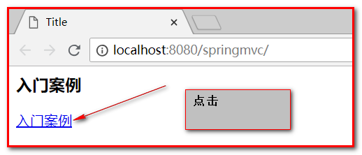
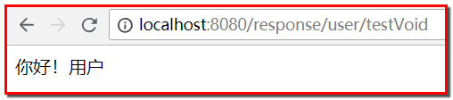
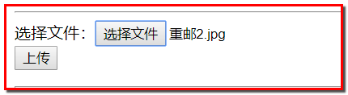

# SpringMVC
<!-- TOC -->

- [SpringMVC](#springmvc)
    - [1.SpringMVC基本概念](#1springmvc基本概念)
        - [1-1.三层架构(B/S)](#1-1三层架构bs)
        - [1-2.MVC模型](#1-2mvc模型)
        - [1-3.SpringMVC](#1-3springmvc)
        - [1-4.SpringMVC的优势](#1-4springmvc的优势)
        - [1-5.SpringMVC和Struts2的比较](#1-5springmvc和struts2的比较)
    - [2.SpringMVC quick start](#2springmvc-quick-start)
        - [2-1.开发准备](#2-1开发准备)
        - [2-2.quick start执行流程分析](#2-2quick-start执行流程分析)
        - [2-3.组件分析](#2-3组件分析)
        - [2-4.<mvc:annotation-driver>标签说明](#2-4mvcannotation-driver标签说明)
        - [2-5.@RequestMapping注解](#2-5requestmapping注解)
        - [2-6.请求参数的绑定](#2-6请求参数的绑定)
            - [2-6-1.请求参数的绑定说明](#2-6-1请求参数的绑定说明)
            - [2-6-2.字符串类型和基本数据类型](#2-6-2字符串类型和基本数据类型)
            - [2-6-3.实体类型(JavaBean)](#2-6-3实体类型javabean)
            - [2-6-4.请求参数中文乱码的解决](#2-6-4请求参数中文乱码的解决)
            - [2-6-5.集合属性数据封装](#2-6-5集合属性数据封装)
            - [2-6-6.自定义类型转换器](#2-6-6自定义类型转换器)
            - [2-6-7.在控制器中使用原生的ServletAPI对象](#2-6-7在控制器中使用原生的servletapi对象)
    - [3.SpringMVC常用注解](#3springmvc常用注解)
        - [3-1.@RequestParam注解](#3-1requestparam注解)
        - [3-2.@RequestBody注解](#3-2requestbody注解)
        - [3-3.@PathVariable注解](#3-3pathvariable注解)
            - [3-3-1.Rest风格的URL](#3-3-1rest风格的url)
            - [3-3-2.基于HiddentHttpMethodFilter的示例](#3-3-2基于hiddenthttpmethodfilter的示例)
        - [3-4.@RequestHeader注解(了解)](#3-4requestheader注解了解)
        - [3-5.@CookieValue注解](#3-5cookievalue注解)
        - [3-6.@ModelAttribute注解](#3-6modelattribute注解)
            - [3-6-1.基于POJO属性的基本使用](#3-6-1基于pojo属性的基本使用)
            - [3-6-2.基于Map的应用场景一：ModelAttribute修饰方法带返回值](#3-6-2基于map的应用场景一modelattribute修饰方法带返回值)
            - [3-6-3.基于Map的应用场景二：ModelAttribute修饰方法不带返回值](#3-6-3基于map的应用场景二modelattribute修饰方法不带返回值)
        - [3-7.4.7	@SessionAttribute注解](#3-747	sessionattribute注解)
    - [4.响应数据和结果视图](#4响应数据和结果视图)
        - [4-1.开发准备](#4-1开发准备)
        - [4-2.返回值类型](#4-2返回值类型)
            - [4-2-1.返回字符串](#4-2-1返回字符串)
            - [4-2-2.返回值是void](#4-2-2返回值是void)
            - [4-2-3.返回值是ModelAndView对象](#4-2-3返回值是modelandview对象)
        - [4-3.SpringMVC提供的转发和重定向](#4-3springmvc提供的转发和重定向)
            - [4-3-1.forward请求转发](#4-3-1forward请求转发)
            - [4-3-2.redirect重定向](#4-3-2redirect重定向)
        - [4-4.@ResponseBody响应Json数据](#4-4responsebody响应json数据)
            - [4-4-1.去掉对静态资源的拦截](#4-4-1去掉对静态资源的拦截)
            - [4-4-2.使用@ResquestBody获取请求的数据](#4-4-2使用resquestbody获取请求的数据)
            - [4-4-3.Jackson包的使用](#4-4-3jackson包的使用)
            - [4-4-4.使用@ResponseBody注解将JavaBean对象转换成Json返回](#4-4-4使用responsebody注解将javabean对象转换成json返回)
    - [5.SpringMVC实现文件上传](#5springmvc实现文件上传)
        - [5-1.文件上传说明](#5-1文件上传说明)
        - [5-2.文件上传的原理分析](#5-2文件上传的原理分析)
        - [5-3.借助第三方组件实现文件上传](#5-3借助第三方组件实现文件上传)
        - [5-4.SpringMVC传统文件的文件上传](#5-4springmvc传统文件的文件上传)
            - [5-4-1.普通文件上传](#5-4-1普通文件上传)
            - [5-4-2.SpringMVC传统方式文件上传](#5-4-2springmvc传统方式文件上传)
        - [5-5.SpringMVC跨服务器方式的文件上传](#5-5springmvc跨服务器方式的文件上传)
            - [5-5-1.分服务器的目的](#5-5-1分服务器的目的)
            - [5-5-2.准备两个Tomcat服务器](#5-5-2准备两个tomcat服务器)
            - [5-5-3.添加依赖](#5-5-3添加依赖)
            - [5-5-4.文件上传](#5-5-4文件上传)
    - [6.SpringMVC的异常处理](#6springmvc的异常处理)
        - [6-1.异常处理](#6-1异常处理)
        - [6-2.SpringMVC异常处理](#6-2springmvc异常处理)
            - [6-2-1.第一步：编写自定义异常类](#6-2-1第一步编写自定义异常类)
            - [6-2-2.第二步：编写异常处理器](#6-2-2第二步编写异常处理器)
            - [6-2-3.第三步：配置异常处理器(跳转到错误提示页面)](#6-2-3第三步配置异常处理器跳转到错误提示页面)
            - [6-2-4.第四步：修改ExceptionController.java](#6-2-4第四步修改exceptioncontrollerjava)
            - [6-2-5.第五步：指定error.jsp错误页面](#6-2-5第五步指定errorjsp错误页面)
    - [7.SpringMVC的拦截器](#7springmvc的拦截器)
        - [7-1.拦截器的作用](#7-1拦截器的作用)
        - [7-2.自定义拦截器](#7-2自定义拦截器)
            - [7-2-1.第一步：自定义拦截器](#7-2-1第一步自定义拦截器)
            - [7-2-2.第二步：配置拦截器](#7-2-2第二步配置拦截器)
            - [7-2-3.HandlerInterceptor接口中的方法](#7-2-3handlerinterceptor接口中的方法)
        - [7-3.配置多个拦截器](#7-3配置多个拦截器)

<!-- /TOC -->
## 1.SpringMVC基本概念
### 1-1.三层架构(B/S)
* 表现层：接收客户端请求，向客户端响应结果，依赖于service层
	* 展示层：展示结果，使用MVC设计模式
	* 控制层：接收请求
* 业务层：业务逻辑处理，业务层一般依赖于持久层
* 持久层：dao层，负责数据的持久化，和数据库交互，对数据库进行增删改查

### 1-2.MVC模型
MVC：Model-View-Controller，模型-视图-控制器，用于设计web表示层的模式
* Model：数据模型，封装数据
* View：jsp或者HTML，展示数据
* Controller：处理和用户的交互，接收请求，响应结果
### 1-3.SpringMVC
基于Java的实现MVC设计模型的请求驱动类型的轻量级web框架，Spring框架提供了构建web应用程序的全功能MVC模块。

### 1-4.SpringMVC的优势
* **前端控制器(DispatcherServlet)-核心**
* 处理器映射器(HandlerMapping)
* 处理器适配器(HandlerAdapter)
* 视图解析器(ViewResolver)
* 处理器或页面控制器(Controller)
### 1-5.SpringMVC和Struts2的比较
共同点：
* 都是表现层框架，都是基于MVC模型编写的
* 底层都是ServletAPI
* 处理请求的机制都是一个核心控制器
区别：
* SpringMVC的入口是Servlet，而Struts2是Filter
* SpringMVC是基于方法设计的，而Struts2是基于类的，Struts每次执行都会创建一个动作类，SpringMVC执行会比Struts2快一点。
## 2.SpringMVC quick start
### 2-1.开发准备
**第一步：创建maven的web工程，选择maven-archetype-webapp骨架**
项目名：springmvc_day01_quickStart

指定：解决项目中使用idea创建工程后，加载过慢的问题
* key：archetypeCatalog
* value: internal

**第二步：添加maven依赖**
```xml
<properties>
        <project.build.sourceEncoding>UTF-8</project.build.sourceEncoding>
        <maven.compiler.source>1.8</maven.compiler.source>
        <maven.compiler.target>1.8</maven.compiler.target>
        <spring.version>5.0.2.RELEASE</spring.version>
    </properties>

    <dependencies>
        <!--spring的jar包-->
        <dependency>
            <groupId>org.springframework</groupId>
            <artifactId>spring-context</artifactId>
            <version>${spring.version}</version>
        </dependency>
        <!--spring整合web的jar包（目的是，web容器启动，可以自动加载spring容器）-->
        <dependency>
            <groupId>org.springframework</groupId>
            <artifactId>spring-web</artifactId>
            <version>${spring.version}</version>
        </dependency>
        <!--springmvc的jar包-->
        <dependency>
            <groupId>org.springframework</groupId>
            <artifactId>spring-webmvc</artifactId>
            <version>${spring.version}</version>
        </dependency>
        <!--servlet的jar包-->
        <dependency>
            <groupId>javax.servlet</groupId>
            <artifactId>servlet-api</artifactId>
            <version>2.5</version>
            <scope>provided</scope>
        </dependency>

        <dependency>
            <groupId>javax.servlet.jsp</groupId>
            <artifactId>jsp-api</artifactId>
            <version>2.0</version>
            <scope>provided</scope>
        </dependency>
    </dependencies>
```
**第三步：配置web.xml**
在web.xml配置文件中配置SpringMVC的核心控制器DispatcherServlet
```xml
<!DOCTYPE web-app PUBLIC
        "-//Sun Microsystems, Inc.//DTD Web Application 2.3//EN"
        "http://java.sun.com/dtd/web-app_2_3.dtd" >

<web-app>
    <display-name>Archetype Created Web Application</display-name>

    <!--
        1:springmvc的核心（DispatcherServlet前端控制器）
        2:contextConfigLocation：加载springmvc的核心配置文件（spring的配置）
        3:<load-on-startup>1</load-on-startup>:web启动的时候加载springmvc.xml
    -->
    <servlet>
        <servlet-name>dispatcherServlet</servlet-name>
        <servlet-class>org.springframework.web.servlet.DispatcherServlet</servlet-class>
        <!-- 配置Servlet的初始化参数，读取springmvc的配置文件，创建spring容器 -->
        <init-param>
            <param-name>contextConfigLocation</param-name>
            <param-value>classpath:springmvc.xml</param-value>
        </init-param>
        <!-- 配置servlet启动时加载对象 -->
        <load-on-startup>1</load-on-startup>
    </servlet>
    <servlet-mapping>
        <servlet-name>dispatcherServlet</servlet-name>
        <url-pattern>/</url-pattern>
    </servlet-mapping>
    <!--添加处理乱码的过滤器-->
    <filter>
        <filter-name>CharacterEncodingFilter</filter-name>
        <filter-class>org.springframework.web.filter.CharacterEncodingFilter</filter-class>
        <init-param>
            <param-name>encoding</param-name>
            <param-value>UTF-8</param-value>
        </init-param>
    </filter>
    <filter-mapping>
        <filter-name>CharacterEncodingFilter</filter-name>
        <url-pattern>/*</url-pattern>
    </filter-mapping>

    <!--使得浏览器支持 GET、POST、PUT 与DELETE 请求-->
    <filter>
        <filter-name>hiddenHttpMethodFilter</filter-name>
        <filter-class>org.springframework.web.filter.HiddenHttpMethodFilter</filter-class>
    </filter>
    <filter-mapping>
        <filter-name>hiddenHttpMethodFilter</filter-name>
        <url-pattern>/*</url-pattern>
    </filter-mapping>
</web-app>
```
**第四步：在resources目录下创建springmvc.xml文件**
```xml
<?xml version="1.0" encoding="UTF-8"?>
<beans xmlns="http://www.springframework.org/schema/beans"
       xmlns:mvc="http://www.springframework.org/schema/mvc"
       xmlns:context="http://www.springframework.org/schema/context"
       xmlns:xsi="http://www.w3.org/2001/XMLSchema-instance"
       xsi:schemaLocation="
        http://www.springframework.org/schema/beans
        http://www.springframework.org/schema/beans/spring-beans.xsd
        http://www.springframework.org/schema/mvc
        http://www.springframework.org/schema/mvc/spring-mvc.xsd
        http://www.springframework.org/schema/context
        http://www.springframework.org/schema/context/spring-context.xsd">
    <!--1：将springmvc的Controller类交给spring去创建，使用组件的扫描-->
    <context:component-scan base-package="com.itheima"></context:component-scan>

    <!-- 配置视图解析器 -->
    <bean id="viewResolver" class="org.springframework.web.servlet.view.InternalResourceViewResolver">
        <property name="prefix" value="/WEB-INF/pages/"></property>
        <property name="suffix" value=".jsp"></property>
    </bean>

    <!--3：配置spring的注解驱动，自动配置处理器映射器、配置处理器适配器-->
    <mvc:annotation-driven conversion-service="conversionServiceFactoryBean"></mvc:annotation-driven>

    <!--第二步：执行类型转换器-->
    <bean id="conversionServiceFactoryBean" class="org.springframework.context.support.ConversionServiceFactoryBean">
        <property name="converters">
            <set>
                <bean class="com.itheima.converter.StringToDateConverter"></bean>
            </set>
        </property>
    </bean>
</beans>
```
**第五步：创建index.jsp**
```jsp
<%@ page contentType="text/html;charset=UTF-8" language="java" %>
<html>
<head>
    <title>Title</title>
</head>
<body>
<h3>入门案例</h3>
<a href="hello">入门案例</a>
</body>
</html>
```
**第六步：创建包com.jack.controller，创建类HelloController**
```java
/**
 * @author jackli
 * 控制器
 */
@Controller
@RequestMapping(path = "/user")
public class HelloController {

    /**
     * @RequestMapping
     *  建立请求url和请求处理方法之间的关系
     *  属性：
     *      path：指定请求的url和value作用一致
     *      value：见上
     *      method：用于指定请求的方式
     *      params：用于指定限制请求参数的条件。它支持简单的表达式。要求请求参数的key和value必须和配置的一模一样
     *      headers：用于指定限制请求消息头的条件。
     * @return
     */
    @RequestMapping(path = "/hello")
    public String sayHello() {
        System.out.println("sayHello方法执行了...");
        return "success"; // 响应结果
    }
}
```
**第七步：在WEB-INF下创建pages的文件夹，创建success.jsp**
```jsp
<%@ page contentType="text/html;charset=UTF-8" language="java" %>
<html>
<head>
    <title>success</title>
</head>
<body>
<h3>访问成功！</h3>
</body>
</html>
```
**第八步：部署tomcat，测试程序**
部署tomcat


测试程序




### 2-2.quick start执行流程分析
* 启动tomcat服务器，因为配置了load-on-startup标签，所以会创建DispatcherServlet对象，就会加载springmvc配置文件
* 开启了注解扫描，由于配置了@Controller，那么HelloController对象就会被创建
* 从index.jsp发送请求，请求会先到达DispatcherServlet核心控制器，根据配置@RequestMapping注解找到执行的具体方法
* 根据执行方法的返回值，再根据配置的视图解析器，去指定目录下查找指定名称的jsp文件
* tomcat服务器渲染页面，作出响应


### 2-3.组件分析
* **前端控制器(DispatcherServlet)**
用户请求到达前端控制器，它相当于mvc模式中的c，DispatcherServlet是整个流程控制的中心，由它调用其他组件处理用户请求，降低了组件之间的耦合性
* **处理器映射器(HandlerMapping)**
负责根据用户请求找到Handler即处理器
包含两部分：
  * 处理器：Handler
  * HandlerInterceptor(拦截器)的集合
* ** 处理器适配器(HandlerAdapter)**
通过HandlerAdapter对处理器进行执行(适配器模式的应用)，对Handler进行包装，不同请求查找对应controller中处理的方法
* **处理器(Handler)**
具体业务控制器，@Controller，DispatcherServlet把用户请求转发到Handler，由Handler对具体的用户请求进行处理
* **视图解析器(View Resolver)**
View Resovler负责将结果生成view视图，View Resolver首先根据逻辑视图名解析成物理视图名即具体的页面地址，再生成View视图对象，最后对View进行渲染将处理结果通过页面展示给用户
* **视图(View)**
将模型数据通过页面展示给用户，springmvc提供了视图类型的支持，jsp、freemarkerView、jstlView等等
### 2-4.<mvc:annotation-driver>标签说明
SpringMVC的三大组件：
* 处理器映射器
* 处理器适配器
* 视图解析器
使用**<mvc:annotation-driver>**自动加载RequestMappingHandlerMapping(处理器映射器)和RequestMappingHandlerAdapter(处理器适配器)，替代注解处理器和适配器的配置
```xml
<!--配置Spring开启注解mvc的支持-->
<mvc:annotation-driver></mvc:annotation-driver>
```
```xml
<!-- 上面的标签相当于 替代如下配置-->
<!-- Begin -->
<!-- HandlerMapping -->
<bean class="org.springframework.web.servlet.mvc.method.annotation.RequestMappingHandlerMapping"></bean>
<bean class="org.springframework.web.servlet.handler.BeanNameUrlHandlerMapping"></bean>
<!-- HandlerAdapter -->
<bean class="org.springframework.web.servlet.mvc.method.annotation.RequestMappingHandlerAdapter"></bean>
<bean class="org.springframework.web.servlet.mvc.HttpRequestHandlerAdapter"></bean>
<bean class="org.springframework.web.servlet.mvc.SimpleControllerHandlerAdapter"></bean>
<!-- HadnlerExceptionResolvers -->
<bean class="org.springframework.web.servlet.mvc.method.annotation.ExceptionHandlerExceptionResolver"></bean>
<bean class="org.springframework.web.servlet.mvc.annotation.ResponseStatusExceptionResolver"></bean>
<bean class="org.springframework.web.servlet.mvc.support.DefaultHandlerExceptionResolver"></bean>
<!-- End -->
```
### 2-5.@RequestMapping注解
作用：建立请求url和请求处理方法之间的关系
属性：
  * path：指定请求的url和value作用一致
  * value：见上
  * method：用于指定请求的方式
  * params：用于指定限制请求参数的条件。它支持简单的表达式。要求请求参数的key和value必须和配置的一模一样
  * headers：用于指定限制请求消息头的条件。
源码：
```java
// 写在方法和类上
@Target({ElementType.METHOD, ElementType.TYPE})
@Retention(RetentionPolicy.RUNTIME)
@Documented
@Mapping
public @interface RequestMapping {
    String name() default "";
	// path和value作用一样
    @AliasFor("path")
    String[] value() default {};

    @AliasFor("value")
    String[] path() default {};

    RequestMethod[] method() default {};

    String[] params() default {};

    String[] headers() default {};

    String[] consumes() default {};

    String[] produces() default {};
}

```
修改HelloController.java
```java
/**
 * @author jackli
 */
@Controller
@RequestMapping(path = "/user")//请求url的第一级访问目录
public class HelloController {

    @RequestMapping(path = "/hello")
    public String sayHello() {
        System.out.println("sayHello方法执行了...");
        return "success";
    }
	//请求url的第二级访问目录
    @RequestMapping(path = "/testRequestMapping", method = {RequestMethod.GET},
            params = {"username=jack"}, headers = {"accept"})
    public String testRequestMapping() {
        System.out.println("testRequestMapping方法执行了...");
        return "success";
    }
}
```
method = {RequestMethod.GET},params = {"username=jack"}, headers = {"accept"}参数的设置表示：
  * 必须是GET请求
  * 必须有username=jack的参数
  * 请求头必须包含accept的属性

### 2-6.请求参数的绑定
#### 2-6-1.请求参数的绑定说明
a.绑定机制
* 表单提交的数据都是k=v格式的 username=haha&password=123
* SpringMVC的参数绑定过程是把表单提交的请求参数，作为控制器中方法的参数进行绑定的
* 要求：提交表单的name和参数的名称是相同的
b.支持的数据类型
* 基本数据类型和字符串类型
* 实体类型（JavaBean)
* 集合数据类型（List、map集合等）
#### 2-6-2.字符串类型和基本数据类型
* 提交表单的name和参数的名称必须相同
* 区分大小写
**第一步：创建param.jsp**
```jsp
<body>
<h3>传递参数</h3>
<a href="param/testParam?username=张三&age=18">入门案例</a>
</body>
```
**第二步：创建ParamController.java**
```java
@Controller
@RequestMapping(path = "/param")
public class ParamController {

    // 请求参数
    @RequestMapping(path = "/testParam")
    public String testParam(String username,Integer age){
        System.out.println("params测试：username:"+username+"   age:"+age);
        return "success";// 响应结果
    }
}
```
#### 2-6-3.实体类型(JavaBean)
* 提交表单的name和JavaBean中的属性名称需要一致
* 如果一个JavaBean类中包含其他的引用类型，那么表单的name属性需要编写成：对象.属性 例如：address.name
**第一步：创建com.jack.domain，创建User.java**
```java
/**
 * @author jackli
 */
public class User {

    private String username;
    private int age;
	// ...
}
```
**第二步：创建Account.java**
```java
/**
 * @author jackli
 */
public class Account {
    private String name;
    private String password;
    private Double money;
    private User user;
    // ...
}
```
**第三步：param.jsp**
```jsp
<form action="param/saveAccount" method="post">
    账号：<input type="text" name="name"/><br>
    密码：<input type="password" name="password"/><br>
    金额：<input type="text" name="money"/><br>
    用户姓名：<input type="text" name="user.username"/><br>
    用户年龄：<input type="text" name="user.age"/><br>
    <input type="submit" value="提交"/>
</form>
```
**第四步：ParamController.java**
```java
@RequestMapping(value = "/saveAccount", method = RequestMethod.POST)
public String saveAccount(Account account) {
	System.out.println("获取的account：" + account);
	return "success";
}
```
#### 2-6-4.请求参数中文乱码的解决
在web.xml中配置Spring提供的过滤器
```xml
<!--解决请求参数乱码问题-->
<filter>
  <filter-name>characterEncodingFilter</filter-name>
  <filter-class>org.springframework.web.filter.CharacterEncodingFilter</filter-class>
  <init-param>
    <param-name>encoding</param-name>
    <param-value>UTF-8</param-value>
  </init-param>
</filter>
<filter-mapping>
  <filter-name>characterEncodingFilter</filter-name>
  <url-pattern>/*</url-pattern>
</filter-mapping>
```
#### 2-6-5.集合属性数据封装
* JSP页面编写方式：**list[0].属性**
* JSP页面编写方式：**map['one'].属性**
**第一步：param.jsp**
```jsp
<form action="param/saveAccount" method="post">
    账号：<input type="text" name="name"/><br>
    密码：<input type="text" name="password"/><br>
    金额：<input type="text" name="money"/><br>
    用户姓名：<input type="text" name="user.username"/><br>
    用户年龄：<input type="text" name="user.age"/><br>

    用户姓名（list)：<input type="text" name="list[0].username"/><br>
    用户年龄（list)：<input type="text" name="list[0].age"/><br>
    用户姓名（list)：<input type="text" name="list[1].username"/><br>
    用户年龄（list)：<input type="text" name="list[1].age"/><br>

    用户姓名（map)：<input type="text" name="map['one'].username"/><br>
    用户年龄（map)：<input type="text" name="map['one'].age"/><br>
    用户姓名（map)：<input type="text" name="map['two'].username"/><br>
    用户年龄（map)：<input type="text" name="map['two'].age"/><br>
    <input type="submit" value="提交"/>
</form>
```
**第二步：在Account.java中添加**
```java
private List<User> list;
private Map<String,User> map;
```
#### 2-6-6.自定义类型转换器
* 表单提交的任何数据类型全部都是字符串类型，但是后台定义Integer类型，数据也可以封装上，说明SpringMVC框架内部会默认进行数据类型转换。
* 如果想自定义数据类型转换，可以**实现Converter的接口**
**第一步：在User.java中添加**
```java
public class User {
    private String username;
    private Integer age;
    private Date birthday;
}
```
**第二步：param.jsp**
```jsp
<form action="param/saveUser" method="post">
    姓名：<input type="text" name="username"/><br>
    年龄：<input type="text" name="age"/><br>
    生日：<input type="text" name="birthday"/><br>
    <input type="submit" value="提交"/>
</form>
```
**第三步：ParamController.java**
```java
@RequestMapping(value = "/saveUser", method = RequestMethod.POST)
public String saveUser(User user) {
	System.out.println("获取的user：" + user);
	return "success";
}
```
测试发现：默认支持的日期格式是2017/5/15，如果输入2017-5-15，则会报错
**1.自定义类型转换器**
建一个com.jack.util，创建StringToDataConverter.java
```java
/**
 * @author jackli
 * 把字符串转换成日期的转换器
 */
public class StringToDateConverter implements Converter<String, Date> {
	/**
	 * 进行类型转换的方法
	 */
    @Override
    public Date convert(String s) {
        if (s == null) {
            throw new RuntimeException("参数不能为空");
        }
        SimpleDateFormat sdf = new SimpleDateFormat("yyyy-MM-dd");
        Date time = null;
        try {
            time = sdf.parse(s);
        } catch (ParseException e) {
            throw new RuntimeException("类型转换错误");
        }
        return time;
    }
}
```
**2.注册自定义类型转换器，在springmvc.xml配置文件中配置**
```xml
<!-- 注册自定义类型转换器 -->
<bean id="conversionService" class="org.springframework.context.support.ConversionServiceFactoryBean">
    <property name="converters">
        <set>
            <bean class="com.jack.util.StringToDateConverter"></bean>
        </set>
    </property>
</bean>

<!-- 配置spring开启注解mvc的支持 -->
<mvc:annotation-driven conversion-service="conversionService"></mvc:annotation-driven>
```
测试：输入日期2017-5-15，没问题
#### 2-6-7.在控制器中使用原生的ServletAPI对象
**只需要在控制器的方法参数定义HttpServletRequest和HttpServletResponse对象**
**第一步：param.jsp**
```jsp
<a href="param/testServlet">测试ServletAPI</a>
```
**第二步：ParamController.java**
```java
@RequestMapping(value = "/testServlet", method = RequestMethod.GET)
public String testServlet(HttpServletRequest request, HttpServletResponse response) {
    System.out.println("request:" + request);
    System.out.println("session:" + request.getSession());
    System.out.println("application:" + request.getSession().getServletContext());
    System.out.println("response:"+response);
    return "success";
}
```
## 3.SpringMVC常用注解
### 3-1.@RequestParam注解
作用：**把请求中指定名称的参数给控制器中的形参赋值。**
属性：
* value：请求参数中的名称。 
* required：请求参数中是否必须提供此参数。默认值：true。表示必须提供，如果不提供将报错。 
* defaultValue：表示默认值，如果不传递值
**第一步：创建anno.jsp**
```jsp
<body>
<h3>RequestParam入门案例</h3>
<a href="anno/testRequestParam?name=杰克&age=22">RequestParam</a>
</body>
```
**第二步：创建AnnoController.java**
```java
/**
 * @author jackli
 */
@Controller
@RequestMapping("/anno")
public class AnnoController {

    /**
     * @RequestParam：把请求中指定名称的参数给控制器中的形参赋值
     *  value：请求参数中的名称。
     *  required：请求参数中是否必须提供此参数。默认值：true。表示必须提供，如果不提供将报错。
     *  defaultValue：表示默认值，如果不传递值
     * @param username
     * @param age
     * @return
     */
    @RequestMapping(path = "testRequestParam")
    public String testRequestParam(@RequestParam(value = "name", required = false) String username,
                                   @RequestParam(value = "age") int age) {
        System.out.println("testRequestParam方法执行了...");
        System.out.println("username：" + username + "，age：" + age);
        return "success";
    }
}
```
### 3-2.@RequestBody注解
作用：**用于获取请求体内容。直接使用得到是key=value&key=value...结构的数据。 get请求方式不适用**
属性：
* required：是否必须有请求体。默认值是: true
    * 当取值为true时,get请求方式会报错。
    * 如果取值为false，get请求得到是null。
**第一步：anno.jsp**
```jsp
<h3>@RequestBody</h3>
post请求jsp代码： <br>
<!-- request body注解 -->
<form action="anno/testRequestBody" method="post">
    用户名称：<input type="text" name="username" ><br/>
    用户密码：<input type="password" name="password" ><br/>
    用户年龄：<input type="text" name="age" ><br/>
    <input type="submit" value="保存">
</form>
get请求jsp代码： <br>
<a href="anno/testRequestBody?body=test">requestBody注解get请求</a>
```
**第二步：AnnoController.java**
```java
/**
 * @RequestBody:
 *  用于获取请求体内容。直接使用得到是key=value&key=value...结构的数据。 get请求方式不适用。
 *  属性：
 *      required：是否必须有请求体。默认值是:true。
 *      当取值为true时, get请求方式会报错。
 *      如果取值为false，get请求得到是null。
 * @param body
 * @return
 */
@RequestMapping(path = "/testRequestBody")
public String testRequestBody(@RequestBody(required = false) String body) {
    System.out.println("testRequestBody方法执行了...");
    System.out.println(body);
    return "success";
}
```
**注意：当输入中文时后台接收有乱码问题，处理请求乱码的过滤器好像并没有起作用？**
### 3-3.@PathVariable注解
作用：**用于绑定url中的占位符。例如：请求url中 /delete/{id}/{name}，这个{id},{name}就是url占位符。 url支持占位符是spring3.0之后加入的。是springmvc支持restful风格URL的一个重要标志。 **
属性：
	* value：用于指定url中占位符名称。 
	* required：是否必须提供占位符。
**第一步：anno.jsp**
```jsp
<h3>@PathVariable注解</h3>
<!-- PathVariable注解 -->
<a href="anno/testPathVariable/100">pathVariable注解</a>
```
**第二步：AnnoController.java**
```java
@RequestMapping("/testPathVariable/{uid}")
public String testPathVariable(@PathVariable(value = "uid") Integer id) {
    System.out.println("testPathVariable方法执行了...");
    System.out.println(id);
    return "success";
}
```
#### 3-3-1.Rest风格的URL
REST（英文：Representational State Transfer，简称REST，说的意思是：表现层状态转变，或者叫做 “表述性状态转移”）描述了一个架构样式的网络系统。
REST并没有一个明确的标准，而更像是一种设计的风格。
优点：
* 它结构清晰、符合标准、易于理解、扩展方便
特性：
* **资源（Resources**：一段文本、一张图片、一首歌曲、一种服务，可以用一个URI（统一资源定位符）指向它，每种资源对应一个特定的 URI 。**要获取这个资源，访问它的URI就可以，因此 URI 即为每一个资源的独一无二的识别符。**
* **表现层（Representation）**：把资源具体呈现出来，txt、HTML、xml、json、二进制等等
* ** 状态转化（State Transfer）**：每发出一个请求，就代表了客户端和服务器的一次交互过程。
四个表示操作方式的动词：**GET、POST、PUT、DELETE**。它们分别对应四种基本操作：**GET 用来获取资源，POST 用来新建资源，PUT 用来更新资源，DELETE 用来删除资源。 **
```txt
/account HTTP协议 GET ： 查询所有 account 
/account/1 HTTP协议 GET ： 得到 id = 1 的 account 
/account/1 HTTP协议 DELETE： 删除 id = 1的 account 
/account HTTP协议 PUT： 更新id = 1的 account 
/account HTTP协议 POST： 新增 account 
```
#### 3-3-2.基于HiddentHttpMethodFilter的示例
Spring3.0添加的一个过滤器：**让浏览器支持GET、POST、PUT、DELETE请求。**
**第一步：在web.xml配置该过滤器**
```xml
<!--
  使浏览器支持 GET、POST、PUT 与DELETE 请求。
  第一步：在web.xml中配置该过滤器。
  第二步：请求方式必须使用post请求。
  第三步：按照要求提供_method请求参数，该参数的取值就是我们需要的请求方式。
 -->
<filter>
  <filter-name>hiddenHttpMethodFilter</filter-name>
  <filter-class>org.springframework.web.filter.HiddenHttpMethodFilter</filter-class>
</filter>
<filter-mapping>
  <filter-name>hiddenHttpMethodFilter</filter-name>
  <url-pattern>/*</url-pattern>
</filter-mapping>
```
**第二步：请求方式必须使用POST请求**
**第三步: 按照要求提供"_method"请求参数，该参数的取值就是我们需要的请求方式**
源码分析


**第四步：anno.jsp**
```xml
jsp中示例代码：
<!-- 保存 -->
<form action="anno/testPathVariable" method="post">
    用户名称：<input type="text" name="username"><br/>
    <input type="hidden" name="_method" value="POST">
    <input type="submit" value="保存"></form>
<hr/>
<!-- 更新 -->
<form action="anno/testPathVariable" method="post">
    用户名称：<input type="text" name="username"><br/>
    <input type="hidden" name="_method" value="PUT">
    <input type="submit" value="更新">
</form>
<hr/>
<!-- 删除 -->
<form action="anno/testPathVariable/1" method="post">
    <input type="hidden" name="_method" value="DELETE">
    <input type="submit" value="删除">
</form>
<hr/>
<!-- 查询一个 -->
<form action="anno/testPathVariable/1" method="post">
    <input type="hidden" name="_method" value="GET">
    <input type="submit" value="查询">
</form>
```
**第五步：AnnoController.java**
```java
@RequestMapping(value = "/testPathVariable", method = RequestMethod.POST)
public String save(User user) {
    System.out.println("save方法执行了...");
    System.out.println(user);
    return "success";
}

@RequestMapping(value = "/testPathVariable", method = RequestMethod.PUT)
public String update(User user) {
    System.out.println("update方法执行了...");
    System.out.println(user);
    return "success";
}

@RequestMapping(value = "/testPathVariable/{uid}", method = RequestMethod.DELETE)
public String delete(@PathVariable(value = "uid") Integer id) {
    System.out.println("delete方法执行了...");
    System.out.println(id);
    return "success";
}

@RequestMapping(value = "/testPathVariable/{uid}", method = RequestMethod.GET)
public String findById(@PathVariable(value = "uid") Integer id) {
    System.out.println("findById方法执行了...");
    System.out.println(id);
    return "success";
}
```
如果PUT请求和DELETE请求响应的时候报错，但是我们可以在控制台看到结果，说明执行了对应的方法，但是在响应到页面的时候，页面不支持PUT和DELETE请求的响应，所以抛出异常，我们可以使用**@ResponseBody表示不再响应页面**，即**视图解析器将失效，以文本的形式返回**，用在ajax的应用场景（返回文本或者json）
```java
@RequestMapping(value = "/testPathVariable", method = RequestMethod.PUT)
public @ResponseBody  String update(User user) {
    System.out.println("update方法执行了...");
    System.out.println(user);
    return "success";
}

@RequestMapping(value = "/testPathVariable/{uid}", method = RequestMethod.DELETE)
public @ResponseBody String delete(@PathVariable(value = "uid") Integer id) {
    System.out.println("delete方法执行了...");
    System.out.println(id);
    return "success";
}
```
### 3-4.@RequestHeader注解(了解)
作用：**用于获取请求头信息**
属性：
* value：提供消息头名称 
* required：是否必须有此消息头
**第一步：anno.jsp**
```jsp
<h3>测试@RequestHeader注解</h3>
<!-- RequestHeader注解 --> 
<a href="anno/testRequestHeader">获取请求消息头</a>
```
**第二步：AnnoController.java**
```java
@RequestMapping(path = "/testRequestHeader")
public String testRequestHeader(@RequestHeader(value = "accept") String requestHeader) {
    System.out.println("testRequestHeader方法执行了...");
    System.out.println(requestHeader);
    return "success";
}
```
**第三步：测试**

### 3-5.@CookieValue注解
作用：**用于把指定cookie名称的值传入控制器方法参数。**
属性：
* value：指定cookie的名称。
* required：是否必须有此cookie。 
**第一步：anno.jsp**
```jsp
<h3>测试@CookieValue注解</h3>
<!-- CookieValue注解 -->
<a href="anno/testCookieValue">CookieValue注解</a>
```
**第二步：AnnoController.java**
```java
@RequestMapping(path = "/testCookieValue")
public String testCookieValue(@CookieValue(value = "JSESSIONID") String cookieValue) {
    System.out.println("testCookieValue方法执行了...");
    System.out.println(cookieValue);
    return "success";
}
```
**第三步：测试**

### 3-6.@ModelAttribute注解
作用：**SpringMVC4.3版本以后新加入的。它可以用于修饰方法和参数。**
* 出现在方法上，表示**当前方法会在控制器的方法执行之前，先执行**。它可以修饰没有返回值的方法，也可以修饰有具体返回值的方法。 
* 出现在参数上，获取指定的数据给参数赋值。 
属性：**value：用于获取数据的key。key可以是POJO的属性名称，也可以是map结构的key。 **
应用场景：**表单提交数据不是完整的实体类数据时，保证没有提交数据的字段使用数据库对象原来的数据。**
例如：我们在编辑一个用户时，用户有一个创建信息字段，该字段的值是不允许被修改的。在提交表单数据是肯定没有此字段的内容，一旦更新会把该字段内容置为null，此时就可以使用此注解解决问题。 

#### 3-6-1.基于POJO属性的基本使用
**第一步：anno.jsp**
```jsp
<h3>测试@ModelAttribute注解</h3>
需求： 修改用户信息，要求用户的日期不能修改 jsp的代码： 
<!-- 修改用户信息 --> 
<form action="anno/testModelAttribute" method="post"> 
    用户名称：<input type="text" name="username" ><br/> 
    用户年龄：<input type="text" name="age" ><br/> 
    <input type="submit" value="保存"> 
</form>
```
**第二步：AnnoController.java**
```java
@ModelAttribute // 在testModelAttribute()方法之前运行
public void showModel(User user) {
    // 模拟去数据库查询
    System.out.println("showModel方法执行了...");
}
@RequestMapping(path = "testModelAttribute")
public String testModelAttribute(User user) {
    System.out.println("testModelAttribute方法执行了...");
    System.out.println(user);
    return "success";
}
```

#### 3-6-2.基于Map的应用场景一：ModelAttribute修饰方法带返回值 
**第一步：anno.jsp**
```jsp
<h3>测试@ModelAttribute注解</h3>
需求： 修改用户信息，要求用户的日期不能修改 jsp的代码： 
<!-- 修改用户信息 --> 
<form action="anno/testModelAttribute" method="post"> 
    用户名称：<input type="text" name="username" ><br/> 
    用户年龄：<input type="text" name="age" ><br/> 
    <input type="submit" value="保存"> 
</form>
```
**第二步：AnnoController.java**
```java
@ModelAttribute // 在执行的方法之前运行
public User showModel(String username) {
    // 模拟去数据库查询
    User user = findUserByName(username);
    System.out.println("showModel方法执行了..."+user);
    return user;
}
@RequestMapping(path = "/testModelAttribute")
public String testModelAttribute(@ModelAttribute(value = "user") User user) {
    System.out.println("testModelAttribute方法执行了...");
    System.out.println(user);
    return "success";
}

private User findUserByName(String username) {
    User user = new User();
    user.setUsername(username);
    user.setAge(36);
    user.setBirthday(new Date());
    return user;
}
```
**第三步：测试**

#### 3-6-3.基于Map的应用场景二：ModelAttribute修饰方法不带返回值
**第一步：anno.jsp**
```jsp
<h3>测试@ModelAttribute注解</h3>
需求： 修改用户信息，要求用户的日期不能修改 jsp的代码： 
<!-- 修改用户信息 --> 
<form action="anno/testModelAttribute" method="post"> 
    用户名称：<input type="text" name="username" ><br/> 
    用户年龄：<input type="text" name="age" ><br/> 
    <input type="submit" value="保存"> 
</form>
```
**第二步：AnnoController.java**
```java
@ModelAttribute // 在执行的方法之前运行
public User showModel(String username, Map<String, User> map) {
    // 模拟去数据库查询
    System.out.println("showModel方法执行了...");
    User user = findUserByName(username);
    map.put("user", user);
    System.out.println(user);
    return user;
}

@RequestMapping(path = "/testModelAttribute")
public String testModelAttribute(@ModelAttribute(value = "user") User user) {
    System.out.println("testModelAttribute方法执行了...");
    System.out.println(user);
    return "success";
}

private User findUserByName(String username) {
    User user = new User();
    user.setUsername(username);
    user.setAge(36);
    user.setBirthday(new Date());
    return user;
}
```
**第三步：测试**

### 3-7.4.7	@SessionAttribute注解
作用：**用于多次执行控制器方法间的参数共享。 放置到类的上面。**
属性：
* value：用于指定存入的属性名称 
* type：用于指定存入的数据类型。 
**相当于将数据存放到Session中。**
**第一步：anno.jsp**
```jsp
<h3>测试@SessionAttribute注解</h3>
<!-- SessionAttribute注解的使用 -->
<a href="anno/sessionAttributePut">存入SessionAttribute</a> <hr/>
<a href="anno/sessionAttributeGet">取出SessionAttribute</a> <hr/>
<a href="anno/sessionAttributeClean">清除SessionAttribute</a>
```
**第二步：AnnoController.java**
```java
// 存放session
@RequestMapping(path = "/sessionAttributePut")
public String sessionAttributePut(Model model) {
    System.out.println("存放");
    // model是一个map结构，默认放置到request域中
    model.addAttribute("username", "张三");
    model.addAttribute("password", "123");
    model.addAttribute("age", 22);
    return "success";
}

// 获取session
@RequestMapping(path = "/sessionAttributeGet")
public String sessionAttributeGet(ModelMap modelMap) {
    System.out.println("获取");
    System.out.println("username:" + modelMap.get("username"));
    System.out.println("password:" + modelMap.get("password"));
    System.out.println("age:" + modelMap.get("age"));
    return "success";
}

// 清空session
@RequestMapping(path = "/sessionAttributeClean")
public String sessionAttributeClean(SessionStatus sessionStatus) {
    System.out.println("清空");
    sessionStatus.setComplete();
    return "success";
}
```
**第三步：测试**

## 4.响应数据和结果视图
### 4-1.开发准备
**第一步：创建web工程**

项目名：springmvc_day02_response

指定：
* Key：archetypeCatalog
* Value：internal
**解决web项目使用idea创建工程后，加载过慢的问题。**

**第二步：添加依赖**
```xml
<!-- 版本锁定 -->
<properties>
  <project.build.sourceEncoding>UTF-8</project.build.sourceEncoding>
  <maven.compiler.source>1.8</maven.compiler.source>
  <maven.compiler.target>1.8</maven.compiler.target>
  <spring.version>5.0.2.RELEASE</spring.version>
</properties>

<dependencies>
  <dependency>
    <groupId>org.springframework</groupId>
    <artifactId>spring-context</artifactId>
    <version>${spring.version}</version>
  </dependency>

  <dependency>
    <groupId>org.springframework</groupId>
    <artifactId>spring-web</artifactId>
    <version>${spring.version}</version>
  </dependency>

  <dependency>
    <groupId>org.springframework</groupId>
    <artifactId>spring-webmvc</artifactId>
    <version>${spring.version}</version>
  </dependency>

  <dependency>
    <groupId>javax.servlet</groupId>
    <artifactId>servlet-api</artifactId>
    <version>2.5</version>
    <scope>provided</scope>
  </dependency>

  <dependency>
    <groupId>javax.servlet.jsp</groupId>
    <artifactId>jsp-api</artifactId>
    <version>2.0</version>
    <scope>provided</scope>
  </dependency>
</dependencies>
```
**第三步：配置web.xml**
**在web.xml配置文件中配置核心控制器DispatcherServlet**
```xml
<!--配置SpringMVC核心控制器-->
<!--
     1:springmvc的核心（DispatcherServlet前端控制器）
     2:contextConfigLocation：加载springmvc的核心配置文件（spring的配置）
     3:<load-on-startup>1</load-on-startup>:web启动的时候加载springmvc.xml
 -->
<servlet>
  <servlet-name>dispatcherServlet</servlet-name>
  <servlet-class>org.springframework.web.servlet.DispatcherServlet</servlet-class>
  <!--配置Servlet的初始化参数，读取SpringMVC的配置文件，创建spring容器-->
  <init-param>
    <param-name>contextConfigLocation</param-name>
    <param-value>classpath:springmvc.xml</param-value>
  </init-param>
  <!--配置Servlet启动时加载对象-->
  <load-on-startup>1</load-on-startup>
</servlet>
<servlet-mapping>
  <servlet-name>dispatcherServlet</servlet-name>
  <url-pattern>/</url-pattern>
</servlet-mapping>
```
**在web.xml中配置处理乱码的过滤器**
```xml
<!--解决请求参数乱码问题-->
  <filter>
    <filter-name>characterEncodingFilter</filter-name>
    <filter-class>org.springframework.web.filter.CharacterEncodingFilter</filter-class>
    <init-param>
      <param-name>encoding</param-name>
      <param-value>UTF-8</param-value>
    </init-param>
  </filter>
  <filter-mapping>
    <filter-name>characterEncodingFilter</filter-name>
    <url-pattern>/*</url-pattern>
  </filter-mapping>
```
**第四步：配置springmvc.xml**
在resources目录下创建springmvc.xml文件
```xml
<?xml version="1.0" encoding="UTF-8"?>
<beans xmlns="http://www.springframework.org/schema/beans"
       xmlns:mvc="http://www.springframework.org/schema/mvc"
       xmlns:context="http://www.springframework.org/schema/context"
       xmlns:xsi="http://www.w3.org/2001/XMLSchema-instance"
       xsi:schemaLocation="
        http://www.springframework.org/schema/beans
        http://www.springframework.org/schema/beans/spring-beans.xsd
        http://www.springframework.org/schema/mvc
        http://www.springframework.org/schema/mvc/spring-mvc.xsd
        http://www.springframework.org/schema/context
        http://www.springframework.org/schema/context/spring-context.xsd">
    <!--配置Spring容器创建对象时要扫描的包-->
    <context:component-scan base-package="com.jack"></context:component-scan>
    <!--配置Spring开启注解mvc的支持-->
    <mvc:annotation-driven></mvc:annotation-driven>

    <!--配置视图解析器-->
    <bean id="viewResolver" class="org.springframework.web.servlet.view.InternalResourceViewResolver">
        <property name="prefix" value="/WEB-INF/pages/"></property>
        <property name="suffix" value=".jsp"></property>
    </bean>
</beans>
```
**第五步：创建index.jsp**
```jsp
<%@ page contentType="text/html;charset=UTF-8" language="java" %>
<html>
<head>
    <title>index</title>
</head>
<body>

</body>
</html>
```
**第六步：在WEB-INF目录下创建pages的文件夹，创建success.jsp**
```jsp
<%@ page contentType="text/html;charset=UTF-8" language="java" %>
<html>
<head>
    <title>success</title>
</head>
<body>
<h2 style="color: green;">访问成功</h2>
</body>
</html>
```
**第七步：创建com.jack.domain，创建User.java**
```java
/**
 * @author jackli
 */
@Component
public class User {

    private String username;
    private String password;
    private int age;


    public String getUsername() {
        return username;
    }

    public void setUsername(String username) {
        this.username = username;
    }

    public String getPassword() {
        return password;
    }

    public void setPassword(String password) {
        this.password = password;
    }

    public int getAge() {
        return age;
    }

    public void setAge(int age) {
        this.age = age;
    }

    @Override
    public String toString() {
        return "User{" +
                "username='" + username + '\'' +
                ", password='" + password + '\'' +
                ", age=" + age +
                '}';
    }
}
```
### 4-2.返回值类型
#### 4-2-1.返回字符串
**Controller方法返回字符串可以指定逻辑视图的名称，根据视图解析器解析为物理视图的地址。**
**第一步：创建response.jsp**
```jsp
<body>
    <h3>返回字符串</h3>
    <a href="user/testReturnString">返回字符串</a><br>
    <a href="user/userUpdate">修改用户</a>
</body>
```
**第二步：创建包com.jack.controller，创建类UserController.java**
```java
/**
 * @author jackli
 * 测试springmvc的返回值
 */
@Controller
@RequestMapping("/user")
public class UserController {

    @Autowired
    private User user;

    @RequestMapping("/testReturnString")
    public String testReturnString() {
        System.out.println("testReturnString方法执行了...");
        return "success";
    }

	/**
     * 请求参数的绑定
     */
    @RequestMapping("/userUpdate")
    public String userUpdate(Model model) {
        System.out.println("userUpdate方法执行了...");
        user.setUsername("杰克");
        user.setPassword("123456");
        user.setAge(20);
        model.addAttribute("user", user);
        return "update";
    }
}
```
**第三步：在WEB-INF的pages目录下，创建update.jsp**
```jsp
<%@ page contentType="text/html;charset=UTF-8" language="java" isELIgnored="false" %>
<html>
<head>
    <title>update</title>
</head>
<body>
<h3>修改用户</h3>
<form action="/user/userUpdate" method="post">
    姓名：<input type="text" name="username" value="${user.username}"><br>
    年龄：<input type="text" name="password" value="${user.password}"><br>
    生日：<input type="text" name="age" value="${user.age}"><br>
    <input type="submit" value="提交">
</form>
</body>
</html>
```
#### 4-2-2.返回值是void
情况1.如果控制器的方法返回值编写成void，执行程序报404的异常，默认查找JSP页面没有找到。
默认会跳转到@RequestMapping(path="/testVoid")testVoid的页面。
**第一步：response.jsp**
```jsp
<h3>无返回值void</h3>
<a href="user/testVoid">无返回值</a>
```
**第二步：UserController.java**
```java
/**
 * 第一种：无返回值void
 * 如果没有定义返回值，那么视图解析器将会按照之前配置好的路径下去查找
 * 方法名.jsp文件，如果没有则报404错误
 */
@RequestMapping("/testVoid")
public void testVoid() {
    System.out.println("testVoid方法执行了...");
}
```

情况2.可以使用请求转发或者重定向跳转到指定的页面，修改testVoid方法
```java
/**
 * 第二种：使用重定向或请求转发跳转页面
 */
@RequestMapping("/testVoid")
public void testVoid(HttpServletRequest request, HttpServletResponse response) throws Exception {
    System.out.println("testVoid方法执行了...");
    // 请求转发
    // request.getRequestDispatcher("/WEB-INF/pages/success.jsp").forward(request, response);
    // 重定向
    // System.out.println(request.getContextPath()); // /response
    // response.sendRedirect(request.getContextPath() + ""/WEB-INF/pages/success.jsp");

    // 向页面输出
    // 解决中文乱码问题
     response.setContentType("text/html;charset=utf-8");
    // response.setCharacterEncoding("utf-8"); // 单独使用setCharacterEncoding()不能解决中文乱码问题
    response.getWriter().print("你好！用户");
}
```
**如果不指定请求转发和重定向，直接响应数据**

#### 4-2-3.返回值是ModelAndView对象
**ModelAndView对象是Spring提供的一个对象，可以用来调整具体的JSP视图**
**第一步：response.jsp**
```jsp
<h3>返回ModelAndView对象</h3>
<a href="user/testModelAndView">ModelAndView</a>
```
**第二步：修改UserController.java**
```java
/**
 * 第三种：ModelAndView对象
 * 渲染具体的视图
 *  可以设置视图的名称(即跳转的页面)
 *  还可以传入对象
 * @param mav
 * @return
 */
@RequestMapping("/testModelAndView")
public ModelAndView testModelAndView(ModelAndView mav) {
    System.out.println("testModelAndView方法执行了...");
    // 设置视图的名称，默认会去视图解析器找/WEB-INF/pages/success.jsp页面
    // mav.setViewName("success");
    List<User> list = new ArrayList<>();
    user.setUsername("杰克");
    user.setPassword("123");
    list.add(user);
    User user2 = new User();
    user2.setUsername("肉丝");
    user2.setPassword("456");
    list.add(user2);
    mav.addObject("list", list);
    mav.setViewName("show");
    return mav;
}
```
**第三步：添加jstl依赖**
```xml
<!--引入jstl标签库-->
<dependency>
  <groupId>jstl</groupId>
  <artifactId>jstl</artifactId>
  <version>1.2</version>
</dependency>
```
**第四步：show.jsp**
```jsp
<%@ page contentType="text/html;charset=UTF-8" language="java" isELIgnored="false" %>
<%@taglib prefix="c" uri="http://java.sun.com/jsp/jstl/core" %>
<html>
<head>
    <title>show</title>
</head>
<body>
    <h3>访问成功</h3>
    <table>
        <tr>
            <td>姓名</td>
            <td>密码</td>
        </tr>
        <c:forEach items="${list}" var="user">
            <tr>
                <td>${user.username}</td>
                <td>${user.password}</td>
            </tr>
        </c:forEach>
    </table>
</body>
</html>
```
**第五步：测试**

### 4-3.SpringMVC提供的转发和重定向
#### 4-3-1.forward请求转发
testForwardOrRedirect方法返回String类型，想进行请求转发也可以编写成：
**第一步：response.jsp**
```jsp
<h3>转发和重定向</h3>
<a href="user/testForwardOrRedirect">ForwardOrRedirect</a>
```
**第二步：UserController.java**
```java
/**
 * SpringMVC框架提供了转发和重定向，返回字符串的形式
 * @return
 */
@RequestMapping("/testForwardOrRedirect")
public String testForwardOrRedirect() {
    System.out.println("testForwardOrRedirect方法执行了...");
    // 请求转发：应用内跳转，地址不会变
    // 由于跳过了视图解析器，所以这里的路径要写完整的路径，
    // 注意：WEB-INF目录下的文件，是不能访问的，没有权限
    // return "forward:/WEB-INF/pages/success.jsp";
    return "forward:/user/testReturnString";
}
```
**第三步：测试**

#### 4-3-2.redirect重定向
testForwardOrRedirect方法返回String类型，想进行重定向也可以编写成
```java
/**
 * SpringMVC框架提供了转发和重定向，返回字符串的形式
 * @return
 */
@RequestMapping("/testForwardOrRedirect")
public String testForwardOrRedirect() {
    System.out.println("testForwardOrRedirect方法执行了...");
    // 重定向：应用外跳转，地址会变
    return "redirect:/user/testReturnString";
}
```
**测试**

### 4-4.@ResponseBody响应Json数据
#### 4-4-1.去掉对静态资源的拦截
1.DispatcherServlet会拦截到所有的资源，导致一个问题就是静态资源（img、css、js）也会被拦截到，从而不能被使用。
**第一步：response.jsp**
```jsp
<%@ page contentType="text/html;charset=UTF-8" language="java" %>
<html>
<head>
    <title>response</title>
    <%--引入jQuery需要放在用jQuery代码之前，不然找不到--%>
    <script src="js/jquery-3.3.1.min.js"></script>
</head>
<body>
<h3>ResponseBody响应json数据</h3>
<input type="button" value="提交" id="btn"/>
<script>
$(function () {
    $("#btn").click(function () {
        alert("ok");
    });
});
</script>
</body>
</html>
```
此时发现【提交】按钮不起作用，因为springMVC的使用了servlet的配置，servlet中使用/，拦截所有的请求，js/jquery.min.js也被拦截了，不起作用。
**解决方案:需要配置静态资源不进行拦截，在springmvc.xml配置文件添加如下配置**
**第二步：springmvc.xml配置不过滤<mvc:resource></mvc:resource>**


* location元素表示webapp目录下的包下的所有文件
* mapping元素表示以/css开头的所有请求路径，如/css/a.css 或者/css/aa/b.css
```xml
 <!--
忽略静态资源css，js，images，不能让springmvc的核心控制器处理，否则失效
    location=""：指定的是webapp下的所有文件
    mapping=""：表示的映射，核心控制器忽略/js/*，js下的所有静态资源
       /js/**：能匹配js/a/b/jquery.js
       /js/*；能匹配js/jquery.js
-->
<mvc:resources location="/images/" mapping="/images/**"/>
<mvc:resources location="/js/" mapping="/js/**"/>
<mvc:resources location="/css/" mapping="/css/**"/>
```
#### 4-4-2.使用@ResquestBody获取请求的数据
**第一步：response.jsp**
```jsp
<h3>ResponseBody响应json数据</h3>
<input type="button" value="提交" id="btn"/>
<script src="js/jquery-3.3.1.min.js"></script>
<script>
    $(function () {
       $("#btn").click(function () {
           $.ajax({
               url:"user/testAjaxJson",
               contentType:"application/json", // 传递给服务器的参数
               data:'{"username":"jack", "password":"123", "age":12}',
               dataType:"json",
               type:"post",//请求方式
               success:function (data) {
                   alert(data.username);
                   alert(data.password);
                   alert(data.age);
               }
           });

       });
    });
</script>
```
**第二步：UserController.java**
```java
@RequestMapping("/testAjaxJson")
public void testAjaxJson(@RequestBody String body) {
    System.out.println("testAjaxJson方法执行了...");
    System.out.println("User:" + body);
}
```
**第三步：测试**

此时获取了json数据的字符串
#### 4-4-3.Jackson包的使用
**json字符串和JavaBean对象互相转换的过程中，需要使用jackson的jar包**
**添加Jackson的jar包依赖**
```xml
<!--对SpringMVC来说，将对象转换成 json，也可以将json转换成对象-->
<dependency>
  <groupId>com.fasterxml.jackson.core</groupId>
  <artifactId>jackson-databind</artifactId>
  <version>2.9.0</version>
</dependency>
<dependency>
  <groupId>com.fasterxml.jackson.core</groupId>
  <artifactId>jackson-core</artifactId>
  <version>2.9.0</version>
</dependency>
<dependency>
  <groupId>com.fasterxml.jackson.core</groupId>
  <artifactId>jackson-annotations</artifactId>
  <version>2.9.0</version>
</dependency>
```
#### 4-4-4.使用@ResponseBody注解将JavaBean对象转换成Json返回
**使用@ResponseBody注解把JavaBean对象转换成json字符串，直接响应要求方法需要返回JavaBean的对象**
**第一步：response.jsp**
```jsp
<h3>ResponseBody响应json数据</h3>
<input type="button" value="提交" id="btn"/>
<script src="js/jquery-3.3.1.min.js"></script>
<script>
    $(function () {
       $("#btn").click(function () {
           $.ajax({
               url:"user/testAjaxJson",
               contentType:"application/json", // 传递给服务器的参数
               data:'{"username":"jack", "password":"123", "age":12}',
               dataType:"json",
               type:"post",//请求方式
               success:function (data) {
                   alert(data.username);
                   alert(data.password);
                   alert(data.age);
               }
           });

       });
    });
</script>
```
**注意：data:'{"username":"tom","password":"123","age":30}',一定保证单引号在外，双引号在里，否则会抛出异常**
**第二步：UserController.java**
```java
@RequestMapping("/testAjaxJson")
@ResponseBody
public User testAjaxJson(@RequestBody String body) {
    System.out.println("testAjaxJson方法执行了...");
    System.out.println("User:" + body);
    user.setUsername("杰妮");
    user.setPassword("123456");
    user.setAge(28);
    return user;
}
```
**第三步：测试**
后台获取前端发送的数据：

页面获取后台返回的数据：

## 5.SpringMVC实现文件上传
### 5-1.文件上传说明
* form表单的enctype取值必须是：**multipart/form-data** （支持二进制数据）
  * 默认值是:application/x-www-form-urlencoded) （支持传递参数，例如：?username=zhangsan&age=18
  * enctype:是表单请求正文的类型
* method属性取值必须是POST
* 提供一个文件选择域<input type=”file” /> 
### 5-2.文件上传的原理分析
**当form表单的enctype取值不是默认值后，request.getParameter()将失效**
* enctype=”application/x-www-form-urlencoded”时，form表单的正文内容是： key=value&key=value&key=value 
* 当form表单的enctype取值为Mutilpart/form-data时，请求正文内容就变成： 每一部分都是MIME类型描述的正文
```text
-----------------------------7de1a433602ac 分界符 
Content-Disposition: form-data; name="userName" 协议头 
aaa 协议的正文 
-----------------------------7de1a433602ac 
Content-Disposition: form-data; name="file"; filename="C:\Users\zhy\Desktop\fileupload_demofile\b.txt" 
Content-Type: text/plain 协议的类型（MIME类型） 
bbbbbbbbbbbbbbbbbbbbbbbbbbbbbbbb 
-----------------------------7de1a433602ac-- 
```
### 5-3.借助第三方组件实现文件上传
使用Commons-fileupload组件实现文件上传，需要导入该组件相应的支撑jar包：**Commons-fileupload**和**commons-io**
### 5-4.SpringMVC传统文件的文件上传
传统方式的文件上传，指的是我们上传的文件和访问的应用存在于**同一台服务器上**。 
并且上传完成之后，浏览器可能跳转。
**第一步：创建工程，添加依赖**

```xml
<properties>
    <project.build.sourceEncoding>UTF-8</project.build.sourceEncoding>
    <maven.compiler.source>1.8</maven.compiler.source>
    <maven.compiler.target>1.8</maven.compiler.target>
    <spring.version>5.0.2.RELEASE</spring.version>
  </properties>

  <dependencies>
    <dependency>
      <groupId>junit</groupId>
      <artifactId>junit</artifactId>
      <version>4.11</version>
      <scope>test</scope>
    </dependency>
    <dependency>
      <groupId>org.springframework</groupId>
      <artifactId>spring-context</artifactId>
      <version>${spring.version}</version>
    </dependency>

    <dependency>
      <groupId>org.springframework</groupId>
      <artifactId>spring-web</artifactId>
      <version>${spring.version}</version>
    </dependency>

    <dependency>
      <groupId>org.springframework</groupId>
      <artifactId>spring-webmvc</artifactId>
      <version>${spring.version}</version>
    </dependency>

    <dependency>
      <groupId>javax.servlet</groupId>
      <artifactId>servlet-api</artifactId>
      <version>2.5</version>
      <scope>provided</scope>
    </dependency>

    <dependency>
      <groupId>javax.servlet.jsp</groupId>
      <artifactId>jsp-api</artifactId>
      <version>2.0</version>
      <scope>provided</scope>
    </dependency>

    <!--引入jstl标签库-->
    <dependency>
      <groupId>jstl</groupId>
      <artifactId>jstl</artifactId>
      <version>1.2</version>
    </dependency>
    <!--springmvc来说，将对象转换成 json，也可以将json转换成对象-->
    <dependency>
      <groupId>com.fasterxml.jackson.core</groupId>
      <artifactId>jackson-databind</artifactId>
      <version>2.9.0</version>
    </dependency>
    <dependency>
      <groupId>com.fasterxml.jackson.core</groupId>
      <artifactId>jackson-core</artifactId>
      <version>2.9.0</version>
    </dependency>
    <dependency>
      <groupId>com.fasterxml.jackson.core</groupId>
      <artifactId>jackson-annotations</artifactId>
      <version>2.9.0</version>
    </dependency>
    <!--文件上传的依赖-->
    <dependency>
      <groupId>commons-fileupload</groupId>
      <artifactId>commons-fileupload</artifactId>
      <version>1.3.1</version>
    </dependency>
    <dependency>
      <groupId>commons-io</groupId>
      <artifactId>commons-io</artifactId>
      <version>2.4</version>
    </dependency>
    <!--引入jersy-->
    <dependency>
      <groupId>com.sun.jersey</groupId>
      <artifactId>jersey-core</artifactId>
      <version>1.18.1</version>
    </dependency>
    <dependency>
      <groupId>com.sun.jersey</groupId>
      <artifactId>jersey-client</artifactId>
      <version>1.18.1</version>
    </dependency>
  </dependencies>
```
**第二步：编写web.xml文件**
```xml
<?xml version="1.0" encoding="UTF-8"?>
<web-app xmlns="http://java.sun.com/xml/ns/javaee"
         xmlns:xsi="http://www.w3.org/2001/XMLSchema-instance"
         xsi:schemaLocation="http://java.sun.com/xml/ns/javaee
		  http://java.sun.com/xml/ns/javaee/web-app_3_0.xsd"
         version="3.0">

  <display-name>Archetype Created Web Application</display-name>
  <!--不拦截静态资源HTML-->
  <servlet-mapping>
    <servlet-name>default</servlet-name>
    <url-pattern>*.html</url-pattern>
  </servlet-mapping>
  <!--配置SpringMVC核心控制器-->
  <!--
       1:springmvc的核心（DispatcherServlet前端控制器）
       2:contextConfigLocation：加载springmvc的核心配置文件（spring的配置）
       3:<load-on-startup>1</load-on-startup>:web启动的时候加载springmvc.xml
   -->
  <servlet>
    <servlet-name>dispatcherServlet</servlet-name>
    <servlet-class>org.springframework.web.servlet.DispatcherServlet</servlet-class>
    <!--配置Servlet的初始化参数，读取SpringMVC的配置文件，创建spring容器-->
    <init-param>
      <param-name>contextConfigLocation</param-name>
      <param-value>classpath:springmvc.xml</param-value>
    </init-param>
    <!--配置Servlet启动时加载对象-->
    <load-on-startup>1</load-on-startup>
  </servlet>
  <servlet-mapping>
    <servlet-name>dispatcherServlet</servlet-name>
    <url-pattern>/</url-pattern>
  </servlet-mapping>

  <!--解决请求参数乱码问题-->
  <filter>
    <filter-name>characterEncodingFilter</filter-name>
    <filter-class>org.springframework.web.filter.CharacterEncodingFilter</filter-class>
    <init-param>
      <param-name>encoding</param-name>
      <param-value>UTF-8</param-value>
    </init-param>
  </filter>
  <filter-mapping>
    <filter-name>characterEncodingFilter</filter-name>
    <url-pattern>/*</url-pattern>
  </filter-mapping>
</web-app>
```
**第三步：springmvc.xml**
```xml
<?xml version="1.0" encoding="UTF-8"?>
<beans xmlns="http://www.springframework.org/schema/beans"
       xmlns:mvc="http://www.springframework.org/schema/mvc"
       xmlns:context="http://www.springframework.org/schema/context"
       xmlns:xsi="http://www.w3.org/2001/XMLSchema-instance"
       xsi:schemaLocation="
        http://www.springframework.org/schema/beans
        http://www.springframework.org/schema/beans/spring-beans.xsd
        http://www.springframework.org/schema/mvc
        http://www.springframework.org/schema/mvc/spring-mvc.xsd
        http://www.springframework.org/schema/context
        http://www.springframework.org/schema/context/spring-context.xsd">
    <!--配置Spring容器创建对象时要扫描的包-->
    <context:component-scan base-package="com.jack"></context:component-scan>
    <!--配置Spring开启注解mvc的支持-->
    <mvc:annotation-driven></mvc:annotation-driven>

    <!--配置视图解析器-->
    <bean id="viewResolver" class="org.springframework.web.servlet.view.InternalResourceViewResolver">
        <property name="prefix" value="/WEB-INF/pages/"></property>
        <property name="suffix" value=".jsp"></property>
    </bean>

    <!--
    忽略静态资源css，js，images，不能让springmvc的核心控制器处理，否则失效
        location=""：指定的是webapp下的所有文件
        mapping=""：表示的映射，核心控制器忽略/js/*，js下的所有静态资源
           /js/**：能匹配js/a/b/jquery.js
           /js/*；能匹配js/jquery.js
    -->
   <!-- <mvc:resources location="/images/" mapping="/images/**"/>
    <mvc:resources location="/js/" mapping="/js/**"/>
    <mvc:resources location="/css/" mapping="/css/**"/>-->

    <!--
        配置文件解析器对象，要求id必须是multipartResolver
        普通方式上传文件时，需要注释掉这段代码，不然fileupload插件调用
        upload.parseRequest(request)解析得到空值问题
    -->
    <bean id="multipartResolver" class="org.springframework.web.multipart.commons.CommonsMultipartResolver">
        <property name="maxUploadSize" value="2097152"></property>
    </bean>
</beans>
```
**第四步：创建com.jack.controller，FileUploadController.java**
```java
/**
 * @author jackli
 */
@Controller
@RequestMapping("/upload")
public class FileUploadController {

    @RequestMapping("/testFileUpload")
    public String testFileUpload() {
        System.out.println("testFileUpload方法执行了...");
        return "success";
    }
}
```
**第五步：index.jsp**
```xml
<body>
    <a href="upload/testFileUpload">文件上传</a>
</body>
```
**第六步：创建WEB-INF/pages/success.jsp**
```jsp
<body>
    <h1>文件上传成功</h1>
</body>
```
#### 5-4-1.普通文件上传
**第一步：index.jsp**
```jsp
<%--
   enctype="multipart/form-data"把请求体分成多个部分上传
--%>
   <form action="upload/testFileUpload1" method="post" enctype="multipart/form-data">
       选择文件：<input type="file" name="upload"><br/>
       <input type="submit" value="上传"/><br/>
   </form>
```
**第二步：FileUploadController.java**
```java
@RequestMapping("/testFileUpload1")
public String testFileUpload1(HttpServletRequest request) throws Exception {
    System.out.println("testFileUpload1方法执行了...");
    // 获取项目目录下的/upload绝对路径
    String realPath = request.getSession().getServletContext().getRealPath("/upload");
    System.out.println(realPath);
    File file = new File(realPath);
    if (!file.exists()) {
        // 不存在该目录，则创建该目录
        file.mkdirs();
    }
    // 创建磁盘文件工厂类
    DiskFileItemFactory factory = new DiskFileItemFactory();
    ServletFileUpload fileUpload = new ServletFileUpload(factory);
    // 从请求的参数中获取上传的文件
    try {
        // 解析request
        List<FileItem> fileItems = fileUpload.parseRequest(request);
        for (FileItem fileItem : fileItems) {
            // 表示是其他的普通文本的表单（不是上传的文件）
            if (fileItem.isFormField()) {
                // 按照其他表单处理
            } else {// 按照文件上传的表单处理
                // 获取到文件的名称
                String fileName = fileItem.getName();
                String uuid = UUID.randomUUID().toString().replace("-", "").toUpperCase();
                fileName = uuid + "_" + fileName;
                // 上传文件
                fileItem.write(new File(file, fileName));
                // 删除临时文件
                fileItem.delete();
            }
        }
    } catch (Exception e) {
        e.printStackTrace();
    }
    return "success";
}
```
**第三步：测试**


#### 5-4-2.SpringMVC传统方式文件上传
SpringMVC框架提供了MultipartFile对象，该对象表示上传的文件，要求**变量名称**必须和**表单file标签的name属性名称相同**。

**第一步：在springmvc.xml中配置文件解析器对象**
```xml
<!--
    配置文件解析器对象，要求id必须是multipartResolver
    普通方式上传文件时，需要注释掉这段代码，不然fileupload插件调用
    upload.parseRequest(request)解析得到空值问题
-->
<bean id="multipartResolver" class="org.springframework.web.multipart.commons.CommonsMultipartResolver">
    <property name="maxUploadSize" value="2097152"></property>
</bean>
```
**第二步：index.jsp**
```jsp
<form action="upload/testFileUpload2" method="post" enctype="multipart/form-data">
    选择文件：<input type="file" name="upload"><br/>
    <input type="submit" value="上传"/><br/>
</form>
```
**第三步：FileUploadController.java**
```java
/**
 * 使用SpringMVC的文件上传组件
 *  框架提供了一个类，表示上传文件的对象，底层已经帮你解析了request对象，
 *      把文件上传对象通过方法的参数传递进来
 *  MultipartFile upload   变量名称必须和表单file标签的name属性名称相同，
 *  上传文件的对象，SpringMVC框架传递给你的。
 * @param request
 * @param upload
 * @return
 * @throws Exception
 */
@RequestMapping("/testFileUpload2")
public String testFileUpload2(HttpServletRequest request, MultipartFile upload) throws Exception {
    System.out.println("testFileUpload2方法执行了...");
    String realPath = request.getSession().getServletContext().getRealPath("/upload");
    // 创建file对象
    File file = new File(realPath);
    // 判断目录是否存在
    if (!file.exists()) {
        // 创建目录
        file.mkdirs();
    }
    // 获取到文件的名称
    String filename = upload.getOriginalFilename();
    // 生成唯一标识
    String uuid = UUID.randomUUID().toString().replace("-", "").toUpperCase();
    filename = uuid + "_" + filename;
    // 使用upload对象中的方法直接上传文件
    upload.transferTo(new File(file, filename));
    return "success";
}
```
**第四步：测试**



### 5-5.SpringMVC跨服务器方式的文件上传
#### 5-5-1.分服务器的目的
在实际开发中，我们会有很多处理不同功能的服务器。例如：
* 应用服务器：负责部署我们的应用 
* 数据库服务器：运行我们的数据库 
* 缓存和消息服务器：负责处理大并发访问的缓存和消息 
* 文件服务器：负责存储用户上传文件的服务器。
* 图片服务器：负责存储用户上传的图片的信息。 
  分服务器处理的目的是让服务器各司其职，从而提高我们项目的运行效率。
#### 5-5-2.准备两个Tomcat服务器
**第一步：创建工程，选择项目，new一个Module**

**第二步：创建2个tomcat服务器**
* 一个tomcat用来启动springmvc_day02_fileupload(端口号：8080)

* 一个tomcat用来启动springmvc_day02_fileuploadserver(端口号：9090)


两个服务器的端口号需要不一致
且图片服务器webapp目录下创建upload文件夹，用来保存上传的图片
#### 5-5-3.添加依赖
**添加文件上传依赖**
```xml
<!--文件上传的依赖-->
<dependency>
  <groupId>commons-fileupload</groupId>
  <artifactId>commons-fileupload</artifactId>
  <version>1.3.1</version>
</dependency>
<dependency>
  <groupId>commons-io</groupId>
  <artifactId>commons-io</artifactId>
  <version>2.4</version>
</dependency>
<!--引入jersy-->
<dependency>
  <groupId>com.sun.jersey</groupId>
  <artifactId>jersey-core</artifactId>
  <version>1.18.1</version>
</dependency>
<dependency>
  <groupId>com.sun.jersey</groupId>
  <artifactId>jersey-client</artifactId>
  <version>1.18.1</version>
</dependency>
```
#### 5-5-4.文件上传
**第一步：index.jsp**
```jsp
<form action="upload/testFileUpload3" method="post" enctype="multipart/form-data">
    选择文件：<input type="file" name="upload"><br/>
    <input type="submit" value="上传"/><br/>
</form>
```
**第二步：FileUploadController.java**
```java
/**
 * 跨服务器上传文件，把文件上传到图片服务器上
 * @param upload
 * @return
 * @throws Exception
 */
@RequestMapping("/testFileUpload3")
public String testFileUpload3(MultipartFile upload) throws Exception {
    System.out.println("testFileUpload3方法执行了...");

    // 指定上传文件的路径
    String filePath = "http://localhost:9090/fileuploadserver/upload/";

    // 获取到文件的名称
    String filename = upload.getOriginalFilename();
    // 生成唯一标识
    String uuid = UUID.randomUUID().toString().replace("-", "").toUpperCase();
    filename = uuid + "_" + filename;

    // 上传文件
    // 创建客户端对象
    Client client = new Client();
    filename = filePath + filename;
    // 连接图片服务器
    WebResource resource = client.resource(filename);
    // 把文件上传到图片服务器上
    resource.put(upload.getBytes());
    return "success";
}
```
**第三步：测试**

**第四步：可能出现的异常**
**1.403: returned a response status of 403 Forbidden**
原因：出现这个错误的原因是因为我将图片上传单独部署了一个服务器。但是图片不能写入。需要在这个存储图片的项目所在的tomcat中配置可写操作
解决方案：在tomcat/conf/web.xml文件里面添加如下代码
```xml
<servlet>
	<servlet-name>default</servlet-name>
	<servlet-class>org.apache.catalina.servlets.DefaultServlet</servlet-class>
	<init-param>
		<param-name>debug</param-name>
		<param-value>0</param-value>
	</init-param>
	<!--添加这行代码-->
	<init-param>
		<param-name>readonly</param-name>
		<param-value>false</param-value>
	</init-param>
	<init-param>
		<param-name>listings</param-name>
		<param-value>false</param-value>
	</init-param>
	<load-on-startup>1</load-on-startup>
</servlet>

```
**2.409**
原因：保存图片的服务器没有upload文件夹
解决方案：在tomcat的webapps下的图片服务器项目目录里创建一个upload文件夹
**3.400：com.sun.jersey.api.client.UniformInterfaceException: PUT http://localhost:9090/fileuploadserver/upload/65676B2FB9804E73B09031859D696EA0_重邮.jpg returned a response status of 400 Bad Request**
原因：上传中文名称的图片，没有转码
解决方案：
```java
// 处理上传中文名称的图片，returned a response status of 400 Bad Request
filename = URLEncoder.encode(filename, "utf-8");
```
**4.upload.parseRequest(request)解析得到空值**
原因：使用了普通文件上传的方式
解决方案：注释掉以下代码
```xml
<!--
    配置文件解析器对象，要求id必须是multipartResolver
    普通方式上传文件时，需要注释掉这段代码，不然fileupload插件调用
    upload.parseRequest(request)解析得到空值问题
-->
<bean id="multipartResolver" class="org.springframework.web.multipart.commons.CommonsMultipartResolver">
    <property name="maxUploadSize" value="20971520"></property>
</bean>
```
## 6.SpringMVC的异常处理
### 6-1.异常处理
系统中异常包括两类：预期异常和运行时异常RuntimeException，前者通过捕获异常从而获取异常信息，后者主要通过规范代码开发、测试通过手段减少运行时异常的发生。 系统的dao、service、controller出现都通过throws Exception向上抛出，**最后由springmvc前端控制器交由异常处理器进行异常处理**

### 6-2.SpringMVC异常处理
**第一步：创建maven工程com.jack.springmvc_day02_exception**
**第二步：添加依赖**
```xml
!-- 版本锁定 -->
<properties>
  <project.build.sourceEncoding>UTF-8</project.build.sourceEncoding>
  <maven.compiler.source>1.8</maven.compiler.source>
  <maven.compiler.target>1.8</maven.compiler.target>
  <spring.version>5.0.2.RELEASE</spring.version>
</properties>

<dependencies>
  <dependency>
    <groupId>org.springframework</groupId>
    <artifactId>spring-context</artifactId>
    <version>${spring.version}</version>
  </dependency>

  <dependency>
    <groupId>org.springframework</groupId>
    <artifactId>spring-web</artifactId>
    <version>${spring.version}</version>
  </dependency>

  <dependency>
    <groupId>org.springframework</groupId>
    <artifactId>spring-webmvc</artifactId>
    <version>${spring.version}</version>
  </dependency>

  <dependency>
    <groupId>javax.servlet</groupId>
    <artifactId>servlet-api</artifactId>
    <version>2.5</version>
    <scope>provided</scope>
  </dependency>

  <dependency>
    <groupId>javax.servlet.jsp</groupId>
    <artifactId>jsp-api</artifactId>
    <version>2.0</version>
    <scope>provided</scope>
  </dependency>

  <dependency>
    <groupId>jstl</groupId>
    <artifactId>jstl</artifactId>
    <version>1.2</version>
  </dependency>
</dependencies>
```
**第三步：web.xml**
```xml
<?xml version="1.0" encoding="UTF-8"?>
<web-app xmlns="http://java.sun.com/xml/ns/javaee"
         xmlns:xsi="http://www.w3.org/2001/XMLSchema-instance"
         xsi:schemaLocation="http://java.sun.com/xml/ns/javaee
		  http://java.sun.com/xml/ns/javaee/web-app_3_0.xsd"
         version="3.0">

  <display-name>Archetype Created Web Application</display-name>
  <servlet-mapping>
    <servlet-name>default</servlet-name>
    <url-pattern>*.html</url-pattern>
  </servlet-mapping>
  <!--配置SpringMVC核心控制器-->
  <!--
       1:springmvc的核心（DispatcherServlet前端控制器）
       2:contextConfigLocation：加载springmvc的核心配置文件（spring的配置）
       3:<load-on-startup>1</load-on-startup>:web启动的时候加载springmvc.xml
   -->
  <servlet>
    <servlet-name>dispatcherServlet</servlet-name>
    <servlet-class>org.springframework.web.servlet.DispatcherServlet</servlet-class>
    <!--配置Servlet的初始化参数，读取SpringMVC的配置文件，创建spring容器-->
    <init-param>
      <param-name>contextConfigLocation</param-name>
      <param-value>classpath:springmvc.xml</param-value>
    </init-param>
    <!--配置Servlet启动时加载对象-->
    <load-on-startup>1</load-on-startup>
  </servlet>
  <servlet-mapping>
    <servlet-name>dispatcherServlet</servlet-name>
    <url-pattern>/</url-pattern>
  </servlet-mapping>

  <!--解决请求参数乱码问题-->
  <filter>
    <filter-name>characterEncodingFilter</filter-name>
    <filter-class>org.springframework.web.filter.CharacterEncodingFilter</filter-class>
    <init-param>
      <param-name>encoding</param-name>
      <param-value>UTF-8</param-value>
    </init-param>
  </filter>
  <filter-mapping>
    <filter-name>characterEncodingFilter</filter-name>
    <url-pattern>/*</url-pattern>
  </filter-mapping>
</web-app>
```
**第四步：springmvc.xml**
```xml
<?xml version="1.0" encoding="UTF-8"?>
<beans xmlns="http://www.springframework.org/schema/beans"
       xmlns:mvc="http://www.springframework.org/schema/mvc"
       xmlns:context="http://www.springframework.org/schema/context"
       xmlns:xsi="http://www.w3.org/2001/XMLSchema-instance"
       xsi:schemaLocation="
        http://www.springframework.org/schema/beans
        http://www.springframework.org/schema/beans/spring-beans.xsd
        http://www.springframework.org/schema/mvc
        http://www.springframework.org/schema/mvc/spring-mvc.xsd
        http://www.springframework.org/schema/context
        http://www.springframework.org/schema/context/spring-context.xsd">
    <!--配置Spring容器创建对象时要扫描的包-->
    <context:component-scan base-package="com.jack"></context:component-scan>
    <!--配置Spring开启注解mvc的支持-->
    <mvc:annotation-driven></mvc:annotation-driven>

    <!--配置视图解析器-->
    <bean id="viewResolver" class="org.springframework.web.servlet.view.InternalResourceViewResolver">
        <property name="prefix" value="/WEB-INF/pages/"></property>
        <property name="suffix" value=".jsp"></property>
    </bean>

    <!--
    忽略静态资源css，js，images，不能让springmvc的核心控制器处理，否则失效
        location=""：指定的是webapp下的所有文件
        mapping=""：表示的映射，核心控制器忽略/js/*，js下的所有静态资源
           /js/**：能匹配js/a/b/jquery.js
           /js/*；能匹配js/jquery.js
    -->
    <mvc:resources location="/images/" mapping="/images/**"/>
    <mvc:resources location="/js/" mapping="/js/**"/>
    <mvc:resources location="/css/" mapping="/css/**"/>

    <!--加载异常处理器-->
    <bean id="myExceptionHandler" class="com.jack.exception.MyExceptionHandler"></bean>
</beans>
```
**第五步：创建com.jack.exception包，ExceptionController.java**
```java
/**
 * @author jackli
 */
@Controller
@RequestMapping("/exception")
public class ExceptionController {

    @RequestMapping("/testException")
    public String testException() throws MyException {
        System.out.println("testException方法执行了...");
        // 制造异常
        int i = 10 / 0;
        return "success";
    }
}
```
**第六步：index.jsp**
```jsp
<body>
<a href="exception/testException">异常处理</a>
</body>
```
**第七步：WEB-INF/pages/success.jsp**
```jsp
<body>
<h2 color="green">访问成功</h2>
</body>
```
**第八步：测试**

#### 6-2-1.第一步：编写自定义异常类
**创建com.jack.exception包，MyException.java**
```java
/**
 * @author jackli
 */
public class MyException extends Exception {

    // 定义异常信息
    private String message;

    public MyException(String message) {
        this.message = message;
    }

    @Override
    public String getMessage() {
        return message;
    }

    public void setMessage(String message) {
        this.message = message;
    }
}
```
#### 6-2-2.第二步：编写异常处理器
**创建包com.jack.exception，创建MyExceptionHandler.java**
```java
/**
 * @author jackli
 * 异常处理类
 */
public class MyExceptionHandler implements HandlerExceptionResolver {
    /**
     * 在Controller、Service、Dao抛出异常，不会直接跳转到页面，而是通过异常处理器进行处理转发
     * @param httpServletRequest
     * @param httpServletResponse
     * @param o
     * @param e
     * @return
     */
    @Override
    public ModelAndView resolveException(HttpServletRequest httpServletRequest, HttpServletResponse httpServletResponse, Object o, Exception e) {
        MyException myException = null;

        if (e instanceof MyException) {
            myException = (MyException) e;
        } else {
            myException = new MyException("请联系管理员");
        }
        ModelAndView mav = new ModelAndView();
        mav.addObject("message", myException.getMessage());
        mav.setViewName("error");
        return mav;
    }
}
```
#### 6-2-3.第三步：配置异常处理器(跳转到错误提示页面)
在springmvc.xml中配置异常处理器
```xml
<!--加载异常处理器-->
<bean id="myExceptionHandler" class="com.jack.exception.MyExceptionHandler"></bean>
```
#### 6-2-4.第四步：修改ExceptionController.java
**修改ExceptionController.java**
```java
/**
 * @author jackli
 */
@Controller
@RequestMapping("/exception")
public class ExceptionController {

    @RequestMapping("/testException")
    public String testException() throws MyException {
        System.out.println("testException方法执行了...");
        // 制造异常
        try {
            int i = 10 / 0;
        } catch (Exception e) {
            e.printStackTrace();
            throw new MyException("服务器异常，请联系管理员");
        }
        return "success";
    }
}
```
#### 6-2-5.第五步：指定error.jsp错误页面
**在WEB-INF/pages/error.jsp**
```jsp
<%@ page contentType="text/html;charset=UTF-8" language="java" %>
<html>
<head>
    <title>error</title>
</head>
<body>
<h3  style="color: red;">${message}</h3>
</body>
</html>
```
**测试**


## 7.SpringMVC的拦截器
### 7-1.拦截器的作用
Spring MVC 的处理器拦截器类似于Servlet开发中的过滤器Filter，用于对处理器进行预处理和后处理。 用户可以自己定义一些拦截器来实现特定的功能。 谈到拦截器，还要向大家提一个词——拦截器链（Interceptor Chain）。拦截器链就是将拦截器按一定的顺序联结成一条链。在访问被拦截的方法或字段时，拦截器链中的拦截器就会按其之前定义的顺序被调用。 
**过滤器和拦截器的区别**
* 过滤器是servlet规范中的一部分，任何java web工程都可以使用
* 拦截器是SpringMVC框架自己的，只有使用了SpringMVC框架的工程才能用
* 过滤器在url-pattern中配置了/*之后，可以对所有要访问的资源拦截
* 拦截器它是只会拦截访问的控制器方法(只会拦截Controller)，如果访问的是jsp，html,css,image或者js是不会进行拦截的

它也是**AOP思想的具体应用。 **
我们要想自定义拦截器，** 要求必须实现：HandlerInterceptor接口。 **

### 7-2.自定义拦截器
**第一步：创建maven工程com.jack.springmvc_day02_interceptor**
**第二步：添加依赖**
```xml
<!-- 版本锁定 -->
<properties>
  <project.build.sourceEncoding>UTF-8</project.build.sourceEncoding>
  <maven.compiler.source>1.8</maven.compiler.source>
  <maven.compiler.target>1.8</maven.compiler.target>
  <spring.version>5.0.2.RELEASE</spring.version>
</properties>

<dependencies>
  <dependency>
    <groupId>org.springframework</groupId>
    <artifactId>spring-context</artifactId>
    <version>${spring.version}</version>
  </dependency>

  <dependency>
    <groupId>org.springframework</groupId>
    <artifactId>spring-web</artifactId>
    <version>${spring.version}</version>
  </dependency>

  <dependency>
    <groupId>org.springframework</groupId>
    <artifactId>spring-webmvc</artifactId>
    <version>${spring.version}</version>
  </dependency>

  <dependency>
    <groupId>javax.servlet</groupId>
    <artifactId>servlet-api</artifactId>
    <version>2.5</version>
    <scope>provided</scope>
  </dependency>

  <dependency>
    <groupId>javax.servlet.jsp</groupId>
    <artifactId>jsp-api</artifactId>
    <version>2.0</version>
    <scope>provided</scope>
  </dependency>

  <dependency>
    <groupId>jstl</groupId>
    <artifactId>jstl</artifactId>
    <version>1.2</version>
  </dependency>
</dependencies>

```
**第三步：web.xml**
```xml
<?xml version="1.0" encoding="UTF-8"?>
<web-app xmlns="http://java.sun.com/xml/ns/javaee"
         xmlns:xsi="http://www.w3.org/2001/XMLSchema-instance"
         xsi:schemaLocation="http://java.sun.com/xml/ns/javaee
		  http://java.sun.com/xml/ns/javaee/web-app_3_0.xsd"
         version="3.0">

  <display-name>Archetype Created Web Application</display-name>
  <servlet-mapping>
    <servlet-name>default</servlet-name>
    <url-pattern>*.html</url-pattern>
  </servlet-mapping>
  <!--配置SpringMVC核心控制器-->
  <!--
       1:springmvc的核心（DispatcherServlet前端控制器）
       2:contextConfigLocation：加载springmvc的核心配置文件（spring的配置）
       3:<load-on-startup>1</load-on-startup>:web启动的时候加载springmvc.xml
   -->
  <servlet>
    <servlet-name>dispatcherServlet</servlet-name>
    <servlet-class>org.springframework.web.servlet.DispatcherServlet</servlet-class>
    <!--配置Servlet的初始化参数，读取SpringMVC的配置文件，创建spring容器-->
    <init-param>
      <param-name>contextConfigLocation</param-name>
      <param-value>classpath:springmvc.xml</param-value>
    </init-param>
    <!--配置Servlet启动时加载对象-->
    <load-on-startup>1</load-on-startup>
  </servlet>
  <servlet-mapping>
    <servlet-name>dispatcherServlet</servlet-name>
    <url-pattern>/</url-pattern>
  </servlet-mapping>

  <!--解决请求参数乱码问题-->
  <filter>
    <filter-name>characterEncodingFilter</filter-name>
    <filter-class>org.springframework.web.filter.CharacterEncodingFilter</filter-class>
    <init-param>
      <param-name>encoding</param-name>
      <param-value>UTF-8</param-value>
    </init-param>
  </filter>
  <filter-mapping>
    <filter-name>characterEncodingFilter</filter-name>
    <url-pattern>/*</url-pattern>
  </filter-mapping>
</web-app>
```
**第四步：springmvc.xml**
```xml
<?xml version="1.0" encoding="UTF-8"?>
<beans xmlns="http://www.springframework.org/schema/beans"
       xmlns:mvc="http://www.springframework.org/schema/mvc"
       xmlns:context="http://www.springframework.org/schema/context"
       xmlns:xsi="http://www.w3.org/2001/XMLSchema-instance"
       xsi:schemaLocation="
        http://www.springframework.org/schema/beans
        http://www.springframework.org/schema/beans/spring-beans.xsd
        http://www.springframework.org/schema/mvc
        http://www.springframework.org/schema/mvc/spring-mvc.xsd
        http://www.springframework.org/schema/context
        http://www.springframework.org/schema/context/spring-context.xsd">
    <!--配置Spring容器创建对象时要扫描的包-->
    <context:component-scan base-package="com.jack"></context:component-scan>
    <!--配置Spring开启注解mvc的支持-->
    <mvc:annotation-driven></mvc:annotation-driven>

    <!--配置视图解析器-->
    <bean id="viewResolver" class="org.springframework.web.servlet.view.InternalResourceViewResolver">
        <property name="prefix" value="/WEB-INF/pages/"></property>
        <property name="suffix" value=".jsp"></property>
    </bean>

    <!--
    忽略静态资源css，js，images，不能让springmvc的核心控制器处理，否则失效
        location=""：指定的是webapp下的所有文件
        mapping=""：表示的映射，核心控制器忽略/js/*，js下的所有静态资源
           /js/**：能匹配js/a/b/jquery.js
           /js/*；能匹配js/jquery.js
    -->
    <mvc:resources location="/images/" mapping="/images/**"/>
    <mvc:resources location="/js/" mapping="/js/**"/>
    <mvc:resources location="/css/" mapping="/css/**"/>
</beans>
```
**第五步：创建包com.jack.controller，InterceptorController.java**
```java
/**
 * @author jackli
 */
@Controller
@RequestMapping("/interceptor")
public class InterceptorController {

    @RequestMapping("/testInterceptor")
    public String testInterceptor() {
        System.out.println("testInterceptor方法执行了...");
        return "success";
    }
}
```
**第六步：创建index.jsp**
```jsp
<%@ page contentType="text/html;charset=UTF-8" language="java" %>
<html>
<head>
    <title>index</title>
</head>
<body>
<a href="interceptor/testInterceptor?username=jack">自定义拦截器</a>
</body>
</html>
```
**在WEB-INF/pages/success.jsp**
```jsp
<%@ page contentType="text/html;charset=UTF-8" language="java" %>
<html>
<head>
    <title>success</title>
</head>
<body>
<h2 style="color: green;">访问成功</h2>
</body>
</html>
```
#### 7-2-1.第一步：自定义拦截器
**创建com.jack.interceptor，创建MyInterceptor1.java，实现HandlerInterceptor**
```java
/**
 * @author jackli
 */
public class MyInterceptor1 implements HandlerInterceptor {


    /**
     * controller方法执行前，进行拦截的方法
     * return true放行
     * return false拦截
     *   可以使用转发或者重定向直接跳转到指定的页面。
     * @param request
     * @param response
     * @param handler
     * @return
     * @throws Exception
     */
    @Override
    public boolean preHandle(HttpServletRequest request, HttpServletResponse response, Object handler) throws Exception {
        System.out.println("访问InterceptorController类之前...");
        String username = request.getParameter("username");
        if (!"admin".equals(username)) {
            // 拦截
            request.getRequestDispatcher("/WEB-INF/pages/error.jsp").forward(request, response);
            // response.sendRedirect(request.getContextPath()+"/WEB-INF/pages/error.jsp");
            return false;
        }
        // 放行
        return true;
    }

    /**
     * controller方法执行后，进行拦截的方法（后处理），success.jsp执行之前
     *   可以使用转发或者重定向直接跳转到指定的页面。
     */
    @Override
    public void postHandle(HttpServletRequest request, HttpServletResponse response, Object handler, ModelAndView modelAndView) throws Exception {
        System.out.println("访问InterceptorController类之后...");
    }

    /**
     *  success.jsp执行之后，该方法执行（终处理）
     */
    @Override
    public void afterCompletion(HttpServletRequest request, HttpServletResponse response, Object handler, Exception ex) throws Exception {
        System.out.println("访问success.jsp之后...");
    }
}
```
#### 7-2-2.第二步：配置拦截器
**在springmvc.xml中配置拦截器**
```xml
<!--配置拦截器-->
<mvc:interceptors>
    <mvc:interceptor>
        <!--哪些方法进行拦截-->
        <mvc:mapping path="/interceptor/*"/>
        <!--哪些方法不进行拦截-->
        <!--<mvc:exclude-mapping path="/interceptor/save"/>-->
        <bean class="com.jack.interceptor.MyInterceptor1"></bean>
    </mvc:interceptor>
</mvc:interceptors>
```
**在success.jsp中添加**
```jsp
<%
    System.out.println("浏览器success.jsp执行了...");
%>
```
**部署tomcat，查看结果**

#### 7-2-3.HandlerInterceptor接口中的方法
* preHandle方法是controller方法执行前拦截的方法,可以使用request或者response跳转到指定的页面return true放行，执行下一个拦截器，如果没有拦截器，执行controller中的方法。return false不放行，不会执行controller中的方法。
* postHandle是controller方法执行后执行的方法，在JSP视图执行前。可以使用request或者response跳转到指定的页面，如果指定了跳转的页面，那么controller方法跳转的页面将不会显示。
* afterCompletion方法是在JSP执行后执行request或者response不能再跳转页面了，否则抛出异常。
**修改MyInterceptor1.java**
```java
/**
 * @author jackli
 */
public class MyInterceptor1 implements HandlerInterceptor {
    /**
     * controller方法执行前，进行拦截的方法
     * return true放行
     * return false拦截
     *   可以使用转发或者重定向直接跳转到指定的页面。
     * @param request
     * @param response
     * @param handler
     * @return
     * @throws Exception
     */
    @Override
    public boolean preHandle(HttpServletRequest request, HttpServletResponse response, Object handler) throws Exception {
        System.out.println("访问InterceptorController类之前...");
        String username = request.getParameter("username");
        // 拦截如果不是管理员，不让访问success.jsp页面
        if (!"admin".equals(username)) {
            // 拦截
            request.getRequestDispatcher("/WEB-INF/pages/error.jsp").forward(request, response);
            // response.sendRedirect(request.getContextPath()+"/WEB-INF/pages/error.jsp");
            return false;
        }
        // 放行
        return true;
    }

    /**
     * controller方法执行后，进行拦截的方法（后处理），success.jsp执行之前
     *   可以使用转发或者重定向直接跳转到指定的页面。
     */
    @Override
    public void postHandle(HttpServletRequest request, HttpServletResponse response, Object handler, ModelAndView modelAndView) throws Exception {
        System.out.println("访问InterceptorController类之后...");
    }

    /**
     *  success.jsp执行之后，该方法执行（终处理）
     */
    @Override
    public void afterCompletion(HttpServletRequest request, HttpServletResponse response, Object handler, Exception ex) throws Exception {
        System.out.println("访问success.jsp之后...");
    }
}
```
**测试**

### 7-3.配置多个拦截器
**在com.jack.interceptor包再创建一个拦截器类MyInterceptor2.java**
```java
/**
 * @author jackli
 */
public class MyInterceptor2 implements HandlerInterceptor {


    /**
     * controller方法执行前，进行拦截的方法
     * return true放行
     * return false拦截
     *   可以使用转发或者重定向直接跳转到指定的页面。
     * @param request
     * @param response
     * @param handler
     * @return
     * @throws Exception
     */
    @Override
    public boolean preHandle(HttpServletRequest request, HttpServletResponse response, Object handler) throws Exception {
        System.out.println("访问InterceptorController类之前...");
        String username = request.getParameter("username");
        // 拦截如果不是管理员，不让访问success.jsp页面
        if (!"jack".equals(username)) {
            // 拦截
            request.getRequestDispatcher("/WEB-INF/pages/error.jsp").forward(request, response);
            // response.sendRedirect(request.getContextPath()+"/WEB-INF/pages/error.jsp");
            return false;
        }
        // 放行
        return true;
    }

    /**
     * controller方法执行后，进行拦截的方法（后处理），success.jsp执行之前
     *   可以使用转发或者重定向直接跳转到指定的页面。
     */
    @Override
    public void postHandle(HttpServletRequest request, HttpServletResponse response, Object handler, ModelAndView modelAndView) throws Exception {
        System.out.println("访问InterceptorController类之后...");
    }

    /**
     *  success.jsp执行之后，该方法执行（终处理）
     */
    @Override
    public void afterCompletion(HttpServletRequest request, HttpServletResponse response, Object handler, Exception ex) throws Exception {
        System.out.println("访问success.jsp之后...");
    }
}
```
**在springmvc.xml中再配置一个拦截器**
```xml
<!--配置拦截器-->
<mvc:interceptors>
    <mvc:interceptor>
        <!--哪些方法进行拦截-->
        <mvc:mapping path="/interceptor/*"/>
        <!--哪些方法不进行拦截-->
        <!--<mvc:exclude-mapping path="/interceptor/save"/>-->
        <bean class="com.jack.interceptor.MyInterceptor1"></bean>
    </mvc:interceptor>
    <mvc:interceptor>
        <!--哪些方法进行拦截-->
        <mvc:mapping path="/**"/>
        <!--哪些方法不进行拦截-->
        <!--<mvc:exclude-mapping path="/interceptor/save"/>-->
        <bean class="com.jack.interceptor.MyInterceptor2"></bean>
    </mvc:interceptor>
</mvc:interceptors>
```
**部署tomcat，测试**


