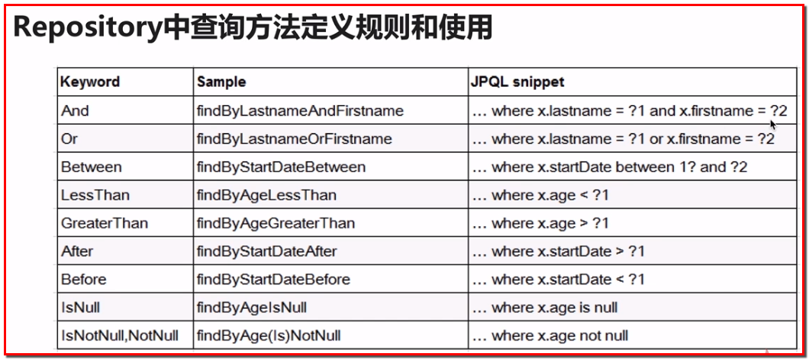
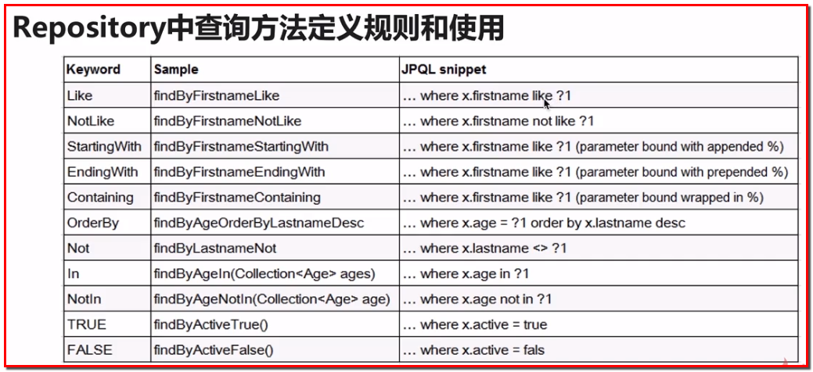

# SpringData
<!-- TOC -->

- [SpringData](#springdata)
    - [1.SpringData概述](#1springdata概述)
        - [1-1.什么是SpringData](#1-1什么是springdata)
        - [1-2.SpringData的应用场景](#1-2springdata的应用场景)
    - [2.传统方式访问数据库](#2传统方式访问数据库)
        - [2-1.JDBC](#2-1jdbc)
            - [1)创建maven项目](#1创建maven项目)
            - [2)数据表准备](#2数据表准备)
            - [3)开发JDBCUtil工具类](#3开发jdbcutil工具类)
            - [4)建立对象模型，DAO](#4建立对象模型dao)
            - [5)Test Case](#5test-case)
        - [2-2.Spring JdbcTemplate](#2-2spring-jdbctemplate)
            - [1) 添加maven依赖](#1-添加maven依赖)
            - [2) DataSource & JdbcTemplate注入](#2-datasource--jdbctemplate注入)
            - [3)  Test Case](#3--test-case)
        - [2-3.弊端分析](#2-3弊端分析)
    - [3.SpringData快速入门](#3springdata快速入门)
        - [3-1.开发环境搭建](#3-1开发环境搭建)
            - [1)添加maven依赖](#1添加maven依赖)
            - [2)配置applicationContext-new.xml文件](#2配置applicationcontext-newxml文件)
            - [3)创建实体类Employee](#3创建实体类employee)
            - [4)Test Case](#4test-case)
        - [3-2.Spring Data JPA HelloWorld开发](#3-2spring-data-jpa-helloworld开发)
            - [1)创建EmployeeRepositry接口](#1创建employeerepositry接口)
            - [2)Test Case](#2test-case)
            - [3)对接口的说明](#3对接口的说明)
    - [4.SpringData JPA进阶](#4springdata-jpa进阶)
        - [4-1.Repository接口讲解](#4-1repository接口讲解)
            - [**1) Repository是一个空接口，标记接口**](#1-repository是一个空接口标记接口)
            - [2) 如果我们定义的接口EmployeeRepository extends Repository](#2-如果我们定义的接口employeerepository-extends-repository)
            - [3) 添加注解能够达到不用extends Repository的功能](#3-添加注解能够达到不用extends-repository的功能)
        - [4-2.Repository子接口讲解](#4-2repository子接口讲解)
        - [4-3.Repository中查询方法定义规则和使用](#4-3repository中查询方法定义规则和使用)
            - [1)接口方法](#1接口方法)
            - [2)Test Case](#2test-case-1)
            - [3)弊端](#3弊端)
        - [4-4.@Query的注解使用](#4-4query的注解使用)
            - [1)自定义方法名称](#1自定义方法名称)
            - [2)命名参数和索引参数的使用](#2命名参数和索引参数的使用)
            - [3)支持本地查询](#3支持本地查询)
        - [4-5.更新及删除操作整合事务的使用](#4-5更新及删除操作整合事务的使用)
            - [1)EmployeeRepository3接口](#1employeerepository3接口)
            - [2)EmployeeService服务层类](#2employeeservice服务层类)
            - [3)Test Case](#3test-case)
            - [4)总结](#4总结)
    - [5.SpringData JPA高阶](#5springdata-jpa高阶)
        - [5-1.CrudRepository接口](#5-1crudrepository接口)
            - [1)EmployeeCrudRepository接口](#1employeecrudrepository接口)
            - [2)EmployeeCrudService服务层类](#2employeecrudservice服务层类)
            - [3)修改Employee类](#3修改employee类)
            - [4)Test Case](#4test-case-1)
        - [5-2.PagingAndSortingRepository接口](#5-2pagingandsortingrepository接口)
            - [1)EmployeePagingAndSortingRepository接口](#1employeepagingandsortingrepository接口)
            - [2)Test Case](#2test-case-2)
        - [5-3.JpaRepository接口](#5-3jparepository接口)
            - [1)EmployeeJpaRepository接口](#1employeejparepository接口)
            - [2)Test Case](#2test-case-3)
        - [5-4.JpaSpecificationExecutor接口](#5-4jpaspecificationexecutor接口)
            - [1)EmployeeJpaSpecificationExecutorRepository接口](#1employeejpaspecificationexecutorrepository接口)
            - [2)Test Case](#2test-case-4)
    - [6.课程总结](#6课程总结)

<!-- /TOC -->
## 1.SpringData概述

### 1-1.什么是SpringData

主旨：provide a familiar and consistent，Spring-based programming model for data access

历史：2010，作者Rod Johnson，Spring Source项目

网址：http://projects.spring.io/spring-data/#quick-start

### 1-2.SpringData的应用场景

Spring Data包含多个子项目：

- Spring Data JPA：减少数据访问层的开发量
- Spring Data Mongo DB：基于分布式的数据存储的数据库
- Spring Data Redis：key-value的非关系型数据库
- Spring Data Solr：基于Lucene的全文搜索服务器

## 2.传统方式访问数据库

### 2-1.JDBC

操作步骤：

- Connection
- Statement
- ResultSet
- Test Case单元测试

#### 1)创建maven项目

- maven工程的目录结构
- 添加依赖

```xml
<!--Mysql Driver-->
<dependency>
  <groupId>mysql</groupId>
  <artifactId>mysql-connector-java</artifactId>
  <version>5.1.38</version>
</dependency>
<!--junit-->
<dependency>
  <groupId>junit</groupId>
  <artifactId>junit</artifactId>
  <version>4.11</version>
  <scope>test</scope>
</dependency>
```

#### 2)数据表准备

```sql lite
create database spring_data;
create table student(
   id int not null auto_increment,
   name varchar(20) not null,
   age int not null,
   primary key(id)
);

insert into student (name, age) values('张三', 20);
insert into student (name, age) values('李四', 21);
insert into student (name, age) values('王五', 22);
```

#### 3)开发JDBCUtil工具类

获取Connection，关闭Connection、Statement、ResultSet

**JDBCUtil.java，放在com.jack.util**

```java
/**
 * JDBC工具类
 * 1) 获取Connection
 * 2）释放资源
 */
public class JDBCUtil {

    /**
     * 获取Connection
     * @return 所获取到的JDBC的Connection
     */
    public static Connection getConnection() throws Exception {

        /**
         * 不建议把配置硬编码到代码中
         *
         * 最佳实践：配置性的建议写到配置文件中
         */
       /* String url = "jdbc:mysql:///spring_data";
        String user = "root";
        String password = "root";
        String driverClass = "com.mysql.jdbc.Driver";*/

        InputStream inputStream = JDBCUtil.class.getClassLoader().getResourceAsStream("db.properties");
        Properties properties = new Properties();
        properties.load(inputStream);

        String url = properties.getProperty("jdbc.url");
        String user = properties.getProperty("jdbc.user");
        String password = properties.getProperty("jdbc.password");
        String driverClass = properties.getProperty("jdbc.driverClass");

        Class.forName(driverClass);
        Connection connection = DriverManager.getConnection(url, user, password);
        return connection;
    }

    /**
     * 释放DB相关的资源
     * @param resultSet
     * @param statement
     * @param connection
     */
    public static void release(ResultSet resultSet, Statement statement, Connection connection) {
        if (resultSet != null) {
            try {
                resultSet.close();
            } catch (SQLException e) {
                e.printStackTrace();
            }
        }

        if (statement != null) {
            try {
                statement.close();
            } catch (SQLException e) {
                e.printStackTrace();
            }
        }

        if (connection != null) {
            try {
                connection.close();
            } catch (SQLException e) {
                e.printStackTrace();
            }
        }
    }
}
```

注意事项：配置的属性放在配置文件中，然后通过代码的方式将配置文件中的数据加载进来即可。

#### 4)建立对象模型，DAO

**Student实体对象，放在com.jack.domain包下**

```java
/**
 * 学生对象实体类
 */
public class Student {

    /**
     * 主键字段
     */
    private int id;

    /**
     * 姓名
     */
    private String name;

    /**
     * 年龄
     */
    private int age;

    public int getId() {
        return id;
    }

    public void setId(int id) {
        this.id = id;
    }

    public String getName() {
        return name;
    }

    public void setName(String name) {
        this.name = name;
    }

    public int getAge() {
        return age;
    }

    public void setAge(int age) {
        this.age = age;
    }
}
```

**StudentDAO接口，放在com.jack.dao包中**

```java
/**
 *  StudentDAO访问接口实现类：通过最原始的JDBC的方式操作
 */
public class StudentDAOImpl implements StudentDAO {

    /**
     * 查询所有学生信息
     * @return
     */
    @Override
    public List<Student> query() {
        List<Student> students = new ArrayList<>();
        Connection connection = null;
        PreparedStatement pstmt = null;
        String sql = "select id, name, age from student";
        ResultSet rs = null;
        try {
             connection = JDBCUtil.getConnection();
             pstmt = connection.prepareStatement(sql);
             rs = pstmt.executeQuery();

             Student student = null;
             while (rs.next()) {
                 int id = rs.getInt("id");
                 String name = rs.getString("name");
                 int age = rs.getInt("age");

                 student = new Student();
                 student.setId(id);
                 student.setName(name);
                 student.setAge(age);

                 students.add(student);
             }
        } catch (Exception e) {
            e.printStackTrace();
        } finally {
            // 释放资源
            JDBCUtil.release(rs, pstmt, connection);
        }
        return students;
    }

    /**
     * 保存一个学生信息
     * @param student
     */
    @Override
    public void save(Student student) {
        Connection connection = null;
        PreparedStatement pstmt = null;
        ResultSet rs = null;
        String sql = "insert into student(name, age) values(?, ?)";
        try {
            connection = JDBCUtil.getConnection();
            pstmt = connection.prepareStatement(sql);
            pstmt.setString(1, student.getName());
            pstmt.setInt(2, student.getAge());
            pstmt.executeUpdate();
        } catch (Exception e) {
            e.printStackTrace();
        } finally {
            JDBCUtil.release(rs, pstmt, connection);
        }
    }
}
```

#### 5)Test Case

**在test目录下，创建com.jack.dao包，创建StudentDAOImplTest测试类**

```java
public class StudentDAOImplTest {

    @Test
    public void testQuery() {
        StudentDAO studentDAO = new StudentDAOImpl();
        List<Student> students = studentDAO.query();
        for (Student student : students) {
            System.out.println("id；" + student.getId()
                    + "，name：" + student.getName()
                    + "，age：" + student.getAge());
        }
    }

    @Test
    public void save() {
        StudentDAO studentDAO = new StudentDAOImpl();
        Student student = new Student();
        student.setName("tom");
        student.setAge(22);
        studentDAO.save(student);
    }
}
```

**test目录，com.jack.util包，JDBCUtilTest测试类**

```java
public class JDBCUtilTest {

    @Test
    public void testGetConnection() throws Exception {
        Connection connection = JDBCUtil.getConnection();
        Assert.assertNotNull(connection);
    }
}
```

**test目录，DataSourceTest测试类**

```java
public class DataSourceTest {

    private ApplicationContext ac = null;

    @Before
    public void setUp() {
        ac = new ClassPathXmlApplicationContext("applicationContext.xml");
        System.out.println("setUp");
    }

    @After
    public void tearDown() {
        ac = null;
        System.out.println("tearDown");
    }

    @Test
    public void testDataSource() {
        System.out.println("testDataSource");
        DataSource dataSource = (DataSource) ac.getBean("dataSource");
        Assert.notNull(dataSource);
    }

    @Test
    public void testJdbcTemplate() {
        System.out.println("testJdbcTemplate");
        JdbcTemplate jdbcTemplate = (JdbcTemplate) ac.getBean("jdbcTemplate");
        Assert.notNull(jdbcTemplate);
    }
}
```

### 2-2.Spring JdbcTemplate

使用Spring JdbcTemplate的方式操作数据库

#### 1) 添加maven依赖

```xml
<!--spring-->
<dependency>
  <groupId>org.springframework</groupId>
  <artifactId>spring-jdbc</artifactId>
  <version>4.3.5.RELEASE</version>
</dependency>

<dependency>
  <groupId>org.springframework</groupId>
  <artifactId>spring-context</artifactId>
  <version>4.3.5.RELEASE</version>
</dependency>
```

#### 2) DataSource & JdbcTemplate注入

**配置applicationContext.xml**

```xml
<?xml version="1.0" encoding="UTF-8"?>
<beans xmlns="http://www.springframework.org/schema/beans"
       xmlns:xsi="http://www.w3.org/2001/XMLSchema-instance"
       xsi:schemaLocation="http://www.springframework.org/schema/beans
       http://www.springframework.org/schema/beans/spring-beans.xsd">

    <bean id="dataSource" class="org.springframework.jdbc.datasource.DriverManagerDataSource">
        <property name="driverClassName" value="com.mysql.jdbc.Driver"></property>
        <property name="url" value="jdbc:mysql:///spring_data"></property>
        <property name="username" value="root"></property>
        <property name="password" value="root"></property>
    </bean>

    <bean id="jdbcTemplate" class="org.springframework.jdbc.core.JdbcTemplate">
        <property name="dataSource" ref="dataSource"></property>
    </bean>

    <bean id="studentDAO" class="com.jack.Dao.StudentDAOSpringJdbcImpl">
        <property name="template" ref="jdbcTemplate"></property>
    </bean>
</beans>
```

**开发Spring jdbcTemplate的query和save方法**

```java
public class StudentDAOSpringJdbcImpl implements StudentDAO {

    private JdbcTemplate template;

    public void setTemplate(JdbcTemplate template) {
        this.template = template;
    }

    /**
     * 查询所有学生
     * @return
     */
    @Override
    public List<Student> query() {
        String sql = "select id, name, age from student";
        List<Student> students = new ArrayList<>();

        /*template.query(sql, new RowCallbackHandler() {
            @Override
            public void processRow(ResultSet resultSet) throws SQLException {
                int id = resultSet.getInt("id");
                String name = resultSet.getString("name");
                int age = resultSet.getInt("age");

                Student student = new Student();
                student.setId(id);
                student.setName(name);
                student.setAge(age);

                students.add(student);
            }
        });*/

        students = template.query(sql, new BeanPropertyRowMapper<>(Student.class));

        return students;
    }

    /**
     * 保存一个学生
     * @param student
     */
    @Override
    public void save(Student student) {
        String sql = "insert into student(name, age) values(?, ?)";
        template.update(sql, new Object[] {student.getName(), student.getAge()});
    }
}
```

#### 3)  Test Case

**test目录下，com.jack.dao包，创建StudentDAOSpringJdbcImplTest测试类**

```java
public class StudentDAOSpringJdbcImplTest {

    private ApplicationContext ac = null;

    private StudentDAO studentDAO= null;

    @Before
    public void setUp() {
        ac = new ClassPathXmlApplicationContext("applicationContext.xml");
        studentDAO = (StudentDAO) ac.getBean("studentDAO");
        System.out.println("setUp");
    }

    @After
    public void tearDown() {
        ac = null;
        System.out.println("tearDown");
    }

    /**
     * 查询所有学生信息
     */
    @Test
    public void testQuery() {
        studentDAO = new StudentDAOImpl();
        List<Student> students = studentDAO.query();
        for (Student student : students) {
            System.out.println("id；" + student.getId()
                    + "，name：" + student.getName()
                    + "，age：" + student.getAge());
        }
    }

    /**
     * 保存一个学生信息
     */
    @Test
    public void save() {
        studentDAO = new StudentDAOImpl();
        Student student = new Student();
        student.setName("jack");
        student.setAge(20);
        studentDAO.save(student);
    }
}
```

### 2-3.弊端分析

- DAO has many code
- DAOImpl has many duplicate code
- Develop the page and the other functions
- ...

## 3.SpringData快速入门

### 3-1.开发环境搭建

#### 1)添加maven依赖

```xml
<!--Spring Data JPA-->
<dependency>
  <groupId>org.springframework.data</groupId>
  <artifactId>spring-data-jpa</artifactId>
  <version>1.8.0.RELEASE</version>
</dependency>
<dependency>
  <groupId>org.hibernate</groupId>
  <artifactId>hibernate-entitymanager</artifactId>
  <version>4.3.6.Final</version>
</dependency>
```

#### 2)配置applicationContext-new.xml文件

```xml
<?xml version="1.0" encoding="UTF-8"?>

<beans xmlns="http://www.springframework.org/schema/beans"
       xmlns:xsi="http://www.w3.org/2001/XMLSchema-instance"
       xmlns:context="http://www.springframework.org/schema/context"
       xmlns:tx="http://www.springframework.org/schema/tx"
       xmlns:jpa="http://www.springframework.org/schema/data/jpa"
       xsi:schemaLocation="http://www.springframework.org/schema/beans http://www.springframework.org/schema/beans/spring-beans.xsd
		http://www.springframework.org/schema/data/jpa http://www.springframework.org/schema/data/jpa/spring-jpa-1.3.xsd
		http://www.springframework.org/schema/tx http://www.springframework.org/schema/tx/spring-tx-4.0.xsd
		http://www.springframework.org/schema/context http://www.springframework.org/schema/context/spring-context-4.0.xsd">

    <!--1 配置数据源-->
    <bean id="dataSource" class="org.springframework.jdbc.datasource.DriverManagerDataSource">
        <property name="driverClassName" value="com.mysql.jdbc.Driver"></property>
        <property name="url" value="jdbc:mysql:///spring_data"></property>
        <property name="username" value="root"></property>
        <property name="password" value="root"></property>
    </bean>

    <!--2 配置EntityManagerFactory-->
    <bean id="entityManagerFactory" class="org.springframework.orm.jpa.LocalContainerEntityManagerFactoryBean">
        <property name="dataSource" ref="dataSource"></property>
        <property name="jpaVendorAdapter">
            <bean class="org.springframework.orm.jpa.vendor.HibernateJpaVendorAdapter"></bean>
        </property>
        <property name="packagesToScan" value="com.jack"></property>

        <property name="jpaProperties">
            <props>
                <prop key="hibernate.ejb.naming_strategy">org.hibernate.cfg.ImprovedNamingStrategy</prop>
                <prop key="hibernate.dialect">org.hibernate.dialect.MySQL5InnoDBDialect</prop>
                <prop key="hibernate.show_sql">true</prop>
                <prop key="hibernate.format_sql">true</prop>
                <prop key="hibernate.hbm2ddl.auto">update</prop>
            </props>
        </property>
    </bean>

    <!--3 配置事务管理器-->
    <bean id="transactionManager" class="org.springframework.orm.jpa.JpaTransactionManager">
        <property name="entityManagerFactory" ref="entityManagerFactory"></property>
    </bean>

    <!--4 配置支持注解的事务-->
    <tx:annotation-driven transaction-manager="transactionManager"></tx:annotation-driven>

    <!--5 配置spring data-->
    <jpa:repositories base-package="com.jack" entity-manager-factory-ref="entityManagerFactory"></jpa:repositories>

    <context:component-scan base-package="com.jack"></context:component-scan>
</beans>
```

#### 3)创建实体类Employee

```java
/**
 * 雇员:  先开发实体类===>自动生成数据表
 */
@Entity
public class Employee {

    private Integer id;

    private String name;

    private Integer age;

    @GeneratedValue
    @Id
    @Column(nullable = false)
    public Integer getId() {
        return id;
    }

    public void setId(Integer id) {
        this.id = id;
    }

    @Column(length = 20, nullable = false)
    public String getName() {
        return name;
    }

    public void setName(String name) {
        this.name = name;
    }

    @Column(nullable = false)
    public Integer getAge() {
        return age;
    }

    public void setAge(Integer age) {
        this.age = age;
    }
}
```

#### 4)Test Case

**在Test目录下, 创建测试类SpringDataTest，测试环境是否搭建成功，看数据库是否有employee表生成**

```java
public class SpringDataTest {
    private ApplicationContext ac = null;

    @Before
    public void setUp() {
        ac = new ClassPathXmlApplicationContext("applicationContext-new.xml");
        System.out.println("setUp");
    }

    @After
    public void tearDown() {
        ac = null;
        System.out.println("tearDown");
    }

    @Test
    public void testEntityManagerFactory() {

    }
}
```

### 3-2.Spring Data JPA HelloWorld开发

#### 1)创建EmployeeRepositry接口

```java
public interface EmployeeRepository extends Repository<Employee, Integer> {

    public Employee findByName(String name);

    public void save(Employee employee);
}
```

#### 2)Test Case

**在Test目录下，创建包com.jack.repository，创建测试类EmployeeRepostoryTest**

```java
public class EmployeeRepositoryTest {

    private ApplicationContext ac = null;

    private EmployeeRepository employeeRepository;

    @Before
    public void setUp() {
        ac = new ClassPathXmlApplicationContext("applicationContext-new.xml");
        employeeRepository = (EmployeeRepository) ac.getBean("employeeRepository");
        System.out.println("setUp");
    }

    @After
    public void tearDown() {
        ac = null;
        System.out.println("tearDown");
    }

    @Test
    public void testFindByName() {
        Employee employee = employeeRepository.findByName("jack");
        System.out.println("id；" + employee.getId()
                + "，name：" + employee.getName()
                + "，age：" + employee.getAge());
    }

    @Test
    public void testSave() {
        Employee employee = new Employee();
        employee.setName("tom");
        employee.setAge(20);
        employeeRepository.save(employee);
    }
}
```

#### 3)对接口的说明

**Repository**

- Repository
- RepositoryDefinition
- Repository Query Specifications
- Query Annotation
- Update/Delete/Transaction

**Repository Hierarchy**

- CrudRepository
- PagingAndSortingRepository
- JpaRepository
- JpaSpecificationExecutor

## 4.SpringData JPA进阶

### 4-1.Repository接口讲解

- Repository接口是Spring Data的核心接口，不提供任何方法
- public interface Repository<T, ID extends Serializable>{ }
  - ID就是T里面的ID的数据类型
- @RepositoryDefinition注解的使用

Repository类的定义

```java
public interface Repository<T, ID extends Serializable>{

 }
```

#### **1) Repository是一个空接口，标记接口**

没有包含方法声明的接口就叫标记接口

#### 2) 如果我们定义的接口EmployeeRepository extends Repository

```java
org.springframework.data.jpa.repository.support.SimpleJpaRepository@3b152928
```

如果我们自己定义的接口没有继承Repository，运行时会报错

```java
org.springframework.beans.factory.NoSuchBeanDefinitionException: No bean named 'employeeRepository' available
```

#### 3) 添加注解能够达到不用extends Repository的功能

```java
@RepositoryDefinition(domainClass = Employee.class, idClass = Integer.class)
```

### 4-2.Repository子接口讲解

- CrudRepository：继承Repository，实现CRUD相关的方法
- PagingAndSortingRepository：继承CrudRepository，实现了分页排序相关的方法
- JpaRepository：继承PagingAndSortingRepository，实现JPA规范相关的方法

### 4-3.Repository中查询方法定义规则和使用

- 了解Spring Data中查询方法名称的定义规则
- 使用Spring Data完成复杂查询方法名称的命名





#### 1)接口方法

```java
/**
 * where name like ?% and age < ?
 * @param name
 * @param age
 * @return
 */
public List<Employee> findByNameStartingWithAndAgeLessThan(String name, Integer age);

/**
 * where name like %? and age < ?
 * @param name
 * @param age
 * @return
 */
public List<Employee> findByNameEndingWithAndAgeLessThan(String name, Integer age);

/**
 * where name in(...) or age < ?
 * @param name
 * @param age
 * @return
 */
public List<Employee> findByNameInOrAgeLessThan(List<String> name, Integer age);

/**
 * where name in(...) and age < ?
 * @param name
 * @param age
 * @return
 */
public List<Employee> findByNameInAndAgeLessThan(List<String> name, Integer age);
```

#### 2)Test Case

```java
/**
 * 测试where name like ?% and age < ?
 */
@Test
public void testFindByNameStartingWithAndAgeLessThan() {
    List<Employee> employees = employeeRepository.findByNameStartingWithAndAgeLessThan("test", 23);
    for (Employee employee : employees) {
        System.out.println("id；" + employee.getId()
                + "，name：" + employee.getName()
                + "，age：" + employee.getAge());
    }
}

/**
 * 测试where name like %? and age < ?
 */
@Test
public void testFindByNameEndingWithAndAgeLessThan() {
    List<Employee> employees = employeeRepository.findByNameEndingWithAndAgeLessThan("1", 22);
    for (Employee employee : employees) {
        System.out.println("id；" + employee.getId()
                + "，name：" + employee.getName()
                + "，age：" + employee.getAge());
    }
}

/**
 * 测试where name in(...) or age < ?
 */
@Test
public void testFindByNameInOrAgeLessThan() {
    List<String> names = new ArrayList<>();
    names.add("test1");
    names.add("test2");
    names.add("test3");
    List<Employee> employees = employeeRepository.findByNameInOrAgeLessThan(names, 22);
    for (Employee employee : employees) {
        System.out.println("id；" + employee.getId()
                + "，name：" + employee.getName()
                + "，age：" + employee.getAge());
    }
}

/**
 * 测试where name in(...) and age < ?
 */
@Test
public void testFindByNameInAndAgeLessThan() {
    List<String> names = new ArrayList<>();
    names.add("test1");
    names.add("test2");
    names.add("test3");
    List<Employee> employees = employeeRepository.findByNameInAndAgeLessThan(names, 22);
    for (Employee employee : employees) {
        System.out.println("id；" + employee.getId()
                + "，name：" + employee.getName()
                + "，age：" + employee.getAge());
    }
}
```

#### 3)弊端

对于按照方法命名规则来使用的话，有弊端：

- 方法名会比较长：约定大于配置
- 对于一些复杂的查询，是很难实现的

如何解决这些弊端呢？

**使用注解@Query**

### 4-4.@Query的注解使用

使用了@Query注解后：

- 在Repository方法中使用，不需要遵循查询方法命名规则
- 只需要将@Query定义在Repository中的方法上即可
- 命名参数以及索引参数的使用
- 本地查询

#### 1)自定义方法名称

```java
public interface EmployeeRepository2 extends Repository<Employee, Integer> {

    /**
     * 获取最大员工编号的员工
     * @return
     */
    @Query("select e from Employee e where id=(select max(id) from Employee e2)")
    public Employee getEmployeeById();
}
```

**Test Case**

```java
public class EmployeeRepository2Test {
    private ApplicationContext ac = null;

    private EmployeeRepository2 employeeRepository2;

    @Before
    public void setUp() {
        ac = new ClassPathXmlApplicationContext("applicationContext-new.xml");
        employeeRepository2 = (EmployeeRepository2) ac.getBean("employeeRepository2");
        System.out.println("setUp");
    }

    @After
    public void tearDown() {
        ac = null;
        System.out.println("tearDown");
    }

    /**
     * 测试获取员工编号最大的员工
     */
    @Test
    public void testGetEmployeeById() {
        Employee employee = employeeRepository2.getEmployeeById();
        System.out.println("id；" + employee.getId()
                + "，name：" + employee.getName()
                + "，age：" + employee.getAge());
    }
}
```

#### 2)命名参数和索引参数的使用

命名参数：:name，方法的参数需要添加@Param("name")

索引参数：?1，使用?表示占位符，使用1表示第几个参数

```java
public interface EmployeeRepository2 extends Repository<Employee, Integer> {
    /**
     * 第一种参数的写法
     * 查询员工根据姓名和年龄
     * @param name
     * @param age
     * @return
     */
    @Query("select o from Employee o where o.name=?1 and o.age=?2")
    public List<Employee> queryParam1(String name, Integer age);

    /**
     * 第二种参数的写法
     * 查询员工根据姓名和年龄
     * @param name
     * @param age
     * @return
     */
    @Query("select o from Employee o where o.name=:name and o.age=:age")
    public List<Employee> queryParam2(@Param("name") String name, @Param("age") Integer age);

    /**
     * 根据姓名进行模糊查询
     * @param name
     * @return
     */
    @Query("select o from Employee o where o.name like %?1%")
    public List<Employee> queryLike1(String name);

    /**
     * 根据姓名进行模糊查询
     * Ctrl+P：显示参数信息
     * @param name
     * @return
     */
    @Query("select o from Employee o where o.name like %:name%")
    public List<Employee> queryLike2(@Param("name") String name);
}
```

**Test Case**

```java
public class EmployeeRepository2Test {
    private ApplicationContext ac = null;

    private EmployeeRepository2 employeeRepository2;

    @Before
    public void setUp() {
        ac = new ClassPathXmlApplicationContext("applicationContext-new.xml");
        employeeRepository2 = (EmployeeRepository2) ac.getBean("employeeRepository2");
        System.out.println("setUp");
    }

    @After
    public void tearDown() {
        ac = null;
        System.out.println("tearDown");
    }

    /**
     * 测试查询员工根据姓名和年龄
     */
    @Test
    public void testQueryParam1() {
        List<Employee> employees = employeeRepository2.queryParam1("jack", 20);
        for (Employee employee : employees) {
            System.out.println("id；" + employee.getId()
                    + "，name：" + employee.getName()
                    + "，age：" + employee.getAge());
        }
    }

    /**
     * 测试查询员工根据姓名和年龄
     */
    @Test
    public void testQueryParam2() {
        List<Employee> employees = employeeRepository2.queryParam2("jack", 20);
        for (Employee employee : employees) {
            System.out.println("id；" + employee.getId()
                    + "，name：" + employee.getName()
                    + "，age：" + employee.getAge());
        }
    }

    /**
     * 测试根据姓名进行模糊查询
     */
    @Test
    public void testQueryLike1() {
        List<Employee> employees = employeeRepository2.queryLike1("test");
        for (Employee employee : employees) {
            System.out.println("id；" + employee.getId()
                    + "，name：" + employee.getName()
                    + "，age：" + employee.getAge());
        }
    }

    /**
     * 测试根据姓名进行模糊查询
     */
    @Test
    public void testQueryLike2() {
        List<Employee> employees = employeeRepository2.queryLike1("test1");
        for (Employee employee : employees) {
            System.out.println("id；" + employee.getId()
                    + "，name：" + employee.getName()
                    + "，age：" + employee.getAge());
        }
    }
}
```

#### 3)支持本地查询

Spring Data还支持原生的sql查询，在@Query注解中把nativeQuery属性值设置true即可。

```java
public interface EmployeeRepository2 extends Repository<Employee, Integer> {
    /**
     * 支持原生态sql查询
     * 设置nativeQuery为true即可
     * 查询总的记录数
     * @return
     */
    @Query(nativeQuery = true, value = "select count(1) from employee")
    public Long getCount();
}
```

**Test Case**

```java
public class EmployeeRepository2Test {
    private ApplicationContext ac = null;

    private EmployeeRepository2 employeeRepository2;

    @Before
    public void setUp() {
        ac = new ClassPathXmlApplicationContext("applicationContext-new.xml");
        employeeRepository2 = (EmployeeRepository2) ac.getBean("employeeRepository2");
        System.out.println("setUp");
    }

    @After
    public void tearDown() {
        ac = null;
        System.out.println("tearDown");
    }

    /**
     * 查询员工总数
     */
    @Test
    public void testGetCount() {
        Long count = employeeRepository2.getCount();
        System.out.println("总的员工数：" + count);
    }
}
```

### 4-5.更新及删除操作整合事务的使用

- @Modifying注解使用
- @Modifying结合@Query注解执行更新操作
- @Transactional在Spring Data中的使用

#### 1)EmployeeRepository3接口

```java
public interface EmployeeRepository3 extends Repository<Employee, Integer> {

    /**
     * 更新年龄
     * @param id
     * @param age
     */
    @Modifying
    @Query("update Employee o set o.age=:age where o.id=:id")
    public void update(@Param("id") Integer id, @Param("age") Integer age);
}
```

#### 2)EmployeeService服务层类

在com.jack.service包下

```java
/**
 * 事务控制一般在service层
 */
@Service
public class EmployeeService {

    @Autowired
    private EmployeeRepository3 employeeRepository3;

    /**
     * 根据id更新年龄
     * @param id
     * @param age
     */
    @Transactional
    public void update(Integer id, Integer age) {
        employeeRepository3.update(id, age);
    }
}
```

#### 3)Test Case

```java
public class EmployeeServiceTest {


    private ApplicationContext ac = null;

    private EmployeeService employeeService;

    @Before
    public void setUp() {
        ac = new ClassPathXmlApplicationContext("applicationContext-new.xml");
        employeeService = ac.getBean(EmployeeService.class);
        System.out.println("setUp");
    }

    @After
    public void tearDown() {
        ac = null;
        System.out.println("tearDown");
    }

    /**
     * 测试更新操作
     */
    @Test
    public void testUpdate() {
        employeeService.update(1, 18);
    }
}
```

#### 4)总结

事务在Spring Data中的使用：

- 事务一般是在Service层
- @Query、@Modifying、@Transactional的综合使用
  - @Query和@Modifying注解定义在Repository接口的方法上
  - @Transactional注解定义在Service层的方法上

## 5.SpringData JPA高阶

### 5-1.CrudRepository接口

CrudRepository接口使用详解：

- save(entity)
- save(entities)
- findOne(id)
- findAll()
- delete(id)
- delete(entity)
- delete(entities)
- deleteAll()
- exist(id)

#### 1)EmployeeCrudRepository接口

```java
public interface EmployeeCrudRepository extends CrudRepository<Employee, Integer> {

}
```

#### 2)EmployeeCrudService服务层类

```java
@Service
public class EmployeeCrudService {

    @Autowired
    private EmployeeCrudRepository crudRepository;

    /**
     * 批量添加雇员信息
     * @param employees
     */
    @Transactional
    public void save(List<Employee> employees) {
        crudRepository.save(employees);
    }
}
```

#### 3)修改Employee类

添加一个@Table注解，name属性为crud_employee，执行sql语句时会创建一张crud_employee新表

```java
@Entity
@Table(name = "crud_employee")
public class Employee {
    // ...
}
```

#### 4)Test Case

```java
public class EmployeeCrudServiceTest {

    private ApplicationContext ac = null;

    private EmployeeCrudService crudService;

    @Before
    public void setUp() {
        ac = new ClassPathXmlApplicationContext("applicationContext-new.xml");
        crudService = ac.getBean(EmployeeCrudService.class);
        System.out.println("setUp");
    }

    @After
    public void tearDown() {
        ac = null;
        System.out.println("tearDown");
    }

    /**
     * 测试批量添加雇员信息
     */
    @Test
    public void testSave() {
        List<Employee> employees = new ArrayList<>();
        Employee employee = null;

        for (int i = 0; i <= 100; i++) {
            employee = new Employee();

            employee.setName("test" + i);
            employee.setAge(100 - i);
            employees.add(employee);
        }
        crudService.save(employees);
    }
}
```

### 5-2.PagingAndSortingRepository接口

PagingAndSortingRepository接口使用详解

- 该接口包含分页和排序的功能
- 带排序的查询：findAll(Sort sort)
- 带排序的分页查询：findAll(Pageable pageable)

#### 1)EmployeePagingAndSortingRepository接口

```java
public interface EmployeePagingAndSortingRepository extends PagingAndSortingRepository<Employee, Integer> {
}
```

#### 2)Test Case

```java
public class EmployeePagingAndSortingRepositoryTest {

    private ApplicationContext ac = null;

    private EmployeePagingAndSortingRepository employeePagingAndSortingRepository;

    @Before
    public void setUp() {
        ac = new ClassPathXmlApplicationContext("applicationContext-new.xml");
        employeePagingAndSortingRepository = ac.getBean(EmployeePagingAndSortingRepository.class);
        System.out.println("setUp");
    }

    @After
    public void tearDown() {
        ac = null;
        System.out.println("tearDown");
    }

    /**
     * 测试分页
     */
    @Test
    public void testPage() {
        // page：index是从0开始的，不是从1开始的
        Pageable pageable = new PageRequest(0, 5);
        Page<Employee> employeePage = employeePagingAndSortingRepository.findAll(pageable);

        System.out.println("查询的总页数：" + employeePage.getTotalPages());
        System.out.println("查询的总记录数：" + employeePage.getTotalElements());
        System.out.println("查询的当前第几页：" + employeePage.getNumber() + 1);
        System.out.println("查询的当前页面的集合：" + employeePage.getContent());
        System.out.println("查询的当前页面的记录数：" + employeePage.getNumberOfElements());
    }

    /**
     * 测试带排序的分页
     */
    @Test
    public void testPageAndSort() {

        // 排序
        Sort.Order order = new Sort.Order(Sort.Direction.DESC, "id");
        Sort sort = new Sort(order);

        // page：index是从0开始的，不是从1开始的
        Pageable pageable = new PageRequest(0, 5, sort);
        Page<Employee> employeePage = employeePagingAndSortingRepository.findAll(pageable);

        System.out.println("查询的总页数：" + employeePage.getTotalPages());
        System.out.println("查询的总记录数：" + employeePage.getTotalElements());
        System.out.println("查询的当前第几页：" + employeePage.getNumber() + 1);
        System.out.println("查询的当前页面的集合：" + employeePage.getContent());
        System.out.println("查询的当前页面的记录数：" + employeePage.getNumberOfElements());
    }
}
```

### 5-3.JpaRepository接口

JpaRepository接口使用详解：

- findAll
- findAll(Sort sort)
- save(entities)
- flush
- deleteInBatch(entities)

#### 1)EmployeeJpaRepository接口

```java
public interface EmployeeJpaRepository extends JpaRepository<Employee, Integer> {
}
```

#### 2)Test Case

```java
public class EmployeeJpaRepositoryTest {

    private ApplicationContext ac = null;

    private EmployeeJpaRepository employeeJpaRepository;

    @Before
    public void setUp() {
        ac = new ClassPathXmlApplicationContext("applicationContext-new.xml");
        employeeJpaRepository = ac.getBean(EmployeeJpaRepository.class);
        System.out.println("setUp");
    }

    @After
    public void tearDown() {
        ac = null;
        System.out.println("tearDown");
    }

    /**
     * 测试主键查询
     */
    @Test
    public void testFind() {
        Employee employee = employeeJpaRepository.findOne(99);
        System.out.println("employee：" + employee);
        // 测试id对应的雇员信息是否存在
        System.out.println("employee(2)：" + employeeJpaRepository.exists(2));
        System.out.println("employee(102)：" + employeeJpaRepository.exists(102));
    }

}
```

### 5-4.JpaSpecificationExecutor接口

JpaSpecificationExecutor接口使用详解：

- Specification封装了JPA Criteria查询条件

#### 1)EmployeeJpaSpecificationExecutorRepository接口

```java
public interface EmployeeJpaSpecificationExecutorRepository
        extends JpaRepository<Employee, Integer>, JpaSpecificationExecutor<Employee> {
}
```

#### 2)Test Case

```java
public class EmployeeJpaSpecificationExecutorRepositoryTest {

    private ApplicationContext ac = null;

    private EmployeeJpaSpecificationExecutorRepository employeeJpaSpecificationExecutorRepository;

    @Before
    public void setUp() {
        ac = new ClassPathXmlApplicationContext("applicationContext-new.xml");
        employeeJpaSpecificationExecutorRepository = ac.getBean(EmployeeJpaSpecificationExecutorRepository.class);
        System.out.println("setUp");
    }

    @After
    public void tearDown() {
        ac = null;
        System.out.println("tearDown");
    }

    /**
     * 1)分页
     * 2)排序
     * 3)查询条件：age > 50
     */
    @Test
    public void testQuery() {
        // 排序
        Sort.Order order = new Sort.Order(Sort.Direction.DESC, "id");
        Sort sort = new Sort(order);

        // page：index是从0开始的，不是从1开始的
        Pageable pageable = new PageRequest(0, 5, sort);

        /**
         * root：就是我们要查询的类型（employee）
         * criteriaQuery：添加查询条件
         * criteriaBuilder：构建Predicate
         */
        Specification<Employee> specification = new Specification<Employee>() {
            @Override
            public Predicate toPredicate(Root<Employee> root,
                                         CriteriaQuery<?> criteriaQuery,
                                         CriteriaBuilder criteriaBuilder) {
                // root (employee(age))
                Path path = root.get("age");
                return criteriaBuilder.gt(path, 50);
            }
        };

        Page<Employee> employeePage = employeeJpaSpecificationExecutorRepository.findAll(specification, pageable);

        System.out.println("查询的总页数：" + employeePage.getTotalPages());
        System.out.println("查询的总记录数：" + employeePage.getTotalElements());
        System.out.println("查询的当前第几页：" + employeePage.getNumber() + 1);
        System.out.println("查询的当前页面的集合：" + employeePage.getContent());
        System.out.println("查询的当前页面的记录数：" + employeePage.getNumberOfElements());
    }
}
```

## 6.课程总结

- Spring Data预览
- 传统方式访问数据库
- Spring Data快速入门
- Spring Data JPA进阶
- Spring Data JPA高级