# ssm整合

[TOC]


## 1.ssm整合
### 1-1.搭建整合环境
#### 1-1-1.使用XML+注解的方式进行ssm的整合
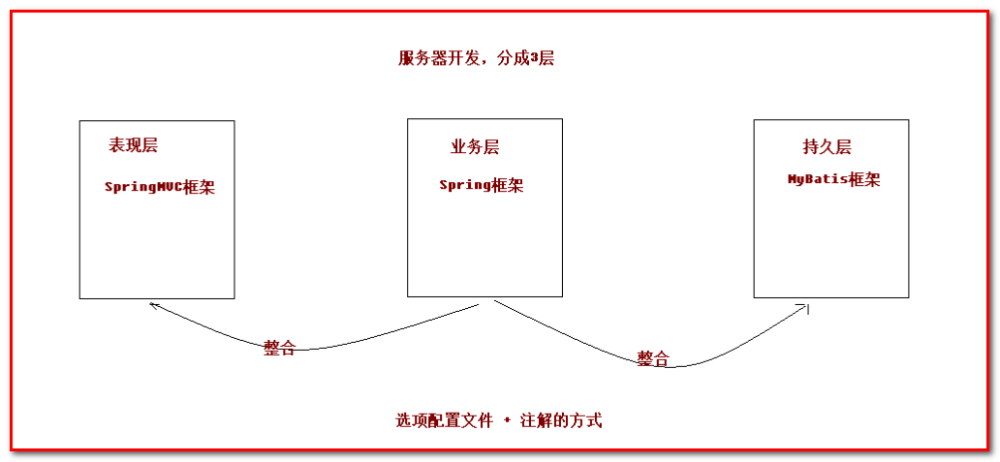
#### 1-1-2.整合思路
* 先搭建整合的环境(先搭建Spring的环境)
* 再使用Spring整合SpringMVC框架
* 最后使用Spring整合Mybatis框架
#### 1-1-3.创建数据库和表
```sql
create database itcastspringmvc;
use itcastspringmvc;
create table account(
    id int primary key auto_increment,
    name varchar(20),
    money double
);
```
### 1-2.整合前准备
#### 1-2-1.创建maven的web工程
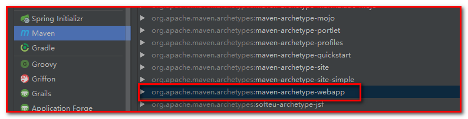

**项目名：springmvc_day03_ssm**
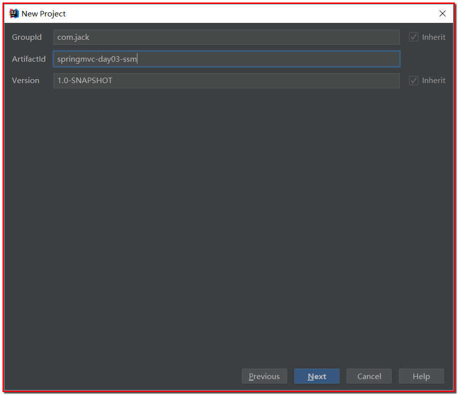

指定：
key：**archetypeCatalog**
value：**internal**
解决web项目使用idea创建工程加载慢的问题
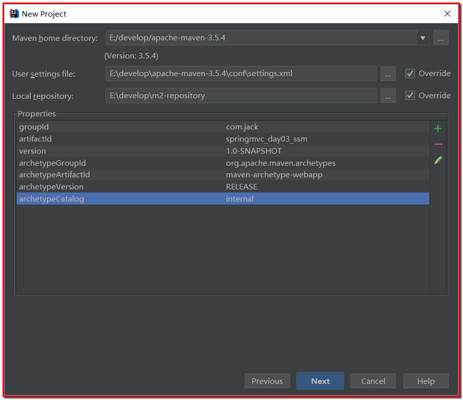
#### 1-2-2.添加整合所需要的maven依赖包
```xml
<?xml version="1.0" encoding="UTF-8"?>

<project xmlns="http://maven.apache.org/POM/4.0.0" xmlns:xsi="http://www.w3.org/2001/XMLSchema-instance"
  xsi:schemaLocation="http://maven.apache.org/POM/4.0.0 http://maven.apache.org/xsd/maven-4.0.0.xsd">
  <modelVersion>4.0.0</modelVersion>

  <groupId>com.jack</groupId>
  <artifactId>springmvc_day03_ssm</artifactId>
  <version>1.0-SNAPSHOT</version>
  <packaging>war</packaging>

  <name>springmvc_day03_ssm Maven Webapp</name>
  <!-- FIXME change it to the project's website -->
  <url>http://www.example.com</url>

  <properties>
    <project.build.sourceEncoding>UTF-8</project.build.sourceEncoding>
    <maven.compiler.source>1.8</maven.compiler.source>
    <maven.compiler.target>1.8</maven.compiler.target>
    <spring.version>5.0.2.RELEASE</spring.version>
    <slf4j.version>1.6.6</slf4j.version>
    <log4j.version>1.2.12</log4j.version>
    <mysql.version>5.1.6</mysql.version>
    <mybatis.version>3.4.5</mybatis.version>
  </properties>

  <dependencies>

    <!--Spring的aop-->
    <dependency>
      <groupId>org.aspectj</groupId>
      <artifactId>aspectjweaver</artifactId>
      <version>1.6.8</version>
    </dependency>

    <dependency>
      <groupId>org.springframework</groupId>
      <artifactId>spring-aop</artifactId>
      <version>${spring.version}</version>
    </dependency>
    <!--Spring的核心-->
    <dependency>
      <groupId>org.springframework</groupId>
      <artifactId>spring-context</artifactId>
      <version>${spring.version}</version>
    </dependency>
    <!--Spring整合web，当web容器启动的时候，加载Spring-->
    <dependency>
      <groupId>org.springframework</groupId>
      <artifactId>spring-web</artifactId>
      <version>${spring.version}</version>
    </dependency>
    <!--SpringMVC-->
    <dependency>
      <groupId>org.springframework</groupId>
      <artifactId>spring-webmvc</artifactId>
      <version>${spring.version}</version>
    </dependency>
    <!--Spring整合junit-->
    <dependency>
      <groupId>org.springframework</groupId>
      <artifactId>spring-test</artifactId>
      <version>${spring.version}</version>
    </dependency>
    <!--Spring的事务处理-->
    <dependency>
      <groupId>org.springframework</groupId>
      <artifactId>spring-tx</artifactId>
      <version>${spring.version}</version>
    </dependency>

    <dependency>
      <groupId>org.springframework</groupId>
      <artifactId>spring-jdbc</artifactId>
      <version>${spring.version}</version>
    </dependency>
    <!--junit测试-->
    <dependency>
      <groupId>junit</groupId>
      <artifactId>junit</artifactId>
      <version>4.12</version>
      <scope>compile</scope>
    </dependency>
    <!--mysql驱动包-->
    <dependency>
      <groupId>mysql</groupId>
      <artifactId>mysql-connector-java</artifactId>
      <version>${mysql.version}</version>
    </dependency>
    <!--servlet包-->
    <dependency>
      <groupId>javax.servlet</groupId>
      <artifactId>servlet-api</artifactId>
      <version>2.5</version>
      <scope>provided</scope>
    </dependency>

    <dependency>
      <groupId>javax.servlet.jsp</groupId>
      <artifactId>jsp-api</artifactId>
      <version>2.0</version>
      <scope>provided</scope>
    </dependency>
    <!--jstl表达式-->
    <dependency>
      <groupId>jstl</groupId>
      <artifactId>jstl</artifactId>
      <version>1.2</version>
    </dependency>

    <!--log start-->
    <dependency>
      <groupId>log4j</groupId>
      <artifactId>log4j</artifactId>
      <version>${log4j.version}</version>
    </dependency>

    <dependency>
      <groupId>org.slf4j</groupId>
      <artifactId>slf4j-api</artifactId>
      <version>${slf4j.version}</version>
    </dependency>

    <dependency>
      <groupId>org.slf4j</groupId>
      <artifactId>slf4j-log4j12</artifactId>
      <version>${slf4j.version}</version>
    </dependency>
    <!--log end-->
    <!--Mybatis的依赖包-->
    <dependency>
      <groupId>org.mybatis</groupId>
      <artifactId>mybatis</artifactId>
      <version>${mybatis.version}</version>
    </dependency>
    <!--Spring整合Mybatis的jar包-->
    <dependency>
      <groupId>org.mybatis</groupId>
      <artifactId>mybatis-spring</artifactId>
      <version>1.3.0</version>
    </dependency>
    <!--c3p0数据库连接池-->
    <dependency>
      <groupId>c3p0</groupId>
      <artifactId>c3p0</artifactId>
      <version>0.9.1.2</version>
      <type>jar</type>
      <scope>compile</scope>
    </dependency>

  </dependencies>

  <build>
    <finalName>ssm</finalName>
    <pluginManagement>
      <plugins>
        <plugin>
          <groupId>org.apache.maven.plugins</groupId>
          <artifactId>maven-compiler-plugin</artifactId>
          <version>3.2</version>
          <configuration>
            <source>1.8</source>
            <target>1.8</target>
            <encoding>UTF-8</encoding>
            <showWarnings>true</showWarnings>
          </configuration>
        </plugin>
      </plugins>
    </pluginManagement>
  </build>

</project>
```
#### 1-2-3.创建实体类
**创建包com.jack.ssm.domain，创建类Account.java**
```java
public class Account implements Serializable {

    private Integer id;
    private String name;
    private Double money;
	// get、set和toString方法省略
}
```
#### 1-2-4.创建dao
**创建包com.jack.ssm.dao，创建接口AccountDao.java**
```java
//@Repository("accountDao")//该注解可加可不加
public interface AccountDao {

    @Select("select * from account")
    List<Account> findAll();

    @Insert("insert into account(name, money) values(#{name}, #{money})")
    void saveAccount(Account account);
}
```
#### 1-2-5.创建service
**创建包com.jack.ssm.service，创建接口AccountService.java**
```java
public interface AccountService {

    List<Account> findAll();

    void saveAccount(Account account);
}
```
**创建AccountService的实现类AccountServiceImpl**
```java
@Service("accountService")
public class AccountServiceImpl implements AccountService {

    @Autowired
    private AccountDao accountDao;

    @Override
    public List<Account> findAll() {
        System.out.println("AccountServiceImpl的findAll()方法执行了...");
        List<Account> accounts = accountDao.findAll();
        return accounts;
    }

    @Override
    public void saveAccount(Account account) {
        System.out.println("AccountServiceImpl的findAll()方法执行了...");
        accountDao.saveAccount(account);
    }
}
```
#### 1-2-6.创建Controller
**创建包com.jack.sss.controller，创建类AccountController.java**
```java
@Controller
@RequestMapping("/account")
public class AccountController {

    @Autowired
    private AccountService accountService;

    /**
     * 测试能否调用service层
     * @return
     */
    /*@RequestMapping("/findAll")
    public String findAll() {
        System.out.println("AccountController的findAll方法执行了...");
        List<Account> accounts = accountService.findAll();
        for (Account account : accounts) {
            System.out.println(account);
        }
        return "success";
    }*/

    @RequestMapping("/findAll")
    public String findAll(Model model) {
        System.out.println("AccountController的findAll方法执行了...");
        List<Account> accounts = accountService.findAll();
        for (Account account : accounts) {
            System.out.println(account);
        }
        model.addAttribute("accounts", accounts);
        return "success";
    }

    @RequestMapping("/save")
    public String saveAccount(Account account) {
        System.out.println("AccountController的saveAccount方法执行了...");
        accountService.saveAccount(account);
        // 保存成功重定向到查询页面
        return "redirect:/account/findAll";
    }
}
```
**最后包和类的结构**
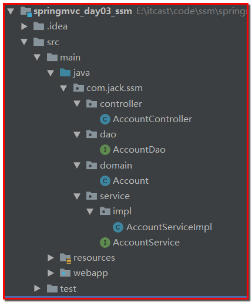

### 1-3.搭建Spring环境
#### 1-3-1.applicationContext.xml
**在resources目录中创建applicationContext.xml(Spring容器，管理Bean)配置文件**
```java
<?xml version="1.0" encoding="UTF-8"?>
<beans xmlns="http://www.springframework.org/schema/beans"
       xmlns:xsi="http://www.w3.org/2001/XMLSchema-instance"
       xmlns:context="http://www.springframework.org/schema/context"
       xmlns:aop="http://www.springframework.org/schema/aop"
       xmlns:tx="http://www.springframework.org/schema/tx"
       xsi:schemaLocation="http://www.springframework.org/schema/beans
   http://www.springframework.org/schema/beans/spring-beans.xsd
   http://www.springframework.org/schema/context
   http://www.springframework.org/schema/context/spring-context.xsd
   http://www.springframework.org/schema/aop
   http://www.springframework.org/schema/aop/spring-aop.xsd
   http://www.springframework.org/schema/tx
   http://www.springframework.org/schema/tx/spring-tx.xsd">
    <!-- 开启注解扫描 -->
    <context:component-scan base-package="com.jack.ssm">
        <!-- 不扫描Controller注解 -->
        <context:exclude-filter type="annotation" expression="org.springframework.stereotype.Controller"/>
    </context:component-scan>
</beans>
```
#### 1-3-2.log4j.properties日志文件
```properties
# Set root category priority to INFO and its only appender to CONSOLE.
#log4j.rootCategory=INFO, CONSOLE            debug   info   warn error fatal
log4j.rootCategory=info, CONSOLE, LOGFILE

# Set the enterprise logger category to FATAL and its only appender to CONSOLE.
log4j.logger.org.apache.axis.enterprise=FATAL, CONSOLE

# CONSOLE is set to be a ConsoleAppender using a PatternLayout.
log4j.appender.CONSOLE=org.apache.log4j.ConsoleAppender
log4j.appender.CONSOLE.layout=org.apache.log4j.PatternLayout
log4j.appender.CONSOLE.layout.ConversionPattern=%d{ISO8601} %-6r [%15.15t] %-5p %30.30c %x - %m\n

# LOGFILE is set to be a File appender using a PatternLayout.
log4j.appender.LOGFILE=org.apache.log4j.FileAppender
log4j.appender.LOGFILE.File=d:/axis.log
log4j.appender.LOGFILE.Append=true
log4j.appender.LOGFILE.layout=org.apache.log4j.PatternLayout
log4j.appender.LOGFILE.layout.ConversionPattern=%d{ISO8601} %-6r [%15.15t] %-5p %30.30c %x - %m\n
```
#### 1-3-3.修改service，加上@Service注解
```java
@Service("accountService")
public class AccountServiceImpl implements AccountService {

    @Autowired
    private AccountDao accountDao;

    @Override
    public List<Account> findAll() {
        System.out.println("AccountServiceImpl的findAll()方法执行了...");
        List<Account> accounts = accountDao.findAll();
        return accounts;
    }

    @Override
    public void saveAccount(Account account) {
        System.out.println("AccountServiceImpl的findAll()方法执行了...");
        accountDao.saveAccount(account);
    }
}
```
#### 1-3-4.测试Spring的环境
在项目中编写测试方法，进行测试，创建测试类：com.jack.ssm.test.SpringTest
```java
public class SpringTest {

    @Test
    public void testAccountService() {
        ApplicationContext ac = new ClassPathXmlApplicationContext("applicationContext.xml");
        AccountService accountService = ac.getBean("accountService", AccountService.class);
        accountService.findAll();
    }
}
```
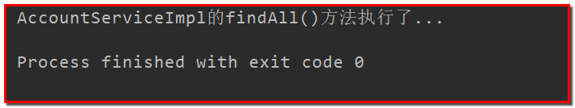

### 1-4.搭建SpringMVC的环境
#### 1-4-1.web.xml和springmvc.xml配置文件
**1.在web.xml中配置DispatcherServlet前端控制器**
```xml
<?xml version="1.0" encoding="UTF-8"?>
<web-app xmlns="http://java.sun.com/xml/ns/javaee"
         xmlns:xsi="http://www.w3.org/2001/XMLSchema-instance"
         xsi:schemaLocation="http://java.sun.com/xml/ns/javaee
		  http://java.sun.com/xml/ns/javaee/web-app_3_0.xsd"
         version="3.0">
  <display-name>Archetype Created Web Application</display-name>
  <!--配置SpringMVC核心控制器-->
  <servlet>
    <servlet-name>dispatcherServlet</servlet-name>
    <servlet-class>org.springframework.web.servlet.DispatcherServlet</servlet-class>
    <init-param>
      <param-name>contextConfigLocation</param-name>
      <param-value>classpath:springmvc.xml</param-value>
    </init-param>
    <!--当web容器启动的时候，加载SpringMVC-->
    <load-on-startup>1</load-on-startup>
  </servlet>
  <servlet-mapping>
    <servlet-name>dispatcherServlet</servlet-name>
    <url-pattern>/</url-pattern>
  </servlet-mapping>
</web-app>
```
**2.在web.xml中配置CharacterEncodingFilter过滤器解决中文乱码**
```xml
<!--解决SpringMVC处理转发的post请求的乱码问题-->
<filter>
  <filter-name>characterEncodingFilter</filter-name>
  <filter-class>org.springframework.web.filter.CharacterEncodingFilter</filter-class>
  <init-param>
    <param-name>encoding</param-name>
    <param-value>utf-8</param-value>
  </init-param>
</filter>
<filter-mapping>
  <filter-name>characterEncodingFilter</filter-name>
  <url-pattern>/*</url-pattern>
</filter-mapping>
```
**3.在resouces下，创建springmvc.xml配置文件**
```xml
<?xml version="1.0" encoding="UTF-8"?>
<beans xmlns="http://www.springframework.org/schema/beans"
       xmlns:mvc="http://www.springframework.org/schema/mvc"
       xmlns:context="http://www.springframework.org/schema/context"
       xmlns:xsi="http://www.w3.org/2001/XMLSchema-instance"
       xsi:schemaLocation="
        http://www.springframework.org/schema/beans
        http://www.springframework.org/schema/beans/spring-beans.xsd
        http://www.springframework.org/schema/mvc
        http://www.springframework.org/schema/mvc/spring-mvc.xsd
        http://www.springframework.org/schema/context
        http://www.springframework.org/schema/context/spring-context.xsd">
    <!--1.组件扫描-->
    <context:component-scan base-package="com.jack.ssm">
        <!--扫描Controller层-->
        <context:include-filter type="annotation" expression="org.springframework.stereotype.Controller"></context:include-filter>
        <!--不扫描service层，让spring去扫描，否则事务会失效-->
        <context:exclude-filter type="annotation" expression="org.springframework.stereotype.Service"></context:exclude-filter>
    </context:component-scan>
    
    <!--2.配置视图解析器-->
    <bean id="viewResolver" class="org.springframework.web.servlet.view.InternalResourceViewResolver">
        <property name="prefix" value="/WEB-INF/pages/"></property>
        <property name="suffix" value=".jsp"></property>
    </bean>
    
    <!--3.开启springmvc注解的支持-->
    <mvc:annotation-driven></mvc:annotation-driven>

    <!--
    忽略静态资源css，js，images，不能让springmvc的核心控制器处理，否则失效
        location=""：指定的是webapp下的所有文件
        mapping=""：表示的映射，核心控制器忽略/js/*，js下的所有静态资源
           /js/**：能匹配js/a/b/jquery.js
           /js/*；能匹配js/jquery.js
    -->
   <mvc:resources location="/images/" mapping="/images/**"/>
   <mvc:resources location="/js/" mapping="/js/**"/>
   <mvc:resources location="/css/" mapping="/css/**"/>
</beans>
```
**注意**
```text
其中：
<context:include-filter type="annotation" expression="org.springframework.stereotype.Controller"/>
表示springmvc的注解包含@Controller的注解。
为什么要包含@Controller注解呢？
(1）SpringMVC IOC容器  存在Controller的实例对象
(2）Spring IOC容器  存在Controller的实例和Service层以及Dao层

重叠会引发一些问题：
		例如：事务失效、相关注解失效
	解决方案一：
		SpringMVC只扫描 @Controller 注解
		Spring不扫描 @Controller 注解
	解决方案二：
		只让SpringMVC扫描，不让Spring扫描
        在springMVC的配置中添加<import resource="applicationContext.xml"></import>
```
#### 1-4-2.AccountController.java
```java
@Controller
@RequestMapping("/account")
public class AccountController {

    @Autowired
    private AccountService accountService;

    @RequestMapping("/findAll")
    public String findAll(Model model) {
        System.out.println("AccountController的findAll方法执行了...");
        List<Account> accounts = accountService.findAll();
        for (Account account : accounts) {
            System.out.println(account);
        }
        model.addAttribute("accounts", accounts);
        return "success";
    }
}
```
#### 1-4-3.index.jsp
```jsp
<%@ page contentType="text/html;charset=UTF-8" language="java" %>
<html>
<head>
    <title>index</title>
</head>
<body>
<h3>账号操作</h3>
<a href="account/findAll">查询所有账号</a>
</body>
</html>
```
#### 1-4-4.success.jsp(/WEB-INF/pages/目录下)
```jsp
<%@ page contentType="text/html;charset=UTF-8" language="java" %>
<html>
<head>
    <title>success</title>
</head>
<body>
<h3 style="color: green;">访问成功！</h3>
</body>
</html>
```
### 1-5.Spring整合SpringMVC框架
目的：在controller层中能够成功调用service层的对象方法(由Spring创建对象，并注入到IOC容器中)
在项目启动的时候，就去加载applicationContext.xml的配置文件，在web.xml中配置ContextLoaderListener监听器（该监听器只能加载WEB-INF目录下的applicationContext.xml的配置文件）。
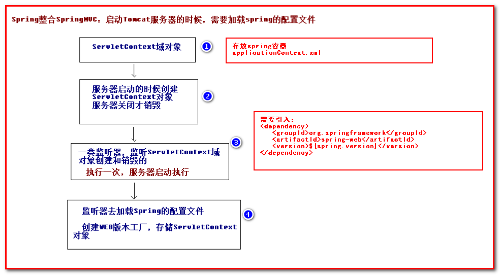
#### 1-5-1.web.xml
```xml
<!--配置spring的监听器，默认加载WEB-INF下的applicationContext.xml-->
<listener>
  <listener-class>org.springframework.web.context.ContextLoaderListener</listener-class>
</listener>
 <!--该监听器默认只加载WEB-INF下的applicationContext.xml配置文件，通过contextConfigLocation改变位置 -->
<context-param>
  <param-name>contextConfigLocation</param-name>
  <param-value>classpath:applicationContext.xml</param-value>
</context-param>
```
#### 1-5-2.AccountController.java
```java
@Controller
@RequestMapping("/account")
public class AccountController {

    @Autowired
    private AccountService accountService;

    /**
     * 测试能否调用service层
     * @return
     */
    @RequestMapping("/findAll")
    public String findAll() {
        System.out.println("AccountController的findAll方法执行了...");
        List<Account> accounts = accountService.findAll();
        for (Account account : accounts) {
            System.out.println(account);
        }
        return "success";
    }
}
```
### 1-6.搭建Mybatis的环境
#### 1-6-1.sqlMapConfig.xml
在resources目录下编写sqlMapConfig.xml配置文件
```xml
<?xml version="1.0" encoding="UTF-8"?>
<!DOCTYPE configuration
        PUBLIC "-//mybatis.org//DTD Config 3.0//EN"
        "http://mybatis.org/dtd/mybatis-3-config.dtd">

<configuration>
    <!--外部配置数据库连接信息-->
    <properties resource="jdbc.properties"/>
    <environments default="mysql">
        <environment id="mysql">
            <transactionManager type="JDBC"/>
            <dataSource type="POOLED">
                <property name="driver" value="${jdbc.driver}"/>
                <property name="url" value="${jdbc.url}"/>
                <property name="username" value="${jdbc.username}"/>
                <property name="password" value="${jdbc.password}"/>
            </dataSource>
        </environment>
    </environments>

    <mappers>
        <!-- <mapper class="com.jack.ssm.dao.AccountDao"/> -->
        <!-- 该包下所有的dao接口都可以使用 -->
        <package name="com.jack.ssm.dao"/>
    </mappers>
</configuration>
```
#### 1-6-2.AccountDao.java
**在AccountDao接口的方法上添加注解，编写SQL语句**
```java
public interface AccountDao {

    @Select("select * from account")
    List<Account> findAll();

    @Insert("insert into account(name, money) values(#{name}, #{money})")
    void saveAccount(Account account);
}
```
#### 1-6-3.MybatisTest.java
在测试环境下，com.jack.ssm.test中，编写测试方法
```java
public class MybatisTest {

    @Test
    public void testFindAll() throws IOException {
        // 加载配置文件
        InputStream in = Resources.getResourceAsStream("sqlMapConfig.xml");
        SqlSessionFactoryBuilder sqlSessionFactoryBuilder = new SqlSessionFactoryBuilder();
        // 创建工厂
        SqlSessionFactory sessionFactory = sqlSessionFactoryBuilder.build(in);
        // 创建session对象
        SqlSession session = sessionFactory.openSession();
        // 获取代理对象
        AccountDao accountDao = session.getMapper(AccountDao.class);

        List<Account> accounts = accountDao.findAll();
        for (Account account : accounts) {
            System.out.println(account);
        }

        // 释放资源
        session.close();
        in.close();
    }

    @Test
    public void saveAccount() throws IOException {
        // 加载配置文件
        InputStream in = Resources.getResourceAsStream("sqlMapConfig.xml");
        SqlSessionFactoryBuilder sqlSessionFactoryBuilder = new SqlSessionFactoryBuilder();
        // 创建工厂
        SqlSessionFactory sessionFactory = sqlSessionFactoryBuilder.build(in);
        // 创建session对象
        SqlSession session = sessionFactory.openSession();
        // 获取代理对象
        AccountDao accountDao = session.getMapper(AccountDao.class);

        Account account = new Account();
        account.setName("杰克");
        account.setMoney(800d);
        accountDao.saveAccount(account);

        // 提交事务
        session.commit();
        // 释放资源
        session.close();
        in.close();
    }
}
```
### 1-7.Spring整合Mybatis框架
#### 1-7-1.applicationContext.xml
**目的：把SqlMapConfig.xml配置文件中的内容配置到applicationContext.xml配置文件中**
```xml
<!--spring整合mybatis-->
<!--去掉sqlMapConfig.xml文件-->
<!--1.加载配置文件jdbc.properties-->
<context:property-placeholder location="classpath:jdbc.properties"></context:property-placeholder>
<!--2.配置c3p0连接池-->
<bean id="dataSource" class="com.mchange.v2.c3p0.ComboPooledDataSource">
    <property name="driverClass" value="${jdbc.driver}"></property>
    <property name="jdbcUrl" value="${jdbc.url}"></property>
    <property name="user" value="${jdbc.username}"></property>
    <property name="password" value="${jdbc.password}"></property>
</bean>
<!--3.创建sqlSessionFactory，mybatis操作的核心-->
<bean id="sqlSessionFactory" class="org.mybatis.spring.SqlSessionFactoryBean">
    <property name="dataSource" ref="dataSource"></property>
</bean>
<!--4.查找映射，找到Mybatis操作dao-->
<bean id="mapperScannerConfigurer" class="org.mybatis.spring.mapper.MapperScannerConfigurer">
    <property name="basePackage" value="com.jack.ssm.dao"></property>
</bean>
```
#### 1-7-2.AccountDao.java
在AccountDao接口中添加@Repository注解，也可以不添加。
```java
//@Repository("accountDao")//该注解可加可不加
public interface AccountDao {

    @Select("select * from account")
    List<Account> findAll();

    @Insert("insert into account(name, money) values(#{name}, #{money})")
    void saveAccount(Account account);
}
```
**测试**
```java
public class SpringTest {

    /**
     * 测试Spring整合Mybatis是否成功
     */
    @Test
    public void testSpringMybatis() {
        ApplicationContext ac = new ClassPathXmlApplicationContext("applicationContext.xml");
        // 直接调用AccountDao的findAll方法测试
        AccountDao accountDao = ac.getBean(AccountDao.class);
        List<Account> accounts = accountDao.findAll();
        for (Account account : accounts) {
            System.out.println(account);
        }
    }
}
```
#### 1-7-3.AccountServiceImpl.java
**在service中注入dao对象**
```java
@Service("accountService")
public class AccountServiceImpl implements AccountService {

    @Autowired
    private AccountDao accountDao;

    @Override
    public List<Account> findAll() {
        System.out.println("AccountServiceImpl的findAll()方法执行了...");
        List<Account> accounts = accountDao.findAll();
        return accounts;
    }

    @Override
    public void saveAccount(Account account) {
        System.out.println("AccountServiceImpl的findAll()方法执行了...");
        accountDao.saveAccount(account);
    }
}
```
#### 1-7-4.AccountController.java
```java
@Controller
@RequestMapping("/account")
public class AccountController {

    @Autowired
    private AccountService accountService;

    @RequestMapping("/findAll")
    public String findAll(Model model) {
        System.out.println("AccountController的findAll方法执行了...");
        List<Account> accounts = accountService.findAll();
        for (Account account : accounts) {
            System.out.println(account);
        }
        model.addAttribute("accounts", accounts);
        return "success";
    }

    @RequestMapping("/save")
    public String saveAccount(Account account) {
        System.out.println("AccountController的saveAccount方法执行了...");
        accountService.saveAccount(account);
        // 保存成功重定向到查询页面
        return "redirect:/account/findAll";
    }
}
```
#### 1-7-5.success.jsp(/WEB-INF/pages/目录下)
```jsp
<%@ page contentType="text/html;charset=UTF-8" language="java" %>
<%@taglib prefix="c" uri="http://java.sun.com/jsp/jstl/core" %>
<html>
<head>
    <title>success</title>
    <style>
        #accounts
        {
            font-family:"Trebuchet MS", Arial, Helvetica, sans-serif;
            width:100%;
            border-collapse:collapse;
        }

        #accounts td, #accounts th
        {
            font-size:1em;
            border:1px solid #98bf21;
            padding:3px 7px 2px 7px;
            text-align:center;
        }

        #accounts th
        {
            font-size:1.1em;
            text-align:center;
            padding-top:5px;
            padding-bottom:4px;
            background-color:#A7C942;
            color:#ffffff;
        }
    </style>
</head>
<body>
<h3 style="color: green;">访问成功！</h3>
<h3 style="color: red;">遍历数据</h3>
<table id="accounts">
    <tr>
        <th>id</th>
        <th>name</th>
        <th>money</th>
    </tr>
    <c:forEach items="${accounts}" var="account">
    <tr>
        <td>${account.id}</td>
        <td>${account.name}</td>
        <td>${account.money}</td>
    </tr>
    </c:forEach>
</table>
</body>
</html>
```
#### 1-7-6.测试
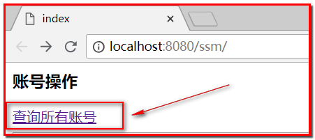

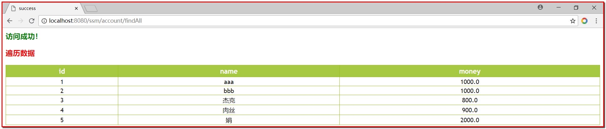

### 1-8.配置Spring的声明式事务管理
#### 1-8-1.applicationContext.xml
```xml
<!--spring的声明式事务处理(xml和注解)-->
<bean id="transactionManager" class="org.springframework.jdbc.datasource.DataSourceTransactionManager">
    <property name="dataSource" ref="dataSource"></property>
</bean>
<!--配置事务通知-->
<tx:advice id="myAdvice" transaction-manager="transactionManager">
    <tx:attributes>
        <tx:method name="find*" read-only="true"/>
        <tx:method name="save*" read-only="false"/>
        <tx:method name="update*" read-only="false"/>
        <tx:method name="delete*" read-only="false"></tx:method>
    </tx:attributes>
</tx:advice>
<!--配置aop增强事务-->
<aop:config>
    <!--切入点-->
    <aop:pointcut id="myPointcut" expression="execution(* com.jack.ssm.service..*.*(..))"></aop:pointcut>
    <!--让他通知关联切入点-->
    <aop:advisor advice-ref="myAdvice" pointcut-ref="myPointcut"></aop:advisor>
</aop:config>
```
#### 1-8-2.index.jsp
```jsp
<h3>保存账号</h3>
<form method="post" action="account/save">
    姓名：<input type="text" name="name"><br>
    金额：<input type="text" name="money"><br>
    <input type="submit" value="保存">
</form>
```
#### 1-8-3.AccountController.java
```java
@Controller
@RequestMapping("/account")
public class AccountController {

    @Autowired
    private AccountService accountService;

    @RequestMapping("/findAll")
    public String findAll(Model model) {
        System.out.println("AccountController的findAll方法执行了...");
        List<Account> accounts = accountService.findAll();
        for (Account account : accounts) {
            System.out.println(account);
        }
        model.addAttribute("accounts", accounts);
        return "success";
    }

    @RequestMapping("/save")
    public String saveAccount(Account account) {
        System.out.println("AccountController的saveAccount方法执行了...");
        accountService.saveAccount(account);
        // 保存成功重定向到查询页面
        return "redirect:/account/findAll";
    }
}
```
#### 1-8-4.测试
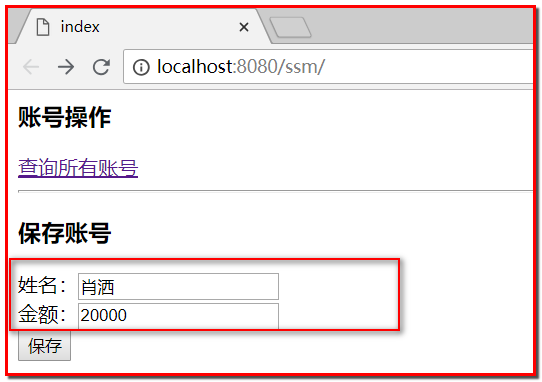

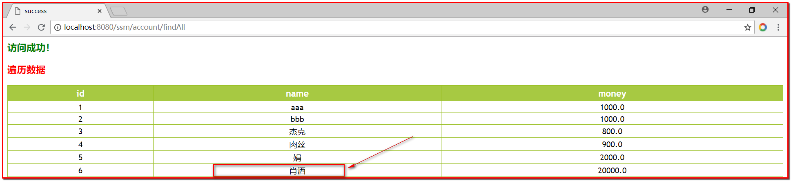

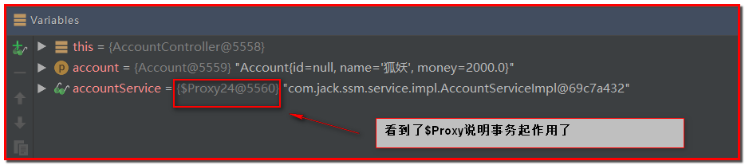

### 1-9.让SpringMVC扫描，不让Spring扫描
#### 1-9-1.配置springmvc.xml
```xml
<?xml version="1.0" encoding="UTF-8"?>
<beans xmlns="http://www.springframework.org/schema/beans"
       xmlns:mvc="http://www.springframework.org/schema/mvc"
       xmlns:context="http://www.springframework.org/schema/context"
       xmlns:xsi="http://www.w3.org/2001/XMLSchema-instance"
       xsi:schemaLocation="
        http://www.springframework.org/schema/beans
        http://www.springframework.org/schema/beans/spring-beans.xsd
        http://www.springframework.org/schema/mvc
        http://www.springframework.org/schema/mvc/spring-mvc.xsd
        http://www.springframework.org/schema/context
        http://www.springframework.org/schema/context/spring-context.xsd">
    <!--1.组件扫描-->
    <context:component-scan base-package="com.jack.ssm">
        <!--扫描Controller层-->
        <context:include-filter type="annotation" expression="org.springframework.stereotype.Controller"></context:include-filter>
        <!--不扫描service层，让spring去扫描，否则事务会失效-->
        <context:exclude-filter type="annotation" expression="org.springframework.stereotype.Service"></context:exclude-filter>
    </context:component-scan>
    <!--2.配置视图解析器-->
    <bean id="viewResolver" class="org.springframework.web.servlet.view.InternalResourceViewResolver">
        <property name="prefix" value="/WEB-INF/pages/"></property>
        <property name="suffix" value=".jsp"></property>
    </bean>
    <!--3.开启springmvc注解的支持-->
    <mvc:annotation-driven></mvc:annotation-driven>

    <!--
    忽略静态资源css，js，images，不能让springmvc的核心控制器处理，否则失效
        location=""：指定的是webapp下的所有文件
        mapping=""：表示的映射，核心控制器忽略/js/*，js下的所有静态资源
           /js/**：能匹配js/a/b/jquery.js
           /js/*；能匹配js/jquery.js
    -->
    <mvc:resources location="/images/" mapping="/images/**"/>
    <mvc:resources location="/js/" mapping="/js/**"/>
    <mvc:resources location="/css/" mapping="/css/**"/>

    <!--引入applicationContext.xml，让springmvc去扫描包-->
    <import resource="applicationContext.xml" />
</beans>
```
#### 1-9-2.配置springContext.xml
```xml
<?xml version="1.0" encoding="UTF-8"?>
<beans xmlns="http://www.springframework.org/schema/beans"
       xmlns:xsi="http://www.w3.org/2001/XMLSchema-instance"
       xmlns:context="http://www.springframework.org/schema/context"
       xmlns:aop="http://www.springframework.org/schema/aop"
       xmlns:tx="http://www.springframework.org/schema/tx"
       xsi:schemaLocation="http://www.springframework.org/schema/beans
   http://www.springframework.org/schema/beans/spring-beans.xsd
   http://www.springframework.org/schema/context
   http://www.springframework.org/schema/context/spring-context.xsd
   http://www.springframework.org/schema/aop
   http://www.springframework.org/schema/aop/spring-aop.xsd
   http://www.springframework.org/schema/tx
   http://www.springframework.org/schema/tx/spring-tx.xsd">
    <!-- 开启注解扫描 -->
    <context:component-scan base-package="com.jack.ssm">
        <!--不扫描Controller注解-->
        <context:exclude-filter type="annotation" expression="org.springframework.stereotype.Controller"/>
    </context:component-scan>


    <!--spring整合mybatis-->
    <!--去掉sqlMapConfig.xml文件-->
    <!--1.加载配置文件jdbc.properties-->
    <context:property-placeholder location="classpath:jdbc.properties"></context:property-placeholder>
    <!--2.配置c3p0连接池-->
    <bean id="dataSource" class="com.mchange.v2.c3p0.ComboPooledDataSource">
        <property name="driverClass" value="${jdbc.driver}"></property>
        <property name="jdbcUrl" value="${jdbc.url}"></property>
        <property name="user" value="${jdbc.username}"></property>
        <property name="password" value="${jdbc.password}"></property>
    </bean>
    <!--3.创建sqlSessionFactory，mybatis操作的核心-->
    <bean id="sqlSessionFactory" class="org.mybatis.spring.SqlSessionFactoryBean">
        <property name="dataSource" ref="dataSource"></property>
    </bean>
    <!--4.查找映射，找到Mybatis操作dao-->
    <bean id="mapperScannerConfigurer" class="org.mybatis.spring.mapper.MapperScannerConfigurer">
        <property name="basePackage" value="com.jack.ssm.dao"></property>
    </bean>

    <!--spring的声明式事务处理(xml和注解)-->
    <bean id="transactionManager" class="org.springframework.jdbc.datasource.DataSourceTransactionManager">
        <property name="dataSource" ref="dataSource"></property>
    </bean>
    <!--配置事务通知-->
    <tx:advice id="myAdvice" transaction-manager="transactionManager">
        <tx:attributes>
            <tx:method name="find*" read-only="true"/>
            <tx:method name="save*" read-only="false"/>
            <tx:method name="update*" read-only="false"/>
            <tx:method name="delete*" read-only="false"></tx:method>
        </tx:attributes>
    </tx:advice>
    <!--配置aop增强事务-->
    <aop:config>
        <!--切入点-->
        <aop:pointcut id="myPointcut" expression="execution(* com.jack.ssm.service..*.*(..))"></aop:pointcut>
        <!--让他通知关联切入点-->
        <aop:advisor advice-ref="myAdvice" pointcut-ref="myPointcut"></aop:advisor>
    </aop:config>
</beans>
```
#### 1-9-3.去掉web.xml中的监听器
```xml
<!--让SpringMVC去扫描，去掉spring的监听器-->
<!--配置spring的监听器，默认加载WEB-INF下的applicationContext.xml-->
<!--<listener>
  <listener-class>org.springframework.web.context.ContextLoaderListener</listener-class>
</listener>-->
 <!--该监听器默认只加载WEB-INF下的applicationContext.xml配置文件，通过contextConfigLocation改变位置 -->
<!--<context-param>
  <param-name>contextConfigLocation</param-name>
  <param-value>classpath:applicationContext.xml</param-value>
</context-param>-->
```
## 2.SSM整合案例-用户注册/登录
### 2-1.ssm配置
#### 2-1-1.web.xml
```xml
<?xml version="1.0" encoding="UTF-8"?>
<web-app xmlns="http://java.sun.com/xml/ns/javaee"
         xmlns:xsi="http://www.w3.org/2001/XMLSchema-instance"
         xsi:schemaLocation="http://java.sun.com/xml/ns/javaee
		  http://java.sun.com/xml/ns/javaee/web-app_3_0.xsd"
         version="3.0">
  <display-name>Archetype Created Web Application</display-name>
  <!--配置springmvc核心控制器-->
  <servlet>
    <servlet-name>dispatcherServlet</servlet-name>
    <servlet-class>org.springframework.web.servlet.DispatcherServlet</servlet-class>
    <init-param>
      <param-name>contextConfigLocation</param-name>
      <param-value>classpath:springmvc.xml</param-value>
    </init-param>
    <!--当web容器启动的时候，加载springmvc-->
    <load-on-startup>1</load-on-startup>
  </servlet>
  <servlet-mapping>
    <servlet-name>dispatcherServlet</servlet-name>
    <url-pattern>/</url-pattern>
  </servlet-mapping>
  <!--解决springmvc处理转发的post请求的乱码问题-->
  <filter>
    <filter-name>characterEncodingFilter</filter-name>
    <filter-class>org.springframework.web.filter.CharacterEncodingFilter</filter-class>
    <init-param>
      <param-name>encoding</param-name>
      <param-value>utf-8</param-value>
    </init-param>
  </filter>
  <filter-mapping>
    <filter-name>characterEncodingFilter</filter-name>
    <url-pattern>/*</url-pattern>
  </filter-mapping>
</web-app>
```
#### 2-1-2.applicationContext.xml
```xml
<?xml version="1.0" encoding="UTF-8"?>
<beans xmlns="http://www.springframework.org/schema/beans"
       xmlns:xsi="http://www.w3.org/2001/XMLSchema-instance"
       xmlns:context="http://www.springframework.org/schema/context"
       xmlns:aop="http://www.springframework.org/schema/aop"
       xmlns:tx="http://www.springframework.org/schema/tx"
       xsi:schemaLocation="http://www.springframework.org/schema/beans
   http://www.springframework.org/schema/beans/spring-beans.xsd
   http://www.springframework.org/schema/context
   http://www.springframework.org/schema/context/spring-context.xsd
   http://www.springframework.org/schema/aop
   http://www.springframework.org/schema/aop/spring-aop.xsd
   http://www.springframework.org/schema/tx
   http://www.springframework.org/schema/tx/spring-tx.xsd">
    <!-- 开启注解扫描 -->
    <context:component-scan base-package="com.jack.ssm">
        <!--不扫描Controller注解-->
        <context:exclude-filter type="annotation" expression="org.springframework.stereotype.Controller"/>
    </context:component-scan>


    <!--spring整合mybatis-->
    <!--去掉sqlMapConfig.xml文件-->
    <!--1.加载配置文件jdbc.properties-->
    <context:property-placeholder location="classpath:jdbc.properties"></context:property-placeholder>
    <!--2.配置c3p0连接池-->
    <bean id="dataSource" class="com.mchange.v2.c3p0.ComboPooledDataSource">
        <property name="driverClass" value="${jdbc.driver}"></property>
        <property name="jdbcUrl" value="${jdbc.url}"></property>
        <property name="user" value="${jdbc.username}"></property>
        <property name="password" value="${jdbc.password}"></property>
    </bean>
    <!--3.创建sqlSessionFactory，mybatis操作的核心-->
    <bean id="sqlSessionFactory" class="org.mybatis.spring.SqlSessionFactoryBean">
        <property name="dataSource" ref="dataSource"></property>
    </bean>
    <!--4.查找映射，找到Mybatis操作dao-->
    <bean id="mapperScannerConfigurer" class="org.mybatis.spring.mapper.MapperScannerConfigurer">
        <property name="basePackage" value="com.jack.ssm.dao"></property>
    </bean>

    <!--spring的声明式事务处理(xml和注解)-->
    <bean id="transactionManager" class="org.springframework.jdbc.datasource.DataSourceTransactionManager">
        <property name="dataSource" ref="dataSource"></property>
    </bean>
    <!--配置事务通知-->
    <tx:advice id="myAdvice" transaction-manager="transactionManager">
        <tx:attributes>
            <tx:method name="find*" read-only="true"/>
            <tx:method name="save*" read-only="false"/>
            <tx:method name="update*" read-only="false"/>
            <tx:method name="delete*" read-only="false"></tx:method>
        </tx:attributes>
    </tx:advice>
    <!--配置aop增强事务-->
    <aop:config>
        <!--切入点-->
        <aop:pointcut id="myPointcut" expression="execution(* com.jack.ssm.service..*.*(..))"></aop:pointcut>
        <!--让他通知关联切入点-->
        <aop:advisor advice-ref="myAdvice" pointcut-ref="myPointcut"></aop:advisor>
    </aop:config>
</beans>
```
#### 2-1-3.springmvc.xml
```xml
<?xml version="1.0" encoding="UTF-8"?>
<beans xmlns="http://www.springframework.org/schema/beans"
       xmlns:mvc="http://www.springframework.org/schema/mvc"
       xmlns:context="http://www.springframework.org/schema/context"
       xmlns:xsi="http://www.w3.org/2001/XMLSchema-instance"
       xsi:schemaLocation="
        http://www.springframework.org/schema/beans
        http://www.springframework.org/schema/beans/spring-beans.xsd
        http://www.springframework.org/schema/mvc
        http://www.springframework.org/schema/mvc/spring-mvc.xsd
        http://www.springframework.org/schema/context
        http://www.springframework.org/schema/context/spring-context.xsd">
    <!--1.组件扫描-->
    <context:component-scan base-package="com.jack.ssm">
        <!--扫描Controller层-->
        <context:include-filter type="annotation" expression="org.springframework.stereotype.Controller"></context:include-filter>
        <!--不扫描service层，让spring去扫描，否则事务会失效-->
        <context:exclude-filter type="annotation" expression="org.springframework.stereotype.Service"></context:exclude-filter>
    </context:component-scan>
    <!--2.配置视图解析器-->
    <bean id="viewResolver" class="org.springframework.web.servlet.view.InternalResourceViewResolver">
        <property name="prefix" value="/WEB-INF/pages/"></property>
        <property name="suffix" value=".jsp"></property>
    </bean>
    <!--3.开启springmvc注解的支持-->
    <mvc:annotation-driven></mvc:annotation-driven>

    <!--静态资源不拦截，简写方式-->
    <mvc:default-servlet-handler></mvc:default-servlet-handler>
    <!--引入applicationContext.xml，让springmvc去扫描包-->
    <import resource="applicationContext.xml" />

    <!--配置拦截器-->
    <mvc:interceptors>
        <mvc:interceptor>
            <mvc:mapping path="/user/*"></mvc:mapping>
            <mvc:exclude-mapping path="/user/login"></mvc:exclude-mapping>
            <bean class="com.jack.ssm.interceptor.LoginInterceptor"></bean>
        </mvc:interceptor>
    </mvc:interceptors>
</beans>
```
### 2-2.用户注册
#### 2-2-1.数据库表设计
```sql
create table `user` (
    `number` varchar(40) not null,
    `name` VARCHAR(20) DEFAULT NULL,
    `password` VARCHAR(60) DEFAULT NULL,
    `mobile` VARCHAR(11) DEFAULT NULL,
    `qq` VARCHAR(11) DEFAULT NULL,
    `email` VARCHAR(60) DEFAULT NULL,
    primary key (`number`)
) ENGINE=INNODB DEFAULT CHARSET = utf8;
```
#### 2-2-2.创建工程并添加maven依赖
项目名：springmvc_day03_register
指定：
key：archetypeCatalog
value：internal

**pom.xml**
```xml
<?xml version="1.0" encoding="UTF-8"?>

<project xmlns="http://maven.apache.org/POM/4.0.0" xmlns:xsi="http://www.w3.org/2001/XMLSchema-instance"
  xsi:schemaLocation="http://maven.apache.org/POM/4.0.0 http://maven.apache.org/xsd/maven-4.0.0.xsd">
  <modelVersion>4.0.0</modelVersion>

  <groupId>com.jack</groupId>
  <artifactId>springmvc_day03_register</artifactId>
  <version>1.0-SNAPSHOT</version>
  <packaging>war</packaging>

  <name>springmvc_day03_register Maven Webapp</name>
  <!-- FIXME change it to the project's website -->
  <url>http://www.example.com</url>

  <properties>
    <project.build.sourceEncoding>UTF-8</project.build.sourceEncoding>
    <maven.compiler.source>1.8</maven.compiler.source>
    <maven.compiler.target>1.8</maven.compiler.target>
    <spring.version>5.0.2.RELEASE</spring.version>
    <slf4j.version>1.6.6</slf4j.version>
    <log4j.version>1.2.12</log4j.version>
    <mysql.version>5.1.6</mysql.version>
    <mybatis.version>3.4.5</mybatis.version>
  </properties>

  <dependencies>

    <!-- spring的aop -->
    <dependency>
      <groupId>org.aspectj</groupId>
      <artifactId>aspectjweaver</artifactId>
      <version>1.6.8</version>
    </dependency>

    <dependency>
      <groupId>org.springframework</groupId>
      <artifactId>spring-aop</artifactId>
      <version>${spring.version}</version>
    </dependency>
    <!--spring的核心-->
    <dependency>
      <groupId>org.springframework</groupId>
      <artifactId>spring-context</artifactId>
      <version>${spring.version}</version>
    </dependency>
    <!--spring整合web，当web容器启动的时候，加载spring-->
    <dependency>
      <groupId>org.springframework</groupId>
      <artifactId>spring-web</artifactId>
      <version>${spring.version}</version>
    </dependency>
    <!--spring的mvc-->
    <dependency>
      <groupId>org.springframework</groupId>
      <artifactId>spring-webmvc</artifactId>
      <version>${spring.version}</version>
    </dependency>
    <!--spring整合junit-->
    <dependency>
      <groupId>org.springframework</groupId>
      <artifactId>spring-test</artifactId>
      <version>${spring.version}</version>
    </dependency>
    <!--spring的事务处理-->
    <dependency>
      <groupId>org.springframework</groupId>
      <artifactId>spring-tx</artifactId>
      <version>${spring.version}</version>
    </dependency>

    <dependency>
      <groupId>org.springframework</groupId>
      <artifactId>spring-jdbc</artifactId>
      <version>${spring.version}</version>
    </dependency>

    <dependency>
      <groupId>junit</groupId>
      <artifactId>junit</artifactId>
      <version>4.12</version>
      <scope>compile</scope>
    </dependency>

    <dependency>
      <groupId>mysql</groupId>
      <artifactId>mysql-connector-java</artifactId>
      <version>${mysql.version}</version>
    </dependency>

    <dependency>
      <groupId>javax.servlet</groupId>
      <artifactId>servlet-api</artifactId>
      <version>2.5</version>
      <scope>provided</scope>
    </dependency>

    <dependency>
      <groupId>javax.servlet.jsp</groupId>
      <artifactId>jsp-api</artifactId>
      <version>2.0</version>
      <scope>provided</scope>
    </dependency>
    <!--jstl表达式-->
    <dependency>
      <groupId>jstl</groupId>
      <artifactId>jstl</artifactId>
      <version>1.2</version>
    </dependency>

    <!-- log start -->
    <dependency>
      <groupId>log4j</groupId>
      <artifactId>log4j</artifactId>
      <version>${log4j.version}</version>
    </dependency>

    <dependency>
      <groupId>org.slf4j</groupId>
      <artifactId>slf4j-api</artifactId>
      <version>${slf4j.version}</version>
    </dependency>

    <dependency>
      <groupId>org.slf4j</groupId>
      <artifactId>slf4j-log4j12</artifactId>
      <version>${slf4j.version}</version>
    </dependency>
    <!-- log end -->
    <dependency>
      <groupId>org.mybatis</groupId>
      <artifactId>mybatis</artifactId>
      <version>${mybatis.version}</version>
    </dependency>
    <!--spring整合Mybatis的jar包-->
    <dependency>
      <groupId>org.mybatis</groupId>
      <artifactId>mybatis-spring</artifactId>
      <version>1.3.0</version>
    </dependency>

    <dependency>
      <groupId>c3p0</groupId>
      <artifactId>c3p0</artifactId>
      <version>0.9.1.2</version>
      <type>jar</type>
      <scope>compile</scope>
    </dependency>

  </dependencies>

  <build>
    <finalName>ssm</finalName>
    <pluginManagement>
      <plugins>
        <plugin>
          <groupId>org.apache.maven.plugins</groupId>
          <artifactId>maven-compiler-plugin</artifactId>
          <version>3.2</version>
          <configuration>
            <source>1.8</source>
            <target>1.8</target>
            <encoding>UTF-8</encoding>
            <showWarnings>true</showWarnings>
          </configuration>
        </plugin>
        <plugin>
          <groupId>org.apache.tomcat.maven</groupId>
          <artifactId>tomcat7-maven-plugin</artifactId>
          <version>2.2</version>
          <!--插件使用的相关配置-->
          <configuration>
            <!--端口号-->
            <port>18881</port>
            <!--写当前项目的名字(虚拟路径),如果写/，那么每次访问项目就不需要加项目名字了-->
            <path>/</path>
            <!--解决get请求乱码-->
            <uriEncoding>UTF-8</uriEncoding>
          </configuration>
        </plugin>
      </plugins>
    </pluginManagement>
  </build>
</project>
```
#### 2-2-3.创建User.java
```java
public class User implements Serializable {

    private String number;
    private String name;
    private String password;
    private String mobile;
    private String qq;
    private String email;
	// ...
}
```
#### 2-2-4.注册页面
拷贝页面到webapp目录下
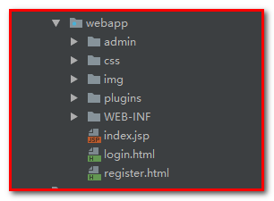

#### 2-2-5.创建UserController.java
```java
@Controller
@RequestMapping("/user")
public class UserController {

    @Autowired
    private UserService userService;

    @RequestMapping("/login")
    public String login(User user, HttpSession session) {
        User loginUser = userService.findByNumberAndPassword(user);
        if (loginUser != null) {
            session.setAttribute("loginUser", loginUser);
        }
        return "admin/index";
    }

    @RequestMapping("/save")
    public String saveUser(User user) {
        System.out.println("UserController的saveUser方法执行了...");
        int i = userService.saveUser(user);
        if (i > 0) { // 注册成功
            return "redirect:/login.html";
        } else { // 注册失败
            return "redirect:/register.html";
        }
    }
}
```
#### 2-2-6.创建接口UserService和实现类UserServiceImpl
**UserService.java**
```java
public interface UserService {

    List<User> findAll();

    int saveUser(User user);

    User findByNumberAndPassword(User user);
}
```
**UserServiceImpl**
```java
@Service("userService")
public class UserServiceImpl implements UserService {

    @Autowired
    private UserDao userDao;

    @Override
    public List<User> findAll() {
        System.out.println("UserServiceImpl的findAll方法执行了...");
        List<User> users = userDao.findAll();
        for (User user : users) {
            System.out.println(user);
        }
        return users;
    }

    @Override
    public int saveUser(User user) {
        System.out.println("UserServiceImpl的saveUser方法执行了...");
        return userDao.saveUser(user);
    }

    @Override
    public User findByNumberAndPassword(User user) {
        return userDao.findByNumberAndPassword(user);
    }
}
```
#### 2-2-7.创建接口UserDao
```java
public interface UserDao {

    @Select("select * from user")
    List<User> findAll();

    @Insert("insert into user(number,password,mobile) values(#{number}, #{password}, #{mobile})")
    int saveUser(User user);

    @Select(value = "select * from user where number = #{number} and password = #{password}")
    User findByNumberAndPassword(User user);
}
```
#### 2-2-8.register.html测试
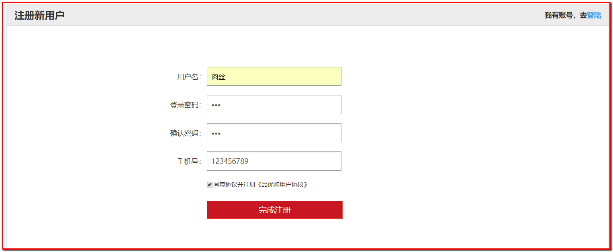

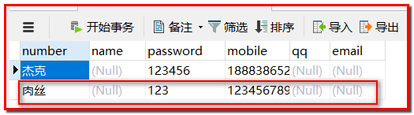

** 修改register.html页面**
```html
<form id="registerForm" action="user/save" method="post" class="sui-form form-horizontal">
	<!--添加一个隐藏域，防止注册请求被拦截-->
					<div class="control-group">
						<label for="register" class="control-label">&nbsp;&nbsp;&nbsp;&nbsp;&nbsp;&nbsp;</label>
						<div class="controls">
							<input name="register" type="hidden" value="register">
						</div>
					</div>
					<div class="control-group">
						<label class="control-label">用户名：</label>
						<div class="controls">
							<input type="text" name="number" placeholder="请输入你的用户名" class="input-xfat input-xlarge">
						</div>
					</div>
					<div class="control-group">
						<label for="inputPassword" class="control-label">登录密码：</label>
						<div class="controls">
							<input type="password" id="password" name="password" placeholder="设置登录密码" class="input-xfat input-xlarge">
						</div>
					</div>
					<div class="control-group">
						<label for="inputPassword" class="control-label">确认密码：</label>
						<div class="controls">
							<input type="password" id="confirmPassword" placeholder="再次确认密码" class="input-xfat input-xlarge">
						</div>
					</div>
					
					<div class="control-group">
						<label class="control-label">手机号：</label>
						<div class="controls">
							<input type="text" name="mobile" placeholder="请输入你的手机号" class="input-xfat input-xlarge">
						</div>
					</div>
					
					<div class="control-group">
						<label for="inputPassword" class="control-label">&nbsp;&nbsp;&nbsp;&nbsp;&nbsp;&nbsp;</label>
						<div class="controls">
							<input name="m1" type="checkbox" value="2" checked=""><span>同意协议并注册《品优购用户协议》</span>
						</div>
					</div>
					<div class="control-group">
						<label class="control-label"></label>
						<div class="controls btn-reg">
							<button class="sui-btn btn-block btn-xlarge btn-danger" type="button" id="registerBtn">完成注册</button>
						</div>
					</div>
				</form>
```
**实现密码输入框的页面校验**
```html
<script src="plugins/jQuery/jquery-2.2.3.min.js"></script>
<script>
	$(function(){
	    $("#registerBtn").click(function(){
	        var password = $("#password").val();
	        var confirmPassword = $("#confirmPassword").val();
	        if(password == confirmPassword){
	            $("#registerForm").submit();
			}
			else{
                alert("2次密码输入的不一致");
			}
		})
	})
</script>
```
#### 2-2-9.关于路径问题
**使用jsp**
* 使用绝对路径：${pageContext.request.contextPath}

**使用html**
* 使用绝对路径/
* 最好使用相对路径（webapp）：
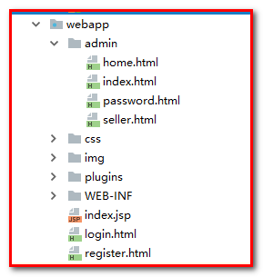

**./ 表示当前路径，../表示上一级路径**

### 2-3.用户注册
#### 2-3-1.login.html登录页面
```html
<form id="subForm" action="user/login" method="post" class="sui-form">
								<div class="input-prepend"><span class="add-on loginname"></span>
									<input id="prependedInput" type="text" name="number" placeholder="邮箱/用户名/手机号" class="span2 input-xfat">
								</div>
								<div class="input-prepend"><span class="add-on loginpwd"></span>
									<input id="prependedInput" type="password" name="password" placeholder="请输入密码" class="span2 input-xfat">
								</div>
								<div class="setting">
									<label class="checkbox inline"><input name="m1" type="checkbox" value="2" checked="">自动登录</label>
									<span class="forget">忘记密码？</span>
								</div>
								<div class="logined">
									<button class="sui-btn btn-block btn-xlarge btn-danger" type="submit">登&nbsp;&nbsp;录</button>
								</div>
							</form>
```
#### 2-3-2.在WEB-INF/pages/目录下新建welcome.jsp
```jsp
<%@ page contentType="text/html;charset=UTF-8" language="java" %>
<html>
<head>
    <title>welcome</title>
</head>
<body>
<h3 style="color: blue;">欢迎用户：${sessionScope.loginUser.number}</h3>
</body>
</html>
```
#### 2-3-3.UserController.java
```java
@Controller
@RequestMapping("/user")
public class UserController {

    @Autowired
    private UserService userService;

    /*@RequestMapping("/login")
    public String login(User user, HttpSession session) {
        User loginUser = userService.findByNumberAndPassword(user);
        if (loginUser != null) {
            session.setAttribute("loginUser", loginUser);
        }
        return "admin/index";
    }*/
    @RequestMapping("/login")
    public String login(User user, HttpSession session) {
        User loginUser = userService.findByNumberAndPassword(user);
        if (loginUser != null) {
            session.setAttribute("loginUser", loginUser);
        }
        return "admin/welcome";
    }

    @RequestMapping("/save")
    public String saveUser(User user) {
        System.out.println("UserController的saveUser方法执行了...");
        int i = userService.saveUser(user);
        if (i > 0) { // 注册成功
            return "redirect:/login.html";
        } else { // 注册失败
            return "redirect:/register.html";
        }
    }
}
```
#### 2-3-4.UserServiceImpl.java
```java
@Service("userService")
public class UserServiceImpl implements UserService {

    @Autowired
    private UserDao userDao;

    @Override
    public List<User> findAll() {
        System.out.println("UserServiceImpl的findAll方法执行了...");
        List<User> users = userDao.findAll();
        for (User user : users) {
            System.out.println(user);
        }
        return users;
    }

    @Override
    public int saveUser(User user) {
        System.out.println("UserServiceImpl的saveUser方法执行了...");
        return userDao.saveUser(user);
    }

    @Override
    public User findByNumberAndPassword(User user) {
        return userDao.findByNumberAndPassword(user);
    }
}
```
#### 2-3-5.UserDao.java
```java
public interface UserDao {

    @Select("select * from user")
    List<User> findAll();

    @Insert("insert into user(number,password,mobile) values(#{number}, #{password}, #{mobile})")
    int saveUser(User user);

    @Select(value = "select * from user where number = #{number} and password = #{password}")
    User findByNumberAndPassword(User user);
}
```
#### 2-3-6.登录成功，重定向到欢迎页
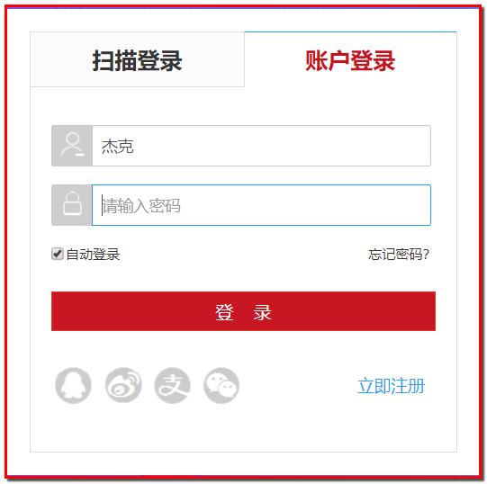

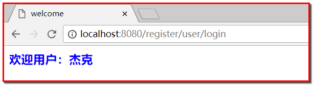

### 2-4.整合拦截器
需求：
* 用户如果已经登录，可以访问
* 用户如果没有登录，则不能访问欢迎页
#### 2-4-1.LoginInterceptor.java
```java
public class LoginInterceptor implements HandlerInterceptor {

    /**
     * 在访问Controller之前进行拦截
     * @param request
     * @param response
     * @param handler
     * @return
     * @throws Exception
     */
    @Override
    public boolean preHandle(HttpServletRequest request, HttpServletResponse response, Object handler) throws Exception {
        // 如果是注册不拦截
        String register = request.getParameter("register");
        if ("register".equals(register)) {
            return true;
        }
        User loginUser = (User) request.getSession().getAttribute("loginUser");
        // 如果没有登录，那么跳转到登录页面
        if (loginUser == null) {
            response.sendRedirect(request.getContextPath() + "/login.html");
            return false; // 拦截，不放行
        }
        return true; // 放行
    }
}
```
#### 2-4-2.springmvc.xml
```xml
<!--配置拦截器-->
<mvc:interceptors>
    <mvc:interceptor>
        <mvc:mapping path="/user/*"></mvc:mapping>
        <mvc:exclude-mapping path="/user/login"></mvc:exclude-mapping>
        <bean class="com.jack.ssm.interceptor.LoginInterceptor"></bean>
    </mvc:interceptor>
</mvc:interceptors>
```
## 3.Maven的tomcat插件使用
### 3-1.在pom.xml中配置tomcat插件
```xml
<?xml version="1.0" encoding="UTF-8"?>

<project xmlns="http://maven.apache.org/POM/4.0.0" xmlns:xsi="http://www.w3.org/2001/XMLSchema-instance"
  xsi:schemaLocation="http://maven.apache.org/POM/4.0.0 http://maven.apache.org/xsd/maven-4.0.0.xsd">
  <modelVersion>4.0.0</modelVersion>

  <groupId>com.jack</groupId>
  <artifactId>springmvc_day03_register</artifactId>
  <version>1.0-SNAPSHOT</version>
  <packaging>war</packaging>

  <name>springmvc_day03_register Maven Webapp</name>
  <!-- FIXME change it to the project's website -->
  <url>http://www.example.com</url>

  <properties>
    <project.build.sourceEncoding>UTF-8</project.build.sourceEncoding>
    <maven.compiler.source>1.8</maven.compiler.source>
    <maven.compiler.target>1.8</maven.compiler.target>
    <spring.version>5.0.2.RELEASE</spring.version>
    <slf4j.version>1.6.6</slf4j.version>
    <log4j.version>1.2.12</log4j.version>
    <mysql.version>5.1.6</mysql.version>
    <mybatis.version>3.4.5</mybatis.version>
  </properties>

  <dependencies>
	<!--省略...-->
  </dependencies>

  <build>
    <finalName>ssm</finalName>
    <pluginManagement>
      <plugins>
        <plugin>
          <groupId>org.apache.maven.plugins</groupId>
          <artifactId>maven-compiler-plugin</artifactId>
          <version>3.2</version>
          <configuration>
            <source>1.8</source>
            <target>1.8</target>
            <encoding>UTF-8</encoding>
            <showWarnings>true</showWarnings>
          </configuration>
        </plugin>
		<!--maven引入tomcat插件-->
        <plugin>
          <groupId>org.apache.tomcat.maven</groupId>
          <artifactId>tomcat7-maven-plugin</artifactId>
          <version>2.2</version>
          <!--插件使用的相关配置-->
          <configuration>
            <!--端口号-->
            <port>18881</port>
            <!--写当前项目的名字(虚拟路径),如果写/，那么每次访问项目就不需要加项目名字了-->
            <path>/</path>
            <!--解决get请求乱码-->
            <uriEncoding>UTF-8</uriEncoding>
          </configuration>
        </plugin>
      </plugins>
    </pluginManagement>
  </build>
</project>
```
### 3-2.去掉web项目的tomcat配置
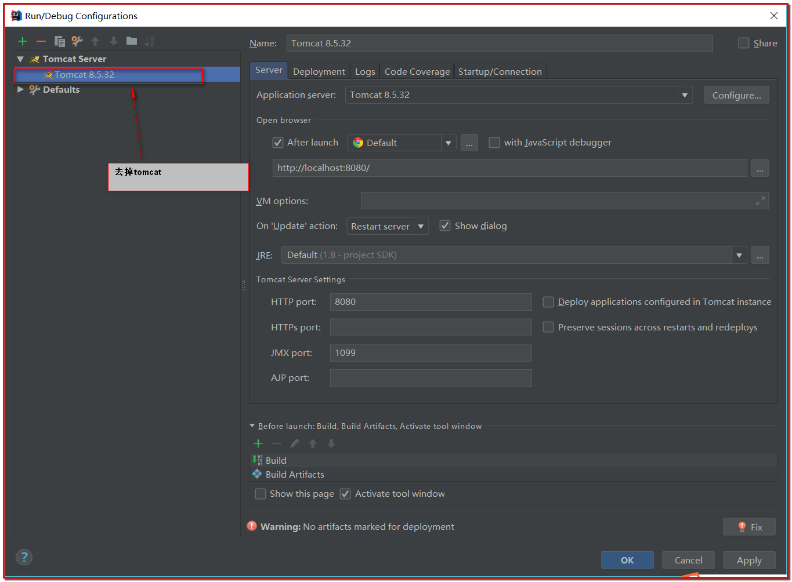
### 3-3.使用maven来跑tomcat
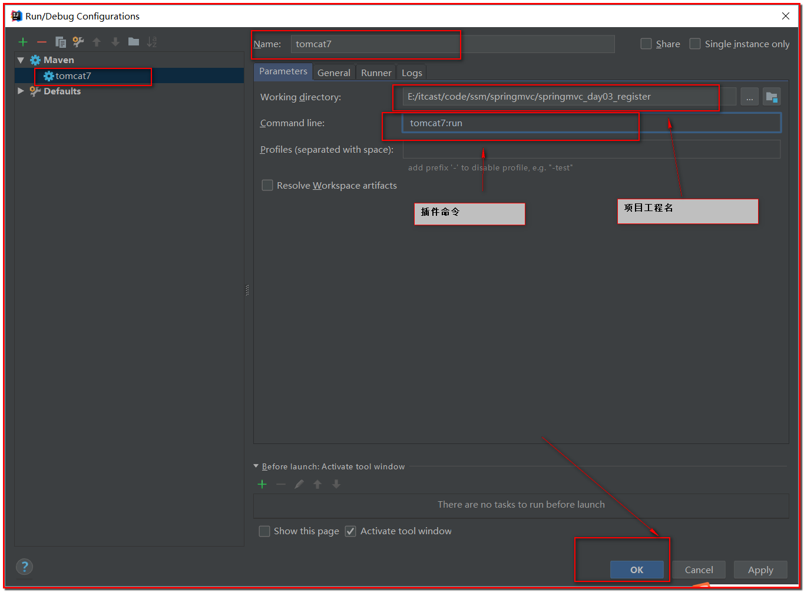
### 3-4.测试
**启动后**
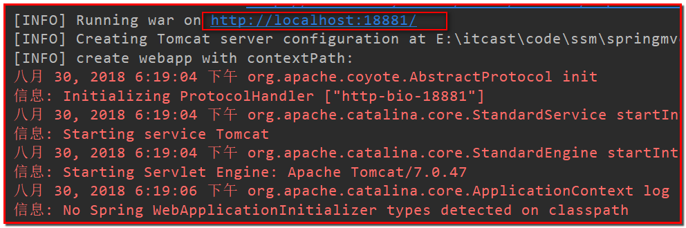

**可以访问页面**
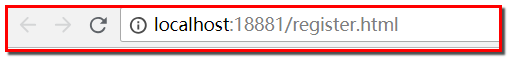

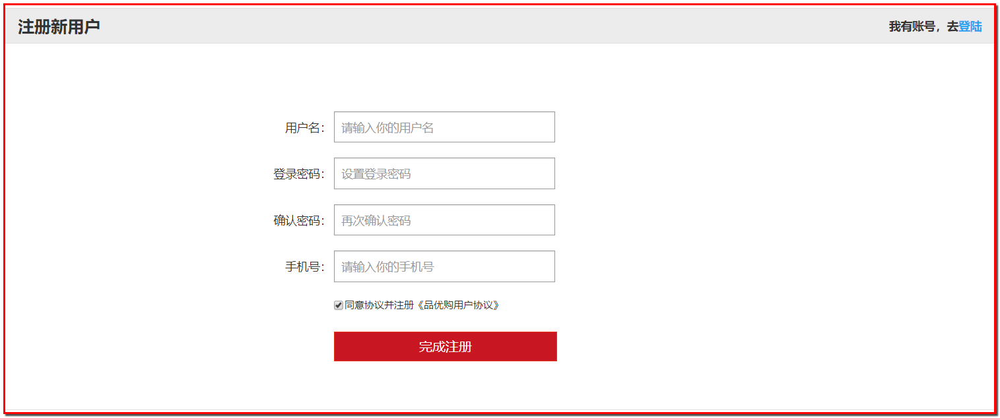