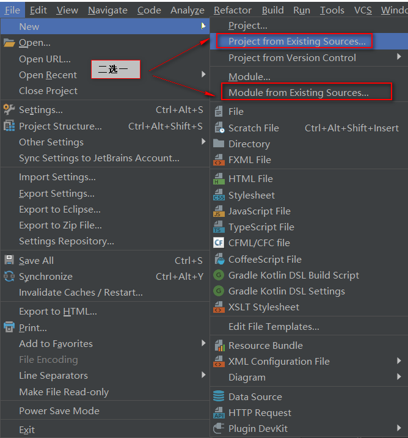
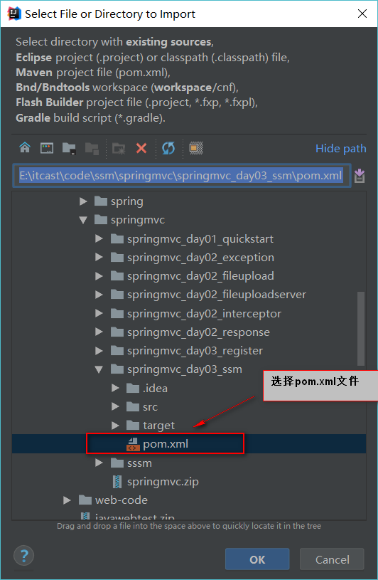
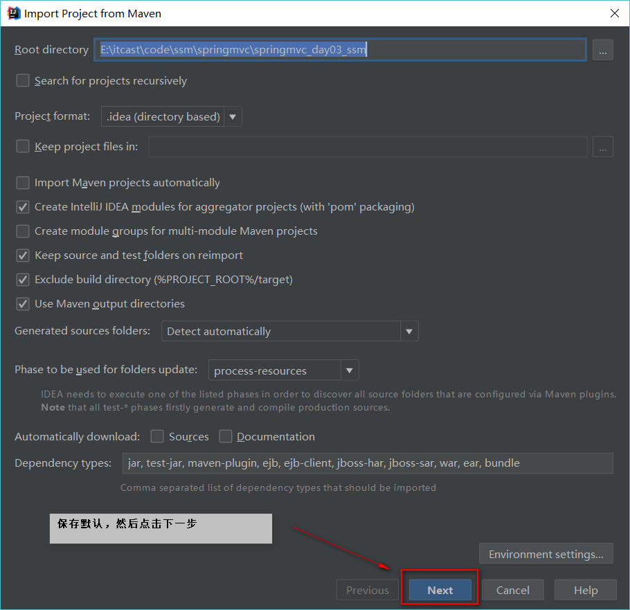
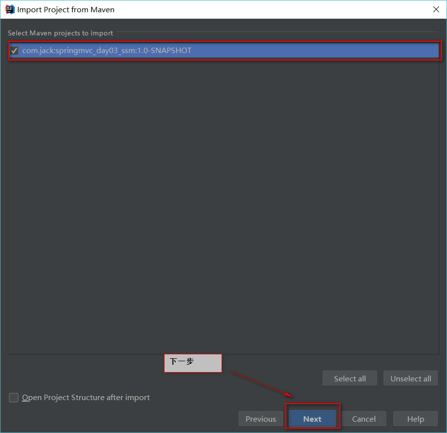
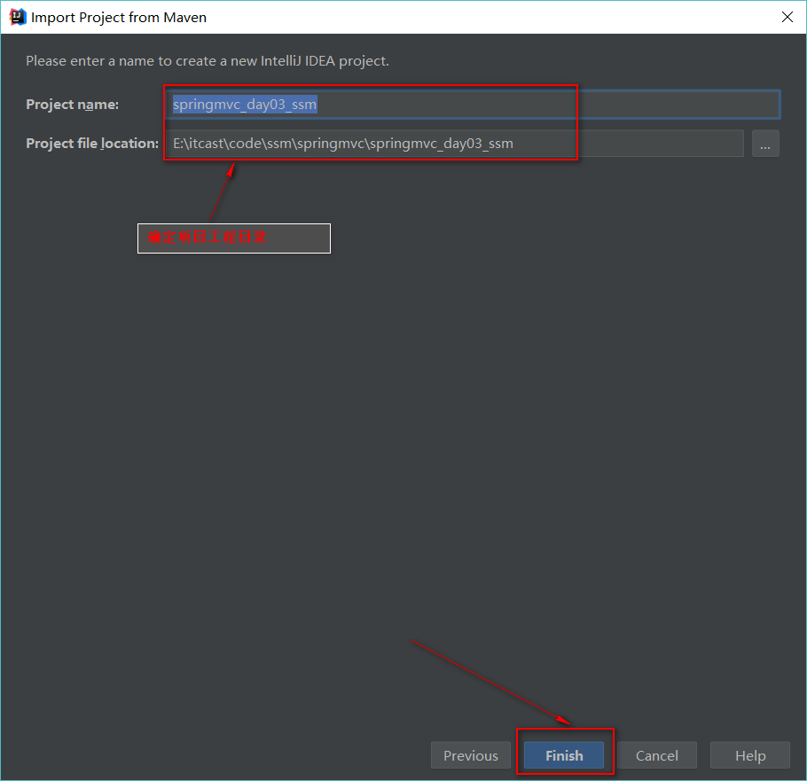
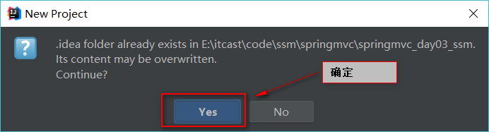
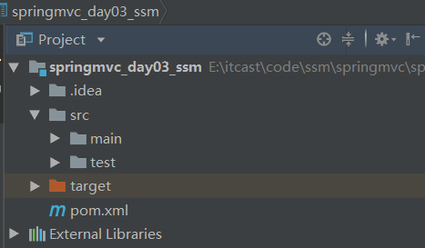
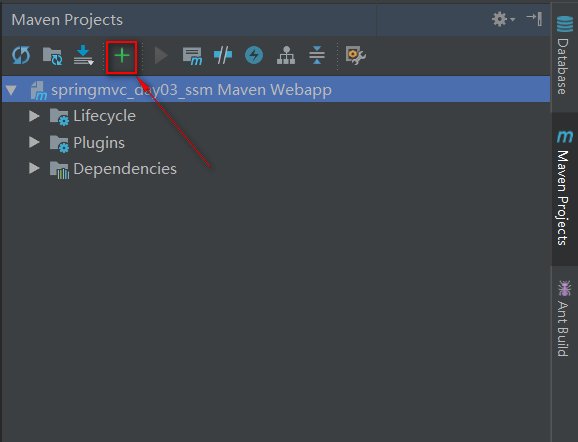
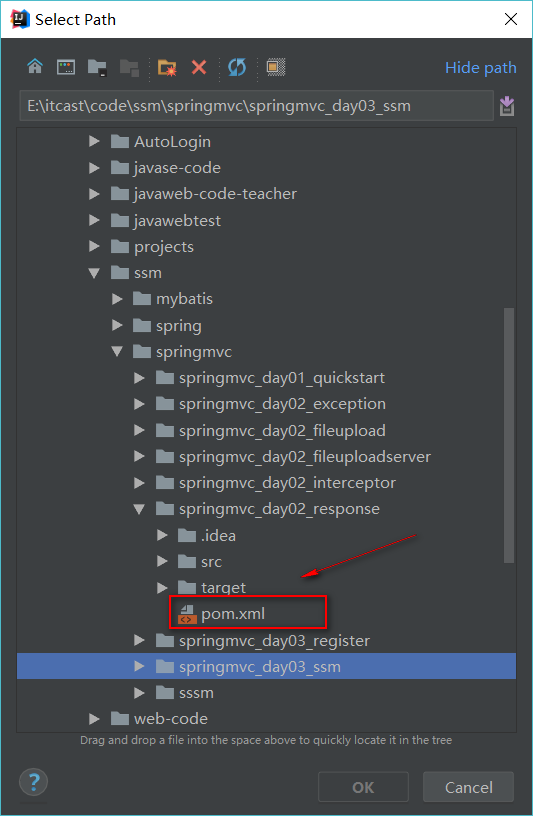
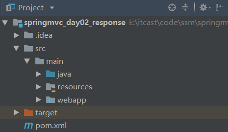

# idea导入maven项目
## 1.第一种方式
### 1-1.打开一个现有的Intellij IDEA工程，点击菜单的**File->new->Module from Existing Sources(或者Project from Existing Sources)**

### 1-2.选择pom.xml文件

### 1-3.保持默认，点击Next

### 1-4.点击Next

### 1-5.确认项目工程目录是否正确

### 1-6.点击Yes

### 1-7.导入完成

## 2.第二种方式
### 2-1.点击+号

### 2-2.选择pom.xml文件

### 2-3.导入完成

